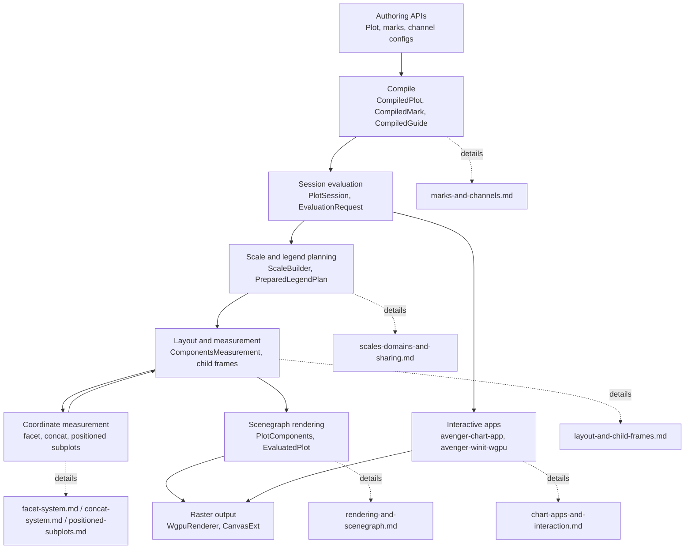

# Avenger Chart Architecture

These documents describe the current internal architecture of the
`avenger-chart*` crates. They are development references for maintainers and
agents. User-facing chart documentation lives in `avenger-chart/book/src`.

## Reading Paths

- To change crate ownership or public exports, read
  [crate-boundaries.md](crate-boundaries.md) and
  [extension-contracts.md](extension-contracts.md).
- To debug authoring, compilation, evaluation, or rendering, read
  [compile-evaluate-render-pipeline.md](compile-evaluate-render-pipeline.md),
  [plot-sessions-and-fast-evaluation.md](plot-sessions-and-fast-evaluation.md),
  [marks-and-channels.md](marks-and-channels.md), and
  [rendering-and-scenegraph.md](rendering-and-scenegraph.md).
- To work on interactive chart apps or resize behavior, read
  [chart-apps-and-interaction.md](chart-apps-and-interaction.md) and
  [plot-sessions-and-fast-evaluation.md](plot-sessions-and-fast-evaluation.md).
- To work on nested layout, read
  [layout-and-child-frames.md](layout-and-child-frames.md),
  [facet-system.md](facet-system.md), [concat-system.md](concat-system.md), and
  [positioned-subplots.md](positioned-subplots.md).
- To work on scales, guides, legends, or sharing, read
  [scales-domains-and-sharing.md](scales-domains-and-sharing.md) and
  [legends-and-guides.md](legends-and-guides.md).
- To validate a change, start with
  [testing-validation-map.md](testing-validation-map.md).

## System Map

## Documents

- [crate-boundaries.md](crate-boundaries.md): crate ownership, dependency
  direction, facade re-exports, and supported extension boundaries.
- [extension-contracts.md](extension-contracts.md): custom marks, scales,
  legend renderers, coordinate systems, and positioned subplot support.
- [compile-evaluate-render-pipeline.md](compile-evaluate-render-pipeline.md):
  the runtime path from `Plot` to `EvaluatedPlot`.
- [plot-sessions-and-fast-evaluation.md](plot-sessions-and-fast-evaluation.md):
  reusable `PlotSession` evaluation, cache families, Preview optimization,
  raw-domain interaction retargeting, and metrics.
- [chart-apps-and-interaction.md](chart-apps-and-interaction.md):
  `avenger-chart-app`, framed canvas resize, app event flow, and Winit/WGPU
  hosting.
- [marks-and-channels.md](marks-and-channels.md): mark traits, mark state,
  channel values, channel configs, and channel extraction.
- [scales-domains-and-sharing.md](scales-domains-and-sharing.md): scale
  authoring, built-in scale implementation, domain inference, and sharing.
- [legends-and-guides.md](legends-and-guides.md): legend renderer selection,
  legend hoisting, guide measurement, and guide sharing.
- [layout-and-child-frames.md](layout-and-child-frames.md): shared
  child-frame runtime used by facet, concat, and positioned subplots.
- [facet-system.md](facet-system.md): built-in row/column facet runtime.
- [concat-system.md](concat-system.md): built-in horizontal and vertical concat
  runtime.
- [positioned-subplots.md](positioned-subplots.md): coordinate-positioned
  `Subplot<Coord>` runtime.
- [coordinate-systems.md](coordinate-systems.md): coordinate traits,
  transforms, guides, and coordinate crates.
- [rendering-and-scenegraph.md](rendering-and-scenegraph.md): conversion from
  measured plot components to scenegraph and WGPU/canvas rendering.
- [testing-validation-map.md](testing-validation-map.md): focused validation
  commands by subsystem.

## Documentation Rules

- Describe how the current system works.
- Prefer type names, trait names, function names, and module paths.
- Do not use source line-number anchors.
- Keep implementation plans out of current architecture references.
- Delete stale planning notes instead of preserving them in this directory.
