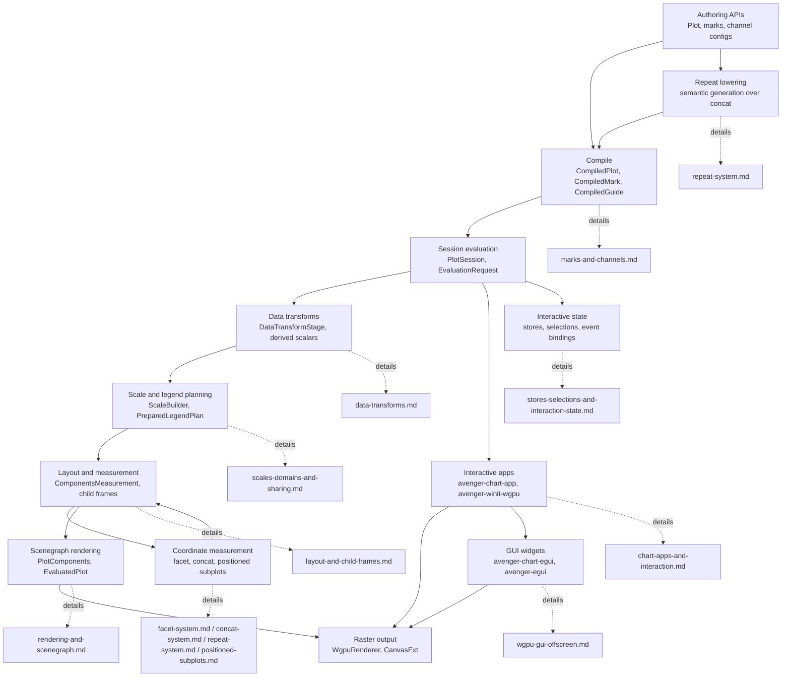

# Avenger Chart Architecture

These documents describe the current internal architecture of the
`avenger-chart*` crates. They are development references for maintainers and
agents. User-facing chart documentation lives in `avenger-chart/book/src`.

## Reading Paths

- To change crate ownership or public exports, read
  [crate-boundaries.md](crate-boundaries.md) and
  [extension-contracts.md](extension-contracts.md).
- To debug authoring, compilation, evaluation, or rendering, read
  [compile-evaluate-render-pipeline.md](compile-evaluate-render-pipeline.md),
  [plot-sessions-and-fast-evaluation.md](plot-sessions-and-fast-evaluation.md),
  [marks-and-channels.md](marks-and-channels.md),
  [data-transforms.md](data-transforms.md), and
  [rendering-and-scenegraph.md](rendering-and-scenegraph.md).
- To work on interactive chart apps or resize behavior, read
  [chart-apps-and-interaction.md](chart-apps-and-interaction.md) and
  [plot-sessions-and-fast-evaluation.md](plot-sessions-and-fast-evaluation.md).
- To work on view-dependent async mark data, read
  [view-materialization.md](view-materialization.md) together with
  [plot-sessions-and-fast-evaluation.md](plot-sessions-and-fast-evaluation.md).
- To work on GUI toolkit integrations that display Avenger-rendered charts as
  native widgets, read
  [wgpu-gui-offscreen.md](wgpu-gui-offscreen.md).
- To work on interactive state, selections, or store-backed overlay marks, read
  [stores-selections-and-interaction-state.md](stores-selections-and-interaction-state.md)
  and [chart-apps-and-interaction.md](chart-apps-and-interaction.md).
- To work on nested layout, read
  [layout-and-child-frames.md](layout-and-child-frames.md),
  [facet-system.md](facet-system.md), [concat-system.md](concat-system.md), and
  [repeat-system.md](repeat-system.md), and
  [positioned-subplots.md](positioned-subplots.md).
- To work on scales, guides, legends, or domain coordination, read
  [scales-domains-and-sharing.md](scales-domains-and-sharing.md) and
  [legends-and-guides.md](legends-and-guides.md).
- To validate a change, start with
  [testing-validation-map.md](testing-validation-map.md).

## System Map

## Documents

- [crate-boundaries.md](crate-boundaries.md): crate ownership, dependency
  direction, facade re-exports, and supported extension boundaries.
- [extension-contracts.md](extension-contracts.md): custom marks, scales,
  legend renderers, coordinate systems, and positioned subplot support.
- [compile-evaluate-render-pipeline.md](compile-evaluate-render-pipeline.md):
  the runtime path from `Plot` to `EvaluatedPlot`.
- [plot-sessions-and-fast-evaluation.md](plot-sessions-and-fast-evaluation.md):
  reusable `PlotSession` evaluation, cache families, Preview optimization,
  raw-domain interaction retargeting, and metrics.
- [view-materialization.md](view-materialization.md): `mark.view(...)`,
  view-local async materialization, retained ready results, preview retargeting,
  scheduler debounce/throttle behavior, and host wakeup wiring.
- [chart-apps-and-interaction.md](chart-apps-and-interaction.md):
  `avenger-chart-app`, framed canvas resize, app event flow, and Winit/WGPU
  hosting.
- [wgpu-gui-offscreen.md](wgpu-gui-offscreen.md): egui widget integration,
  offscreen WGPU textures, latest-scene publishing, event routing, metrics,
  limitations, and non-goals.
- [stores-selections-and-interaction-state.md](stores-selections-and-interaction-state.md):
  mutable `Store` tables, store-backed marks, neutral `Selection` predicates,
  sharing scope, and tool expansion shape for interaction state.
- [marks-and-channels.md](marks-and-channels.md): mark traits, mark state,
  channel values, channel configs, and channel extraction.
- [data-transforms.md](data-transforms.md): transform contracts, transform
  stage sharing, derived scalars, built-in transform ownership, and time
  context propagation.
- [scales-domains-and-sharing.md](scales-domains-and-sharing.md): scale
  authoring, built-in scale implementation, domain inference, scoped domain
  coordination, and named domain groups.
- [legends-and-guides.md](legends-and-guides.md): legend renderer selection,
  legend hoisting, guide measurement, and guide sharing.
- [layout-and-child-frames.md](layout-and-child-frames.md): shared
  child-frame runtime and generic layout alignment used by facet, concat,
  repeat-lowered concat, and positioned subplots.
- [facet-system.md](facet-system.md): built-in row/column facet runtime.
- [concat-system.md](concat-system.md): built-in horizontal, vertical, grid,
  and wrapped concat runtime.
- [repeat-system.md](repeat-system.md): repeat variables, placeholder
  resolution, repeat lowering to concat containers, matrix domain/axis
  defaults, and repeat-aware interactions.
- [positioned-subplots.md](positioned-subplots.md): coordinate-positioned
  `Subplot<Coord>` runtime.
- [coordinate-systems.md](coordinate-systems.md): coordinate traits,
  transforms, guides, and coordinate crates.
- [rendering-and-scenegraph.md](rendering-and-scenegraph.md): conversion from
  measured plot components to scenegraph and WGPU/canvas rendering.
- [testing-validation-map.md](testing-validation-map.md): focused validation
  commands by subsystem.

## Documentation Rules

- Describe how the current system works.
- Prefer type names, trait names, function names, and module paths.
- Do not use source line-number anchors.
- Keep implementation plans out of current architecture references.
- When behavior changes, update these documents to describe the new current
  state.
