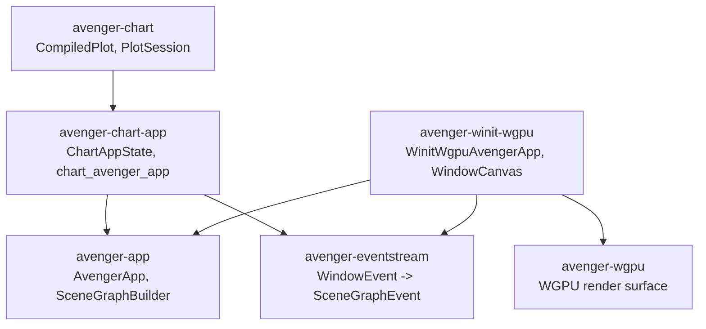
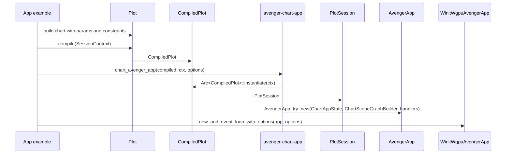
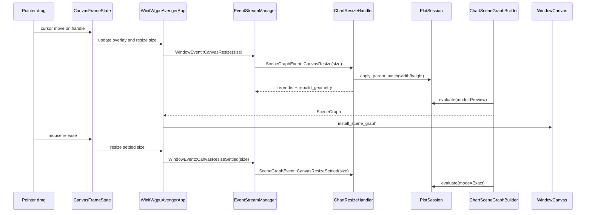

# Chart Apps And Interaction

`avenger-chart-app` is the bridge from a reusable chart session to an
interactive `AvengerApp`. `avenger-winit-wgpu` is the desktop host that owns
the Winit event loop, WGPU window surface, and optional framed-canvas resize
interaction.

The chart crates still own chart evaluation. The app crates own host events,
state updates, scenegraph installation, and rendering cadence.

## Crate Roles

`avenger-app` is generic. It stores app state, owns an `EventStreamManager`,
dispatches window events to registered handlers, rebuilds a `SceneGraph` when a
handler requests rerendering, and maintains the current scenegraph rtree.

`avenger-chart-app` specializes that generic app for charts. It stores a
`PlotSession` in `ChartAppState`, evaluates it through `ChartSceneGraphBuilder`,
and installs resize handlers for chart canvas parameters.

`avenger-winit-wgpu` hosts the app in a Winit loop. It creates a `WindowCanvas`,
handles native window events, installs scenegraphs into the canvas, and renders
through WGPU.

GUI toolkit integrations can host the same `AvengerApp` without owning a Winit
surface. `avenger-egui` routes egui widget-local input into Avenger
`WindowEvent` values, publishes latest completed scenegraphs, and displays
Avenger-rendered offscreen WGPU textures as egui images. See
[wgpu-gui-offscreen.md](wgpu-gui-offscreen.md).

`avenger-eventstream` is the event vocabulary and dispatch layer. It converts
host `WindowEvent` values into `SceneGraphEvent` values, applies stream
throttling, and invokes event handlers.

## Chart App Construction

`chart_avenger_app` computes `CompiledPlot::resize_policy()`, instantiates a
`PlotSession`, stores it in `ChartAppState`, and registers handlers for
`SceneGraphEventType::CanvasResize` and
`SceneGraphEventType::CanvasResizeSettled`. The resize stream uses
`ChartAppOptions::resize_throttle_ms`; settled resize events are not throttled
because they select the final exact evaluation after interaction.

`ChartSceneGraphBuilder` evaluates the session every time `AvengerApp` needs a
new scenegraph. It consumes `ChartAppRuntime::next_evaluation_mode`, resets the
next mode to `EvaluationMode::Exact`, stores the latest metrics, and returns
the evaluated scenegraph.

## Resize Policy

Chart resize behavior is driven by `ChartResizePolicy`, derived from the
compiled layout spec:

- `ChartResizeAxisPolicy::CanvasConstrained`: the canvas expression owns that
  dimension, so an app can patch a bound parameter from resize input;
- `ChartResizeAxisPolicy::PlotConstrained`: the plot area owns that dimension,
  so chart evaluation computes the canvas extent from content;
- `ChartResizeAxisPolicy::Auto`: neither layer explicitly owns the dimension;
- `ChartResizeAxisPolicy::Conflict`: both canvas and plot area constrain the
  dimension.

`ChartResizeBinding` names which params should receive accepted resize sizes.
`ChartResizeHandler` patches only axes that are both canvas-constrained and
bound. Plot-constrained dimensions are left to chart layout. This is what lets
a chart use a canvas-driven width while a responsive `FacetWrap` computes its
height from wrapped content.

With the Winit/WGPU feature enabled, `avenger-chart-app` also exposes helpers:

- `window_scene_sizing_for_resize_policy(policy)`, which chooses how the host
  window surface tracks scenegraph size;
- `canvas_frame_options_for_resize_policy(policy)`, which enables virtual
  canvas handles only for canvas-constrained axes.

## Framed Canvas Resize

Framed canvas resize avoids using native OS window resizing as the chart resize
gesture. The Winit window can be larger than the chart canvas. The chart canvas
is a virtual rectangle anchored at the top-left of the window, with an overlay
outline and optional right, bottom, or corner handles.

`CanvasFrameOptions` controls this behavior:

- `resize_width` and `resize_height` enable the right edge, bottom edge, and
  corner handles;
- `min_size` clamps the virtual canvas dimensions;
- `extra_window_size` makes the initial native window larger than the chart
  canvas;
- `handle_thickness` controls hit testing around the canvas edges.

`CanvasFrameState` tracks the current virtual canvas size, hover handle, active
drag, drag start pointer, and drag start canvas size. Pointer movement updates
the frame overlay immediately and emits logical-size `CanvasResizeEvent`
values. Mouse release emits both a final `CanvasResize` and
`CanvasResizeSettled`.

Native `WindowResize` still resizes the WGPU surface and emits the generic
window resize event. Chart resize bindings in the chart-app examples listen to
virtual `CanvasResize` events instead of native window resize events.

## Resize Event Flow

During `CanvasResize`, `ChartResizeHandler` applies a param patch, sets
`next_evaluation_mode` to `EvaluationMode::Preview`, increments the accepted
resize count, and requests a rerender.

During `CanvasResizeSettled`, `ChartResizeSettleHandler` verifies that the
settled size still matches the current bound params. If
`exact_on_resize_settle` is enabled, it requests an `EvaluationMode::Exact`
evaluation. This preserves responsive drag behavior while settling to the
canonical chart result.

`WinitWgpuAvengerApp` coalesces pending `CanvasResize` work when rendering is
already pending and drops stale resize events whose size no longer matches the
current frame. Settled events are handled separately so release can request the
exact evaluation for the final size.

## Diagnostics

The resize path uses `tracing` targets such as
`avenger_chart_app::resize`, `avenger_winit_wgpu::resize`, and
`avenger_app::resize`. `ChartAppOptions::log_metrics` prints compact chart
evaluation metrics. `AVENGER_TRACE_RESIZE=1` enables resize summary lines with
preview reuse, structure reflow, chrome refresh, guide measurement, and phase
timing counters.

The Winit/WGPU examples initialize `tracing-subscriber` when `RUST_LOG` is set.
Useful examples live in `avenger-chart-app/examples/`:

- `canvas_width_scatter`,
- `canvas_width_height_scatter`,
- `responsive_wrap_resize`.

## Invariants

- `CompiledPlot` remains the serializable chart program.
- `PlotSession` is the stateful runtime instance for repeated evaluation.
- `EvaluationMode::Preview` is explicit and interaction-scoped.
- `EvaluationMode::Exact` is used for initial rendering and settled resize.
- Chart params are patched only for canvas-constrained dimensions with an
  explicit `ChartResizeBinding`.
- Framed canvas chrome is host UI, not chart scenegraph content or visual-test
  baseline content.
