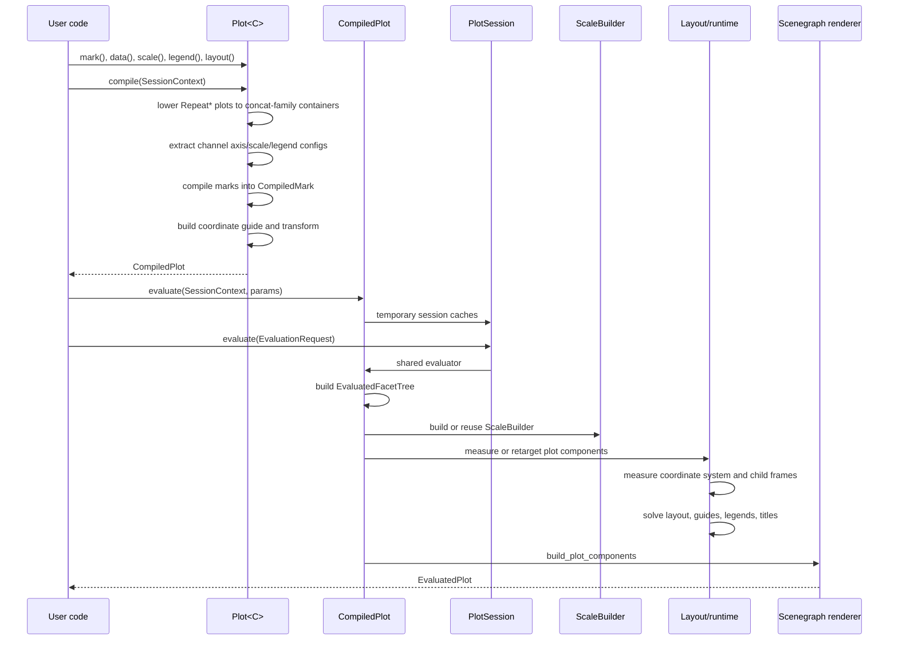

# Compile, Evaluate, Render Pipeline

The chart runtime has two public chart stages plus a reusable app-session path:

- `Plot<C>::compile` consumes the authoring plot and returns `CompiledPlot`.
- `CompiledPlot::evaluate` or `CompiledPlot::evaluate_with_options` returns an
  `EvaluatedPlot` with a scenegraph and spatial index.
- `Arc<CompiledPlot>::instantiate` creates a reusable `PlotSession` for apps
  and other callers that evaluate the same compiled program repeatedly.

Rendering helpers such as `WgpuRenderer` and `CanvasExt` evaluate a compiled
plot and hand the scenegraph to the lower-level renderer.

## Pipeline

## Compile Stage

`Plot<C>` stores authoring state: marks, plot-level data, scale specs, legend
configs, layout spec, title/subtitle, theme, guide config, params, stores,
selections, tools, and event bindings.

`Plot<C>::compile` performs these steps:

- lowers repeat coordinate plots to generated concat-family plots when `C` is
  `RepeatColumns`, `RepeatRows`, `RepeatGrid`, or `RepeatWrap`,
- expands tools into generated params, stores, selections, event bindings,
  scale edits, and marks,
- collects axis, legend, scale, and scale-to-coordinate-channel configs with
  `plot::channel::extract_channel_configs`,
- compiles marks into `Arc<dyn CompiledMark>`,
- applies aggregation for marks whose channel expressions contain aggregate
  functions,
- builds a coordinate guide from `C::Guide`,
- stores the coordinate transform returned by `CoordinateSystem::create_transform`,
- serializes plot-level data and params into `CompiledPlot`.

`CompiledPlot` does not store a persistent `ScaleBuilder`; it remains the
serializable program. Reusable runtime artifacts are owned by `PlotSession` or
by temporary one-shot session cache handles.

## Evaluation Stage

`CompiledPlot::evaluate_with_options` evaluates through temporary session cache
handles. `PlotSession::evaluate` uses durable session caches and a current
param map. Both paths merge provided params with defaults, build an
`EvaluatedFacetTree`, evaluate the layout spec, and create the facade
`render::EvaluationContext`.

`measure_plot_components` then:

- resolves canvas or plot-area dimensions from `EvaluatedLayoutSpec`,
- computes initial layout and legend measurements,
- builds configured scales through a `ScaleProvider`,
- measures coordinate-specific state through
  `measure_coordinate_system_transform`,
- applies coordinate measurement scale adjustments when needed,
- refines layout when plot-area sizing needs coordinate-aware overflow,
- records clip, frame allocation, params, layout, scales, and prepared legend
  plan in `ComponentsMeasurement`.

Coordinate measurement dispatch lives in `avenger-chart/src/coords.rs`. It
handles positioned subplots first, then built-in concat, facet row, and facet
column measurements, and otherwise returns `EmptyCoordMeasurement`.

## Render Stage

`build_plot_components` consumes `ComponentsMeasurement`. It renders data marks
with the configured scales and coordinate measurement, evaluates guides,
renders legends from the prepared legend plan, creates title/subtitle marks,
and optionally creates debug overlay marks.

`components_to_evaluated_plot` groups data marks under the plot-area origin,
adds guide, legend, title, subtitle, and debug marks, then constructs the root
`SceneGraph` and `SceneGraphRTree`.

See [rendering-and-scenegraph.md](rendering-and-scenegraph.md) for the final
scenegraph and WGPU/canvas handoff.

See [plot-sessions-and-fast-evaluation.md](plot-sessions-and-fast-evaluation.md)
for `PlotSession`, `EvaluationRequest`, `EvaluationMode::Preview`, and cache
metrics.

See [chart-apps-and-interaction.md](chart-apps-and-interaction.md) for how
interactive apps instantiate `PlotSession`, patch resize params, and choose
`Preview` or `Exact` evaluation during framed canvas resize.
