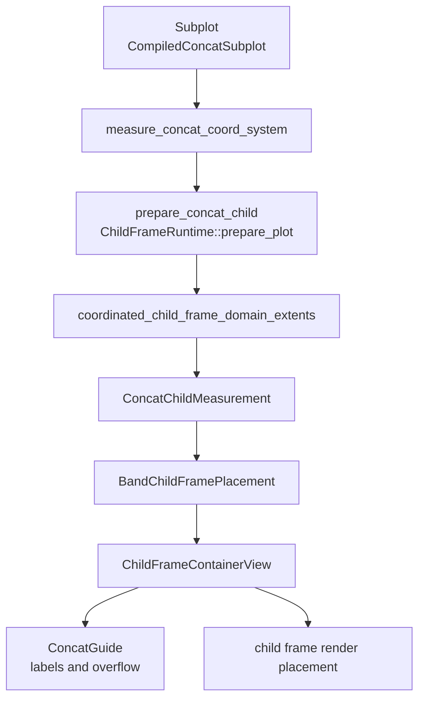

# Concat System

`HConcat`, `VConcat`, `GridConcat`, and `WrapConcat` are built-in layout
containers in `avenger-chart`. They are represented as coordinate systems whose
marks are compiled concat subplots.

Concat is the physical layout substrate for repeat. Repeat containers lower to
matching concat containers, but concat remains usable directly as the manual
escape hatch for custom grids, holes, spans, and wrapped layouts.

## Runtime Flow



## Coordinate Types

All concat containers implement `CoordinateSystemCore`,
`CoordinateSystemTransformCore`, and `CoordinateSystemTransform`. Their
required channel list is empty. Their transform returns container point
geometry, but concat placement is driven by child-frame measurement rather than
data position channels.

The four public container shapes are:

- `HConcat`: one row, one column per child subplot;
- `VConcat`: one column, one row per child subplot;
- `GridConcat`: explicit two-dimensional placement with
  `Subplot::grid_cell(row, column)` and optional
  `Subplot::grid_span(row_span, column_span)`;
- `WrapConcat`: row-major wrapping with auto, fixed, or responsive column
  count.

`GridConcat::rows(...)` and `GridConcat::columns(...)` optionally declare the
track count. Undeclared counts are inferred from child placements. Empty grid
slots behave as holes; they do not collapse tracks or steal axis-guide
ownership from the nearest non-empty outer edge.

`GridConcat` spans are rectangular and end-exclusive. A subplot authored as:

```rust
Subplot::new(child)
    .grid_cell(row, column)
    .grid_span(row_span, column_span)
```

occupies rows `row..row + row_span` and columns
`column..column + column_span`. Spans must be positive, fit within explicit
grid bounds when bounds are configured, and must not overlap any occupied
cell. Holes around spans are allowed.

At measurement time, the child is still one child frame. Its initial plot-area
estimate is the base grid-cell plot area multiplied by the row and column
span. The grid track solver treats the child plot-area demand as an interval
constraint over the covered tracks and assigns the child's chrome slabs only to
the outer edges of the span. It does not create internal guide gaps between
tracks covered by the same child frame.

`WrapConcat::columns(expr)` fixes the physical column count.
`WrapConcat::responsive_columns(width)` resolves the column count from the
current canvas-constrained width and the target approximate cell width.
Trailing missing cells in the final physical row behave as holes.

`ConcatGuide` implements `CoordinateGuide` and `CompiledGuide`. It measures
space for child labels and renders labels through generic child-frame container
guide helpers.

## Measurement

`measure_concat_coord_system` is the concat coordinate measurement entrypoint.
It finds compiled concat subplots with `compiled_subplot`, estimates each child
plot-area size from the parent plot area and child count, prepares each child
with `ChildFrameRuntime`, coordinates child-frame domain extents, measures each
child, and builds `ConcatCoordMeasurement`.

`ConcatCoordMeasurement` stores:

- `ConcatChildMeasurement` values,
- a `BandChildFramePlacement`,
- fallback content size for placement conversion.

Each `ConcatChildMeasurement` stores the child index, optional key, optional
label, grid/wrap placement metadata, container path, and measured
`ComponentsMeasurement`.

## Placement And Coordination

Horizontal concat uses `ChildFrameSharingLevel::hconcat_child`; vertical concat
uses `ChildFrameSharingLevel::vconcat_child`; grid and wrapped concat use the
corresponding grid/wrap child-frame levels. Each child gets a
`ChildFrameScopeKey` with `ChildFrameKey::ConcatChild` and a stable
container-path segment.

`BandChildFramePlacement::from_sized_children` positions children along the
container axes using measured child plot sizes and sibling boundary demands.
The placement is converted to `ChildFramePlacementResult` for rendering and
generic child-frame consumers.

Concat participates in the same child-frame domain, guide, legend, layout, and
debug machinery as facet and positioned subplots. See
[layout-and-child-frames.md](layout-and-child-frames.md).

## Layout Alignment

Concat containers are the main apply-capable participants in generic
child-frame layout alignment. During measurement, `ConcatCoordMeasurement`
exports grid-shaped layout requirements through
`ChildFrameLayoutCoordinationNode`:

- track plot-area widths and heights;
- per-track left/right/top/bottom chrome slabs;
- outer offsets;
- guide-slot gap requirements;
- the child-slot topology used to prove two instances are compatible.

The alignment pass groups equivalent concat instances by `LayoutAlignmentKey`,
merges compatible requirements by taking maxima, and applies the merged
solution back to each matching `ConcatCoordMeasurement`. This lets repeated or
manual concat grids nested under different facet values share physical track
and chrome geometry after each local child has been measured.

Grid slot topology includes row and column spans. Two manual grids are
alignment-compatible only when their child-slot rectangles match, including
span sizes. A spanned grid nested under a facet can align with another
equivalent spanned grid under a sibling facet value, while a non-spanned grid
with the same number of visible children remains a different topology.

`HConcat` and `VConcat` are represented as degenerate one-row or one-column
grid layouts for this pass. `WrapConcat` participates only when instances have
the same resolved physical grid shape; responsive wraps with different column
counts are separated instead of forced into one solution.

Manual grid siblings that contain equivalent nested facet bands can also align
those facet bands. The template-key rule is narrow: it drops the immediate
manual grid-child segment only for facet-band template identity, while keeping
ancestor context, facet kind, topology, and facet semantic tag. This prevents
unrelated grids or different facet fields from becoming one global alignment
group.

## Guide Visibility

`GridConcat` and `WrapConcat` can carry an `AxisGuideVisibilityConfig` through
`.axis_guide_visibility(...)`. The reusable policies are defined by
`AxisGuideVisibilityPolicy`:

- `Auto`: preserve the container's default behavior;
- `All`: show every eligible child axis guide;
- `OuterEdges`: show guides only on the physical outer non-empty edge;
- `OuterForEquivalentDomainGroups`: compact to outer edges only when aligned
  cells use equivalent domain coordination targets.

Repeat matrix axes are implemented by lowering to `GridConcat` with
`OuterForEquivalentDomainGroups`. The policy is not repeat-specific; manual
concat grids can use it directly.

For grid spans, guide ownership is edge-aware:

- x-axis ownership is based on the bottom row edge of the spanned child;
- y-axis ownership is based on the left column edge of the spanned child;
- if a spanned edge crosses strips whose compacted ownership disagrees, the
  relevant axis guide policy falls back to `All` for that child instead of
  hiding a potentially necessary guide.

`OuterForEquivalentDomainGroups` also treats a spanned child as participating
in every physical strip it touches for the relevant axis. The compacted
outer-edge policy is used only when all children in those touched strips have
compatible domain coordination, scale type, and axis configuration.

## Interaction Metadata

Concat child frames contribute evaluated interaction scopes. These scopes carry
the child-frame path, optional authored subplot id, grid row/column placement,
grid row/column span, and inherited facet path. Chart event bindings, scene
queries, stores, selections, and tools target those semantic scopes rather than
public `Vec<usize>` scenegraph paths.

When repeat lowers to concat, generated child-frame keys and ids are ordinary
concat metadata. This is why repeat-aware tools and selections do not need a
separate runtime path.
