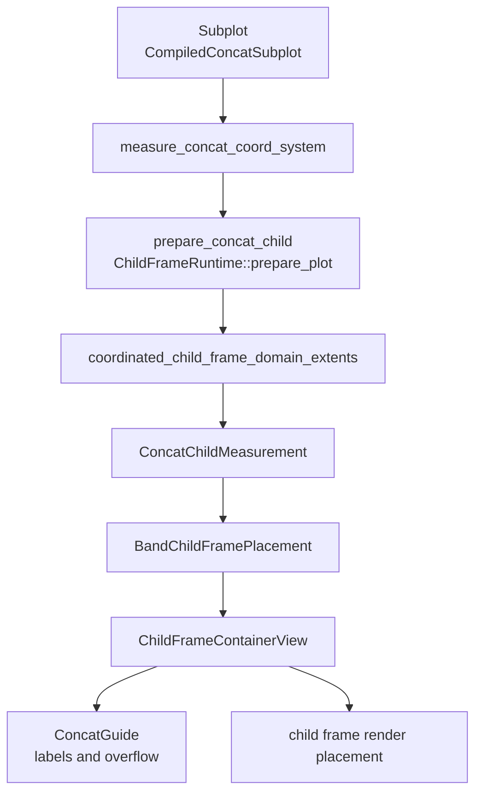

# Concat System

`HConcat` and `VConcat` are built-in layout containers in `avenger-chart`.
They are represented as coordinate systems whose marks are compiled concat
subplots.

## Runtime Flow

## Coordinate Types

`HConcat` and `VConcat` implement `CoordinateSystemCore`,
`CoordinateSystemTransformCore`, and `CoordinateSystemTransform`. Their
required channel list is empty. Their transform returns container point
geometry, but concat placement is driven by child-frame measurement rather than
data position channels.

`ConcatGuide` implements `CoordinateGuide` and `CompiledGuide`. It measures
space for child labels and renders labels through generic child-frame container
guide helpers.

## Measurement

`measure_concat_coord_system` is the concat coordinate measurement entrypoint.
It finds compiled concat subplots with `compiled_subplot`, estimates each child
plot-area size from the parent plot area and child count, prepares each child
with `ChildFrameRuntime`, coordinates child-frame domain extents, measures each
child, and builds `ConcatCoordMeasurement`.

`ConcatCoordMeasurement` stores:

- `ConcatChildMeasurement` values,
- a `BandChildFramePlacement`,
- fallback content size for placement conversion.

Each `ConcatChildMeasurement` stores the child index, optional key, optional
label, container path, and measured `ComponentsMeasurement`.

## Placement And Sharing

Horizontal concat uses `ChildFrameSharingLevel::hconcat_child`; vertical concat
uses `ChildFrameSharingLevel::vconcat_child`. Each child gets a
`ChildFrameScopeKey` with `ChildFrameKey::ConcatChild`.

`BandChildFramePlacement::from_sized_children` positions children along the
concat axis using measured child plot sizes and sibling boundary demands. The
placement is converted to `ChildFramePlacementResult` for rendering and
generic child-frame consumers.

Concat participates in the same child-frame domain, guide, legend, layout, and
debug machinery as facet and positioned subplots. See
[layout-and-child-frames.md](layout-and-child-frames.md).
