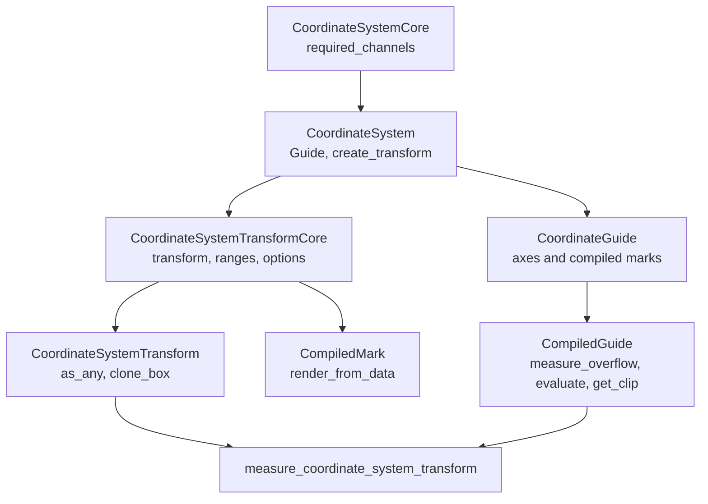

# Coordinate Systems

Coordinate systems define required position channels, coordinate transforms,
and guide behavior. Built-in Cartesian and Polar coordinates live in separate
coordinate crates. Facet and concat are facade-owned layout coordinates.

## Contracts

`CoordinateSystemCore` declares required position channels. `CoordinateSystem`
adds a guide type and creates a boxed `CoordinateSystemTransform`.

`CoordinateSystemTransformCore` maps scaled position channels into
`PlotGeometry`, provides default range bindings, and provides default scale
options for coordinate channels. `CoordinateSystemTransform` adds serialization,
downcasting, and cloning.

`CoordinateGuide` receives axes and compiled mark metadata, then builds a
`CompiledGuide`. `CompiledGuide` measures guide overflow, renders guide marks,
and returns a clip region.

## Built-In Coordinate Crates

`avenger-chart-cartesian` owns `Cartesian`, `CartesianAxis`,
`CartesianGuide`, `CartesianOptions`, Cartesian position configs, Cartesian
axis evaluation, and Cartesian render implementations for `Line`, `Rect`, and
`Symbol`.

`Cartesian` requires `x` and `y`. Its transform returns `PointGeometry`.
Default range bindings map `x` to plot-area width and `y` to inverted
plot-area height. Cartesian positioned subplots use `subplot_x` and
`subplot_y`, mapped to transform channels `x` and `y`.

`avenger-chart-polar` owns `Polar`, `PolarAxis`, `PolarGuide`,
`PolarOptions`, Polar position configs, Polar guide evaluation, and the Polar
`Symbol` render implementation.

`Polar` requires `r` and `theta`. Its transform returns `PointGeometry`.
Default range bindings map `theta` to a fixed `0..2pi` interval and `r` to
half the minimum plot-area dimension. Polar positioned subplots use `r` and
`theta`.

## Facade-Owned Layout Coordinates

`HConcat`, `VConcat`, `FacetRow`, and `FacetColumn` are coordinate systems in
the facade crate because their measurement depends on facade-owned layout and
child-frame runtime state.

`measure_coordinate_system_transform` handles generic positioned subplots
first, then dispatches built-in concat and facet measurements by downcasting
the transform. If no layout-aware coordinate measurement applies, it returns
`EmptyCoordMeasurement`.

## External Coordinate Crates

External coordinate crates implement the core coordinate traits directly. If
they support coordinate-positioned child plots, they also implement
`SubplotContainerCoordinateSystem` and provide `PositionedSubplotSpec`
metadata.

External coordinate crates do not need to depend on Cartesian, Polar, facet, or
concat crates unless they intentionally build on those concrete types.

See [positioned-subplots.md](positioned-subplots.md) for the subplot hook and
[extension-contracts.md](extension-contracts.md) for dependency boundaries.
