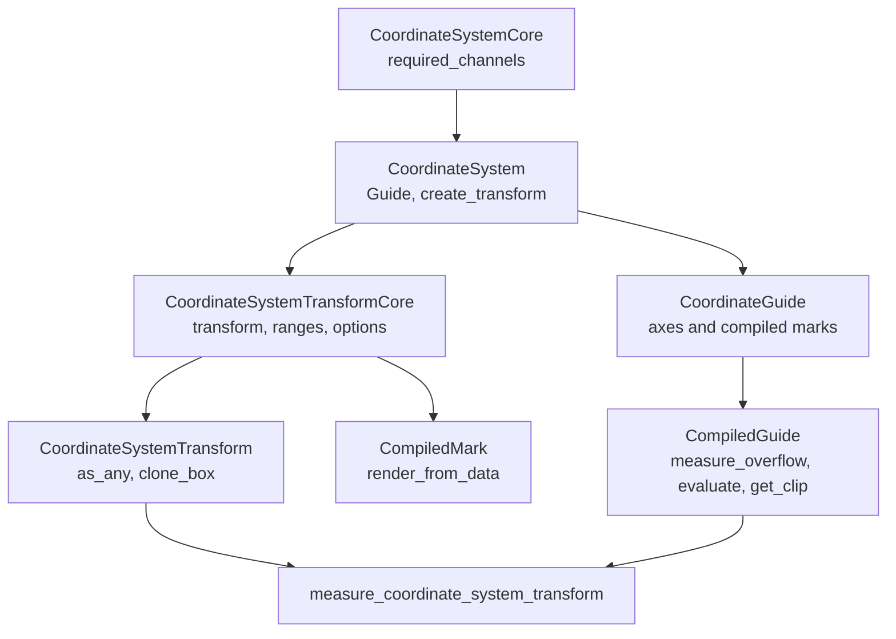

# Coordinate Systems

Coordinate systems define required position channels, coordinate transforms,
and guide behavior. Built-in Cartesian and Polar coordinates live in separate
coordinate crates. Facet and concat are facade-owned layout coordinates.

## Contracts

`CoordinateSystemCore` declares required position channels. `CoordinateSystem`
adds a guide type, creates a boxed `CoordinateSystemTransform`, and may provide
non-rendered coordinate-owned scale sources.

`CoordinateSystemTransformCore` maps scaled position channels into
`PlotGeometry`, provides default range bindings, and provides default scale
options for coordinate channels. `CoordinateSystemTransform` adds serialization,
downcasting, and cloning.

`CoordinateGuide` receives axes and compiled mark metadata, then builds a
`CompiledGuide`. `CompiledGuide` measures guide overflow, renders guide marks,
and returns a clip region.

## Coordinate-Owned Scale Sources

Most Cartesian and Polar scales are discovered from rendered mark channels.
Some coordinate systems own positional dimensions directly, so the scale
pipeline also accepts coordinate-owned scale sources. A coordinate scale source
is a non-rendered channel context contributed by the coordinate system. It can
define generated channels, scale names, axis configs, range bindings, data
scope, and domain-sharing metadata without creating scene marks or public mark
targets.

Parallel coordinates use this path for one vertical scale per dimension. Each
authored dimension has a stable dimension id, a generated internal channel, and
a scale name equal to the dimension id. Parallel data marks request the
generated scaled columns at render time, while event coordinate readback and
axis guides expose the public dimension ids.

Coordinate-owned scale sources participate in facet domain coordination and
repeat placeholder resolution the same way rendered mark channels do. They do
not create legends; ordinary mark style channels such as stroke and fill still
use the regular scale and legend pipeline.

## Built-In Coordinate Crates

`avenger-chart-cartesian` owns `Cartesian`, `CartesianAxis`,
`CartesianGuide`, `CartesianOptions`, Cartesian position configs, Cartesian
axis evaluation, and Cartesian render implementations for built-in data marks
such as `Area`, `Image`, `Line`, `PathMark`, `Rect`, `Rule`, `Symbol`, `Text`,
and `Trail`.

`Cartesian` requires `x` and `y`. Its transform returns `PointGeometry`.
Default range bindings map `x` to plot-area width and `y` to inverted
plot-area height. Cartesian positioned subplots use `subplot_x` and
`subplot_y`, mapped to transform channels `x` and `y`.

`avenger-chart-polar` owns `Polar`, `PolarAxis`, `PolarGuide`,
`PolarOptions`, Polar position configs, Polar guide evaluation, and the Polar
`Symbol` render implementation.

`Polar` requires `r` and `theta`. Its transform returns `PointGeometry`.
Default range bindings map `theta` to a fixed `0..2pi` interval and `r` to
half the minimum plot-area dimension. Polar positioned subplots use `r` and
`theta`.

`avenger-chart-parallel` owns `Parallel`, `ParallelAxis`, `ParallelGuide`,
`ParallelLine`, `ParallelSymbol`, `ParallelAxisOverlay`, and parallel frame
state. `Parallel` is a wide-form coordinate system: each source row is one
polyline, and each `.dimension(id, expr)` owns an independent vertical scale.
Numeric dimensions infer linear scales; categorical dimensions infer point
scales. Axis positions are frame geometry, not data scale values.

Parallel axis overlays are coordinate-positioned child plots centered on a
dimension axis. The child plot receives the selected dimension's y scale and a
local x scale over the overlay width, so ordinary Cartesian marks and compound
marks can draw brush rectangles, summaries, or distributions on top of an axis.

## Facade-Owned Layout Coordinates

`HConcat`, `VConcat`, `FacetRow`, and `FacetColumn` are coordinate systems in
the facade crate because their measurement depends on facade-owned layout and
child-frame runtime state.

`measure_coordinate_system_transform` handles generic positioned subplots
first, then dispatches built-in concat and facet measurements by downcasting
the transform. If no layout-aware coordinate measurement applies, it returns
`EmptyCoordMeasurement`.

## External Coordinate Crates

External coordinate crates implement the core coordinate traits directly. If
they support coordinate-positioned child plots, they also implement
`SubplotContainerCoordinateSystem` and provide `PositionedSubplotSpec`
metadata.

External coordinate crates do not need to depend on Cartesian, Polar, facet, or
concat crates unless they intentionally build on those concrete types.

See [positioned-subplots.md](positioned-subplots.md) for the subplot hook and
[extension-contracts.md](extension-contracts.md) for dependency boundaries.
