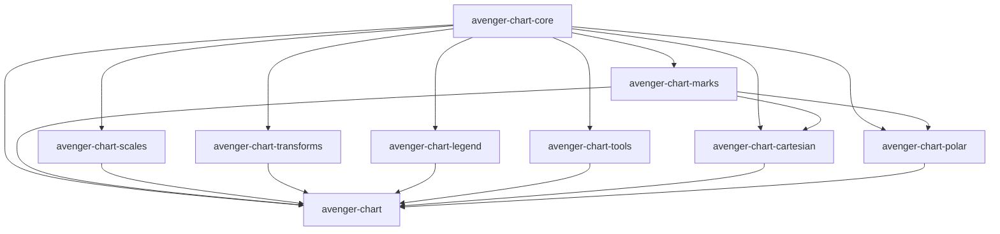

# Crate Boundaries

Avenger treats chart layout as a core chart feature. Built-in facet, concat,
partitioning, layout measurement, child-frame placement, and render-time layout
coordination live in the top-level `avenger-chart` crate.

The extension boundary is narrower:

- custom marks depend on `avenger-chart-core` for mark contracts and on any
  coordinate crate they explicitly target,
- custom scales depend on `avenger-chart-core` and usually `avenger-scales`
  when they implement scale math,
- custom legend renderers depend on `avenger-chart-core`,
- custom data transforms depend on `avenger-chart-core` plus lower-level
  runtime crates needed by the transform implementation,
- custom chart tools depend on `avenger-chart-core`,
- custom coordinate systems depend on `avenger-chart-core` and lower-level
  runtime crates needed by the coordinate implementation,
- coordinate systems that support coordinate-positioned child plots implement
  `SubplotContainerCoordinateSystem`.

Facet and concat containers are not external layout-container APIs. See
[extension-contracts.md](extension-contracts.md) for the supported extension
surfaces.

## Chart-Layer Graph

Dependency arrows point from provider to consumer.

Other workspace crates such as `avenger-scales`, `avenger-scenegraph`,
`avenger-guides`, `avenger-text`, `avenger-app`, `avenger-eventstream`,
`avenger-wgpu`, `avenger-winit-wgpu`, and `avenger-chart-app` sit outside this
chart-layer graph and provide runtime services used by the facade, examples,
apps, or extension crates.

## Owner Crates

| Crate | Owns |
| --- | --- |
| `avenger-chart-core` | Shared chart contracts and value types: `Mark`, `CompiledMark`, `CompiledMarkCore`, `MarkState`, `CompiledMarkState`, `DataContext`, `CompiledDataContext`, `FacetDataScope`, `DataTransform`, `CompiledDataTransform`, `DataTransformStage`, `DataTransformExecutionContext`, `DataTransformResult`, `DerivedScalarMap`, `TimeContext`, `CoordinateSystem`, `CoordinateSystemTransform`, `CoordinateGuide`, `CompiledGuide`, `Scale`, `ScaleSpec`, `ScaleChannelConfig`, `Legend`, `LegendRenderer`, `LegendRendererSelection`, `ChartEventBinding`, `ChartTool`, `ToolExpansion`, `Store`, `StoreData`, `StoreUpdate`, `Selection`, `SelectionUpdate`, `SelectionClauseUpdate`, `SubplotContainerCoordinateSystem`, `PositionedSubplotSpec`, `CompiledPositionedSubplot`, `Sharing`, `SharingLevel`, `AxisPosition`, `FacetAxis`, core `EvaluationContext`, theme values, and geometry/layout value types. |
| `avenger-chart-marks` | Neutral built-in mark authoring types: `Area<C>`, `Image<C>`, `Line<C>`, `PathMark<C>`, `Rect<C>`, `Rule<C>`, `Subplot<C>`, `Symbol<C>`, `Text<C>`, `Trail<C>`, `ZeroD` support, and shared mark helpers. Coordinate-specific render implementations live in coordinate crates or the facade. |
| `avenger-chart-scales` | Built-in chart scale marker types, built-in scale option extension traits, `ScaleBuilder`, `ConfiguredScaleWithSpec`, `DomainExtent`, DataFusion scale UDF/codec helpers, domain inference, and `build_scale_builder_from_marks`. |
| `avenger-chart-transforms` | Built-in data transform authoring and compiled implementations: `Aggregate`, `Bin`, `Calculate`, `Filter`, `Fold`, `Impute`, `JoinAggregate`, `Lump`, `Select`, `Stack`, `TimeUnit`, `Window`, and their output handle types. |
| `avenger-chart-legend` | Built-in legend builders and renderers: `LegendBuilder`, `LegendableChannel`, `CompiledSymbolLegend`, `CompiledLineLegend`, `CompiledRectLegend`, `CompiledColorbar`, `renderer_for_kind`, `LegendMeasurement`, and legend theme defaults. |
| `avenger-chart-tools` | Built-in chart tools that expand into core tool contracts. `PanScrollZoom`, `BoxZoom`, `PointSelection`, and `LassoSelection` live here and emit generated params, selections, raw-domain scale edits, event bindings, marks, and tool metadata as needed. |
| `avenger-chart-cartesian` | `Cartesian`, `CartesianGuide`, `CartesianAxis`, Cartesian channel/axis behavior, Cartesian render implementations for built-in data marks, and Cartesian `Subplot` placement channels `subplot_x` and `subplot_y`. |
| `avenger-chart-polar` | `Polar`, `PolarGuide`, `PolarAxis`, polar channel/axis behavior, Polar `Symbol` render implementation, and Polar `Subplot` placement channels `r` and `theta`. |
| `avenger-chart` | Facade exports plus `Plot`, `CompiledPlot`, facade `render::EvaluationContext`, facet, concat, partitioning, child-frame measurement, layout solvers, generic positioned subplot measurement/rendering, transform runtime application, plot-level scale and legend planning, tool expansion application, WGPU/canvas rendering, and integration tests. |
| `avenger-chart-app` | Chart-specific app bridge: `ChartAppState`, `ChartResizeBinding`, `ChartAppOptions`, `chart_avenger_app`, resize handlers, and Winit/WGPU helper exports behind the `winit-wgpu` feature. |
| `avenger-winit-wgpu` | Desktop/WASM host integration: `WinitWgpuAvengerApp`, `WinitWgpuAvengerAppOptions`, `WindowSceneSizing`, `CanvasFrameOptions`, Winit event-loop handling, virtual canvas frame input, scenegraph installation, and WGPU surface rendering. |

## Facade Re-Exports

The facade crate re-exports many owner-crate APIs for chart authors. The owner
crate still defines the behavior.

| Facade module | Owner crates |
| --- | --- |
| `avenger_chart::prelude` | Common types from `avenger-chart-core`, built-in marks, built-in scales, built-in legend builders, Cartesian, Polar, facet, concat, rendering helpers. |
| `avenger_chart::scales` | Core scale contracts plus built-in scale types and runtime helpers from `avenger-chart-scales`. |
| `avenger_chart::legend` | Core legend contracts plus built-in legend builders and renderers from `avenger-chart-legend`. |
| `avenger_chart::transforms` | Built-in transform authoring types and output handles from `avenger-chart-transforms`. |
| `avenger_chart::tools` | Core tool contracts plus built-in tools from `avenger-chart-tools`. |
| `avenger_chart::coords` | Core coordinate traits plus facade-owned coordinate measurement dispatch helpers. |

Use owner-crate imports in external extension crates when the dependency
boundary matters. Use facade imports in examples and chart-author code when
convenience is the priority.
