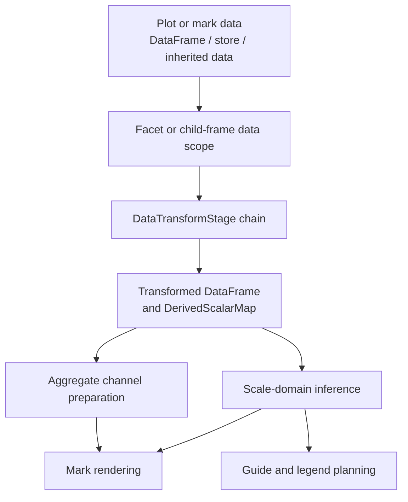

# Data Transforms

Data transforms are mark/data-context operations that run on DataFusion
`DataFrame`s before scale-domain inference, aggregate channel preparation, guide
planning, and mark rendering. They are ordinary chart extension objects: core
owns the serializable trait boundary, while built-in implementations live in
`avenger-chart-transforms`.

## Crate Boundary

`avenger-chart-core` owns the transform contracts:

- `DataTransform`
- `CompiledDataTransform`
- `DataTransformStage`
- `DataTransformCompileContext`
- `DataTransformExecutionContext`
- `DataTransformResult`

Authoring transforms implement `DataTransform` and return two things:

- a boxed, typetag-serialized `CompiledDataTransform`;
- a typed output handle used by the mark transform closure.

Compiled plots store boxed compiled transform objects directly. There is no
runtime transform registry. A binary that deserializes a compiled plot must link
the crate that registered each concrete compiled transform with `typetag`.

`avenger-chart-transforms` owns the built-in transform implementations. The
`avenger-chart` facade links and re-exports this crate so the built-ins work by
default, while external transform crates can depend on `avenger-chart-core`
without depending on built-in transforms.

## Evaluation Order

Transforms attach to a mark's `DataContext`. At evaluation time, the chart
runtime resolves the mark's effective input data, runs transform stages, then
continues through the normal chart pipeline.



This ordering means transform-produced columns participate in scale domains,
axis ticks, legends, selection predicates, event datum rows, and rendering just
like source columns.

## Authoring Shape

Transforms use the mark `.transform(...)` family. Structural transforms return
output handles whose methods expose generated columns by role:

```rust
Rect::new().transform(Bin::new(col("value")).maxbins(20), |mark, bin| {
    mark.x(bin.start())
        .x2(bin.end())
        .y(lit(0.0))
        .y2(count())
})
```

Transforms whose columns are explicitly named by the author usually return `()`.
Downstream channels reference those columns with ordinary DataFusion
expressions:

```rust
Symbol::new().transform(
    Calculate::new().expr("residual", col("actual") - col("predicted")),
    |mark, ()| mark.y(col("residual")),
)
```

The distinction is intentional:

- generated structural columns use output handles such as `bin.start()`,
  `fold.value()`, `stack.end()`, or `impute.imputed()`;
- explicitly named columns use `col("...")` because the author chose the name.

## Transform Stages And Scope

Each transform call stores an ordered `DataTransformStage` with a
`CoordinationScope`:

- `.transform(...)` and `.transform_free(...)` compute at the final leaf scope;
- `.transform_level(n, ...)` computes at a logical ancestor scope;
- `.transform_shared(...)` computes at the shared/root scope.

The runtime applies each stage at its owner scope and filters the resulting
table back down before narrower stages or final rendering. This is important for
binning and other inferred statistical transforms: shared bin edges are computed
once from shared data, then each facet cell renders its filtered rows with the
same generated bin columns and derived scalar defaults.

Transform scopes must be monotonic from broader to narrower. For example,
`Shared -> Level(1) -> Free` is valid, while `Free -> Shared` is rejected.
When a broader transform output must later be filtered to a narrower facet
scope, the transformed table must still contain the facet predicate columns.
If a transform drops required facet columns, evaluation returns a clear
`InvalidArgument`.

## Derived Scalars

Transforms can return a `DerivedScalarMap` in addition to a transformed
`DataFrame`. Derived scalars are named DataFusion expressions computed in the
same data scope as the transform. Channel values, guide/scale config, and
later transform stages can reference them with `derived_scalar(...)`
placeholders.

`Bin` and `TimeUnit` use this to attach ordinary scale and axis defaults to
their output handles:

- domain start/end scalars;
- tick spacing scalars;
- normal scale options such as `nice(false)` and `zero(false)`.

`ScalarAggregate` is the general-purpose producer: it passes its input
through unchanged and publishes whole-input aggregations as derived scalars
(see Built-In Transforms below).

Resolution happens at three consumer layers:

- **Later transform stages**: the chain executor resolves already-produced
  scalars into each subsequent stage's expressions before it applies. Stages
  run in order, so referencing a scalar before the stage that produces it is
  an error ("referenced but not produced in this data scope"). Chains are
  seeded with scalars inherited from prepared mark-group base data and, for
  view-scoped marks, from the pre-view chain, so cross-chain references
  resolve too.
- **Channel data expressions**: resolved once when logical mark data is
  finalized, so domain inference, render channel collection, sorting, and
  aggregate preparation all see resolved values.
- **Scale options and guide config**: resolved during scale and guide
  evaluation (the original consumer layer).

Duplicate derived scalar ids in the same data scope are rejected.

### Position In The Chain Is Meaningful

A derived scalar summarizes the transform's input *at its position in the
chain* — after upstream filters and facet narrowing. `Filter ->
ScalarAggregate::count("n")` counts the filtered rows; per-facet scopes get
per-facet scalars by construction.

### Eager And Lazy Evaluation

`ScalarAggregate` publishes scalars in one of two modes:

- **Eager (default)**: the aggregation executes once during `apply` with the
  execution context's params bound, and the scalar is a concrete literal.
  Works in every consumer layer, is exactly-once per chain application, and
  the value is inspectable (a `scalar_aggregate_eager` tracing span records
  the query latency).
- **Lazy (`.lazy()`)**: the scalar is an uncorrelated scalar subquery over
  the input plan; `apply` stays a pure plan-builder. At the pinned DataFusion
  version, compiled transform and channel expressions are protobuf-encoded
  and cannot represent scalar subqueries, so lazy scalars referenced from
  stages or channels fail with actionable guidance; only scale options and
  guide configs can consume them. DataFusion >= 54 serializes scalar
  subqueries, at which point the stage and channel paths work in lazy mode
  too.

## Built-In Transforms

`avenger-chart-transforms` currently provides:

- `Aggregate`: grouped aggregate output tables used before later transforms.
- `Bin`: exact and nice numeric binning, with output handles for start, end,
  and index.
- `Calculate`: adds or replaces explicitly named expression columns.
- `Filter`: filters rows with a boolean-coerced DataFusion predicate.
- `Fold`: converts multiple field/value expressions into long-form rows.
- `Impute`: fills missing key rows or null values with configured methods.
- `JoinAggregate`: computes aggregate values over the group keys and appends
  them to each input row, implemented as window functions
  (`agg(...) OVER (PARTITION BY group_keys)`).
- `Lump`: groups low-ranked categorical values into an "Other" category or
  drops them.
- `ScalarAggregate`: passes rows through unchanged and publishes whole-input
  aggregations as derived scalars. Completes a triangle with the other
  aggregations: `Aggregate` collapses rows, `JoinAggregate` appends
  aggregates as columns on every row, `ScalarAggregate` publishes them as
  scalar expressions without touching the table.
- `Select`: DataFusion-style projection with explicit aliases.
- `Stack`: computes start/end/midpoint intervals for stacked marks.
- `TimeUnit`: truncates timestamps to explicit or inferred calendar units and
  returns interval output handles.
- `Window`: adds explicitly named DataFusion window expressions.

## Time Context

`TimeContext` is plot-level temporal configuration carried by
`EvaluationContext` and `DataTransformExecutionContext`.

`Chart::time_context(...)` sets defaults for a compiled plot and its descendant
child plots. Transform-local `TimeUnit::time_context(...)` is a partial
override: unset fields inherit from the plot context.

Current behavior:

- `week_start` affects explicit `TimeUnitPart::Week`, auto-selected week
  candidates, and cyclical anchor years.
- `timezone` defaults temporal scale options so tick generation and formatting
  use the plot timezone unless an explicit scale option overrides it.
- TimeUnit timestamp truncation uses DataFusion timestamp expressions; local
  timezone-aware truncation is only as capable as those expressions and the
  timestamp types in the input data.

## External Transforms

External transform crates should define:

1. An authoring type implementing `DataTransform`.
2. A compiled type implementing `CompiledDataTransform` with
   `#[typetag::serde]`.
3. An output handle type when generated structural columns should be referenced
   without spelling generated names.

Compiled transform implementations receive only:

- the input `DataFrame`;
- the DataFusion `SessionContext`;
- current params;
- the resolved `TimeContext`.

Facet owner-scope resolution, transform sharing, table filtering, derived scalar
accumulation, and facet-column validation are owned by the chart runtime rather
than by individual transform implementations.

## Validation Map

Use these focused commands while working on transforms:

- `cargo test --release -p avenger-chart-core transform -- --nocapture`
- `cargo test --release -p avenger-chart-transforms -- --nocapture`
- `cargo test --release -p avenger-chart --test test_data_transform -- --nocapture`
- `cargo test --release -p avenger-chart --test visual_regression transform_expression -- --nocapture`
- `cargo test --release -p avenger-chart --test visual_regression transform_fold -- --nocapture`
- `cargo test --release -p avenger-chart --test visual_regression transform_join_aggregate -- --nocapture`
- `cargo test --release -p avenger-chart --test visual_regression transform_time_unit -- --nocapture`
- `cargo test --release -p avenger-chart --test visual_regression transform_window -- --nocapture`
- `cargo test --release -p avenger-chart --test visual_regression transform_impute -- --nocapture`
