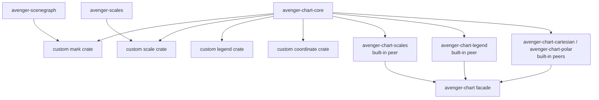
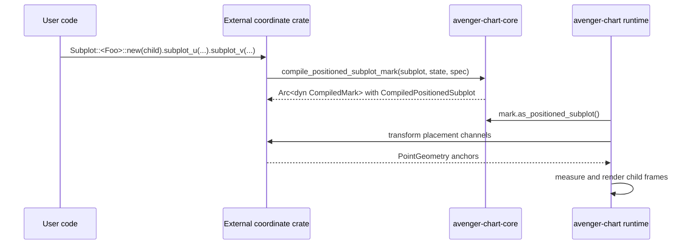

# Extension Contracts

This document lists the supported extension points for crates outside
`avenger-chart`. The common rule is that extension crates depend on
`avenger-chart-core` for chart contracts and on additional crates only when
their implementation needs those concrete services or coordinate types.

Facet, concat, partitioning, and layout containers are core-owned behavior in
`avenger-chart`; they are not external container extension points. Coordinate
systems can opt into coordinate-positioned `Subplot<Coord>` marks.

## Dependency Shape

## Custom Marks

External mark crates implement `Mark<C>` and compile into `Arc<dyn
CompiledMark>`. The authoring side stores channels in `MarkState` and
`DataContext`. The compiled side exposes planning metadata through
`CompiledMarkCore` and renders through `CompiledMark::render_from_data`.
Generic marks can depend only on core. Marks that provide coordinate-specific
authoring methods can also depend on the coordinate crate they target.

The important contracts are:

- `Mark<C>` for authoring-time marks,
- `CompiledMark` and `CompiledMarkCore` for compiled marks,
- `MarkState` and `CompiledMarkState` for channel/data state,
- `ChannelDescriptor` and `supported_channels` for declaring channels,
- `preferred_scale_type`, `default_scale_options`, and
  `default_channel_range` for scale planning,
- `preferred_legend_renderer` for legend renderer selection,
- `MarkRuntimeContext` and `CoordinateSystemTransformCore` for rendering.

Custom marks can use the macros exported by `avenger-chart-core`, such as
`impl_mark_base`, `impl_mark_trait_common`, `define_common_mark_channels`, and
`define_position_channels`.

## Custom Scales

External scale crates use `Scale<S>`, `Auto`, `ScaleSpec`,
`ScaleChannelConfig`, `ScaleChannelValue`, `ScaleDomain`, `ScaleRange`, and
`ScaleTypePreference` from `avenger-chart-core`.

A scale marker type implements `ScaleSpec`. If it provides new runtime scale
math, it returns an `Arc<dyn ScaleImpl>` from `avenger-scales`. Typed authoring
methods are extension traits implemented for `Scale<MyScale>` because external
crates cannot add inherent methods to `Scale<S>`.

Built-in scale marker types such as `Linear`, `Band`, and `Ordinal` live in
`avenger-chart-scales`; they are peers to custom scale crates.

## Custom Legend Renderers

External legend renderer crates implement `LegendRenderer` from
`avenger-chart-core`. A custom mark selects a renderer by returning
`LegendRendererSelection::Custom(Arc<dyn LegendRenderer>)` from
`CompiledMarkCore::preferred_legend_renderer`.

Built-in marks return `LegendRendererSelection::BuiltIn(LegendRendererKind)`.
`avenger-chart` resolves built-in selections through
`avenger-chart-legend::renderer_for_kind` and uses custom renderer objects
directly.

The core legend contracts include `Legend`, `LegendChannel`, `ChannelInfo`,
`MergeKey`, `ConfiguredScaleLegendExt`, and `DomainValues`.

## Custom Coordinate Systems

External coordinate crates implement:

- `CoordinateSystemCore` for required position channels,
- `CoordinateSystem` for the guide type and transform construction,
- `CoordinateSystemTransformCore` for position projection and default ranges,
- `CoordinateSystemTransform` for serialization and downcasting,
- `CoordinateGuide` and `CompiledGuide` for axes and coordinate-specific
  guide marks when guides are needed.

Coordinate transforms that support positioned subplots must return
`PointGeometry` for the placement channels declared by their subplot metadata.

## Positioned Subplot Hook

Coordinate crates own their `Subplot<Coord>` authoring methods and placement
channel names. The shared compile hook is `SubplotContainerCoordinateSystem`.

See [positioned-subplots.md](positioned-subplots.md) for the runtime details.
