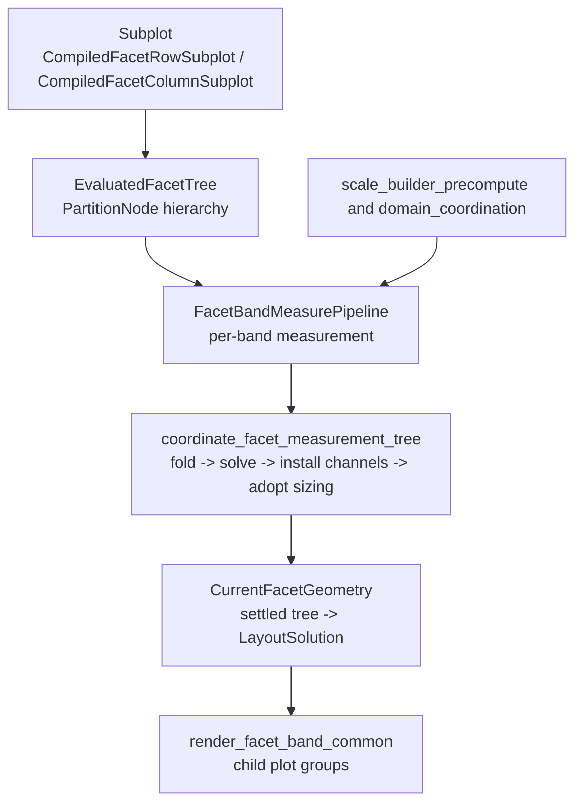
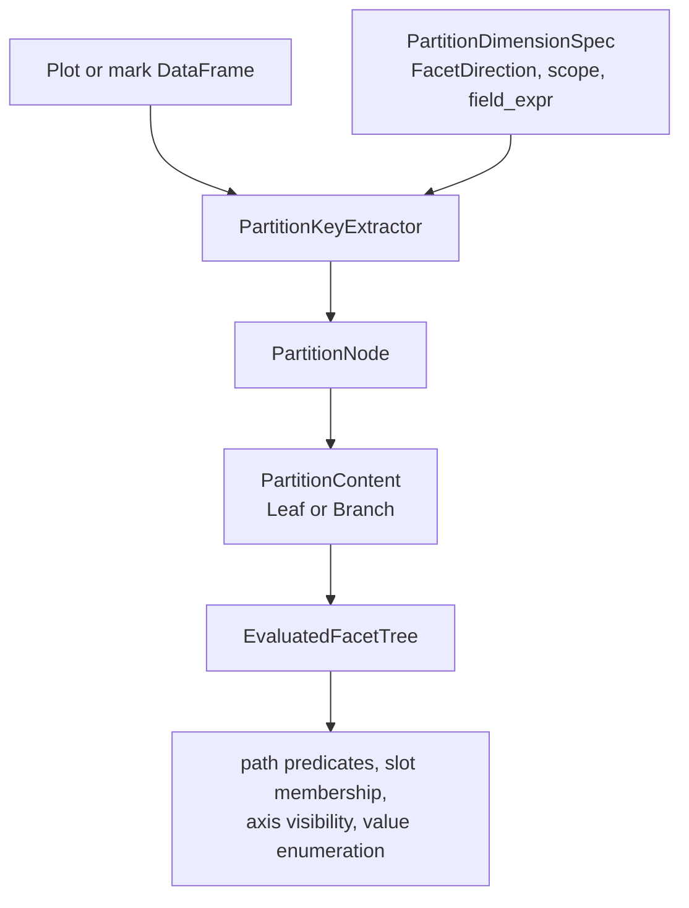

# Facet System

Facet row and facet column are built-in layout containers in `avenger-chart`.
They are implemented as coordinate systems, but they are not external
layout-container extension points.

## Runtime Pipeline

## Compile Path

Facet authoring uses the neutral `Subplot<C>` mark from `avenger-chart-marks`.
`FacetRow` and `FacetColumn` implement `SubplotContainerCoordinateSystem` in
`facet/marks/facet.rs`. Their compile hooks build `CompiledSubplotPayload`
values and return `CompiledFacetRowSubplot` or `CompiledFacetColumnSubplot`.

Facet child plots inherit parent data through filtered per-cell data overrides.
Partitioned facet children do not use explicit child plot data as an
independent data source.

## Partition Tree

`EvaluatedFacetTree::from_compiled_plot` builds the facet hierarchy before plot
measurement. It discovers compiled facet subplot marks with `facet_subplot_ref`,
extracts distinct partition values with `PartitionKeyExtractor`, and builds a
tree of `PartitionNode` values.

`PartitionDimensionSpec` describes one facet dimension while the tree is being
built. `PartitionNode` stores the facet direction, coordination scope, field name,
field expression, observed values, and `PartitionContent`. `PartitionCellPlan`
is the per-cell metadata used by measurement and rendering.

`EvaluatedFacetTree` caches path metadata, predicates, slot membership,
enumerations, jagged-axis checks, and channel-domain coordination metadata. Guide,
legend, domain, and render code query the tree instead of recomputing
partition relationships.

## Measurement

`FacetColumn` and `FacetRow` both use the shared per-band measurement pipeline
in `facet/coord.rs`. The pipeline resolves the active facet node, precomputes
scale/domain artifacts, builds cell semantics, prepares child plots, probes
overflow, computes local layout, and assembles `FacetBandCoordMeasurement`.

`FacetBandCoordMeasurement` is the central measured facet value. It contains
the measured cells, shared `ScaleBuilder` for child plot domains, local layout,
measured overflow, coordination state, current geometry handle, empty-cell
policy, child-frame path prefix, and compiled child plot.

## Coordination And Current Geometry

`coordinate_facet_measurement_tree` runs the cross-band coordination
pass as fold → solve → install channels → adopt geometry. The driver is
in `facet/coordination.rs`, the pre-solve folds plus the real-tree
lowering and channel extraction live in `facet/tree_solve.rs`, pass
construction lives in `facet/coordination_plans.rs`, and the install
and adopt walks live in `facet/coordination_apply.rs`.

- FOLD (`compute_band_folds`): chart scalars that shape the solve are
  decided before lowering, from construction-time values — per-band
  coordinated slot count (shared groups take the group max over the
  share key; FREE slot sharing keeps local n floored by
  `min_slot_count`) and the lowered track gap. Reading
  snapshot-stable values keeps repeated runs on one tree identical by
  construction.
- SOLVE (`tree_solve::tree_solved_round`): the live measurement tree
  lowers into one `avenger_layout::Layout` — leaf cells at their plot
  sizes carrying epoch overflow envelopes as layered edge demands,
  nested-band cells behind the two-wrapper boundary (a contained
  wrapper isolates the child's structural lift; a full-epoch chrome
  wrapper presents the parent level's guide/legend classification — a
  band's channel values are its OWN epoch cell folds, including that
  classification), cousins sharing `avenger_layout` keys, ghost slots
  padded to the folded slot count. One solve yields the layout channel
  (solved track spacing; `guide_slot_gap_px` folds chart-side) and the
  full-overflow channel (each node's `Region.coordinated` edges — its
  own post-share ask). When the shadow census is enabled the solve is
  also retained whole (`RetainedFacetSolve`) for the census's adoption
  probe. Guide-anchor and boundary overflow remain chart-side folds
  over their own scopes (`fold_overflow_entries`): lanes split groups,
  and boundary strips global edges per node.
- INSTALL (`build_requirement_pass_with_round` +
  `apply_requirement_pass`): the per-node channel values (lane gap
  folds and global-edge outer reversion applied in
  `build_round_solution`), coverage-validated at construction; per
  band, realized legend-slab ownership resets and the pass's `Arc`
  handle installs. Bands read coordinated values as views into the
  installed solution (`active_layout()` / `active_overflow()`),
  falling back to local values pre-coordination.
- ADOPT (`run_adopt`): one top-down walk moves every band to the
  operating point its installed solution implies, through the
  no-remeasure substrate
  (`retarget_parent_plot_area_policy_no_remeasure`). Each cell's plot
  area adopts the coordinated band-axis size plus the legend-shrunk
  orthogonal extent, and ordinary child plot scale ranges follow — all
  gated by the sizing policy (content-driven axes keep their measured
  sizes). The substrate recurses when a cell's size moves; the walk
  covers layout-changed-but-size-unchanged bands. Ownership
  realization runs per band after its subtree adopts; the
  domain-recompute seam (`adopt_domain_recompute_seam`) is a named
  no-op because domains are data-driven today.

Adopt applies the pipeline's state-transition law, not a read of solved
geometry: the solve lowers cells at their live sizes, so its slot
geometry describes the current state, while the transition values are
the next operating point. Adoption moves the tree to the solve's fixed
point — at the settled state, solved slots equal live geometry and
re-lowering changes nothing. The env-gated shadow census
(`AVENGER_SHADOW_TREE_SOLVE=1`) verifies this equilibrium per run:
geometry (settled slots vs live cells), idempotence (re-solve from the
shadow's own slots), and adoption (`adopt_delta`: retained install-time
solution vs settled re-solve — the size of the transition the run
applied).

Within a coordination run, measured chrome and overflow stay FROZEN at
their epoch measurements (the staleness law): adoption moves geometry,
never re-measures, so chrome decisions made at estimate-phase geometry
(tick density, label extents) can mis-fit the adopted geometry by the
re-measure delta. The refinement loop owns shrinking that residual:
`EvaluationOptions.facet_layout_refinement.max_refinement_passes`
(default 2) re-measures at realized geometry and re-runs the
coordination pipeline until overflow stops growing
(`overflow_growth_epsilon`); the preview fast path runs measure-once
(passes = 0). The `facet_wrap_auto_columns_measure_once` baseline pins
what the epoch residual looks like.

The public `CoordinationCheckpoint` variants map onto the stages:
`ChannelsInstalled` stops after install (channel values readable,
geometry not yet adopted) and `Adopted` stops after geometry adoption.

After every stable no-remeasure mutation boundary, chart refreshes
`CurrentFacetGeometry` from the settled measurement tree:
`refresh_current_facet_geometry` lowers the current tree and solves one
`avenger_layout::Layout`. Rendering, facet guide positions, debug overlays,
and child-frame readback consume this current geometry directly. Missing
current geometry for a renderable facet band is an internal error.

`facet/placement.rs` still contains chart-owned geometry helpers for deriving
uniform or content-driven facet band geometry during measurement and geometry
refresh. Those helpers are not a second render-time source of truth: final
render/readback positions come from `CurrentFacetGeometry`, not configured
facet row/column scales and not a render-local fallback solve.

## Generic Layout Alignment Boundary

Facet layout also participates in the generic child-frame layout-alignment
pass described in [layout-and-child-frames.md](layout-and-child-frames.md).
`FacetBandCoordMeasurement` exports a `ChildFrameLayoutCoordinationNode` whose
grid-shaped requirements are derived from the current facet geometry. The
node includes a facet semantic tag so equivalent facet bands can align across
manual or repeat-generated container siblings without grouping unrelated
facet fields.

Facet nodes participate in the generic pass for DIAGNOSTICS only (group
membership, merged requirements, deltas) — there is no facet
value-apply adapter because in-chart facet cousins are already equalized by the
coordination pass before alignment runs.
The `concat_grid_facet_track_alignment` visual baseline pins the
closest reachable boundary rendering.
`coordinate_facet_measurement_tree` is the authoritative facet
coordination path (fold–solve–install–adopt); concat containers are the
only apply-capable alignment kinds.

## Coordination

Facet slot sharing and scale-domain coordination both use `CoordinationScope`
at the API boundary. The runtime normalizes these scopes into internal
`SharingLevel` values where older facet and child-frame algorithms still need a
numeric level.

`facet/sharing_policy.rs` combines coordination primitives with facet path
metadata to decide domain grouping, axis label ownership, axis title ownership,
and legend ownership. `FacetWrap` is special only in its physical layout: it
contributes exactly one logical facet level even though it lays out as hidden
row bands containing visible column cells.

Facet measurements also feed the generic child-frame path with
`ContainerPathSegment::FacetValue`, so nested child-frame guide/domain/legend
sharing can cross facet and non-facet containers. See
[layout-and-child-frames.md](layout-and-child-frames.md).
