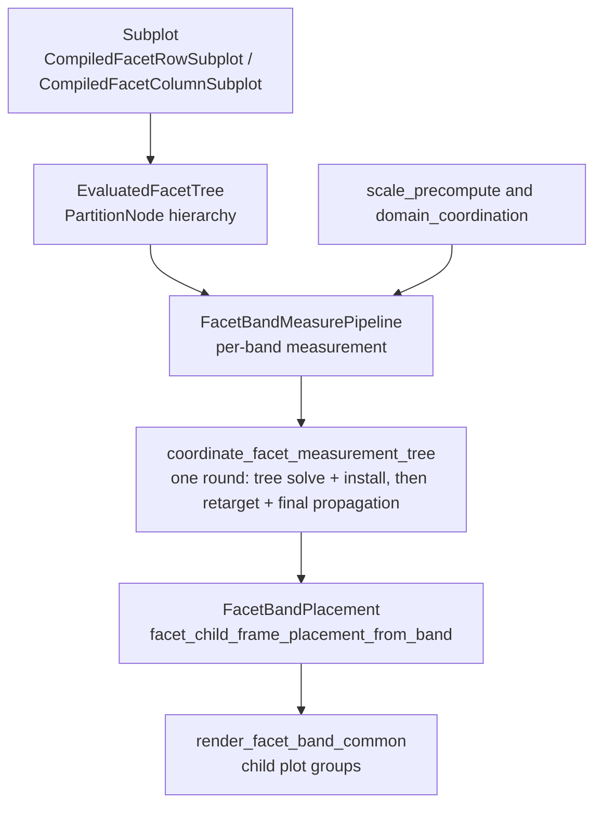
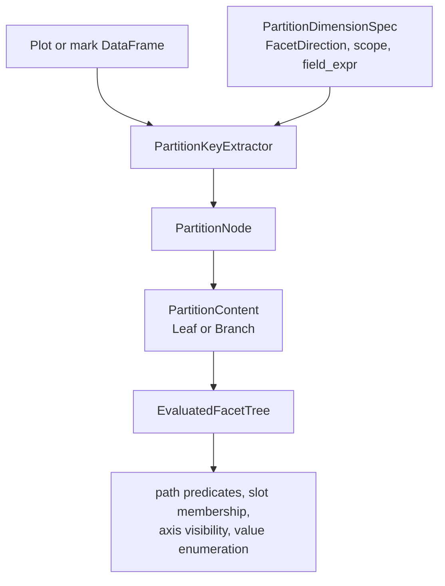

# Facet System

Facet row and facet column are built-in layout containers in `avenger-chart`.
They are implemented as coordinate systems, but they are not external
layout-container extension points.

## Runtime Pipeline

## Compile Path

Facet authoring uses the neutral `Subplot<C>` mark from `avenger-chart-marks`.
`FacetRow` and `FacetColumn` implement `SubplotContainerCoordinateSystem` in
`facet/marks/facet.rs`. Their compile hooks build `CompiledSubplotPayload`
values and return `CompiledFacetRowSubplot` or `CompiledFacetColumnSubplot`.

Facet child plots inherit parent data through filtered per-cell data overrides.
Partitioned facet children do not use explicit child plot data as an
independent data source.

## Partition Tree

`EvaluatedFacetTree::from_compiled_plot` builds the facet hierarchy before plot
measurement. It discovers compiled facet subplot marks with `facet_subplot_ref`,
extracts distinct partition values with `PartitionKeyExtractor`, and builds a
tree of `PartitionNode` values.

`PartitionDimensionSpec` describes one facet dimension while the tree is being
built. `PartitionNode` stores the facet direction, coordination scope, field name,
field expression, observed values, and `PartitionContent`. `PartitionCellPlan`
is the per-cell metadata used by measurement and rendering.

`EvaluatedFacetTree` caches path metadata, predicates, slot membership,
enumerations, jagged-axis checks, and channel-domain coordination metadata. Guide,
legend, domain, and render code query the tree instead of recomputing
partition relationships.

## Measurement

`FacetColumn` and `FacetRow` both use the shared per-band measurement pipeline
in `facet/coord.rs`. The pipeline resolves the active facet node, precomputes
scale/domain artifacts, builds cell semantics, prepares child plots, probes
overflow, computes local layout, and assembles `FacetBandCoordMeasurement`.

`FacetBandCoordMeasurement` is the central measured facet value. It contains
the measured cells, band scale, local layout, measured overflow, coordination
state, placement model, empty-cell policy, child-frame path prefix, and
compiled child plot.

## Coordination And Placement

`coordinate_facet_measurement_tree` runs the cross-band coordination
pass. The driver is in `facet/coordination.rs`, the real-tree lowering
and channel extraction live in `facet/tree_solve.rs`, pass construction
and the chart-side folds live in `facet/coordination_plans.rs`, the
decide-then-apply walkers live in `facet/coordination_apply.rs`, and
sizing decisions live in `FacetCoordinationPolicy`.

The driver is linear — ONE round (the round-identity law: requirement
snapshots read only epoch-frozen and construction values, so a second
collect-and-install was always a byte-identical no-op):

- collect a requirement snapshot from every facet band
  (`collect_requirement_snapshot`),
- solve the REAL facet tree (`tree_solve::tree_solved_round`): the live
  measurement tree lowers into one `avenger_layout::Layout` — leaf
  cells at their plot sizes carrying epoch overflow envelopes as
  layered edge demands, nested-band cells behind the two-wrapper
  boundary (a contained wrapper isolates the child's structural lift; a
  full-epoch chrome wrapper presents the parent level's guide/legend
  classification — a band's channel values are its OWN epoch cell
  folds, including that classification), cousins sharing
  `avenger_layout` keys, ghost slots padded to the coordinated slot
  count. One solve yields the layout channel (solved track spacing;
  slot counts and `guide_slot_gap_px` fold chart-side) and the
  full-overflow channel (each node's `Region.coordinated` edges — its
  own post-share ask). Guide-anchor and boundary overflow remain
  chart-side folds over their own scopes (`fold_overflow_entries`):
  lanes split groups, and boundary strips global edges per node,
- construct the pass's `CoordinationSolution`
  (`build_requirement_pass_with_round`): the per-node channel values
  with the write-back adjustments applied (free slot sharing keeps
  local counts, lane gap folds, global-edge outer reversion, in
  `build_round_solution`), coverage-validated at construction,
- install the solution (`apply_requirement_pass`): per band, reset
  realized legend-slab ownership and install the pass's `Arc` handle.
  Bands read coordinated values as views into the installed solution
  (`active_layout()` / `active_overflow()` / the `*_value()`
  accessors), falling back to local values pre-coordination,
- retarget frames at the written-back targets (`run_retarget`): derive
  every node's decisions from pre-retarget state in one read-only pass,
  then apply parent-first, propagating parent cross sizes to children
  between apply and recurse. Coverage and trace alignment are by
  construction (decide and apply share one traversal),
- final propagation (`run_final_propagation`): the same
  decide-then-apply shape pushes coordinated plot areas and band scale
  ranges to descendants (uniform child targets derive from a band
  solve).

The public `CoordinationCheckpoint` variants map onto these stages
(`RetargetedRequirementsApplied` is post-retarget: requirement snapshots
read only epoch-frozen and construction-time values, so a re-collected
pass would be identical to the initial one).

Rendering resolves `FacetBandPlacement` through `facet/placement.rs`, converts
that placement to child-frame render placements, and calls
`CompiledPlot::build_plot_components` for each renderable cell. Placement is
a pure read in both modes: scale-backed bands resolve cell positions from the
active band scale, and explicit (leaf-plot-area-sized) bands solve the band
on read from the live cells and the coordinated views
(`explicit_placement()`: an avenger-layout band solve over cell plot sizes
and boundary demands, plus the boundary-overflow cross offset). There is no
cached placement and nothing to refresh after mutating cells, scales, or
coordinated values. Empty explicit bands derive their extent from the
containing measurement's plot area at each consumer.

## Generic Layout Alignment Boundary

Facet layout also participates in the generic child-frame layout-alignment
pass described in [layout-and-child-frames.md](layout-and-child-frames.md).
`FacetBandCoordMeasurement` exports a `ChildFrameLayoutCoordinationNode` whose
grid-shaped requirements are derived from the resolved facet placement. The
node includes a facet semantic tag so equivalent facet bands can align across
manual or repeat-generated container siblings without grouping unrelated
facet fields.

Facet nodes participate in the generic pass for DIAGNOSTICS only (group
membership, merged requirements, deltas) — there is no facet
value-apply adapter, because none would ever run: applying requires
explicit placement, which exists only under a leaf-plot-sized facet
root, and a root cannot also be a concat child, so no multi-member
alignment group can reach an applicable band (in-chart facet cousins
are already equalized by the coordination pass before alignment runs).
The `concat_grid_facet_track_alignment` visual baseline pins the
closest reachable boundary rendering.
`coordinate_facet_measurement_tree` is the authoritative facet
retarget/final-propagation path; concat containers are the only
apply-capable alignment kinds.

## Coordination

Facet slot sharing and scale-domain coordination both use `CoordinationScope`
at the API boundary. The runtime normalizes these scopes into internal
`SharingLevel` values where older facet and child-frame algorithms still need a
numeric level.

`facet/sharing_policy.rs` combines coordination primitives with facet path
metadata to decide domain grouping, axis label ownership, axis title ownership,
and legend ownership. `FacetWrap` is special only in its physical layout: it
contributes exactly one logical facet level even though it lays out as hidden
row bands containing visible column cells.

Facet measurements also feed the generic child-frame path with
`ContainerPathSegment::FacetValue`, so nested child-frame guide/domain/legend
sharing can cross facet and non-facet containers. See
[layout-and-child-frames.md](layout-and-child-frames.md).
