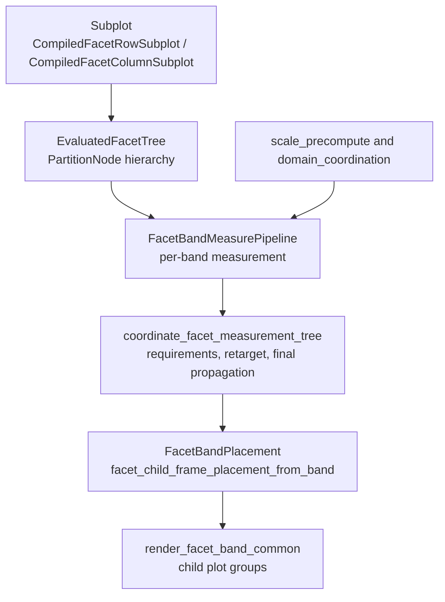
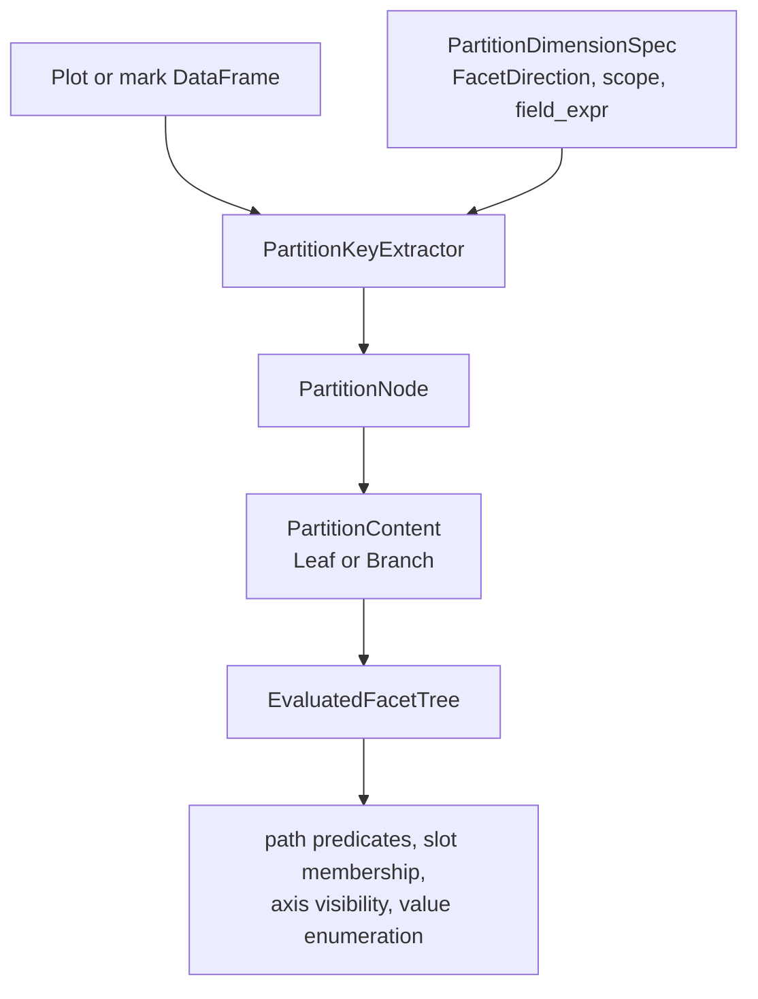

# Facet System

Facet row and facet column are built-in layout containers in `avenger-chart`.
They are implemented as coordinate systems, but they are not external
layout-container extension points.

## Runtime Pipeline

## Compile Path

Facet authoring uses the neutral `Subplot<C>` mark from `avenger-chart-marks`.
`FacetRow` and `FacetColumn` implement `SubplotContainerCoordinateSystem` in
`facet/marks/facet.rs`. Their compile hooks build `CompiledSubplotPayload`
values and return `CompiledFacetRowSubplot` or `CompiledFacetColumnSubplot`.

Facet child plots inherit parent data through filtered per-cell data overrides.
Partitioned facet children do not use explicit child plot data as an
independent data source.

## Partition Tree

`EvaluatedFacetTree::from_compiled_plot` builds the facet hierarchy before plot
measurement. It discovers compiled facet subplot marks with `facet_subplot_ref`,
extracts distinct partition values with `PartitionKeyExtractor`, and builds a
tree of `PartitionNode` values.

`PartitionDimensionSpec` describes one facet dimension while the tree is being
built. `PartitionNode` stores the facet direction, coordination scope, field name,
field expression, observed values, and `PartitionContent`. `PartitionCellPlan`
is the per-cell metadata used by measurement and rendering.

`EvaluatedFacetTree` caches path metadata, predicates, slot membership,
enumerations, jagged-axis checks, and channel-domain coordination metadata. Guide,
legend, domain, and render code query the tree instead of recomputing
partition relationships.

## Measurement

`FacetColumn` and `FacetRow` both use the shared per-band measurement pipeline
in `facet/coord.rs`. The pipeline resolves the active facet node, precomputes
scale/domain artifacts, builds cell semantics, prepares child plots, probes
overflow, computes local layout, and assembles `FacetBandCoordMeasurement`.

`FacetBandCoordMeasurement` is the central measured facet value. It contains
the measured cells, band scale, local layout, measured overflow, coordination
state, placement model, empty-cell policy, child-frame path prefix, and
compiled child plot.

## Coordination And Placement

`coordinate_facet_measurement_tree` runs the cross-band coordination pipeline.
The driver is in `facet/coordination.rs`, immutable plans live in
`facet/coordination_plans.rs`, bounded mutation walkers live in
`facet/coordination_apply.rs`, and sizing decisions live in
`FacetCoordinationPolicy`.

The coordination stages are:

- initial requirement collection and distribution,
- retarget planning and execution,
- retargeted requirement collection,
- final propagation.

Rendering resolves `FacetBandPlacement` through `facet/placement.rs`, converts
that placement to child-frame render placements, and calls
`CompiledPlot::build_plot_components` for each renderable cell.

## Generic Layout Alignment Boundary

Facet layout also participates in the generic child-frame layout-alignment
pass described in [layout-and-child-frames.md](layout-and-child-frames.md).
`FacetBandCoordMeasurement` exports a `ChildFrameLayoutCoordinationNode` whose
grid-shaped requirements are derived from the resolved facet placement. The
node includes a facet semantic tag so equivalent facet bands can align across
manual or repeat-generated container siblings without grouping unrelated
facet fields.

The generic pass currently coexists with the facet-specific coordination
driver. Facet-only measurement still uses `coordinate_facet_measurement_tree`
as the authoritative retarget/final-propagation path. The generic facet-band
apply adapter is deliberately narrower: it only mutates safe explicit
`FacetColumn` / `FacetRow` bands by converting merged `GridTrackRequirements`
back into `CoordinatedLayout`, then reusing
`FacetBandCoordMeasurement::set_coordinated_layout_value(...)` and
`recompute_explicit_placement_if_needed()`.

The adapter refuses cases where that round trip is not proven safe, including
`FacetWrap`'s nested physical band topology, scale-backed placement, empty
bands, and topology mismatches. This keeps the full facet pipeline in charge
of complex facet retargeting while still allowing the generic layout pass to
align safe facet bands nested inside concat or repeat structures.

## Coordination

Facet slot sharing and scale-domain coordination both use `CoordinationScope`
at the API boundary. The runtime normalizes these scopes into internal
`SharingLevel` values where older facet and child-frame algorithms still need a
numeric level.

`facet/sharing_policy.rs` combines coordination primitives with facet path
metadata to decide domain grouping, axis label ownership, axis title ownership,
and legend ownership. `FacetWrap` is special only in its physical layout: it
contributes exactly one logical facet level even though it lays out as hidden
row bands containing visible column cells.

Facet measurements also feed the generic child-frame path with
`ContainerPathSegment::FacetValue`, so nested child-frame guide/domain/legend
sharing can cross facet and non-facet containers. See
[layout-and-child-frames.md](layout-and-child-frames.md).
