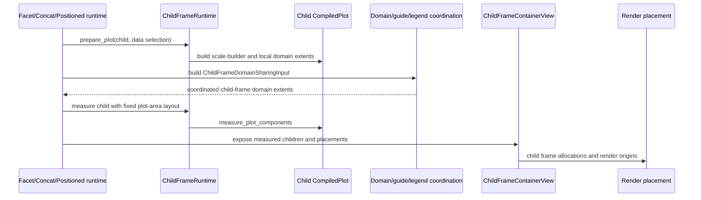
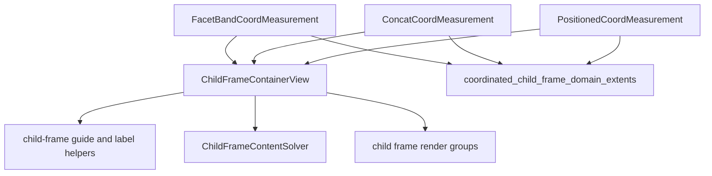

# Layout And Child Frames

The top-level `avenger-chart` crate owns layout runtime behavior. Facet,
concat, repeat-lowered concat, and coordinate-positioned subplots all measure
child plots as chart frames and expose them through a shared child-frame view.

The chart-independent layout primitives underneath — geometry, the band/grid
solvers, and requirement alignment — live in the `avenger-layout` crate.
`avenger-chart` re-exports them through `crate::layout` and adapts chart
concepts at the boundary: plot area -> content size, guide overflow -> inner
edge, legend overflow -> outer edge, rendered envelope -> total edge.

## Child-Frame Lifecycle

## Shared Types

`ChildFrameRuntime` prepares and measures child plots. It owns the common
"measure this child plot as a frame" work used by container-style coordinates.

Important runtime values:

- `PreparedChildFramePlot`: prepared child plot, data override, scale builder,
  local domain extents, and channel coordination metadata,
- `ChildFrameDataSelection`: explicit child data or inherited parent data,
- `ChildFrameScopeKey`: stable identity for one child frame,
- `ChildFrameKey`: immediate child identity for concat, positioned subplot,
  positioned partition, or facet value,
- `ContainerPathSegment`: ancestor path identity,
- `ChildFrameSharingLevel` and `ChildFrameSharingPath`: nested sharing position
  metadata,
- `ChildFrameDomainSharingInput`: local domain extents and coordination
  metadata for a measured child,
- `ChildFrameContainerView`: read-only projection over measured child frames,
- `ChildFrameRenderPlacement`: render origin for one child frame.

The lower-level placement utilities are `PlacementSolution` and
`BandSolution` from the `avenger-layout` crate.

## Container Producers

Facet uses `FacetBandCoordMeasurement`. Concat uses `ConcatCoordMeasurement`.
Repeat containers lower to concat containers before measurement, so they also
produce `ConcatCoordMeasurement`. Coordinate-positioned subplots use
`PositionedCoordMeasurement`. The common projection function accepts these
measurements and returns `ChildFrameContainerView`.

## Measurement Pattern

Containers decide which child frames exist. For each child frame they:

- prepare the child plot with `ChildFrameRuntime::prepare_plot`,
- build a scope key and child-frame coordination level,
- coordinate child-frame domains through
  `coordinated_child_frame_domain_extents`,
- measure the child with `PreparedChildFramePlot::measure`,
- store the child measurement and render placement in the container
  coordinate measurement.

The child plot is measured with a fixed plot-area layout generated by
`ChildFrameRuntime::fixed_plot_area_layout_spec`.

## Layout Consumption

`ComponentsMeasurement::child_frame_container_view` exposes a measured
container to generic consumers. `ComponentsMeasurement::content_layout` uses
`ChildFrameContentSolver` when a child-frame view exists and
`SinglePlotContentSolver` otherwise.

Guides, legends, debug overlays, and render code consume the same measured
child-frame identities and placements, so each container does not need a
separate implementation of those cross-cutting concerns.

See [facet-system.md](facet-system.md), [concat-system.md](concat-system.md),
[repeat-system.md](repeat-system.md), and
[positioned-subplots.md](positioned-subplots.md) for the concrete container
producers.

## Layout Coordination And Alignment

Child-frame layout alignment is the generic physical-layout coordination pass
for nested child-frame containers. It is separate from domain coordination:

- domain coordination decides which scales share data domains;
- axis guide visibility decides which physical axes own labels and titles;
- layout alignment decides which physical tracks, guide gaps, outer offsets,
  and chrome slabs should line up across equivalent container instances.

The implementation lives in
`plot/compiled/child_frame_coordination.rs`. It exports
`ChildFrameLayoutCoordinationNode` values from measured containers and groups
them by `LayoutAlignmentKey` through the chart-side alignment engine
(`layout/alignment.rs::align_by`): compatible groups merge their
`ChartGridData` per-track requirements by component-wise max for delta
gating and diagnostics. The chart-only `guide_slot_gap_px` rides in a
`ChartGridRequirements` side-car and is folded per group over the plan's
member IDs.

How a planned group applies depends on the container family:

- **Concat-family groups solve together on a real share key**
  (`layout/concat_grid.rs::solve_concat_grid_group`): every member is
  rebuilt from its own measured cells (`GridMemberSpec`), all members share
  one `avenger_layout` key in a single solve (the solver merges the
  per-track requirement folds; each member re-solves at the merged floors
  with its own span constraints), and each member installs its own
  extracted solution through
  `ConcatCoordMeasurement::install_grid_solution` — pure placement
  write-back with change detection, no solving.
- **Facet-band groups apply merged requirement values** through the gated
  facet adapter described below.

For grid-shaped child-frame containers, the exported topology is a list of
slot rectangles, not just child count. A manual `GridConcat` child with
`grid_span(2, 3)` exports one child-frame slot covering the corresponding row
and column interval. Alignment therefore distinguishes equivalent spanned
grids from non-spanned grids that happen to contain the same number of child
plots, and it can align matching spanned grids nested under different facet
values.

The grouping key intentionally distinguishes physical instance identity from
semantic template identity. Repeat-generated concat children use stable
template keys such as `repeat_cell:*`, so equivalent repeat grids under
different facet values can align. Facet-band nodes include a semantic facet tag
containing axis, depth, and facet-field identity, so same-shaped but unrelated
facets do not align accidentally. Manual grid siblings that contain equivalent
facet bands may align through a narrow template rule that drops only the
immediate non-repeat grid-child segment while preserving ancestor context and
the facet semantic tag.

The pass records two kinds of evidence:

- measurement-only diagnostics from
  `diagnose_child_frame_layout_alignment(...)`, including exported node count,
  alignment group count, merged deltas, and skipped groups;
- apply traces from `apply_child_frame_layout_alignment(...)`, including
  exported nodes, planned groups, and actually applied containers.

Those names are deliberately generic. They should not be reported as
facet-only coordination even when some participating nodes are facet bands.

## Current Adapter Boundary

Concat-family containers are the primary apply-capable containers. `GridConcat`,
`WrapConcat`, `HConcat`, and `VConcat` expose grid-shaped requirements and can
be physically aligned across equivalent instances.

Facet bands also export layout-coordination nodes. Their mutating adapter is
gated: it applies only to safe explicit `FacetColumn` / `FacetRow` bands whose
topology can round-trip through the existing facet placement path. The adapter
rejects empty bands, nested facet children, scale-backed facet placement, and
topology mismatches. The existing facet coordination driver remains the
authoritative path for facet-only retargeting and final propagation.

This coexistence is intentional. The generic pass solves cross-container
alignment such as repeat inside facet, facet inside repeat, and facet bands
inside manual grid siblings. The facet-specific driver still owns the full
facet measurement algorithm until broad facet parity justifies retiring more
of that code.

## Preview Invariant

Preview evaluation may reuse prior measurements and rendered data marks, but
measurements with a `ChildFrameContainerView` must still traverse children when
building the evaluated plot. Child traversal regenerates nested interaction
scopes for concat, repeat, facet, tool, and selection routing. Data-mark-only
reuse for a child-frame container would preserve visible marks while dropping
those scopes, so the Preview renderer declines that reuse path for child-frame
containers.

When Preview can reuse terminal facet-cell measurements during responsive
structure reflow, it must refresh guide ownership, legend layout, frame layout,
overflow, and interaction-scope metadata under the current physical owner path
before the reused cell is treated as current. If a child-frame physical
structure changes in a way that cannot be refreshed safely, Preview falls back
with `PhysicalStructureMismatch` and rebuilds the measurement. The layout
alignment pass uses measurements from the current evaluation and does not reuse
stale aligned child measurements after a physical-path change.
