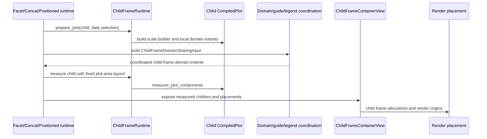
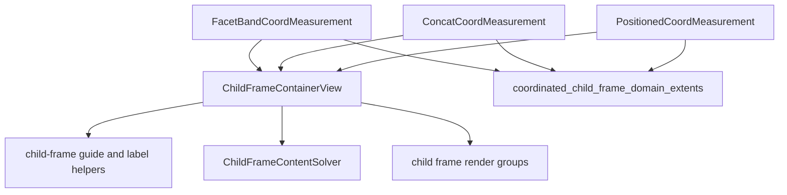

# Layout And Child Frames

The top-level `avenger-chart` crate owns layout runtime behavior. Facet,
concat, repeat-lowered concat, and coordinate-positioned subplots all measure
child plots as chart frames and expose them through a shared child-frame view.

## Child-Frame Lifecycle

## Shared Types

`ChildFrameRuntime` prepares and measures child plots. It owns the common
"measure this child plot as a frame" work used by container-style coordinates.

Important runtime values:

- `PreparedChildFramePlot`: prepared child plot, data override, scale builder,
  local domain extents, and channel coordination metadata,
- `ChildFrameDataSelection`: explicit child data or inherited parent data,
- `ChildFrameScopeKey`: stable identity for one child frame,
- `ChildFrameKey`: immediate child identity for concat, positioned subplot,
  positioned partition, or facet value,
- `ContainerPathSegment`: ancestor path identity,
- `ChildFrameSharingLevel` and `ChildFrameSharingPath`: nested sharing position
  metadata,
- `ChildFrameDomainSharingInput`: local domain extents and coordination
  metadata for a measured child,
- `ChildFrameContainerView`: read-only projection over measured child frames,
- `ChildFrameRenderPlacement`: render origin for one child frame.

The lower-level placement utilities are `ChildFramePlacementResult` and
`BandChildFramePlacement`.

## Container Producers

Facet uses `FacetBandCoordMeasurement`. Concat uses `ConcatCoordMeasurement`.
Repeat containers lower to concat containers before measurement, so they also
produce `ConcatCoordMeasurement`. Coordinate-positioned subplots use
`PositionedCoordMeasurement`. The common projection function accepts these
measurements and returns `ChildFrameContainerView`.

## Measurement Pattern

Containers decide which child frames exist. For each child frame they:

- prepare the child plot with `ChildFrameRuntime::prepare_plot`,
- build a scope key and child-frame coordination level,
- coordinate child-frame domains through
  `coordinated_child_frame_domain_extents`,
- measure the child with `PreparedChildFramePlot::measure`,
- store the child measurement and render placement in the container
  coordinate measurement.

The child plot is measured with a fixed plot-area layout generated by
`ChildFrameRuntime::fixed_plot_area_layout_spec`.

## Layout Consumption

`ComponentsMeasurement::child_frame_container_view` exposes a measured
container to generic consumers. `ComponentsMeasurement::content_layout` uses
`ChildFrameContentSolver` when a child-frame view exists and
`SinglePlotContentSolver` otherwise.

Guides, legends, debug overlays, and render code consume the same measured
child-frame identities and placements, so each container does not need a
separate implementation of those cross-cutting concerns.

See [facet-system.md](facet-system.md), [concat-system.md](concat-system.md),
[repeat-system.md](repeat-system.md), and
[positioned-subplots.md](positioned-subplots.md) for the concrete container
producers.

## Preview Invariant

Preview evaluation may reuse prior measurements and rendered data marks, but
measurements with a `ChildFrameContainerView` must still traverse children when
building the evaluated plot. Child traversal regenerates nested interaction
scopes for concat, repeat, facet, tool, and selection routing. Data-mark-only
reuse for a child-frame container would preserve visible marks while dropping
those scopes, so the Preview renderer declines that reuse path for child-frame
containers.
