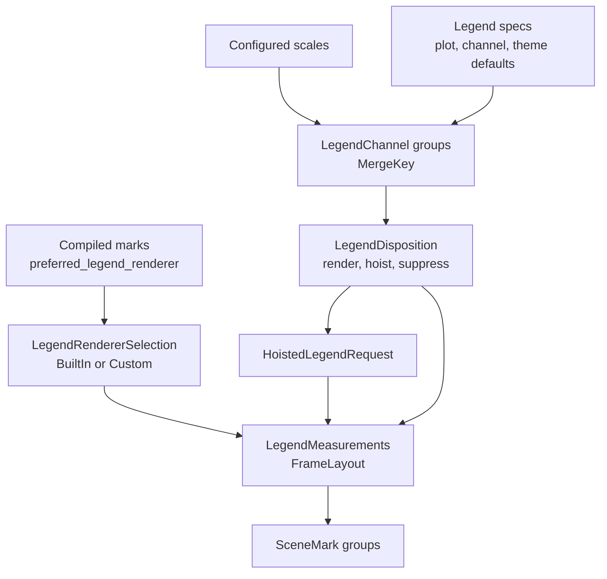

# Legends And Guides

Legends and coordinate guides are planned during plot measurement and rendered
from the measured layout. Core owns the contracts. Built-in legend rendering
lives in `avenger-chart-legend`; plot-level legend planning lives in
`avenger-chart`.

## Legend Flow

## Legend Contracts

`Legend` is the legend spec. `LegendRenderer` is the renderer trait. A compiled
mark chooses a renderer by returning `LegendRendererSelection` from
`CompiledMarkCore::preferred_legend_renderer`.

`LegendRendererSelection::BuiltIn(LegendRendererKind)` is resolved through
`avenger-chart-legend::renderer_for_kind`. `LegendRendererSelection::Custom`
contains an `Arc<dyn LegendRenderer>` and is used directly.

`LegendChannel` carries the channel name, expression, configured scale, channel
type, resolved coordination level, mark type, mark index, and related channel
info.
`MergeKey` allows compatible discrete legend channels from the same mark to be
merged.

## Legend Planning

`CompiledPlot::prepare_legend_plan` builds a `PreparedLegendPlan` from
configured scales, legend specs, facet path, child-frame sharing path, and
legend scope. It:

- combines plot-level, channel-level, default, and theme legend configs,
- builds `LegendChannel` values,
- groups mergeable channels,
- resolves legend position,
- decides whether each group renders locally, is hoisted, or is suppressed,
- measures local groups and records hoisted requests.

Hoisted legends are represented by `HoistedLegendRequest`. Anchors are either
`HoistedLegendAnchor::FacetPath` or
`HoistedLegendAnchor::ChildFrameContainer`.

## Guide Contracts

Coordinate guides implement `CoordinateGuide` at authoring/compile time and
`CompiledGuide` at runtime. `CoordinateGuide` receives channel-level axes with
`set_axes`, receives compiled marks with `set_compiled_marks`, and produces a
boxed `CompiledGuide`.

`CompiledGuide` measures overflow, evaluates guide marks, and returns a clip
region. Guide measurement receives `GuideSharingContext`, which exposes facet
and child-frame ownership queries.

Cartesian and Polar guides live in `avenger-chart-cartesian` and
`avenger-chart-polar`. Facet and concat guides live in the facade because they
depend on facade-owned child-frame measurements.

Nested Cartesian axes are guide bands rendered from `NestedBand` scale
readback. Each visible nested level receives its own axis band. Leaf levels use
leaf-band centers for ticks and labels, parent levels use span centers and
separator rules, and hidden levels remain part of the scale geometry. The level
axis config is stored on `NestedBandLevelSpec`, with outer channel axis config
providing shared defaults.

## Ownership Rules

Facet and child-frame legend ownership use the same scoped coordination
primitive as scale-domain coordination. Free legends render locally. Non-free
legends render at the owner for their resolved coordination scope or are
hoisted to that owner.

The visual channel owns its legend. A coordinated `subplot_x` placement
channel does not promote a `fill` legend; the `fill` channel's own coordination
metadata controls that legend.

Nested position levels also do not own legends. They are represented by the
Cartesian axis. If the same field should have a legend, it must be encoded on a
legendable visual channel such as `fill`, `stroke`, `shape`, `size`, or
`opacity`.

## Axis Guide Visibility Policy

Container-style coordinates can apply `AxisGuideVisibilityPolicy` to child
axes:

- `Auto` preserves the container's default behavior;
- `All` leaves every eligible child guide visible;
- `OuterEdges` compacts guides to physical outer non-empty edges;
- `OuterForEquivalentDomainGroups` compacts only when aligned cells have
  equivalent domain coordination targets.

Facets use this policy to preserve current facet behavior under `Auto` while
allowing explicit overrides. `GridConcat` and `WrapConcat` use the same policy
for manual matrix and wrapped layouts. `RepeatGrid::matrix_axes()` selects
`OuterForEquivalentDomainGroups` on the lowered `GridConcat` and supplies
repeat-variable axis-title defaults.

See [scales-domains-and-sharing.md](scales-domains-and-sharing.md) for domain
coordination, [concat-system.md](concat-system.md) for concat guide policy,
[repeat-system.md](repeat-system.md) for matrix-axis defaults, and
[layout-and-child-frames.md](layout-and-child-frames.md) for child-frame
coordination paths.
