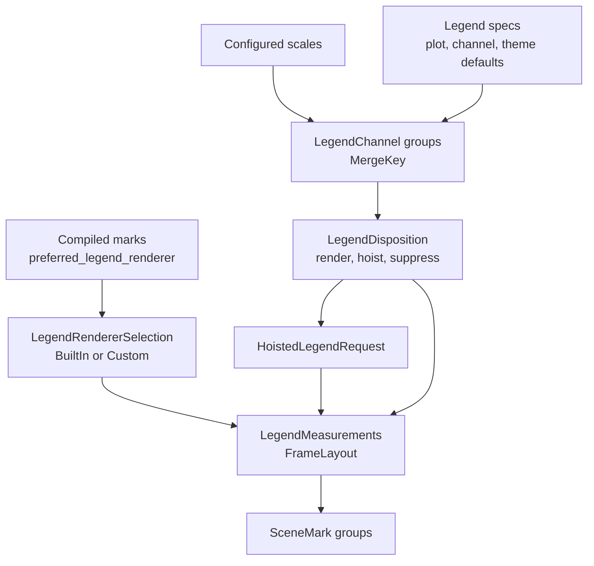

# Legends And Guides

Legends and coordinate guides are planned during plot measurement and rendered
from the measured layout. Core owns the contracts. Built-in legend rendering
lives in `avenger-chart-legend`; plot-level legend planning lives in
`avenger-chart`.

## Legend Flow

## Legend Contracts

`Legend` is the legend spec. `LegendRenderer` is the renderer trait. A compiled
mark chooses a renderer by returning `LegendRendererSelection` from
`CompiledMarkCore::preferred_legend_renderer`.

`LegendRendererSelection::BuiltIn(LegendRendererKind)` is resolved through
`avenger-chart-legend::renderer_for_kind`. `LegendRendererSelection::Custom`
contains an `Arc<dyn LegendRenderer>` and is used directly.

`LegendChannel` carries the channel name, expression, configured scale, channel
type, sharing level, mark type, mark index, and related channel info.
`MergeKey` allows compatible discrete legend channels from the same mark to be
merged.

## Legend Planning

`CompiledPlot::prepare_legend_plan` builds a `PreparedLegendPlan` from
configured scales, legend specs, facet path, child-frame sharing path, and
legend scope. It:

- combines plot-level, channel-level, default, and theme legend configs,
- builds `LegendChannel` values,
- groups mergeable channels,
- resolves legend position,
- decides whether each group renders locally, is hoisted, or is suppressed,
- measures local groups and records hoisted requests.

Hoisted legends are represented by `HoistedLegendRequest`. Anchors are either
`HoistedLegendAnchor::FacetPath` or
`HoistedLegendAnchor::ChildFrameContainer`.

## Guide Contracts

Coordinate guides implement `CoordinateGuide` at authoring/compile time and
`CompiledGuide` at runtime. `CoordinateGuide` receives channel-level axes with
`set_axes`, receives compiled marks with `set_compiled_marks`, and produces a
boxed `CompiledGuide`.

`CompiledGuide` measures overflow, evaluates guide marks, and returns a clip
region. Guide measurement receives `GuideSharingContext`, which exposes facet
and child-frame ownership queries.

Cartesian and Polar guides live in `avenger-chart-cartesian` and
`avenger-chart-polar`. Facet and concat guides live in the facade because they
depend on facade-owned child-frame measurements.

## Ownership Rules

Facet and child-frame legend ownership use the same sharing primitives as
scale-domain sharing. Free legends render locally. Non-free legends render at
the owner for their sharing level or are hoisted to the owner.

The visual channel owns its legend. A shared `subplot_x` placement channel does
not promote a `fill` legend; the `fill` channel's own sharing level controls
that legend.

See [scales-domains-and-sharing.md](scales-domains-and-sharing.md) for domain
sharing and [layout-and-child-frames.md](layout-and-child-frames.md) for
child-frame sharing paths.
