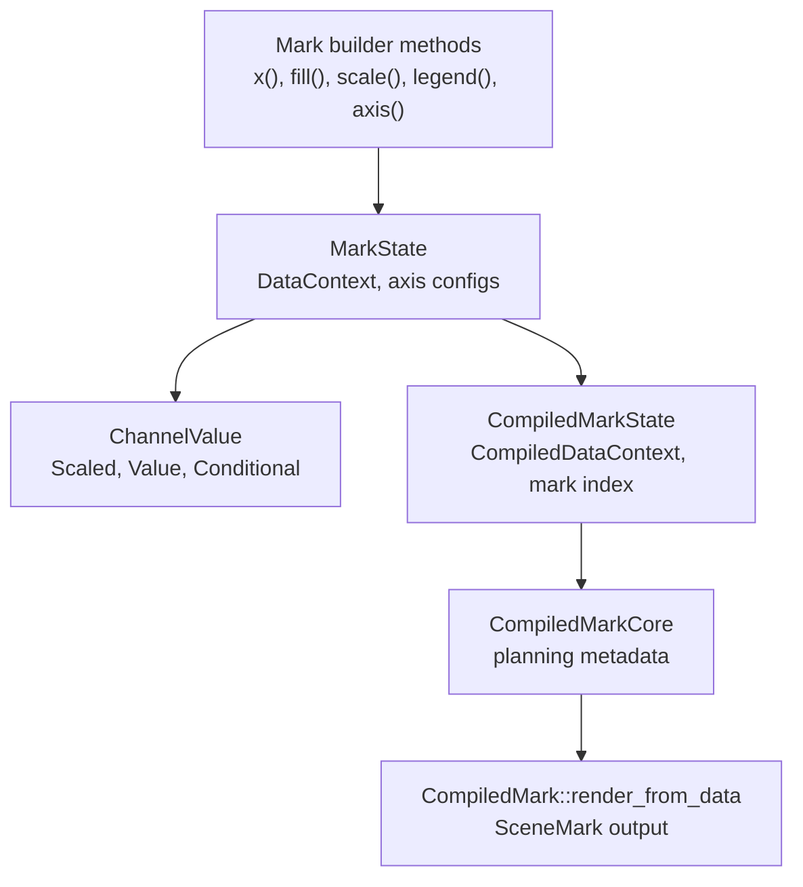

# Marks And Channels

Marks are split into authoring-time and compiled-time contracts. Authoring
marks implement `Mark<C>`. Compiled marks implement `CompiledMarkCore` for
planning metadata and `CompiledMark` for rendering.

## Data Flow

## Authoring Contracts

`Mark<C>` is the authoring contract. It exposes `state`, `state_mut`,
`data_context`, and `compile`. Implementations compile into `Arc<dyn
CompiledMark>`.

`MarkState` stores construction-time channel and data state. `DataContext`
stores channel mappings and optional mark-level data. Marks without mark-level
data can inherit plot-level or container-provided data.

`ChannelValue` has three shapes:

- `Scaled`: an expression that is evaluated through a scale,
- `Value`: an expression that bypasses scaling,
- `Conditional`: ordered condition/value branches with an otherwise value.

Channel configs implement `ChannelConfig`. Scale-bearing configs also get
`ScaleChannelConfig`, which provides `scale`, `scale_with`,
`with_domain_scope`, `with_domain_group`, `with_domain_coordination`,
`share_domain`, and `free_domain`.

## Compile-Time Contracts

`CompiledMarkState` is built from `MarkState` and a resolved data source.
`CompiledDataContext` is the compiled form of the mark data/channel context.

`CompiledMarkCore` is used by planning code before rendering. It provides:

- `mark_type`,
- `supported_channels`,
- `default_channel_value`,
- `mark_specific_default`,
- `preferred_scale_type`,
- `default_scale_options`,
- `default_channel_range`,
- `preferred_legend_renderer`,
- `as_positioned_subplot` for coordinate-positioned subplot marks.

`CompiledMark` adds `render_from_data`, which receives prepared data batches, a
`MarkRuntimeContext`, and a `CoordinateSystemTransformCore`.

## Channel Extraction

`Plot::compile` calls `plot::channel::extract_channel_configs` for each mark.
That function:

- merges axis configs into `axis_specs`,
- resolves channel references with `resolve_all_channel_refs`,
- extracts channel scale configs into plot scale specs,
- extracts legend configs into plot legend specs,
- records the scale-to-coordinate-channel mapping used later for coordinate
  default ranges.

The scale key is the channel name unless a scaled channel has an explicit
`scale_name`. Conditional channels use the channel name.

## Defaults And Titles

Default channel values come from `EvaluationContext::mark_default` first, then
`CompiledMarkCore::mark_specific_default`. Coordinate guides use
`extract_channel_title_from_marks` to derive default axis titles from mark
encodings without depending on render-only behavior.

## Built-In Cartesian Marks

`avenger-chart-marks` owns the coordinate-neutral authoring types for the
built-in marks. `avenger-chart-cartesian` owns their Cartesian position-channel
extension traits and render implementations.

The Cartesian data mark set covers these scenegraph-oriented marks:

- `Symbol<Cartesian>` for point glyphs,
- `Line<Cartesian>` for ordered paths,
- `Rect<Cartesian>` for bars, rectangles, and interval spans,
- `Rule<Cartesian>` for line segments,
- `Text<Cartesian>` for data labels and annotations,
- `Area<Cartesian>` for filled vertical or horizontal areas,
- `Trail<Cartesian>` for variable-width paths,
- `Image<Cartesian>` for embedded or URL-backed raster images,
- `PathMark<Cartesian>` for SVG/path geometry with scene-space transforms.

`PathMark` keeps the explicit suffix to avoid collisions with filesystem and
geometry path types. `PathMark::path_transform` is scene-space SVG/path
geometry; Cartesian `x` and `y` channels provide an optional transformed anchor.

See [scales-domains-and-sharing.md](scales-domains-and-sharing.md) for scale
planning and [legends-and-guides.md](legends-and-guides.md) for legend
selection.
