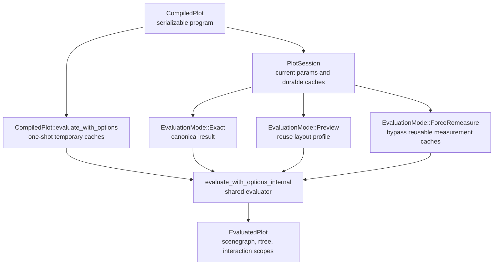
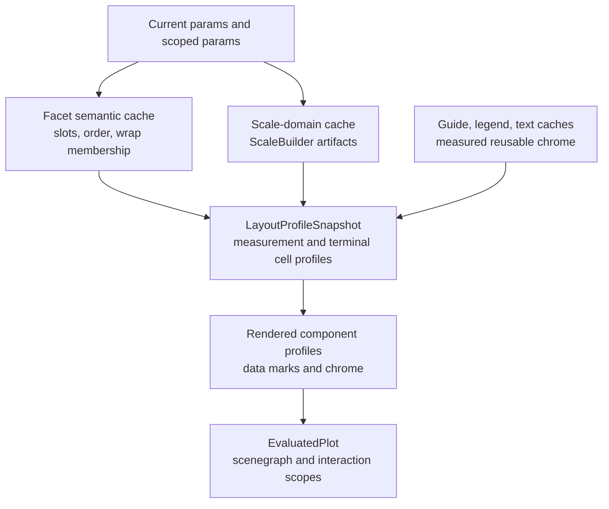
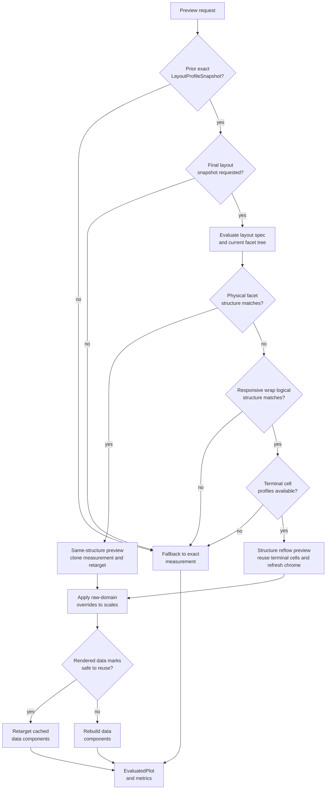
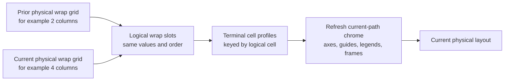
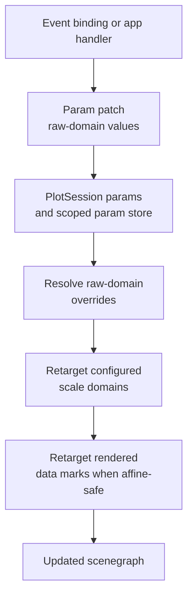

# Plot Sessions And Fast Evaluation

`CompiledPlot` is the serializable chart program. `PlotSession` is the live
runtime instance used when that program is evaluated repeatedly against one
`SessionContext`.

One-shot evaluation remains available through `CompiledPlot::evaluate` and
`CompiledPlot::evaluate_with_options`. Those methods use temporary session
cache handles for a single call. Reusable applications should instantiate a
session:

```rust
let compiled = plot.compile(&ctx).await?;
let mut session = std::sync::Arc::new(compiled).instantiate(std::sync::Arc::new(ctx));
let evaluated = session.evaluate(EvaluationRequest::new().exact()).await?;
```

## Runtime Shape



`PlotSession` stores the current effective params and durable cache handles.
`EvaluationRequest` can provide a full param map, a param patch, or no params.
Successful evaluations commit the next params as the session's current params.
A failed evaluation leaves the session's committed params and reusable profile
state unchanged.

## Evaluation Modes

`EvaluationMode::Exact` preserves the canonical chart function:

```text
CompiledPlot + data environment + params + size + environment -> EvaluatedPlot
```

Exact evaluation may use valid semantic, domain, guide, legend, and text
caches. It still produces the same result as a fresh one-shot evaluation for
the same inputs.

`EvaluationMode::Preview` is an explicit interaction mode. It is used for
transient updates such as pointer moves, drag resize, and raw-domain
interaction. Preview uses the previous exact `LayoutProfileSnapshot` when that
profile can be safely retargeted. It favors stable frame padding and low
latency over remeasuring every guide, legend, and text element on every event.
If no safe preview path exists, the session falls back to exact measurement and
records typed fallback reasons in `EvaluationMetrics`.

`EvaluationMode::ForceRemeasure` is exact evaluation that bypasses reusable
guide, legend, text, and layout-profile caches. It is used by tests,
diagnostics, and hosts that need an explicit fresh measurement.

## Cache Layers

`PlotSession` owns several cache families. Each layer answers a different
question and has its own invalidation boundary:

- scale-domain cache: reusable `ScaleBuilder` domain artifacts keyed by the
  compiled data plan, scale specs, relevant params, and sharing scope;
- facet semantic cache: partition slot values and ordering inputs, including
  responsive `FacetWrap` slots before physical row/column placement;
- facet scale-precompute cache: keyed `FacetScalePrecomputeStore` instances
  for compatible facet structures;
- guide-overflow cache: measured coordinate-guide overflow profiles;
- legend-measurement cache: measured local and hoisted legend groups;
- text-measurement cache: repeated title and subtitle text bounds;
- layout profile: the previous exact `ComponentsMeasurement`, physical and
  logical facet structure keys, optional rendered components, and terminal
  facet-cell profiles.

Prepared mark-data materialization and DataFusion subplan materialization are
not durable session caches. Mark data is normally collected while rendering
unless Preview can safely reuse rendered data components.



## Layout Profiles

`LayoutProfileSnapshot` is the central Preview reuse artifact. It is captured
after a successful exact evaluation. It stores:

- the measured `ComponentsMeasurement`,
- the physical facet structure key from `EvaluatedFacetTree::structure_cache_key`,
- the logical facet structure key from
  `EvaluatedFacetTree::logical_structure_cache_key`,
- a fingerprint of params that affect the profiled structure or mark data,
- terminal facet-cell measurements,
- optional rendered components that can be retargeted without rebuilding data
  marks.

Profile dependency fingerprints intentionally ignore params that are used only
as scale `raw_domain` overrides. Raw-domain changes retarget scales and data
marks through affine scale changes instead of invalidating the layout profile.

## Preview Decision Tree

Preview follows a conservative decision tree:



A successful Preview path records `preview_profile_reuses`. A fallback records
`preview_profile_misses`, `preview_fallbacks`, and one or more
`PreviewProfileFallbackReason` values.

## Same-Structure Preview

When the current physical facet structure matches the profiled physical
structure, Preview clones the previous `ComponentsMeasurement`, retargets plot
areas and scale ranges, applies current raw-domain overrides, and renders from
the locked layout profile.

For single plots and same-structure facets, this path avoids guide overflow
measurement, legend measurement, text measurement, facet tree reconstruction
when safe, and full component measurement. Data marks are reused only when the
data-mark reuse gate accepts the request.

## Responsive Wrap Reflow

Responsive `FacetWrap` can change physical row and column placement as canvas
width changes. The logical facet slots may still be identical. In that case,
Preview treats the change as a structure reflow:

- the current physical facet tree is built from semantic cache inputs;
- the previous and current trees must have the same logical structure;
- terminal facet-cell measurements are looked up by logical cell key;
- each reused terminal cell refreshes guide, legend, axis/facet label, layout,
  and frame chrome under the current physical facet path;
- container coordination is recomputed for the new physical grid.

Guide ownership and axis tick-label visibility are physical-layout questions.
Domain sharing, legend hoisting level, and terminal profile lookup are logical
facet questions. The reflow path keeps those two concepts separate.



A successful logical reflow records `preview_structure_reflow_reuses` and
`facet_cell_measurement_profile_reuses`. Reused cells that refresh chrome
record `facet_cell_measurement_profile_chrome_refreshes`.

## Raw-Domain Fast Path

Scale configs may use `Scale::raw_domain(...)` to read a param-provided domain
override. This is the interaction-oriented scale path for direct domain
control:

- domain inference produces the data-derived domain artifacts;
- a non-null, finite raw domain replaces the configured scale domain after
  inference;
- null or degenerate raw domains are ignored, so the scale falls back to its
  inferred or explicit domain;
- raw-domain params are validated so they are shared at least as broadly as the
  scale domain they drive;
- Preview re-applies active raw-domain overrides to root and faceted cell
  scales without rebuilding scale-domain artifacts.



The raw-domain fast path is intentionally independent of the specific
interaction that produced the patch. Pan shifts the raw-domain interval; any
interaction that changes a domain directly enters evaluation as a raw-domain
param update.

## Data-Mark Reuse Gate

Preview may reuse rendered data components only when the evaluator can prove
that the cached components can be retargeted safely. The gate accepts:

- layout-size-only changes for plots without child-frame containers;
- raw-domain changes where cached and current scale objects can be compared and
  the mark geometry can be retargeted through scale changes;
- terminal facet cells whose dependency fingerprint still matches after
  excluding raw-domain-only params.

The gate rejects non-size params that may change data, styling, mark
visibility, or non-affine geometry. Rejected requests keep layout-profile reuse
where possible but rebuild rendered data components. This conservative split is
why Preview can reuse padding and chrome while still producing current data
marks for style and data-param changes.

## One-Shot Evaluation

One-shot evaluation uses temporary session cache handles. This keeps the public
`&CompiledPlot` API source-compatible while ensuring the one-shot path
exercises the same evaluator as reusable sessions. Temporary caches are dropped
at the end of each call, so repeated one-shot evaluations do not share cache
state.

## Metrics And Diagnostics

`EvaluationMetrics` exposes deterministic counters for tests and performance
diagnostics. Use these counters for regression tests and benchmarks instead of
asserting on wall-clock time.

Structure metrics:

- `facet_tree_builds`,
- `facet_tree_profile_reuses`,
- `facet_semantic_cache_hits` and `facet_semantic_cache_misses`,
- `preview_structure_reflow_reuses` and
  `preview_structure_reflow_misses`,
- `preview_profile_fallback_reasons`.

Scale and domain metrics:

- `scale_domain_cache_hits` and `scale_domain_cache_misses`,
- `scale_builder_builds`,
- `scale_domain_collects`,
- `facet_scale_precompute_cache_hits` and
  `facet_scale_precompute_cache_misses`.

Measurement and chrome metrics:

- `guide_overflow_cache_hits` and `guide_overflow_cache_misses`,
- `guide_overflow_measure_calls`,
- `legend_measurement_cache_hits` and
  `legend_measurement_cache_misses`,
- `text_measurement_cache_hits` and `text_measurement_cache_misses`,
- `facet_cell_measurement_profile_reuses`,
- `facet_cell_measurement_profile_misses`,
- `facet_cell_measurement_profile_chrome_refreshes`,
- `skipped_component_measure_calls`.

Data and render-preparation metrics:

- `preview_data_mark_reuses`,
- `preview_data_mark_reuse_misses`,
- `facet_cells_built`,
- `mark_data_collects`,
- `mark_data_full_collects`,
- `mark_data_array_collects`,
- `mark_data_scalar_collects`.

Timing metrics include:

- `preview_attempt_us`,
- `preview_structure_reflow_us`,
- `refresh_reused_profile_layout_us`,
- `measure_cells_overflow_probe_us`,
- `guide_overflow_measure_us`,
- `build_plot_components_us`,
- `components_to_evaluated_plot_us`.

`avenger-chart-app` can print compact chart evaluation metrics through
`ChartAppOptions::log_metrics`. `AVENGER_TRACE_RESIZE=1` enables resize
summary lines with preview reuse, structure reflow, chrome refresh, guide
measurement, and phase timing counters.

Useful diagnostic commands:

```bash
cargo test -p avenger-chart --lib plot_session_preview -- --nocapture
cargo test -p avenger-chart --lib pan -- --nocapture
cargo run -p avenger-chart --example facet_instanced_pan_png_replay --release
cargo run -p avenger-chart --example responsive_wrap_png_replay --release
```

Steady raw-domain pan Preview is expected to report profile reuse, facet tree
profile reuse when applicable, no mark-data collection, no guide-overflow
measurement, and no steady scale-domain rebuilds.

## Invariants

- `CompiledPlot` remains the serializable chart program.
- `PlotSession` is the stateful runtime instance for repeated evaluation.
- `EvaluationMode::Exact` is the settled canonical result.
- `EvaluationMode::Preview` is explicit and interaction-scoped.
- Preview may reuse layout and chrome, but rendered data marks are reused only
  through a conservative gate.
- Raw-domain interaction updates patch params; evaluation retargets scales from
  those params.
- Responsive `FacetWrap` uses logical structure for profile reuse and physical
  structure for guide/chrome ownership.
- `EvaluationMode::ForceRemeasure` bypasses reusable measurement/profile
  caches without changing the chart's compiled program.
