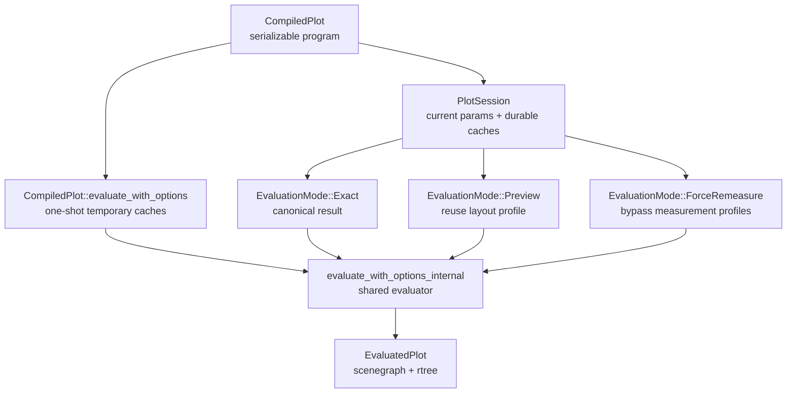

# Plot Sessions And Fast Evaluation

`CompiledPlot` is the serializable chart program. `PlotSession` is the live
runtime instance used when that program is evaluated repeatedly against one
`SessionContext`.

One-shot evaluation remains available through `CompiledPlot::evaluate` and
`CompiledPlot::evaluate_with_options`. Those methods use temporary session
cache handles for a single call. Reusable applications should instantiate a
session:

```rust
let compiled = plot.compile(&ctx).await?;
let mut session = std::sync::Arc::new(compiled).instantiate(std::sync::Arc::new(ctx));
let evaluated = session.evaluate(EvaluationRequest::new().exact()).await?;
```

## Runtime Shape



`PlotSession` stores the current merged params. `EvaluationRequest` can provide
a full param map, a param patch, or no params. Successful evaluations commit
the next params as the session's current params. A failed evaluation does not
produce a new `EvaluatedPlot`.

## Evaluation Modes

`EvaluationMode::Exact` preserves the canonical chart function:

```text
CompiledPlot + data environment + params + size + environment -> EvaluatedPlot
```

Exact evaluation may use valid caches. It still produces the same result as a
fresh one-shot evaluation for the same inputs.

`EvaluationMode::Preview` is an explicit interaction mode. It is used for
pointer moves, drag resize, pan, and zoom where stable frame padding is more
important than remeasuring every label and legend on every event. Preview uses
the previous exact layout profile. When the physical facet structure still
matches, it clones the prior `ComponentsMeasurement`, rebuilds current scale
metadata from cached domains, retargets ranges and child-frame allocations, and
renders from that locked profile. When responsive `FacetWrap` changes physical
rows or columns but preserves the same logical facet slots, Preview can rebuild
the current physical layout from cached terminal cell measurements and
recompute container coordination. If no safe profile exists, preview falls back
to exact evaluation and records both the fallback count and typed fallback
reasons in metrics.

`EvaluationMode::ForceRemeasure` is an exact evaluation that bypasses durable
guide, legend, text, and layout profile caches. It is useful for tests,
diagnostics, and explicit host refreshes.

## Session Caches

`PlotSession` owns several cache families:

- scale-domain cache: reusable `ScaleBuilder` domain artifacts keyed by the
  compiled data plan, scale specs, relevant params, and sharing scope;
- facet semantic cache: partition slot values and ordering inputs, including
  responsive `FacetWrap` slots before physical row/column placement;
- facet scale-precompute cache: keyed `FacetScalePrecomputeStore` instances
  for compatible facet structures;
- guide-overflow cache: measured coordinate-guide overflow profiles;
- legend-measurement cache: measured local and hoisted legend groups;
- text-measurement cache: repeated title and subtitle text bounds;
- layout profile cache: the previous exact `ComponentsMeasurement`, physical
  and logical facet structure keys, and terminal facet cell measurements used
  by Preview.

Prepared mark data and DataFusion subplan materialization are not session
caches today. Mark data is still collected during rendering, and future data
materialization work should build on the same dependency and metrics model.

## One-Shot Evaluation

One-shot evaluation uses temporary session cache handles. This keeps the public
`&CompiledPlot` API source-compatible while ensuring the one-shot path exercises
the same cached evaluator as reusable sessions. Temporary caches are dropped at
the end of each call, so repeated one-shot evaluations do not share cache state.

## Metrics

`EvaluationMetrics` exposes deterministic counters for tests and performance
diagnostics. Important session counters include:

- `scale_domain_cache_hits` and `scale_domain_cache_misses`,
- `facet_semantic_cache_hits` and `facet_semantic_cache_misses`,
- `guide_overflow_cache_hits` and `guide_overflow_cache_misses`,
- `legend_measurement_cache_hits` and `legend_measurement_cache_misses`,
- `text_measurement_cache_hits` and `text_measurement_cache_misses`,
- `preview_profile_reuses`, `preview_profile_misses`, and
  `preview_fallbacks`,
- `preview_profile_fallback_reasons`,
- `preview_structure_reflow_reuses` and
  `preview_structure_reflow_misses`,
- `facet_cell_measurement_profile_reuses` and
  `facet_cell_measurement_profile_misses`,
- `skipped_component_measure_calls`,
- `facet_layout.plot_component_measure_calls`.

Use these counters for regression tests and benchmarks instead of asserting on
wall-clock time.
