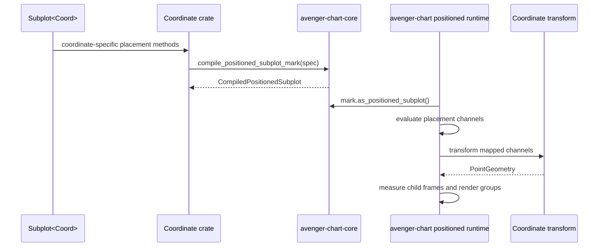
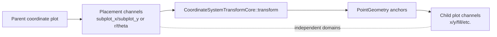

# Coordinate-Positioned Subplots

Coordinate-positioned subplots let a coordinate system place child plots inside
its parent plot area. Coordinate crates own authoring methods and placement
channel names. The top-level `avenger-chart` crate owns child-frame
measurement, domain sharing, guide/legend coordination, and rendering.

## Compile And Runtime Flow

## Authoring Surface

The neutral `Subplot<C>` mark lives in `avenger-chart-marks`. Coordinate crates
add extension traits for placement channels.

Cartesian uses `CartesianSubplotPositionChannels` with `subplot_x`,
`subplot_y`, and `partition_by`. Cartesian maps `subplot_x` to transform
channel `x` and `subplot_y` to transform channel `y`.

Polar uses `PolarSubplotPositionChannels` with `r`, `theta`, and
`partition_by`. Polar maps both placement channels to the same transform
channel names.

External coordinate crates can define their own `Subplot<Foo>` placement
methods and call the shared compile helper.

## Compile Contract

Coordinate crates implement `SubplotContainerCoordinateSystem` and call
`compile_positioned_subplot_mark` with a `PositionedSubplotSpec`.

`PositionedSubplotSpec` declares:

- the coordinate label used in errors,
- the rendered group-name prefix,
- placement channel mappings through `PositionedSubplotChannel`,
- an optional partition channel,
- default child plot-area width and height.

The helper returns a `CompiledPositionedSubplot`, which implements
`PositionedSubplotMarkCore`. The top-level runtime discovers positioned
subplots with `CompiledMarkCore::as_positioned_subplot`.

## Placement Channels

Placement channels belong to the parent coordinate system. Child plot channels
belong to the child plot. Their domains, sharing levels, axes, and legends are
independent unless the chart author explicitly connects them through shared
data or shared scale configuration.

The parent coordinate transform must return `PointGeometry` for positioned
subplots. A non-point transform result is an `InvalidArgument` error.

## Non-Partitioned And Partitioned Modes

Without a partition channel, the runtime creates one child frame per evaluated
placement row. The child plot uses explicit child data when present; otherwise
it inherits the current parent data.

With a partition channel, the runtime creates one child frame per distinct
partition value. Partitioned positioned subplots require parent data and no
plot-level data on the child plot. Placement channels must be aggregates,
literals/constants, or the partition expression. The runtime filters the parent
data per partition value and passes that filtered data to the child plot.

## Child-Frame Integration

Positioned subplots use `PositionedCoordMeasurement` and
`PositionedChildMeasurement`. Child identities are `PositionedSubplot` for
row-based children and `PositionedPartition` for partitioned children. Both are
represented in `ChildFrameScopeKey`, `ChildFrameSharingLevel`, and
`ContainerPathSegment`.

The positioned runtime feeds the same child-frame domain sharing, guide,
legend, layout, and render placement path used by facet and concat. See
[layout-and-child-frames.md](layout-and-child-frames.md).
