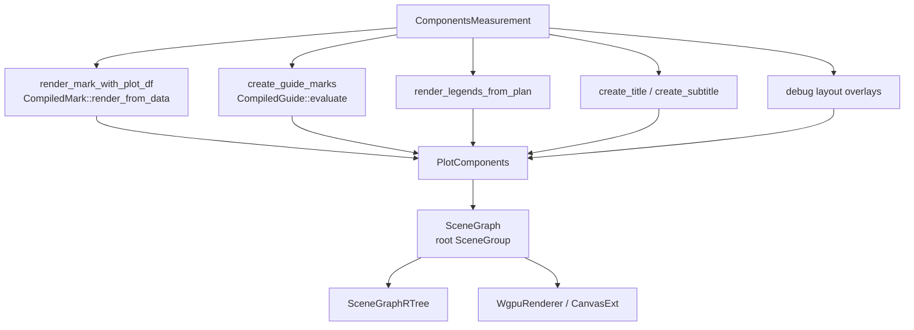

# Rendering And Scenegraph

Rendering converts a measured `CompiledPlot` into an `EvaluatedPlot`.
`EvaluatedPlot` contains an `avenger-scenegraph` `SceneGraph` and an optional
`SceneGraphRTree`.

## Rendering Flow

## Plot Components

`CompiledPlot::build_plot_components` consumes `ComponentsMeasurement` and
returns `PlotComponents`.

`PlotComponents` separates:

- data marks,
- guide marks,
- legend marks,
- title marks,
- subtitle marks,
- debug marks,
- plot bounds,
- clip region,
- evaluated size.

Data marks are rendered through each `CompiledMark`. Guides are rendered
through the compiled coordinate guide. Legends are rendered from the
`PreparedLegendPlan` measured earlier. Debug marks are added when layout debug
overlay mode is enabled.

## Scenegraph Assembly

`components_to_evaluated_plot` groups data marks under the plot-area origin and
adds guide, legend, title, subtitle, and debug marks at frame coordinates. It
also adds a canvas background rectangle when the theme supplies a canvas
background color.

The resulting `SceneGraph` has a root `SceneGroup`, a width, a height, and an
origin. `SceneGraphRTree::from_scene_graph` builds the spatial index stored in
`EvaluatedPlot`.

Nested containers render child plots by calling `CompiledPlot::build_plot_components`
with the child `ComponentsMeasurement`, then wrapping the child output in a
`SceneGroup` placed at the child-frame render origin.

## WGPU And Canvas Output

`WgpuRenderer` evaluates a `CompiledPlot`, creates a `PngCanvas` from
`avenger-wgpu`, sends the scenegraph to the canvas, and renders an in-memory
`RgbaImage` or writes a PNG file.

`CanvasExt` adds `render_plot` and `render_plot_with_options` to `PngCanvas`.
Both methods evaluate the plot, set the scene on the canvas, and render.

The rendering layer does not own chart layout. It consumes the scenegraph
produced by evaluation.
