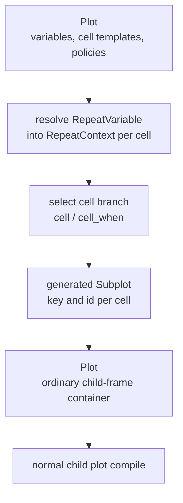

# Repeat System

Repeat containers are semantic authoring sugar over ordinary chart primitives.
They do not own a private layout engine, scale-sharing system, or interaction
runtime. During compilation, repeat plots lower to concat-family containers
whose child plots carry a resolved `RepeatContext`.

## Coordinate Types

`avenger-chart` exposes four repeat coordinate systems:

- `RepeatColumns`: one row of repeated child plots, lowered to `HConcat`;
- `RepeatRows`: one column of repeated child plots, lowered to `VConcat`;
- `RepeatGrid`: explicit row/column repetition, lowered to `GridConcat`;
- `RepeatWrap`: row-major wrapped repetition, lowered to `WrapConcat`.

Each repeat coordinate type implements `CoordinateSystemCore` and
`CoordinateSystem`, but `Plot::<Repeat*>` is intercepted during
`Plot::compile`. The repeat plot is split into repeat metadata, generated
`Subplot` marks, and the matching concat coordinate plot.



The generated child-frame keys are stable and semantic, such as
`repeat_cell:bill_length:bill_depth` for grid cells or
`repeat_item:bill_length` for wrapped repeat items. Generated subplot ids use
identifier-safe forms such as `repeat_cell_bill_length_bill_depth`.

## Repeat Variables And Placeholders

`RepeatVariable` stores:

- a stable id,
- a source-data expression,
- an optional title,
- an optional type hint.

`RepeatVariable::field("field_name")` is the common field-backed constructor.

Child plot templates refer to the currently resolved variable through repeat
placeholders:

- `repeat::column()` and `repeat::row()` for `RepeatGrid`,
  `RepeatColumns`, and `RepeatRows`;
- `repeat::item()` for `RepeatWrap`;
- `repeat::*_id()`, `repeat::*_index()`, and `repeat::*_title()` for
  metadata-driven expressions, labels, and branch predicates;
- `repeat::cell_id()` for cell-scoped selection/store chrome.

Position placeholders such as `repeat::column()` return `ChannelExpr`, not a
plain DataFusion `Expr`, so they can carry channel-value metadata such as
domain coordination and guide defaults. Metadata placeholders such as
`repeat::row_index()` return ordinary `Expr` values.

The repeat lowering path resolves placeholders in mark channels, transform
inputs, conditional encodings, scale/axis/legend configs, event bindings,
tools, and store/selection updates. Using a repeat placeholder outside a
resolved repeat context is an `InvalidArgument` error.

## Cell Templates

Repeat cell selection is author-order and deterministic:

- `.cell(plot)` sets the default child plot template;
- `.cell_when(predicate, plot)` adds a conditional branch;
- branch predicates are evaluated against the resolved `RepeatContext`;
- the first truthy branch wins;
- if no branch matches, the default cell is used.

This is how scatterplot matrices use scatter marks off diagonal and a
histogram or density plot on diagonal:

```rust
Plot::with_coord(
    RepeatGrid::new()
        .rows(vars.clone())
        .columns(vars)
        .cell(scatter_cell)
        .cell_when(
            repeat::row_index().eq(repeat::column_index()),
            histogram_cell,
        ),
);
```

The selected branch does not change the generated cell identity. Stable
identity comes from the repeat variable ids and physical repeat position, not
from the branch kind.

## Domain Coordination

Repeat uses normal `DomainCoordination`, described in
[scales-domains-and-sharing.md](scales-domains-and-sharing.md).

`RepeatGrid::matrix_domains()` and
`RepeatGrid::matrix_domains_with_scope(scope)` configure
`RepeatDomainCoordination::ByVariable`. Direct repeat-backed channels then get
named domain groups from the active variable id:

- x channels using `repeat::column()` use the column variable id as their
  domain group;
- y channels using `repeat::row()` use the row variable id as their domain
  group;
- wrapped repeat channels using `repeat::item()` use the item variable id.

The scope is a `CoordinationScope`:

- `Free` coordinates only within the current leaf owner;
- `Level(n)` coordinates at a logical ancestor;
- `Shared` coordinates at the root owner.

The generated coordination is the same metadata an author could put on a
manual `GridConcat` child channel with `.with_domain_group(...)` and
`.with_domain_scope(...)`. Explicit authored domain coordination may narrow the
generated scope, but cannot broaden it to an incompatible owner or rename it to
an incompatible group.

## Matrix Axis Defaults

`RepeatGrid::matrix_axes()` enables two defaults:

- `AxisGuideVisibilityPolicy::OuterForEquivalentDomainGroups` on the lowered
  `GridConcat`;
- repeat-variable titles on direct repeat-backed axis channels.

The guide policy is reusable and belongs to the child-frame container layer.
Repeat does not hide axes itself. Instead, it generates domain-group metadata
and asks `GridConcat` to compact axes when aligned cells have equivalent domain
coordination targets.

Explicit axis titles, visibility, and guide policies still win over matrix
defaults. Non-repeat channels inside conditional cells are not mislabeled as
repeat-variable axes.

## Wrapped Repeat

`RepeatWrap` lowers to `WrapConcat`. It supports the same column modes as
wrapped concat:

- default auto columns,
- `.columns(expr)` for exact column count,
- `.responsive_columns(approx_width)` for canvas-width-driven reflow.

`RepeatWrap::item_domains_with_scope(scope)` gives item-backed channels named
domain groups by repeat item id. Responsive wrapping changes physical row and
column placement, but the repeated item identity remains logical and stable.

## Interaction Metadata

Evaluated repeat cells expose ordinary child-frame interaction scopes. The
metadata includes:

- the generated child-frame key and subplot id,
- row/column placement metadata for grids,
- repeat cell id, row id, column id, item id, and indices where applicable,
- inherited facet path and logical owner paths when nested under facets.

Tools and event bindings consume this metadata through the same routes as
manual concat and facet layouts. A repeat cell is not a special event surface.

## Repeat-Aware Tools

Tools expand during compile and receive `ToolExpansionContext::repeat_context`
when they are attached to a repeated child plot. Built-in tools use this to
generate cell-specific ids, params, stores, and selection clauses when needed.

`PanScrollZoom` groups raw-domain params by resolved domain coordination
targets. In a matrix repeat:

- horizontal pan updates the repeated column variable domain;
- vertical pan updates the repeated row variable domain;
- if the same variable appears on a different orientation in another cell, that
  cell updates through the shared named domain group.

`BoxSelection` can use repeat placeholders as low-level selection dimensions,
for example `.dimensions(repeat::column(), repeat::row())`. Its chrome store is
cell-filtered with `repeat::current_cell_predicate()`, while the semantic
selection clauses remain ordinary interval predicates over resolved source
data expressions.

## Nesting

Because repeat lowers to concat-family containers, it composes with the rest of
the child-frame system:

- repeat inside concat,
- concat inside repeat cells,
- repeat inside facets,
- facets inside repeat cells,
- repeat inside `FacetWrap`,
- wrapped repeat inside facets.

Facet and repeat metadata both survive into evaluated interaction scopes.
`CoordinationScope::Level(n)` is resolved against the logical owner path. A
`FacetWrap` contributes one logical facet level even though it lays out as a
physical grid of hidden rows and visible columns.

## Nested Layout Alignment

Repeat does not own a private physical alignment pass. After repeat lowers to
the matching concat container, generic child-frame layout alignment treats the
result as ordinary `ConcatCoordMeasurement` nodes. The generated child-frame
keys provide stable template identity:

- repeat grid cells normalize to a repeat-cell template;
- repeat columns and rows normalize to repeat-column or repeat-row templates;
- wrapped repeat items normalize to a repeat-item template.

This is how equivalent repeat grids inside different facet values align their
matrix tracks and guide slabs. The same pass also handles the inverse
direction, where a repeat cell contains a facet, and manual concat structures
that mirror repeat-generated layouts. Repeat contributes semantic identities
and domain coordination metadata; the child-frame layer owns the physical
track and chrome alignment.

## Preview And Cache Invariant

Preview evaluation may reuse layout profiles and rendered data marks, but
child-frame containers must still traverse their children when they are reused.
That traversal regenerates evaluated interaction scopes for nested concat,
facet, and repeat tools. The Preview data-mark reuse path therefore declines
data-mark-only reuse for measurements with a child-frame container view.

See [plot-sessions-and-fast-evaluation.md](plot-sessions-and-fast-evaluation.md)
for the broader Preview cache model.

## Manual Equivalence

Repeat's manual escape hatch is important:

- `RepeatGrid` plus `matrix_domains()` is equivalent to a generated
  `GridConcat` whose child channels use named domain groups.
- `RepeatGrid` plus `matrix_axes()` is equivalent to that grid using
  `AxisGuideVisibilityPolicy::OuterForEquivalentDomainGroups`.
- `RepeatWrap` is equivalent to a generated `WrapConcat` with one child per
  repeated item.

This keeps repeat as a convenience layer over durable primitives rather than a
parallel visualization grammar.
