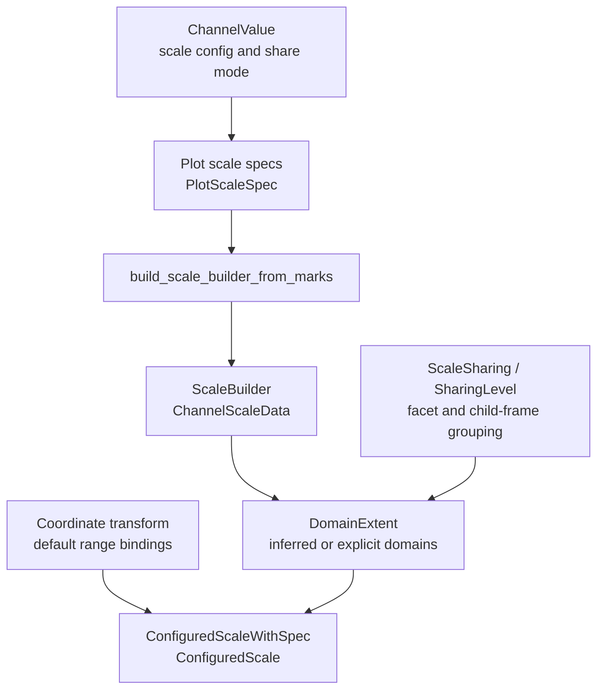

# Scales, Domains, And Sharing

Scale authoring contracts live in `avenger-chart-core`. Built-in scale marker
types and scale runtime construction live in `avenger-chart-scales`. Runtime
scale math lives lower down in `avenger-scales`.

## Scale Flow

## Authoring Contracts

`Scale<S = Auto>` is the generic authoring wrapper. `ScaleSpec` is the marker
trait implemented by scale types. `Auto` represents deferred scale selection.

Core owns generic authoring values:

- `ScaleConfigSpec`,
- `ScaleDomain`, `ScaleDefaultDomain`, and `DomainExpr`,
- `ScaleRange`,
- `ScaleTypePreference`,
- `ScaleChannelConfig` and `ScaleChannelValue`,
- `ScaleSharing` and `SharingLevel`.

Built-in marker types such as `Linear`, `Log`, `Band`, and `Ordinal` live in
`avenger-chart-scales`. Built-in type-specific methods live in extension traits
such as `LinearScaleExt`, `BandScaleExt`, and `OrdinalScaleExt`.

## Scale Builder

`build_scale_builder_from_marks` builds a `ScaleBuilder` from compiled marks,
plot scale specs, the coordinate transform, plot data, optional data override,
and the core evaluation context.

The builder caches expensive data queries and later builds configured scales
for a requested plot-area size. Its cached channel data is represented by
`ChannelScaleData`:

- `Standard` stores resolved data extents,
- `RadiusAware` stores position and radius samples so range-dependent padding
  can be recomputed for the current plot dimensions,
- `ExplicitDomain` stores an explicit user domain.

`CompiledPlot::build_scales_from_builder` asks the coordinate transform for
`ScaleRangeBinding` values, resolves default ranges, and returns
`ConfiguredScaleWithSpec` values.

## Domain Sharing

`ScaleSharing` is the user-facing sharing mode:

- `Free` means local domains,
- `Level(n)` shares at an ancestor level,
- `Shared` shares globally.

`SharingLevel` is the normalized internal value used by facet and child-frame
sharing code.

Facet domain coordination uses `EvaluatedFacetTree`, `FacetScalePrecomputeStore`,
and `DomainExtent` values. Child-frame containers use
`ChildFrameDomainSharingInput`, `ChildFrameChannelDomainExtent`, and
`coordinated_child_frame_domain_extents`.

Sharing belongs to the channel that declares it. Sharing a position channel
does not imply that visual channels such as `fill`, `stroke`, `size`, or
`shape` share or hoist their legends.

See [layout-and-child-frames.md](layout-and-child-frames.md) for child-frame
domain coordination and [legends-and-guides.md](legends-and-guides.md) for
legend ownership.
