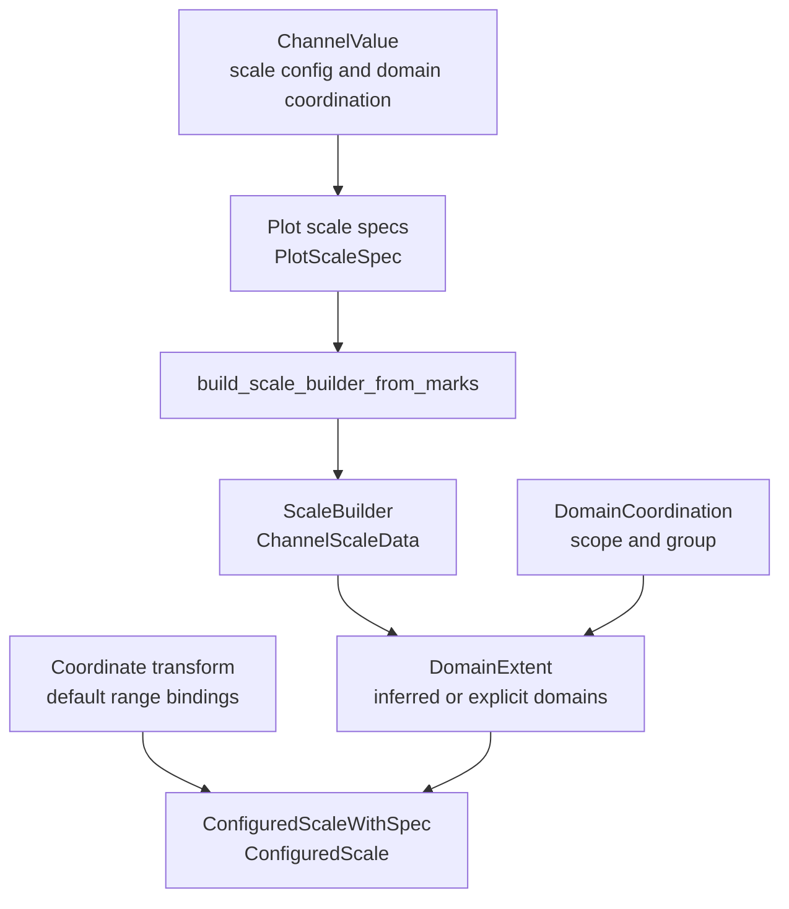

# Scales, Domains, And Coordination

Scale authoring contracts live in `avenger-chart-core`. Built-in scale marker
types and scale runtime construction live in `avenger-chart-scales`. Runtime
scale math lives lower down in `avenger-scales`.

## Scale Flow



## Authoring Contracts

`Scale<S = Auto>` is the generic authoring wrapper. `ScaleSpec` is the marker
trait implemented by scale types. `Auto` represents deferred scale selection.

Core owns generic authoring values:

- `ScaleConfigSpec`,
- `ScaleDomain`, `ScaleDefaultDomain`, and `DomainExpr`,
- `ScaleRange`,
- `ScaleTypePreference`,
- `ScaleChannelConfig` and `ScaleChannelValue`,
- `CoordinationScope`, `DomainCoordination`, and
  `DomainCoordinationGroup`.

Built-in marker types such as `Linear`, `Log`, `Band`, and `Ordinal` live in
`avenger-chart-scales`. Built-in type-specific methods live in extension traits
such as `LinearScaleExt`, `BandScaleExt`, and `OrdinalScaleExt`.

## Scale Builder

`build_scale_builder_from_marks` builds a `ScaleBuilder` from compiled marks,
plot scale specs, the coordinate transform, plot data, optional data override,
and the core evaluation context.

The builder caches expensive data queries and later builds configured scales
for a requested plot-area size. Its cached channel data is represented by
`ChannelScaleData`:

- `Standard` stores resolved data extents,
- `RadiusAware` stores position and radius samples so range-dependent padding
  can be recomputed for the current plot dimensions,
- `ExplicitDomain` stores an explicit user domain.

`CompiledPlot::build_scales_from_builder` asks the coordinate transform for
`ScaleRangeBinding` values, resolves default ranges, and returns
`ConfiguredScaleWithSpec` values.

## Domain Coordination

Domain coordination is the current scale-domain grouping model. It has two
orthogonal parts:

```rust
DomainCoordination {
    scope: CoordinationScope,
    group: DomainCoordinationGroup,
}
```

`CoordinationScope` chooses the logical owner:

- `Free` means the current leaf owner;
- `Level(n)` means logical ancestor level `n`;
- `Shared` means the root/shared owner.

`DomainCoordinationGroup` chooses the semantic group at that owner:

- `ScaleName` uses the concrete scale name, such as `x` or `fill`;
- `Named(id)` coordinates every channel that uses the same id.

This lets normal shared x scales and matrix-style cross-axis linking use the
same mechanism. For example, a scatterplot matrix can coordinate one cell's x
domain with another cell's y domain by assigning both channels to the same
named group.

Channel config helpers expose the common authoring shape:

```rust
Symbol::new().x_with(col("height"), |c| {
    c.with_domain_scope(CoordinationScope::Shared)
        .with_domain_group("height")
})
```

`share_domain()` is shorthand for
`with_domain_scope(CoordinationScope::Shared)` while keeping
`DomainCoordinationGroup::ScaleName`. `free_domain()` is the local-domain
counterpart.

`SharingLevel` remains an internal normalized representation used by facet and
child-frame coordination code, but it is not the public authoring model for
scale domains.

Facet domain coordination uses `EvaluatedFacetTree`,
`FacetScalePrecomputeStore`, and `DomainExtent` values. Child-frame containers
use `ChildFrameDomainSharingInput`, `ChildFrameChannelDomainExtent`, and
`coordinated_child_frame_domain_extents`. Both paths normalize
`DomainCoordination` into a `CoordinationScopeKey` that includes the
coordination kind, owner path, and group id.

Coordination belongs to the channel that declares it. Coordinating a position
channel does not imply that visual channels such as `fill`, `stroke`, `size`,
or `shape` coordinate their domains or hoist their legends.

## Repeat-Generated Groups

Repeat containers generate ordinary domain coordination when requested. See
[repeat-system.md](repeat-system.md).

`RepeatGrid::matrix_domains()` assigns named groups from repeat variable ids:

- `repeat::column()` channels use the column variable id;
- `repeat::row()` channels use the row variable id.

`RepeatWrap::item_domains_with_scope(...)` does the same for
`repeat::item()`. The generated coordination is validated against any explicit
channel coordination so repeat cannot silently broaden or rename an authored
domain target.

## Raw Domains And Tools

Raw-domain params drive direct pan/zoom-style scale control. A raw-domain param
must be scoped at least as broadly as the domain it drives. Validation compares
the param's `CoordinationScope` with the target scale's `DomainCoordination`.

Built-in tools such as `PanScrollZoom` mirror domain coordination targets.
When a repeated matrix links x and y domains through a named group, the tool
generates one raw-domain param per resolved domain target, not one independent
param per visual axis.

See [layout-and-child-frames.md](layout-and-child-frames.md) for child-frame
domain coordination, [repeat-system.md](repeat-system.md) for repeat-generated
groups, and [legends-and-guides.md](legends-and-guides.md) for legend
ownership.
