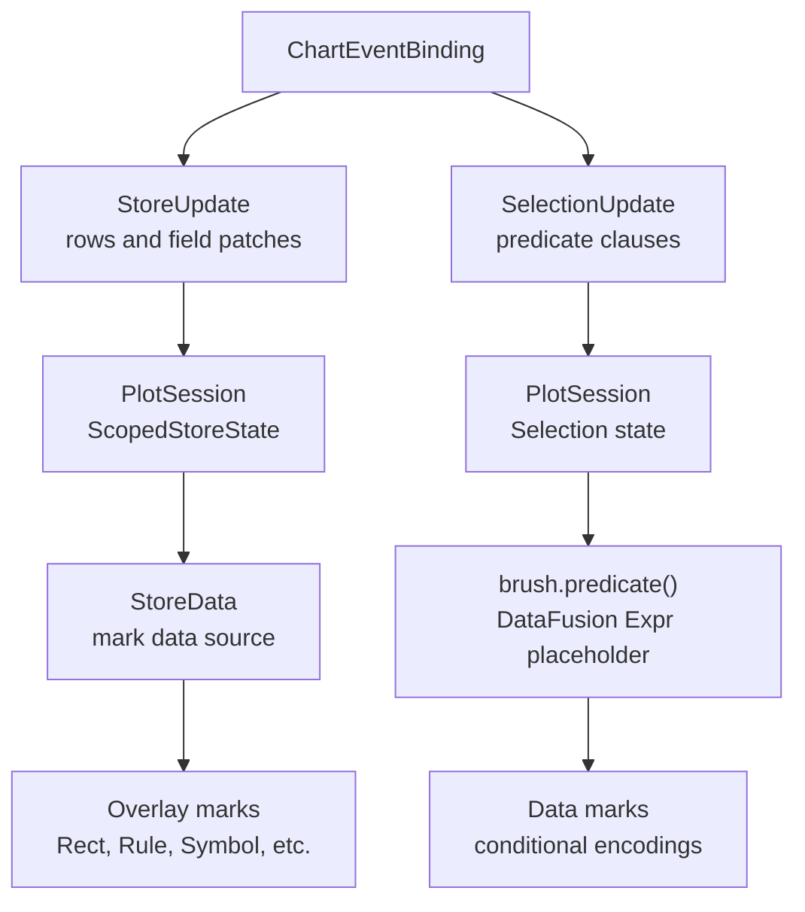

# Stores, Selections, And Interaction State

`Store` and `Selection` are separate interaction-state primitives.

- `Store` is a session-owned mutable table. It is used when interaction state
  needs to be rendered or queried as rows, such as brush rectangles, annotation
  handles, or editable control points.
- `Selection` is a session-owned set of predicate clauses. It is used when
  interaction state needs to decide whether input data rows are selected.

The two are often updated together. For example, a box-selection interaction can
write one store row so a `Rect` mark can draw the box, and also write one
selection clause so data marks and sibling views can use `brush.predicate()`.
The store row is visual chrome; the selection clause is the semantic predicate.

## Roles



- `Param` stores scalar, list, or struct values used directly in expressions.
- `Data` stores immutable or externally supplied tables.
- `Store` stores mutable tabular rows updated by interaction.
- `Selection` stores mutable predicate clauses updated by interaction.

Selections do not own coordinate systems, geometry schemas, or drawable
selection marks. Drawable interaction geometry is ordinary mark data backed by
`StoreData`.

## Store Specs

Authoring code declares stores with `Store` and registers them with
`Plot::add_store(...)` or through `ToolExpansion`.

```rust
let brush_boxes = Store::empty("brush_boxes")
    .field("id", DataType::Utf8, false)
    .field("x_min", DataType::Float64, false)
    .field("x_max", DataType::Float64, false)
    .field("y_min", DataType::Float64, false)
    .field("y_max", DataType::Float64, false)
    .primary_key(["id"])
    .sharing(Sharing::Free);
```

`CompiledStoreSpec` is stored on `CompiledPlot`, so store declarations are part
of the serializable chart program. `PlotSession` instantiates those specs as
`ScopedStoreState`.

Store schemas are Arrow schemas. The runtime reserves metadata columns with the
`__avenger_store_` prefix:

- `__avenger_store_name`
- `__avenger_store_owner_key`
- `__avenger_store_revision`

Those metadata columns are added when store data is materialized for marks and
queries.

## Store Mutation

Event bindings mutate stores with typed `StoreUpdate` operations:

```rust
ChartEventBinding::on_between_end(
    ChartEventStream::on(ChartEventType::MouseDown),
    ChartEventStream::on(ChartEventType::MouseUp),
)
.set_store_at_start_scope(
    "brush_boxes",
    StoreUpdate::replace_rows([StoreRow::new()
        .field("id", lit("active"))
        .field("x_min", ev::interval_start(x_interval.clone()))
        .field("x_max", ev::interval_end(x_interval))
        .field("y_min", ev::interval_start(y_interval.clone()))
        .field("y_max", ev::interval_end(y_interval))]),
)
.preview();
```

The public mutation operations are:

- `StoreUpdate::clear()`
- `StoreUpdate::replace_rows(...)`
- `StoreUpdate::insert_rows(...)`
- `StoreUpdate::upsert_rows(...)`
- `StoreUpdate::update_by_key(...)`
- `StoreUpdate::delete_by_key(...)`
- `StoreUpdate::toggle_rows(...)`

`StoreRow`, `StoreKey`, and `StoreFieldPatch` contain serializable DataFusion
expressions evaluated against the event record. Keyed operations require the
store to declare a primary key.

## Store Data For Marks

`StoreData` is a normal mark data source:

```rust
Rect::<Cartesian>::new()
    .data_store(StoreData::new("brush_boxes"))
    .exclude_from_scale_domains()
    .x(col("x_min"))
    .x2(col("x_max"))
    .y(col("y_min"))
    .y2(col("y_max"));
```

`StoreData::new(name)` reads the store instance implied by that store's
`Sharing`. A free store reads the current leaf facet owner's rows, a
`Level(N)` store reads the current logical ancestor's rows, and a shared store
reads the root rows. The mark data source does not carry an independent read
scope; changing how store-backed chrome is replicated is done by changing the
store's sharing level.

When a mark requests store data, `PlotSession` materializes the relevant rows
as an Arrow `RecordBatch` and exposes them to DataFusion as a queryable
relation for that evaluation. Mark-data cache keys include store revision
fingerprints, so store-backed marks update when interaction mutates rows.

## Store Sharing

Stores use `Sharing`, the same level-based scoping model used by params and
scale domains:

- `Sharing::Free` / `Sharing::Level(0)`: one store instance per leaf facet
  cell;
- `Sharing::Level(N)`: one store instance at logical ancestor level `N`;
- `Sharing::Shared`: one root store instance.

`ChartEventBinding::set_store(...)` writes to the current routed scope.
`ChartEventBinding::set_store_at_start_scope(...)` writes to the scope where a
drag or between-stream interaction started. The start-scope form is the usual
choice for box selections because release events may occur outside the cell
that owns the interaction.

## Selections

A `Selection` declares a named predicate set.

```rust
let brush = Selection::new("brush")
    .combine(SelectionCombine::Union)
    .empty_selects_nothing();

let selected = brush.predicate();
```

`Selection::predicate()` returns a DataFusion expression placeholder. During
mark data preparation, `mark_data_runtime` expands that placeholder from the
current `PlotSession` selection clauses. Empty selections follow
`EmptySelectionBehavior`.

Selection clauses are written by event bindings:

```rust
let clause = SelectionClauseUpdate::interval(lit("active"))
    .facet_scope(Sharing::Free)
    .dimension(col("source_a"))
    .endpoints(x_min, x_max)
    .dimension(col("source_b"))
    .endpoints(y_min, y_max);

ChartEventBinding::on_between_end(
    ChartEventStream::on(ChartEventType::MouseDown),
    ChartEventStream::on(ChartEventType::MouseUp),
)
.set_selection_at_start_scope(
    "brush",
    SelectionUpdate::replace_all_clauses([clause]),
)
.preview();
```

Each interval dimension maps one data expression, such as `col("source_a")`,
to a resolved min/max value. The dimension name is metadata derived from the
expression by default; use `dimension_named(...)` when a stable or clearer name
is needed. Multiple clauses are combined by the selection's
`SelectionCombine`: `Union` ORs clauses together and `Intersect` ANDs clauses
together.

The public selection mutation operations are:

- `SelectionUpdate::clear()`
- `SelectionUpdate::clear_in_scope(...)`
- `SelectionUpdate::replace_all_clauses(...)`
- `SelectionUpdate::replace_clauses_in_scope(...)`
- `SelectionUpdate::upsert_clauses(...)`
- `SelectionUpdate::delete_clauses(...)`

Selection updates can run in the same event binding as param and store updates.
This lets interaction chrome and semantic selection predicates become visible
in the same reevaluation.

## Facet Context

Selections are coordinate-neutral and do not have a sharing level. Facet
ownership is recorded on each clause.

`SelectionClauseUpdate::facet_scope(...)` controls how much logical facet
context the clause captures:

- `Sharing::Free` captures the full logical facet path for the starting or
  current facet cell.
- `Sharing::Level(N)` captures the logical ancestor path at level `N`.
- `Sharing::Shared` captures no facet context.

Facet context fields are declared on the selection:

```rust
let brush = Selection::new("brush")
    .facet_context_field("group_name", col("group_name"))
    .empty_selects_nothing();
```

When a free clause is created inside the `Beta` facet cell, the clause captures
the configured facet context value, such as `group_name = "Beta"`. A sibling
concat plot can use `brush.predicate()` over all rows, and the generated
predicate still selects only rows matching both the interval dimensions and the
captured facet context.

## Box Selection Shape

A box selection uses both primitives:

- a `Store` containing box geometry rows for the visible rectangle chrome;
- a `Selection` containing interval predicate clauses for data filtering.

```rust
let brush_boxes = Store::empty("brush_boxes")
    .field("id", DataType::Utf8, false)
    .field("x_min", DataType::Float64, false)
    .field("x_max", DataType::Float64, false)
    .field("y_min", DataType::Float64, false)
    .field("y_max", DataType::Float64, false)
    .primary_key(["id"])
    .sharing(Sharing::Free);

let brush = Selection::new("brush")
    .combine(SelectionCombine::Union)
    .empty_selects_nothing();

Plot::<Cartesian>::new()
    .add_store(brush_boxes)
    .add_selection(brush.clone())
    .event_binding(draw_or_update_store_rows_and_selection_clauses)
    .mark(points.fill_when(brush.predicate(), selected_color))
    .mark(
        Rect::new()
            .data_store(StoreData::new("brush_boxes"))
            .exclude_from_scale_domains()
            .x(col("x_min"))
            .x2(col("x_max"))
            .y(col("y_min"))
            .y2(col("y_max")),
    );
```

Shift-drag additive selection writes additional store rows and upserts
additional selection clauses. Double-click clear removes the store rows and
clears the selection clauses.

## Tools

Tools are compile-time packages over the same primitives. A selection tool can
expand through `ToolExpansion` into:

- a `Store` for editable chrome rows,
- a neutral `Selection` for predicate semantics,
- event bindings that mutate the store and selection,
- ordinary overlay marks that read `StoreData`,
- optional params and metadata.

The built-in `BoxSelection` tool should use this shape. It does not need a
private overlay scene-mark system; editable boxes are regular chart marks over
regular store rows.

## Invariants

- Store mutation is typed and serializable through `StoreUpdate`.
- Store reading is tabular and goes through DataFusion like other mark data.
- Selection mutation is typed and serializable through `SelectionUpdate`.
- Selection predicates are generated from current selection clauses at
  evaluation time.
- Selection clauses, not selections, carry resolved facet context.
- Selections are coordinate-neutral and do not own drawable geometry.
- Tools are conveniences over public chart primitives, not a separate runtime
  interaction system.
