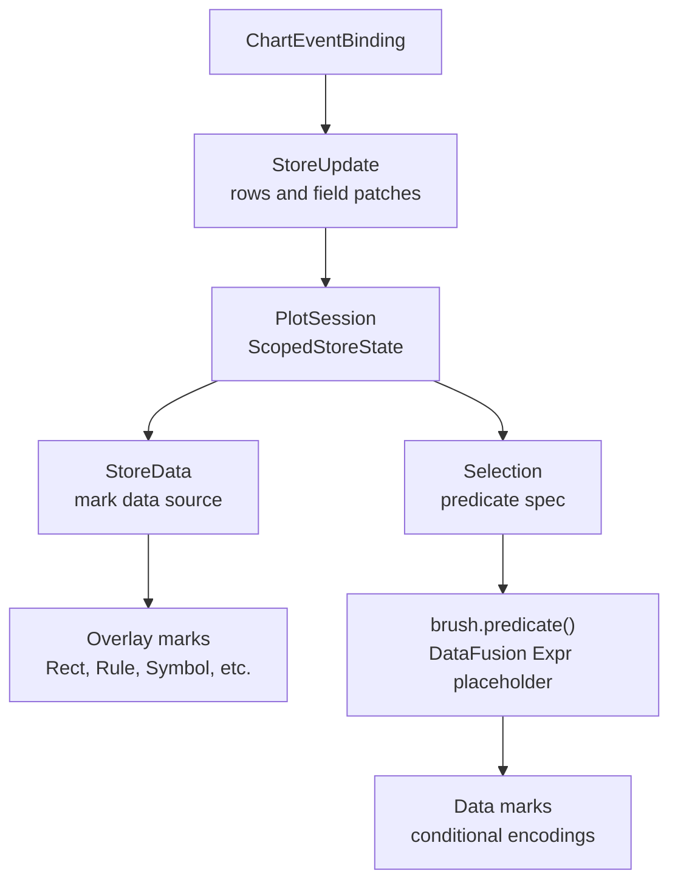

# Stores, Selections, And Interaction State

`Store` is the chart-level mutable table primitive. `Selection` is the
semantic predicate layer that can be derived from store rows. Together they let
interactive charts keep editable visual state, such as brush boxes or
annotation handles, in ordinary tabular form while keeping selection predicates
portable across facets and concat siblings.

## Roles



- `Param` stores scalar, list, or struct values used directly in expressions.
- `Data` stores immutable or externally supplied tables.
- `Store` stores session-owned mutable tables updated by interaction.
- `Selection` stores predicate-composition semantics derived from rows in a
  store.

Selections do not own coordinate systems, geometry schemas, or drawable
selection marks. Drawable interaction geometry is ordinary mark data backed by
`StoreData`.

## Store Specs

Authoring code declares stores with `Store` and registers them with
`Plot::add_store(...)` or through `ToolExpansion::store(...)`.

```rust
let brush_boxes = Store::empty("brush_boxes")
    .field("id", DataType::Utf8, false)
    .field("x_min", DataType::Float64, false)
    .field("x_max", DataType::Float64, false)
    .field("y_min", DataType::Float64, false)
    .field("y_max", DataType::Float64, false)
    .primary_key(["id"])
    .sharing(Sharing::Free);
```

`CompiledStoreSpec` is stored on `CompiledPlot`, so store declarations are part
of the serializable chart program. `PlotSession` instantiates those specs as
`ScopedStoreState`.

Store schemas are Arrow schemas. The runtime reserves metadata columns with
the `__avenger_store_` prefix:

- `__avenger_store_name`
- `__avenger_store_owner_key`
- `__avenger_store_revision`

Those metadata columns are added when store data is materialized for marks and
queries.

## Store Mutation

Event bindings mutate stores with typed `StoreUpdate` operations:

```rust
ChartEventBinding::on_between_end(
    ChartEventStream::on(ChartEventType::MouseDown),
    ChartEventStream::on(ChartEventType::MouseUp),
)
.set_store_at_start_scope(
    "brush_boxes",
    StoreUpdate::replace_rows([StoreRow::new()
        .field("id", lit("active"))
        .field("x_min", ev::interval_start(x_interval.clone()))
        .field("x_max", ev::interval_end(x_interval))
        .field("y_min", ev::interval_start(y_interval.clone()))
        .field("y_max", ev::interval_end(y_interval))]),
)
.exact();
```

The public mutation operations are:

- `StoreUpdate::clear()`
- `StoreUpdate::replace_rows(...)`
- `StoreUpdate::insert_rows(...)`
- `StoreUpdate::upsert_rows(...)`
- `StoreUpdate::update_by_key(...)`
- `StoreUpdate::delete_by_key(...)`
- `StoreUpdate::toggle_rows(...)`

`StoreRow`, `StoreKey`, and `StoreFieldPatch` contain serializable DataFusion
expressions evaluated against the event record. Keyed operations require the
store to declare a primary key.

## Store Data For Marks

`StoreData` is a normal mark data source:

```rust
Rect::<Cartesian>::new()
    .data_store(StoreData::new("brush_boxes"))
    .exclude_from_scale_domains()
    .x(col("x_min"))
    .x2(col("x_max"))
    .y(col("y_min"))
    .y2(col("y_max"));
```

`StoreData::new(name)` reads the store instance implied by that store's
`Sharing`. A free store reads the current leaf facet owner's rows, a
`Level(N)` store reads the current logical ancestor's rows, and a shared store
reads the root rows. The mark data source does not carry an independent read
scope; changing how store-backed chrome is replicated is done by changing the
store's sharing level.

When a mark requests store data, `PlotSession` materializes the relevant rows
as an Arrow `RecordBatch` and exposes them to DataFusion as a queryable
relation for that evaluation. Mark-data cache keys include store revision
fingerprints, so store-backed marks update when interaction mutates rows.

## Sharing And Scope

Stores use `Sharing`, the same level-based scoping model used by params and
scale domains:

- `Sharing::Free` / `Sharing::Level(0)`: one store instance per leaf facet
  cell;
- `Sharing::Level(N)`: one store instance at logical ancestor level `N`;
- `Sharing::Shared`: one root store instance.

`ChartEventBinding::set_store(...)` writes to the current routed scope.
`ChartEventBinding::set_store_at_start_scope(...)` writes to the scope where a
drag or between-stream interaction started. The start-scope form is the usual
choice for box selections because release events may occur outside the cell
that owns the interaction.

## Neutral Selections

A `Selection` describes how to turn store rows into a predicate expression.

```rust
let brush = Selection::new("brush")
    .source(
        SelectionSource::store("brush_boxes")
            .interval()
            .dimension("x", col("x"))
            .bounds("x_min", "x_max")
            .dimension("y", col("y"))
            .bounds("y_min", "y_max"),
    )
    .combine(SelectionCombine::Union)
    .empty_selects_nothing();

let selected = brush.predicate();
```

`Selection::predicate()` returns a DataFusion expression placeholder. During
mark data preparation, `mark_data_runtime` expands that placeholder by reading
the selection's source store rows from `ScopedStoreState`.

For interval sources, each `SelectionSourceDimensionSpec` maps one data
expression to two store fields: a minimum and maximum bound. Multiple store
rows become multiple clauses. `SelectionCombine::Union` ORs clauses together;
`SelectionCombine::Intersect` ANDs clauses together. Empty selections follow
`EmptySelectionBehavior`.

## Facet Context

Facet-aware selections can capture data predicates for the logical facet owner
that produced a store row:

```rust
Selection::new("brush")
    .source(brush_source)
    .facet_context_field("group_name", col("group_name"));
```

Selection sharing controls how much facet context becomes part of the generated
predicate:

- `Sharing::Free` captures the full logical facet path.
- `Sharing::Level(N)` captures the owner path at level `N`.
- `Sharing::Shared` captures no facet predicate.

This makes a free selection portable. A brush drawn in one facet cell can be
used by a sibling concat plot over all rows; the generated predicate still
matches only rows whose data values and facet-context fields match the brush's
owning cell.

## Tools

Tools are compile-time packages over the same primitives. A selection tool can
expand through `ToolExpansion` into:

- a `Store` for editable rows,
- a neutral `Selection` derived from that store,
- event bindings that mutate the store,
- ordinary overlay marks that read `StoreData`,
- optional params and metadata.

The built-in `BoxSelection` tool should use this shape. It does not need a
private overlay scene-mark system; editable boxes are regular chart marks over
regular store rows.

## Invariants

- Store mutation is typed and serializable through `StoreUpdate`.
- Store reading is tabular and goes through DataFusion like other mark data.
- Selection predicates are generated from current store rows at evaluation
  time.
- Selections are coordinate-neutral and do not own drawable geometry.
- Tools are conveniences over public chart primitives, not a separate runtime
  interaction system.
