# Testing Validation Map

Use focused checks first. Full visual regression and workspace-wide checks are
useful before release or when a change crosses subsystem boundaries.

## Map

```mermaid
flowchart TD
    Core["core contracts"]
    Marks["marks/channels"]
    Scales["scales/domains"]
    Legends["legends/guides"]
    ChildFrames["child frames"]
    Facet["facet"]
    Concat["concat"]
    Positioned["positioned subplots"]
    External["external extension boundaries"]
    Visual["visual baselines"]

    Core --> CoreChecks["cargo test -p avenger-chart-core --lib"]
    Marks --> MarkChecks["cargo test -p avenger-chart --test test_channel_resolution"]
    Scales --> ScaleChecks["cargo test -p avenger-chart --test test_scale_api"]
    Legends --> LegendChecks["cargo test -p avenger-chart --lib legend_disposition"]
    ChildFrames --> DomainChecks["cargo test -p avenger-chart --lib container_domain_sharing"]
    Facet --> FacetChecks["cargo test -p avenger-chart --test test_evaluated_facet_tree"]
    Concat --> ConcatChecks["cargo test -p avenger-chart --test visual_regression concat"]
    Positioned --> PositionedChecks["cargo test -p avenger-chart --test visual_regression positioned_subplot"]
    External --> ExternalChecks["cargo test --manifest-path avenger-chart-external-test/Cargo.toml"]
    Visual --> VisualChecks["cargo test -p avenger-chart --test visual_regression"]
```

## Focused Checks

| Area | Useful checks |
| --- | --- |
| Core contracts | `cargo test -p avenger-chart-core --lib -- --nocapture` |
| Scale API | `cargo test -p avenger-chart --test test_scale_api -- --nocapture` |
| Scale UDF/serialization | `cargo test -p avenger-chart --test test_simple_scale_udf -- --nocapture`; `cargo test -p avenger-chart --test test_scale_udf_serialization -- --nocapture` |
| Legend ownership | `cargo test -p avenger-chart --lib legend_disposition -- --nocapture` |
| Child-frame domain sharing | `cargo test -p avenger-chart --lib container_domain_sharing -- --nocapture` |
| Facet tree | `cargo test -p avenger-chart --test test_evaluated_facet_tree -- --nocapture` |
| External boundaries | `cargo test --manifest-path avenger-chart-external-test/Cargo.toml -- --nocapture` |
| Compile coverage | `cargo check -p avenger-chart --all-targets`; `cargo check --manifest-path avenger-chart-external-test/Cargo.toml --all-targets` |

## Visual Categories

Visual scenarios live under `avenger-chart/tests/visual_tests/` and are run by
`avenger-chart/tests/visual_regression.rs`.

Useful categories:

- facet: `test_facet_*`, `test_nested_facets`, and facet layout snapshots,
- concat: `test_concat`,
- positioned subplots: `test_cartesian_subplot`,
  `test_positioned_subplot_scale_sharing`, and
  `test_positioned_subplot_legend_sharing`,
- legends: `test_legend*`, `test_line_legend`, `test_rect_legend`,
  `test_facet_legend_sharing`,
- coordinate systems: `test_polar_scatter` and Cartesian mark visual tests.

Use visual baselines when layout, guide, legend, coordinate, or render output
changes. For pure ownership or import refactors, compile checks and focused
unit tests are usually the first pass.
