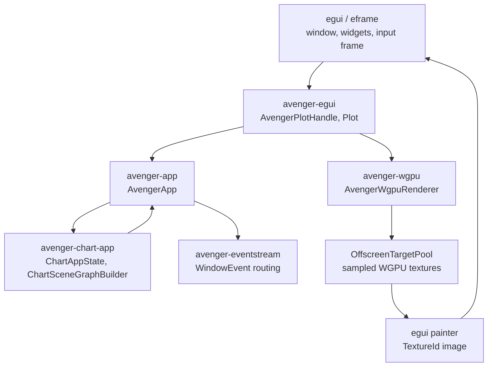
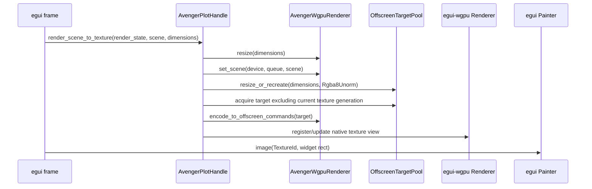
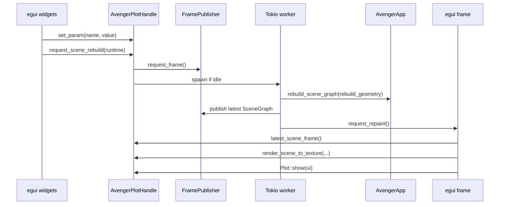

# WGPU GUI Offscreen Rendering

This document describes the current egui-first GUI integration path for
Avenger charts rendered through `avenger-wgpu`.

The integration goal is to let a native GUI toolkit own the app shell,
widgets, input loop, and WGPU device while Avenger owns chart evaluation,
event handling, and scene rendering. The first GUI backend is `avenger-egui`.

## Ownership Model



`egui` owns the frame loop and WGPU `Device`/`Queue` exposed by
`egui_wgpu::RenderState`. `avenger-egui` borrows those objects when it needs
to upload renderer resources, render a scene into an offscreen texture, or
register/update that texture with `egui-wgpu`.

`avenger-wgpu` stays independent of egui-specific types. Its reusable public
entry point is `AvengerWgpuRenderer`, configured by `AvengerRendererConfig`.
The renderer can set a `SceneGraph`, resize logical dimensions, encode frame
commands for a supplied render target, and render into an `OffscreenTarget`.

`WindowCanvas` and `PngCanvas` are host wrappers around the same renderer
capability. `WindowCanvas` owns a Winit surface. `PngCanvas` owns readback
resources. `avenger-egui` owns an `OffscreenTargetPool` and a stable egui
`TextureId`.

## egui Widget Shape

The public egui API intentionally looks like a normal egui widget:

```rust
let changed = ui
    .add(egui::Slider::new(&mut point_size, 32.0..=240.0).text("Point size"))
    .changed();

if changed {
    if plot_handle.set_param("point_size", point_size).changed {
        plot_handle.request_scene_rebuild_with_repaint(runtime.handle(), ctx, true);
    }
}

let output = avenger_egui::Plot::new(&plot_handle)
    .desired_size(ui.available_size_before_wrap())
    .show(ui);

if !output.events.is_empty() {
    plot_handle.request_event_dispatch_with_repaint(runtime.handle(), ctx);
}
```

`Plot::show(ui)` allocates a widget rectangle, paints the latest completed
texture, translates egui input into Avenger `WindowEvent` values, queues those
events on the handle, and returns `PlotOutput`.

`PlotOutput` contains the underlying `egui::Response`, param changes observed
since the previous show call, reserved future selection changes, the frame
status, and the Avenger events routed during that egui frame.

The initial API deliberately keeps param binding low level. Normal egui
controls use their own `.changed()` methods. Application code calls
`set_param(name, value)` and schedules a scene rebuild explicitly.

## Event Routing

egui events are the host input source for this integration. `avenger-egui`
does not use Winit directly.

`EguiEventTranslator` converts widget-local input into
`avenger-eventstream::window::WindowEvent`:

- pointer positions subtract the plot `Rect::min` and stay in egui logical
  point units;
- pointer enter, leave, move, click, release, and capture state become cursor
  and mouse events;
- wheel input is routed only while the plot is hovered;
- keyboard input is routed only while the plot has focus;
- plot size changes emit `CanvasResize`.

`Plot::show(ui)` snapshots `EguiResponseState` before entering
`ui.input(...)`. This avoids calling `Response` methods that lock egui context
while egui's input lock is held.

Queued events are dispatched through the owned `AvengerApp` by
`request_event_dispatch` or `request_event_dispatch_with_repaint`. That path
uses the same `avenger-eventstream` handlers as Winit-hosted chart apps.

## Offscreen Texture Lifecycle

`avenger-egui` renders charts into WGPU textures, not CPU images.



`OffscreenTargetPool` is triple buffered. The egui integration prefers a
target whose generation is not currently registered with egui, so a new render
does not overwrite the texture that the current egui frame may sample.

The texture usage is:

```rust
wgpu::TextureUsages::RENDER_ATTACHMENT
    | wgpu::TextureUsages::TEXTURE_BINDING
    | wgpu::TextureUsages::COPY_SRC
```

The first egui path uses `TextureFormat::Rgba8Unorm` because
`egui-wgpu::Renderer::register_native_texture` expects that format for native
texture registration.

When the offscreen target stays compatible, `avenger-egui` keeps the same
egui `TextureId` and calls
`update_egui_texture_from_wgpu_texture`. When size or format changes recreate
the offscreen target, the same high-level path updates the registered native
texture view.

## Async Scene Lifecycle

The first egui MVP moves chart scene evaluation off the egui hot path. GPU
upload and offscreen rendering still happen from the egui frame using
`egui_wgpu::RenderState`.



`FramePublisher<Arc<SceneGraph>>` owns requested, in-progress, and latest
published scene generations. If a newer generation is requested while older
work is running, stale results are dropped. The worker schedules another pass
for the latest request when needed.

The egui frame can keep painting the latest completed texture while scene
evaluation for a newer request is pending. This is the baseline behavior to
measure before adding semantic drag preview.

Full background GPU submission is deliberately not part of the first egui MVP.
The staged ownership split is:

- background worker: chart/event evaluation and latest `SceneGraph`
  publication;
- egui frame: WGPU `set_scene`, command encoding, queue submission, native
  texture registration/update, and painting.

This avoids cross-thread mutation of renderer resources while still removing
the expensive chart evaluation path from egui's immediate frame work.

## Metrics And Tracing

`AvengerPlotHandle::metrics()` returns a `PlotMetrics` snapshot with counters
and latest timing values for:

- param set calls and changed param enqueues;
- routed event batches and event counts;
- scene rebuild and event-dispatch requests;
- scene frames published and stale scene frames dropped;
- offscreen texture renders, registrations, and updates;
- frames painted, reused latest-frame paints, and paints while a scene render
  is pending;
- latest scene evaluation, `set_scene`, command encode, queue submit, and
  texture publication timings.

`AvengerPlotHandle::show_metrics(ui)` provides a small egui debug readout for
examples and manual testing. `reset_metrics()` clears the counters.

The egui integration emits `tracing::debug!` events and spans around param
patching, event queueing, scene rebuild/event-dispatch requests, scene worker
publication, offscreen render timing, and texture paint. Use `RUST_LOG` with a
subscriber in the host app to inspect these diagnostics.

## Limitations

- The egui integration currently uses `egui-wgpu` native texture registration
  rather than a custom `egui_wgpu::CallbackTrait` render pass.
- GPU upload and offscreen rendering still occur on the egui frame thread.
  Phase 11 style background GPU submission requires separate renderer state
  ownership, synchronization, and publish-after-submit rules.
- WebAssembly may not support the same background worker and WGPU sharing
  model as native apps.
- `selection_changes()` is reserved but not wired to chart selection snapshots
  yet.
- `CanvasResizeSettled` routing is not emitted by the egui widget yet. The
  first MVP uses `CanvasResize`; settled routing should be added only if
  manual resize behavior needs it.
- The current chart text path remains Avenger's text stack. egui font
  measurement and rendering are not used for chart labels.

## Explicit Non-Goals

- No Iced integration crate is part of this plan.
- No direct rendering into egui's main swapchain pass is part of this plan.
- No semantic drag preview should be added until the latest-frame MVP has been
  manually evaluated.
- No high-level egui param binding helpers such as `param_slider` or
  `bind_param` are part of the initial API.
- No CPU readback is used to display charts in egui.
