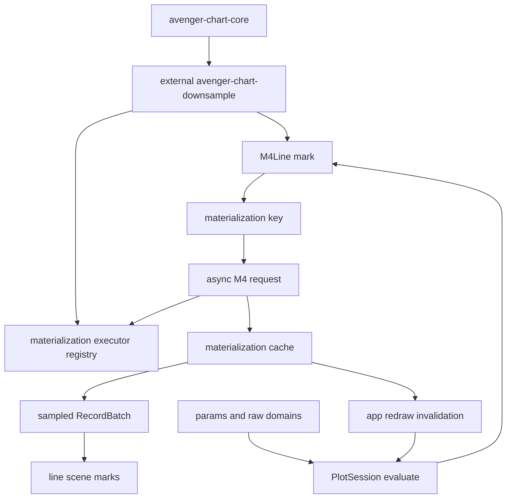

# Async M4 Line Materialization

## Status

Ready for design spike. The M4 use case fits the same async
view-dependent materialization substrate as async rasterized marks, but the
materialized payload is sampled vector data rather than an image.

## Goal

Support large time-series and ordered-line charts by asynchronously
materializing viewport-specific M4 samples. During pan and zoom, the chart
should render immediately by retargeting the last ready sample. When the
interaction settles, Avenger should request the exact sample for the final
viewport without blocking, then redraw when the new sample is ready.

The intended authoring shape is a normal Cartesian line mark from an external
crate:

```rust
Plot::<Cartesian>::new()
    .tool(PanScrollZoom::cartesian())
    .mark(
        M4Line::new()
            .x(col("time"))
            .y(col("value"))
            .series(col("sensor_id"))
            .overscan(0.25)
            .preview(LinePreview::RetargetCached),
    )
```

`M4Line` is a data mark, not coordinate guide chrome. It participates in
Cartesian scale/domain inference, legends, layering, and ordinary pan/zoom
interaction. Its rendered payload is a view-dependent sampled line dataset.

## External Crate Target

`M4Line` should be implemented in an external mark crate, for example
`avenger-chart-downsample` or `avenger-chart-timeseries`, rather than in the
`avenger-chart` facade.

That crate owns:

- the `M4Line` authoring type,
- Cartesian channel helpers for x/y and optional series grouping,
- compiled mark implementation,
- downsampling specs and preview policy,
- materialization request payloads,
- the DataFusion M4 materializer,
- tests and examples for dense time-series data.

The crate should depend on `avenger-chart-core`, `avenger-chart-cartesian`,
DataFusion, and shared resource/materialization utilities. It should not depend
on `avenger-chart`. The facade may re-export it later for convenience, but the
runtime must not special-case the mark.

## Research Basis

M4 is a visualization-oriented line-chart aggregation. For each x interval
corresponding to a pixel column, it keeps the first and last points in x order,
plus the points with minimum and maximum y values. This preserves the vertical
extent and entry/exit behavior needed to draw a faithful line at the current
screen resolution while reducing rows dramatically.

This differs from LTTB and other shape-preserving simplification algorithms.
Those can be useful follow-ons, but M4 is especially aligned with Avenger's
view-dependent materialization model because the buckets are defined directly
by the current x domain and plot width.

Useful references:

- [M4: A Visualization-Oriented Time Series Data Aggregation](https://datavis.cs.columbia.edu/files/papers/m4.pdf)
- [tsdownsample: high-performance time series downsampling for scalable visualization](https://arxiv.org/abs/2307.05389)
- [Datashader API, for the broader view-dependent rendering model](https://datashader.org/api.html)

## Architecture Framing

M4 lines, rasterized points, and map tiles should share one runtime substrate
but enter the chart pipeline in different places:

- map tiles are coordinate guide resource content,
- rasterized points are data mark materializations that produce images,
- M4 lines are data mark materializations that produce vector line data.

The common abstraction is:

```text
ViewDependentMaterialization
  key: stable viewport/data/spec identity
  request: serializable materialization spec
  result: image, record batch, or another typed payload
  cache: session/app runtime state
  executor: registered runtime implementation
```



## Exact Evaluation Is Not A Blocking Sample Wait

`EvaluationMode::Exact` should mean that layout, scales, guides, legends,
params, and non-deferred mark state are canonical for the current request. It
must not mean that the final M4 sample is ready.

Settling a pan or zoom should:

- compute canonical layout and domains,
- mark the final M4 sample key as the desired exact target,
- enqueue that sample at high priority,
- keep rendering the best available fallback sample,
- redraw when the desired sample is ready.

The invariant is:

> No interaction event waits on async materialization. Settle changes priority
> and correctness target; materialized payload readiness is tracked separately.

The rendered scene can therefore contain:

```text
M4Line:
  desired_key = hash(final_x_domain, plot_width, series, downsample_spec)
  displayed_key = last_ready_key
  status = PendingExact
```

## Mark Semantics

`M4Line` is a compiled Cartesian mark with deferred vector data:

- it owns x/y expressions and optional series/group expressions,
- it contributes to x/y domain inference from the source rows,
- it can expose legends for ordinary visual channels such as stroke,
- it renders through ordinary line scene marks once sampled data is ready,
- it does not expose one retained event datum per original row in v1,
- it may expose original-row or bucket-level hover metadata in a later phase.

The mark is async by declaring a deferred payload:

```text
render_from_data:
  compute desired materialization key
  register materialization request
  choose last-ready fallback key
  render sampled line data if available
  otherwise render nothing or a placeholder line state
```

Unlike `RasterizedPoints`, the result is not an image. The natural v1 result is
a sampled `RecordBatch` with columns for x, y, series, point order, and any
visual channels needed by the compiled line renderer.

## Required Generic Primitives

### 1. View-Dependent Materialization Requests

The existing async raster plan should be generalized from image-only
materialization to typed materialized payloads:

```rust
pub struct MaterializationRequest {
    pub key: MaterializationKey,
    pub kind: String,
    pub spec: SerializedMaterializationSpec,
    pub output: MaterializationOutputKind,
    pub priority: f32,
    pub policy: MaterializationPolicy,
}
```

For `M4Line`, the key should include:

- source logical-plan identity,
- x/y and series expressions,
- visible x domain plus overscan domain,
- plot-area pixel width,
- downsampling spec,
- visual-channel dependencies needed for line rendering,
- relevant params,
- data revision or store revision dependencies.

### 2. Materialization Result Types

The materialization cache should support at least:

- `Image(RgbaImage)` for rasterized points and tile images,
- `RecordBatch(RecordBatch)` for M4 samples,
- `Error` and diagnostic metadata.

The cache should remember the last ready key per mark instance so Preview can
retarget the previous sample immediately.

### 3. Materialization Executor Registry

External marks need a runtime dispatch hook:

```rust
pub trait MaterializationExecutor: Send + Sync {
    fn kind(&self) -> &'static str;

    async fn run(
        &self,
        request: MaterializationRequest,
        ctx: MaterializationExecutionContext<'_>,
    ) -> Result<MaterializationResult, MaterializationError>;
}
```

`avenger-chart-downsample` registers an `M4LineExecutor`. The chart runtime only
dispatches by request kind and stores typed results.

### 4. Materialized Data Access For Marks

`CompiledMark::render_from_data` or `MarkRuntimeContext` needs a public way to
retrieve materialized `RecordBatch` payloads by key. If the desired key is not
ready, the mark asks for the last-ready fallback key for the same mark
identity.

This access should be read-only and should not expose facade-owned layout
internals.

### 5. Preview Retarget Policy

Preview rendering needs an explicit stale-sample policy:

- `RetargetCached`: draw the last ready sampled line through current scales,
  accepting temporary loss of detail,
- `HideUntilReady`: hide the line if the exact key is missing,
- `Placeholder`: draw a neutral placeholder.

`RetargetCached` should be the default for interactive exploration.

### 6. Overscan

M4 should support overscan by default. The materialized x domain is wider than
the visible x domain, such as 25% extra on each side. This lets small pans reuse
the previous sample without immediately exposing blank edges.

Overscan belongs in the materialization key. The renderer still clips to the
visible plot area.

### 7. DataFusion M4 Backend

The first backend can use DataFusion to group rows into x pixel buckets. For
each bucket and series, it needs:

- first point by x,
- last point by x,
- min-y point,
- max-y point.

The result must be sorted by series and x order, with a stable order for
multiple selected points from the same bucket. If min/max points duplicate
first/last, duplicates should be removed unless retaining duplicates is needed
to preserve line topology.

### 8. Metrics And Diagnostics

M4 line materialization needs explicit metrics:

- materialization requests,
- cache hits and misses,
- stale fallback draws,
- exact-pending draws,
- query time,
- output row count,
- dropped stale requests,
- overscan reuse hits.

These metrics should be visible in `PlotSession` and chart-app diagnostics.

## DataFusion Details

The M4 query can be expressed as a bucketed aggregation over the current
overscanned x domain:

```sql
WITH projected AS (
  SELECT
    series,
    x,
    y,
    floor((x - xmin) / dx) AS bucket
  FROM source
  WHERE x >= xmin AND x < xmax
),
agg AS (
  SELECT
    series,
    bucket,
    min(x) AS first_x,
    max(x) AS last_x,
    min(y) AS min_y,
    max(y) AS max_y
  FROM projected
  GROUP BY series, bucket
)
```

The executor then resolves the rows corresponding to first, last, min-y, and
max-y. The exact SQL shape may need window functions or joins to recover full
rows and preserve visual-channel values.

The materializer should:

- project only needed columns,
- apply x-domain filters before grouping,
- handle null x/y by excluding rows,
- support linear and time x scales first,
- require or enforce monotonic x ordering per series for the strict M4 path,
- include params referenced by source expressions in the materialization key,
- include store/data revisions in the materialization key.

## Public API Sketch

```rust
let line = M4Line::new()
    .x(col("timestamp"))
    .y(col("temperature"))
    .series(col("station"))
    .stroke_with(col("station"), |c| c.legend(|l| l.title("Station")))
    .overscan(0.25)
    .preview(LinePreview::RetargetCached);

let plot = Plot::<Cartesian>::new()
    .data(readings)
    .tool(PanScrollZoom::cartesian())
    .mark(line);
```

Layering remains ordinary:

```rust
Plot::<Cartesian>::new()
    .mark(M4Line::new().x(col("t")).y(col("value")))
    .mark(Symbol::new().x(col("event_t")).y(col("event_value")).size(lit(80)));
```

## Relationship To `Line`

`M4Line` should start as a separate external mark rather than an option on the
built-in `Line<Cartesian>`.

Reasons:

- it requires async materialization state,
- it has stricter data assumptions,
- it may need specialized diagnostics and hover behavior,
- it proves that external marks can own view-dependent materializers.

After the model is proven, a convenience `.downsample_m4(...)` helper on line
authoring could be considered, but the primitive should remain an external
mark.

## Relationship To Tools

The mark is the primitive. A future tool may package:

- pan/zoom defaults optimized for M4 lines,
- hover over sampled buckets,
- controls for switching between raw and sampled line display,
- controls for overscan or materialization resolution.

The tool should not own the downsampling semantics. It only manipulates params
and options over ordinary lower-level primitives.

## Implementation Phases

### Phase 1: Generalize Materialization Outputs

- Extend the async rasterized-mark plan so materialization results can be
  images or `RecordBatch` payloads.
- Add materialized-data lookup to mark runtime context.
- Add tests proving exact evaluation returns before vector materialization is
  ready.

### Phase 2: External `M4Line` Mark Skeleton

- Add an `avenger-chart-downsample` crate.
- Add `M4Line` authoring and compiled mark types.
- Make it contribute x/y domain data from source rows.
- During evaluation, compute materialization keys and request M4 samples.
- Prove the crate can be used without depending on the `avenger-chart` facade,
  then add optional facade re-exports.

### Phase 3: DataFusion M4 Executor

- Implement count-free M4 point selection for one series.
- Add optional `series(...)` grouping.
- Preserve source-row visual-channel values for selected points.
- Register the executor through the public materialization executor registry.

### Phase 4: Preview, Overscan, And Settle

- Retarget last-ready samples during Preview.
- Enqueue high-priority exact target samples on settle without blocking.
- Add overscan-domain keying and fallback reuse.
- Add diagnostics for stale fallback draws and overscan hits.

### Phase 5: Visual And Interactive Examples

- Add a headless pan/zoom replay benchmark for millions of time-series rows.
- Add an interactive example with artificial M4 latency.
- Add visual baselines using deterministic fixture data and a deterministic
  executor.

### Phase 6: Richer Downsampling

- Add optional LTTB or MinMaxLTTB follow-up algorithms.
- Add hover over sampled buckets or original rows.
- Add multi-line and faceted sharing stress tests.

## Testing Plan

- Unit-test M4 bucket selection for known ordered input.
- Unit-test duplicate removal when first/last/min/max overlap.
- Unit-test multiple series produce independent samples.
- Unit-test x-domain filtering and overscan domain calculation.
- Unit-test null x/y exclusion.
- Unit-test materialization key stability and invalidation.
- Unit-test exact evaluation with missing M4 sample returns immediately.
- Unit-test Preview retarget uses last ready sample.
- Unit-test settled exact target priority without blocking.
- Add a deterministic visual baseline for a line with spikes near bucket
  boundaries.
- Add a benchmark comparing raw line render, cached M4 preview, and completed
  M4 redraw.

## Open Design Questions

- Should the v1 M4 executor require sorted data, or sort within the executor?
- Should the result preserve original rows exactly, or only x/y plus visual
  channels needed for rendering?
- Should materialized `RecordBatch` payloads be stored in the same cache as
  image resources, or in a sibling materialized-data cache?
- How should hover map sampled points back to original rows or buckets?
- Should M4 be combined with LTTB after M4 when the sampled output is still too
  large?
