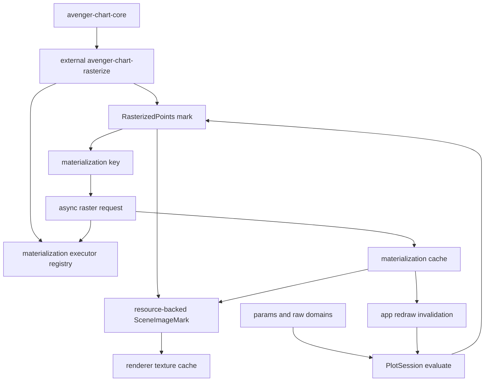

# Async Rasterized Marks

## Status

Ready for design spike. The use case is clear and fits the current
compile/session/resource direction, but it depends on generic async
view-dependent materialization and resource-backed image primitives.

## Goal

Support Datashader-style workflows where dense point data is aggregated into a
pixel-level raster for the current Cartesian viewport. Pan and zoom should stay
smooth by retargeting the last ready raster immediately, while new
viewport-specific rasters are computed asynchronously and swapped in when
ready.

The intended authoring shape is a normal Cartesian data mark:

```rust
Plot::<Cartesian>::new()
    .tool(PanScrollZoom::cartesian())
    .mark(
        RasterizedPoints::new()
            .x(col("x"))
            .y(col("y"))
            .aggregate(count())
            .resolution(RasterResolution::PlotPixels)
            .shade(|s| {
                s.color_scheme("viridis")
                    .norm(ShadeNorm::Log)
            })
            .preview(RasterPreview::RetargetCached),
    )
```

`RasterizedPoints` is a data mark, not coordinate guide chrome. It participates
in Cartesian scale/domain inference and can be layered with other marks. Its
rendered payload is an asynchronously materialized image resource.

## External Crate Target

`RasterizedPoints` should be implemented in an external mark crate, for example
`avenger-chart-rasterize`, rather than in the `avenger-chart` facade.

That crate owns:

- the `RasterizedPoints` authoring type,
- its Cartesian channel helpers,
- compiled mark implementation,
- aggregate and shading specs,
- materialization request payloads,
- the DataFusion raster materializer,
- tests and examples for dense Cartesian data.

The crate should depend on `avenger-chart-core`, `avenger-chart-cartesian`,
DataFusion, and shared resource/materialization utilities. It should not depend
on `avenger-chart`. The facade may re-export it later for convenience, but the
runtime must not special-case the mark.

This external-crate target changes the required abstraction slightly:
view-dependent materialization cannot be a closed enum owned by
`avenger-chart`, and it cannot be image-only. External marks need a public way
to emit serializable materialization requests, a public way to register the
executor that knows how to compute those requests, and a common cache that can
hold image or vector-data results.

## Research Basis

Datashader models dense rendering as a pipeline:

1. choose a canvas with pixel width, pixel height, and x/y ranges,
2. aggregate source rows into fixed pixel bins,
3. transform and shade the aggregate into an image,
4. display the resulting raster.

HoloViews/Bokeh integration makes this operation replayable. During live pan or
zoom, callbacks provide the current viewport and pixel size, and Datashader
computes a new image. Static exports only have the original image, so zooming
expands existing pixels rather than revealing a fresh raster.

Useful references:

- [Datashader pipeline](https://datashader.org/getting_started/Pipeline.html)
- [Datashader interactivity](https://datashader.org/getting_started/Interactivity.html)
- [Datashader API](https://datashader.org/api.html)
- [HoloViews large data guide](https://dev.holoviews.org/user_guide/Large_Data.html)

## Architecture Framing

Map tiles and Datashader-like rasters share a resource/cache substrate, but
they enter the chart pipeline differently. M4-sampled lines share the
materialization substrate as well, but produce vector data rather than images:

- map tiles are coordinate guide underlay resources,
- rasterized points are data mark materializations.
- M4 lines are data mark materializations.

The mark should not block chart evaluation while it computes pixels. Instead,
it emits a resource-backed scene image plus a materialization request.



## Exact Evaluation Is Not A Blocking Raster Wait

`EvaluationMode::Exact` should mean that layout, scales, guides, legends,
params, and non-deferred mark state are canonical for the current request. It
must not mean that every async materialized payload is ready.

Settling a pan or zoom should:

- compute the canonical viewport and layout,
- mark the final raster key as the desired exact target,
- enqueue that raster at high priority,
- keep rendering the best available fallback raster,
- redraw when the desired raster is ready.

The invariant is:

> No interaction event waits on async materialization. Settle changes priority
> and correctness target; resource readiness is tracked separately.

The rendered scene can therefore contain:

```text
RasterizedPoints image:
  desired_key = hash(final_domain, final_size, aggregate_spec)
  displayed_key = last_ready_key
  status = PendingExact
```

When `desired_key` becomes ready, the renderer should ideally swap textures
without requiring a full chart reevaluation. A lightweight reevaluation is
acceptable if the fallback/displayed key is stored in the scenegraph rather
than resolved directly by the renderer.

## Mark Semantics

`RasterizedPoints` is a compiled Cartesian mark with special rendering:

- it owns x/y data expressions,
- it contributes to x/y domain inference from the source rows,
- it can expose a colorbar for aggregate values,
- it renders below later marks according to ordinary mark ordering,
- it emits one image covering the current plot area,
- it does not expose one retained event datum per original row,
- it may expose aggregate hover data in a later phase.

The mark is async by declaring a deferred payload:

```text
render_from_data:
  compute desired materialization key
  register materialization request
  choose last-ready fallback key
  emit resource-backed image mark
```

The actual DataFusion query, dense raster construction, and color shading run
outside normal chart evaluation in the materialization runtime.

## Required Generic Primitives

### 1. View-Dependent Materialization Requests

Evaluation needs a request type for computed resources, not just fetched
resources:

```rust
pub struct MaterializationRequest {
    pub key: MaterializationKey,
    pub kind: String,
    pub spec: SerializedMaterializationSpec,
    pub output: MaterializationOutputKind,
    pub priority: f32,
    pub policy: MaterializationPolicy,
}
```

For `RasterizedPoints`, the key should include:

- source logical-plan identity,
- x/y expressions,
- viewport x/y domains,
- plot-area pixel width and height,
- aggregate spec,
- shading spec,
- relevant params,
- data revision or store revision dependencies.

The request kind and payload must be extensible. `avenger-chart-rasterize`
should be able to define and serialize a `RasterizedPointsSpec`, while the
session/app runtime dispatches it through a materialization executor registry.

### 2. Materialization Cache

`PlotSession` should own or reference a cache with states:

- `Missing`,
- `Queued`,
- `Running`,
- `Ready`,
- `Error`,
- optionally `Stale`.

The cache should remember the last ready key per mark instance so Preview can
retarget the previous raster immediately.

The cache should support multiple result payloads:

- `Image(RgbaImage)` for rasterized points and tile images,
- `RecordBatch(RecordBatch)` for M4-sampled lines,
- `Error` and diagnostic metadata.

### 3. Materialization Executor Registry

External marks need a runtime dispatch hook:

```rust
pub trait MaterializationExecutor: Send + Sync {
    fn kind(&self) -> &'static str;

    async fn run(
        &self,
        request: MaterializationRequest,
        ctx: MaterializationExecutionContext<'_>,
    ) -> Result<MaterializationResult, MaterializationError>;
}
```

The chart app or `PlotSession` receives a registry of executors. Built-in
executors can handle generic HTTP/image resources. External crates register
their own executors, such as `RasterizedPointsExecutor`.

This keeps `CompiledPlot` serializable: compiled marks and materialization
requests contain serializable specs, while live executors and credentials are
runtime configuration.

### 4. Resource-Backed Scene Images And Materialized Data

The scenegraph image source should support inline images and resource refs:

```rust
pub enum SceneImageSource {
    Inline(RgbaImage),
    Resource {
        desired: ResourceKey,
        fallback: Option<ResourceKey>,
    },
}
```

For rasterized marks, `desired` is the current viewport raster. `fallback` is
the best ready raster for the same mark.

M4 line materialization uses the same request/cache/executor substrate but
reads a materialized `RecordBatch` during mark rendering instead of emitting a
resource-backed image. See [async-m4-lines.md](async-m4-lines.md).

### 5. Preview Retarget Policy

Preview rendering needs an explicit stale-raster policy:

- `RetargetCached`: draw the last ready raster through the new scale transform,
  accepting temporarily stretched pixels,
- `HideUntilReady`: hide the raster if the exact key is missing,
- `Placeholder`: draw a neutral placeholder while the new raster computes.

`RetargetCached` should be the default for interactive exploration.

### 6. Async Completion Invalidation

When a materialization finishes, the runtime requests redraw. Redraw should be
coalesced so many near-simultaneous completions do not stampede the app loop.

The preferred path is renderer-level texture swap:

- the scene already references `desired`,
- the resource cache becomes ready,
- the renderer uploads or reuses the texture,
- the app redraws.

If the scene stores only `displayed_key`, completion may instead trigger a
lightweight session evaluation.

### 7. Public Mark Materialization Context

`CompiledMark::render_from_data` needs a public, coordinate-neutral way to
request materializations. This can be an extension of `MarkRuntimeContext` or a
resource collector passed through the evaluation context.

External mark crates need access to:

- current plot-area size,
- resolved x/y scale domains and ranges,
- the coordinate transform,
- params that affect channel expressions,
- mark identity for last-ready fallback lookup,
- data/store revision ids,
- a materialization request sink.

The context should not expose facade-owned layout internals.

### 8. DataFusion Raster Backend

The first backend can use DataFusion to group rows into pixel bins. The query
shape is:

```sql
SELECT
  floor((x - xmin) / dx) AS ix,
  floor((y - ymin) / dy) AS iy,
  count(*) AS value
FROM source
WHERE x >= xmin AND x < xmax
  AND y >= ymin AND y < ymax
GROUP BY ix, iy
```

The materializer then expands sparse `(ix, iy, value)` rows into a dense raster
and shades the aggregate to RGBA. Later phases may replace this with a
specialized kernel, but DataFusion gives v1 a direct path through existing
logical plans, predicate pushdown, projection pruning, and async execution.

### 9. Aggregate Domain And Colorbar Support

The raster value domain is separate from x/y domains. It can be:

- visible-domain local, recomputed from each raster,
- fixed explicit domain,
- global precomputed domain,
- quantile/equalized domain from a sampled or precomputed summary.

Visible-domain local coloring matches common Datashader exploration behavior
but can make colors shift during pan/zoom. Fixed/global coloring is better for
comparisons and stable legends.

The mark should expose enough metadata for a continuous colorbar when the
shading is scalar.

### 10. Metrics And Diagnostics

Rasterized marks need explicit metrics:

- materialization requests,
- cache hits and misses,
- stale fallback draws,
- exact-pending draws,
- query time,
- dense raster build time,
- shading time,
- texture upload time,
- dropped stale requests.

These metrics should be visible in `PlotSession` and chart-app diagnostics.

## Foundational Utilities For External Marks

To make `RasterizedPoints` genuinely external, shared crates need these public
utilities:

- extensible materialization request/spec serialization;
- a runtime materialization executor registry;
- materialization cache access and last-ready fallback lookup keyed by mark
  identity;
- resource-backed scene image support for image-producing marks;
- materialized `RecordBatch` access for vector-data-producing marks such as
  M4 lines;
- mark runtime access to plot-area size, scales, params, and a request sink;
- stable hashing/fingerprinting helpers for DataFusion logical plans,
  expressions, params, and store revisions;
- reusable raster binning helpers for common linear Cartesian cases;
- deterministic materialization executors for tests and visual baselines;
- a way for external marks to expose aggregate-domain metadata to legends or
  colorbars without depending on the facade.

The root `avenger-chart` crate should execute the generic materialization
pipeline and renderer/resource swap behavior. It should not know that a request
came from `RasterizedPoints`.

## Unified Materialization Family

This plan is part of a broader family:

- [map-tiles.md](map-tiles.md): external coordinate guide resources that fetch
  image tiles,
- this document: external data marks that compute raster images from source
  data,
- [async-m4-lines.md](async-m4-lines.md): external data marks that compute
  sampled vector line data from source data.

The common runtime primitive is a nonblocking, view-dependent materialization
request with an extensible executor registry and typed cached results.

## DataFusion Details

The materializer should compile binning from expressions, not from precomputed
columns. It should:

- project only needed source columns,
- apply viewport filters before grouping,
- handle null x/y by excluding rows,
- clamp bin indices to `[0, width)` and `[0, height)`,
- support numeric linear axes first,
- reject non-linear or non-invertible axes until the bin mapping is defined,
- include params referenced by source expressions in the materialization key,
- include store/data revisions in the materialization key.

The output can be one of two forms:

- numeric aggregate raster plus renderer-side color mapping,
- pre-shaded RGBA image.

Pre-shaded RGBA is simpler and closer to Datashader. Numeric raster preserves
more interaction options, such as colorbar-driven recoloring and hover over bin
values. V1 can start with RGBA while keeping the key/result model open to
numeric rasters.

## Public API Sketch

```rust
let density = RasterizedPoints::new()
    .x(col("pickup_lon"))
    .y(col("pickup_lat"))
    .aggregate(count())
    .shade(|s| {
        s.color_scheme("viridis")
            .norm(ShadeNorm::Log)
            .domain(AggregateDomain::Visible)
    })
    .preview(RasterPreview::RetargetCached);

let plot = Plot::<Cartesian>::new()
    .data(trips)
    .canvas_constraint(CanvasConstraint::width(width_param.expr()))
    .canvas_constraint(CanvasConstraint::height(height_param.expr()))
    .tool(PanScrollZoom::cartesian())
    .mark(density);
```

Layering with ordinary marks remains natural:

```rust
Plot::<Cartesian>::new()
    .mark(RasterizedPoints::new().x(col("x")).y(col("y")).aggregate(count()))
    .mark(Symbol::new().x(col("selected_x")).y(col("selected_y")).size(lit(80)));
```

## Relationship To Tools

The mark is the primitive. A future tool may package:

- pan/zoom settings optimized for rasterized marks,
- hover over aggregate bins,
- controls for switching visible/global color domains,
- controls for forcing refresh or changing resolution.

The tool should not own the aggregation semantics. It only manipulates params
and options over ordinary lower-level primitives.

## Implementation Phases

### Phase 1: General View-Dependent Materialization Model

- Add `MaterializationKey`, `MaterializationRequest`,
  `MaterializationState`, and `MaterializationResult`.
- Add request collection during evaluation.
- Add an extensible materialization executor registry keyed by request kind.
- Support typed materialization outputs, including image and `RecordBatch`.
- Add session metrics for request/cache behavior.
- Add tests proving exact evaluation can return while materializations are
  missing.

### Phase 2: Resource-Backed Image Scene Marks

- Extend `SceneImageMark` to support resource refs.
- Add renderer-side resource resolution and texture caching.
- Add deterministic test resource resolver for PNG/visual tests.

### Phase 3: External `RasterizedPoints` Mark Skeleton

- Add an `avenger-chart-rasterize` crate with authoring and compiled mark
  types.
- Make it contribute x/y domain data from source rows.
- During evaluation, compute materialization keys and emit resource-backed
  image marks.
- Add fallback retarget behavior using the last ready key.
- Prove the crate can be used without depending on the `avenger-chart` facade,
  then add optional facade re-exports.

### Phase 4: External DataFusion Raster Materializer

- Implement count aggregation for linear Cartesian x/y.
- Build dense aggregate arrays from sparse DataFusion output.
- Shade to RGBA with a small initial color-scheme set.
- Register the materializer through the public executor registry and run it
  off the interaction path.

### Phase 5: Pan/Zoom Integration

- Ensure `PanScrollZoom` Preview retargets stale rasters smoothly.
- Ensure settle enqueues high-priority exact-target rasters without blocking.
- Add an interactive stress example with artificial materialization latency.

### Phase 6: Colorbar And Aggregate Domains

- Add visible/fixed/global aggregate-domain policies.
- Add continuous colorbar support for scalar raster values.
- Add tests for stable color domains and visible-domain recoloring.

### Phase 7: Richer Aggregates

- Add `sum`, `mean`, `min`, `max`, and category/count variants.
- Consider numeric raster outputs for renderer-side recoloring.
- Add hover over aggregate bins if interaction metadata is available.

## Testing Plan

- Unit-test materialization key stability and invalidation.
- Unit-test exact evaluation with missing materialization returns immediately.
- Unit-test DataFusion binning for known point sets and plot sizes.
- Unit-test null x/y exclusion and bin edge clamping.
- Unit-test stale-raster retarget selection during Preview.
- Unit-test settled exact target priority without blocking.
- Add a deterministic visual baseline with a small known raster.
- Add a headless pan/zoom replay benchmark measuring eval time, query time,
  shade time, and render time.
- Add an interactive example with millions of points and artificial async
  delay.

## Open Design Questions

- Should `RasterizedPoints` initially return RGBA images only, or should it
  expose numeric aggregate rasters from the start?
- Should materialization cache ownership live in `PlotSession`, a shared app
  resource runtime, or a lower-level resource crate?
- Should renderer-level texture swap be required for v1, or can completion
  trigger lightweight reevaluation?
- How should visual baselines represent missing or pending materializations
  deterministically?
- How much of Datashader's transfer-function model should be mirrored before
  adding custom kernels?
- Should reusable DataFusion rasterization helpers live in
  `avenger-chart-rasterize`, or in a lower-level crate intended for multiple
  async materialized marks?
