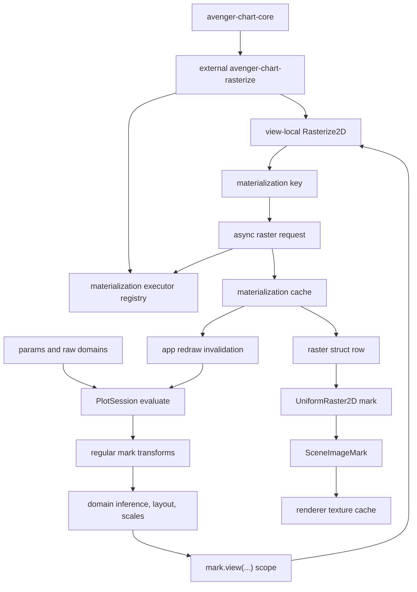

# Async Rasterized Marks

## Status

Ready for design spike. Updated after the initial `UniformRaster2D` mark and
`Rasterize2D` transform work: the Datashader-style public surface should build
on those lower-level primitives, not introduce a parallel private raster model.
Updated again to model `View` as a `mark.view(...)` scope rather than as an
ordinary `DataTransform`. It still depends on generic async view-dependent
materialization and retained view-result reuse.

## Goal

Support Datashader-style workflows where dense point data is aggregated into a
pixel-level raster for the current Cartesian viewport. Pan and zoom should stay
smooth by retargeting the last ready raster immediately, while new
viewport-specific rasters are computed asynchronously and swapped in when
ready.

The intended low-level authoring shape is a normal `UniformRaster2D` mark whose
raster input is produced by `Rasterize2D` inside a `view(...)` scope:

```rust
Plot::<Cartesian>::new()
    .tool(PanScrollZoom::cartesian())
    .mark(
        UniformRaster2D::new()
            .view(
                View::cartesian()
                    .id("density")
                    .x_domain(col("x"))
                    .y_domain(col("y"))
                    .preview_cached(true),
                |mark, view| {
                    mark.transform(
                        Rasterize2D::new(col("x"), col("y"))
                            .x(|x| {
                                x.extent(
                                    view.x().domain_start(),
                                    view.x().domain_end(),
                                )
                                .bins(view.x().pixels())
                            })
                            .y(|y| {
                                y.extent(
                                    view.y().domain_start(),
                                    view.y().domain_end(),
                                )
                                .bins(view.y().pixels())
                            })
                            .agg("count"),
                        |mark, hist| {
                            mark.raster_with(hist.raster(), |r| {
                                r.x(hist.x_dim())
                                    .y(hist.y_dim())
                                    .fill(|fill| {
                                        fill.scale_with::<Sqrt>(|scale| {
                                            scale.nice(false).zero(false)
                                        })
                                        .legend(|legend| legend.title("Count"))
                                    })
                            })
                        },
                    )
                },
            )
            .smooth(false)
    )
```

The `View` scope owns the current viewport boundary and the explicit x/y domain
inputs for this view-scoped mark. `Rasterize2D` bins source rows into the
existing DataArray-style uniform raster struct. `UniformRaster2D` consumes that
raster, handles fill/color scale inference and legends, and renders a
`SceneImageMark`.
In the examples below, the `View` accessors are proposed API; the
`Rasterize2D`, `raster_with(...)`, `hist.raster()`, `hist.x_dim()`, and
`hist.y_dim()` usage follows the current public raster implementation.

`view(...)` is not a data transform. All ordinary mark transforms outside the
view scope run before view resolution. Transforms configured inside the
`view(...)` closure are view-local and may read the resolved view.

`View` is also the public home for default async interaction policy for
materializations inside the scope. Options such as `preview_cached`,
throttle/debounce, stale-result behavior, and settle priority belong here
because they describe how view-dependent work should behave during pan/zoom.
The view-local transform still owns the computation spec: source expressions,
bins/resolution, aggregate, and output type.

A future convenience mark such as `RasterizedPoints` may still exist, but it
should be a component mark that expands to these public primitives. It should
not own a separate raster representation or bypass `Rasterize2D` /
`UniformRaster2D`.

## External Crate Target

The async/component layer should be implementable in an external crate, for
example `avenger-chart-rasterize`, rather than in the `avenger-chart` facade.
That crate may expose a convenience component mark, but its expansion target is
the public `mark.view(...) + Rasterize2D + UniformRaster2D` stack.

That crate owns:

- optional component authoring types such as `RasterizedPoints`,
- async materialization request specs for view-scoped `Rasterize2D`,
- aggregate-domain and preview policy helpers,
- materialization request payloads,
- executor glue around the existing DataFusion `Rasterize2D` rasterizer,
- tests and examples for dense Cartesian data.

The crate should depend on `avenger-chart-core`, `avenger-chart-cartesian`,
`avenger-chart-transforms`, `avenger-chart-marks`, DataFusion, and shared
resource/materialization utilities. The facade may re-export it later for
convenience, but the runtime must not special-case the component.

This external-crate target changes the required abstraction slightly:
view-dependent materialization cannot be a closed enum owned by
`avenger-chart`, and it cannot be image-only. External components and
view-local transforms need a public way to emit serializable
materialization requests, a public way to register the executor that knows how
to compute those requests, and a common cache that can hold raster-struct,
image, or vector-data results.

## Research Basis

Datashader models dense rendering as a pipeline:

1. choose a canvas with pixel width, pixel height, and x/y ranges,
2. aggregate source rows into fixed pixel bins,
3. transform and shade the aggregate into an image,
4. display the resulting raster.

HoloViews/Bokeh integration makes this operation replayable. During live pan or
zoom, callbacks provide the current viewport and pixel size, and Datashader
computes a new image. Static exports only have the original image, so zooming
expands existing pixels rather than revealing a fresh raster.

Useful references:

- [Datashader pipeline](https://datashader.org/getting_started/Pipeline.html)
- [Datashader interactivity](https://datashader.org/getting_started/Interactivity.html)
- [Datashader API](https://datashader.org/api.html)
- [HoloViews large data guide](https://dev.holoviews.org/user_guide/Large_Data.html)

## Architecture Framing

Map tiles and Datashader-like rasters share a resource/cache substrate, but
they enter the chart pipeline differently. M4-sampled lines share the
materialization substrate as well, but produce vector data rather than images:

- map tiles are coordinate guide underlay resources,
- Datashader-style rasters are view-scoped `Rasterize2D`
  materializations consumed by `UniformRaster2D`,
- M4 lines are data mark materializations.

The rasterization stage should not block chart evaluation while it computes
view-sized bins. Instead, evaluation emits a materialization request and renders
the best available retained result through `UniformRaster2D`.



## Exact Evaluation Is Not A Blocking Raster Wait

`EvaluationMode::Exact` should mean that layout, positional scales, params, and
non-deferred mark state are canonical for the current request. It must not mean
that every async materialized payload is ready. Guides or legends that depend
on a deferred materialized value, such as a visible-domain raster colorbar, may
temporarily reflect the displayed fallback payload until the desired payload is
ready and a redraw/reevaluation runs.

Settling a pan or zoom should:

- compute the canonical viewport and layout,
- mark the final raster key as the desired exact target,
- enqueue that raster at high priority,
- keep rendering the best available fallback raster,
- redraw when the desired raster is ready.

The invariant is:

> No interaction event waits on async materialization. Settle changes priority
> and correctness target; resource readiness is tracked separately.

The rendered scene can therefore contain:

```text
UniformRaster2D / Rasterize2D view result:
  desired_key = hash(view_domain, pixel_size, rasterize_spec)
  displayed_key = last_ready_key
  status = PendingExact
```

When `desired_key` becomes ready, the runtime must trigger the host redraw hook.
For numeric raster-struct outputs, the normal path is a lightweight
reevaluation: the cache now resolves to the desired raster row, and
`UniformRaster2D` rebuilds the `SceneImageMark` through the ordinary raster
mark path. Renderer-level texture swap is only the preferred path for optional
pre-shaded image-resource outputs whose scene image already references a
desired resource key.

## Primitive Semantics

The low-level Datashader-style stack has three public pieces:

- `mark.view(View::cartesian(), |mark, view| { ... })` creates a view scope
  after regular transforms, positional domain inference, layout, and scale
  resolution;
- `View::cartesian()` declares explicit x/y domain inputs for the view scope
  and exposes the current resolved domains, ranges, and pixel dimensions to the
  view closure;
- view-local `Rasterize2D` consumes source x/y expressions plus view-derived
  extents and bin counts, then produces ordinary dataframe rows containing the
  existing uniform raster struct;
- `UniformRaster2D` consumes those raster rows, handles fill/color scale
  inference and legends, and renders one `SceneImageMark` per raster row.

A future component mark such as `RasterizedPoints` is only sugar over those
pieces. It may choose defaults for `View`, `Rasterize2D`, fill scales, and
preview policy, but it should compile to the same primitives an author could
write manually.

The logical mark pipeline is:

```text
source data
-> regular transforms on the mark
-> positional domain inference from ordinary channels and View domain inputs
-> layout and scale resolution
-> mark.view(...) closure
-> view-local transforms/materialization
-> render channels
-> scene marks
```

All ordinary transforms on the base mark run before the view scope. This means
`Filter`, `Select`, and other regular transforms affect both the data used for
the `View` x/y domain inputs and the rows visible to view-local transforms.
There is no post-view ordinary transform phase. Transforms authored inside the
`view(...)` closure are view-local and may depend on resolved view values.

x/y channels configured inside `view(...)` are render-only for positional
domain inference. They do not contribute to x/y scale domains. The x/y domain
for a view-scoped mark must come from one of:

- `View::cartesian().x_domain(...)` / `.y_domain(...)`,
- ordinary x/y channels outside the view scope on another mark in the same
  scale-sharing group,
- explicit scale domains configured by the author.

Non-positional channels inside the view scope, such as `fill`, can still
participate in their own scale-domain inference. For rasters, the common case
is a fill domain inferred from `UniformRaster2D` scalar `values.data` after the
view-local `Rasterize2D` result is available.

The same primitive is useful without view-local transforms. For example, a mark
can render against the current visible domain directly:

```rust
Rect::new().view(
    View::cartesian()
        .x_domain(col("x"))
        .y_domain(col("y")),
    |rect, view| {
        rect.x(view.x().domain_start())
            .x2(view.x().domain_end())
            .y(view.y().domain_start())
            .y2(view.y().domain_end())
            .fill("rgba(37, 99, 235, 0.10)")
    },
)
```

Those `x`, `x2`, `y`, and `y2` render channels are derived from the resolved
view and therefore cannot feed back into positional domain inference.

The async boundary belongs to the view-scoped rasterization result:

```text
view scope / rasterize stage:
  compute desired materialization key
  register materialization request
  choose last-ready fallback key
  provide the best available raster struct row(s) to UniformRaster2D
```

The actual DataFusion query and dense raster construction run outside normal
chart evaluation in the materialization runtime. Color mapping can remain in
`UniformRaster2D` by materializing numeric raster structs, or move into the
materializer only for a later pre-shaded RGBA-image mode.

Async policy defaults come from the enclosing `View`. In v1 this can be only
view-level configuration. Later, individual view-local transforms may override
the view policy if a scope contains multiple materializations with different
latency or freshness needs.

## Required Generic Primitives

### 1. View-Scoped Materialization Requests

Evaluation needs a request type for computed resources, not just fetched
resources:

```rust
pub struct MaterializationRequest {
    pub key: MaterializationKey,
    pub kind: String,
    pub spec: SerializedMaterializationSpec,
    pub output: MaterializationOutputKind,
    pub priority: f32,
    pub policy: MaterializationPolicy,
}
```

For a view-scoped `Rasterize2D` materialization, the key should include:

- source logical-plan identity,
- x/y expressions,
- viewport x/y domains,
- plot-area pixel width and height,
- `Rasterize2D` dimension names, sampling, reducer, and value expression,
- partitioning expressions, if any,
- relevant params,
- data revision or store revision dependencies.

If the materialization output is a pre-shaded image instead of a numeric raster
struct, the key must also include fill scale, color range, null/non-finite
colors, and opacity-related options.

The request kind and payload must be extensible. `avenger-chart-rasterize`
should be able to define and serialize a `Rasterize2DMaterializationSpec`,
while the session/app runtime dispatches it through a materialization executor
registry.

### 2. Materialization Cache

`PlotSession` should own or reference a cache with states:

- `Missing`,
- `Queued`,
- `Running`,
- `Ready`,
- `Error`,
- optionally `Stale`.

The cache should remember the last ready key per view scope and materialization
spec so Preview can retarget the previous raster immediately.

The cache should support multiple result payloads:

- `RecordBatch(RecordBatch)` or a more specific raster-struct payload for
  view-scoped `Rasterize2D` results,
- `Image(RgbaImage)` for pre-shaded rasters and tile images,
- `RecordBatch(RecordBatch)` for M4-sampled lines,
- `Error` and diagnostic metadata.

### 3. Materialization Executor Registry

External components and view-local transforms need a runtime dispatch hook:

```rust
pub trait MaterializationExecutor: Send + Sync {
    fn kind(&self) -> &'static str;

    async fn run(
        &self,
        request: MaterializationRequest,
        ctx: MaterializationExecutionContext<'_>,
    ) -> Result<MaterializationResult, MaterializationError>;
}
```

The chart app or `PlotSession` receives a registry of executors. Built-in
executors can handle generic HTTP/image resources. External crates register
their own executors, such as a `Rasterize2DExecutor`.

This keeps `CompiledPlot` serializable: compiled marks and materialization
requests contain serializable specs, while live executors and credentials are
runtime configuration.

### 4. Materialized Data And Optional Resource-Backed Scene Images

The primary v1 path for `Rasterize2D` should be numeric materialized data:
cached raster struct rows flow back into `UniformRaster2D`, which performs
normal fill scale inference, legend/colorbar handling, color mapping, and
`SceneImageMark` construction during reevaluation.

Pre-shaded raster images and map tiles also need scenegraph image resource
refs. That image path should use inline images and resource refs:

```rust
pub enum SceneImageSource {
    Inline(RgbaImage),
    Resource {
        desired: ResourceKey,
        fallback: Option<ResourceKey>,
    },
}
```

For pre-shaded raster images, `desired` is the current viewport raster image
and `fallback` is the best ready raster image for the same view scope.
For numeric raster structs, the same desired/fallback choice happens in the
materialization cache before `UniformRaster2D` renders the chosen raster data;
the scene does not need to reference the desired numeric raster key directly.

M4 line materialization uses the same request/cache/executor substrate but
reads a materialized `RecordBatch` during mark rendering instead of emitting a
resource-backed image. See [async-m4-lines.md](async-m4-lines.md).

### 5. Preview Retarget Policy

`View` should expose an explicit stale-result policy used by view-local
materializations:

- `RetargetCached`: draw the last ready raster through the new scale transform,
  accepting temporarily stretched pixels,
- `HideUntilReady`: hide the raster if the exact key is missing,
- `Placeholder`: draw a neutral placeholder while the new raster computes.

`RetargetCached` should be the default for interactive exploration.

### 6. Async Completion Invalidation

When a materialization finishes, the runtime requests redraw. Redraw should be
coalesced so many near-simultaneous completions do not stampede the app loop.

For numeric raster-struct outputs, completion triggers a lightweight
reevaluation:

- the materialization cache records `desired` as ready,
- the app redraw hook is invoked,
- evaluation chooses the desired raster row instead of the fallback,
- `UniformRaster2D` constructs the new `SceneImageMark`.

For optional pre-shaded image-resource outputs, completion can use a
renderer-level texture/resource swap:

- the scene already references `desired`,
- the resource cache becomes ready,
- the renderer uploads or reuses the texture,
- the app redraws.

### 7. Public View Scope Materialization Context

View scopes and view-local transforms need a public, coordinate-neutral way to
request materializations. This should be modeled as a view-scope runtime
context rather than as ordinary `DataTransformExecutionContext`, because the
view context depends on resolved domains, ranges, layout, and plot-area pixels.

External crates need access to:

- current plot-area size,
- resolved x/y scale domains and ranges,
- the coordinate transform,
- params that affect channel expressions,
- mark identity for last-ready fallback lookup,
- data/store revision ids,
- a materialization request sink.

The context should not expose facade-owned layout internals.

### 8. DataFusion Raster Backend

The first backend should reuse the `Rasterize2D` implementation model: a
DataFusion aggregate UDF bins rows directly into dense uniform raster structs.
It should not materialize long-form `(ix, iy, value)` rows in Rust.

The async executor configures `Rasterize2D` from the resolved view scope:

```text
x extent = current x domain
y extent = current y domain
x bins = current plot-area pixel width or configured resolution
y bins = current plot-area pixel height or configured resolution
```

DataFusion still gives v1 a direct path through existing logical plans,
predicate pushdown, projection pruning, partitioned UDAF execution, and async
execution.

### 9. Aggregate Domain And Colorbar Support

The raster value domain is separate from x/y domains. It can be:

- visible-domain local, recomputed from each raster,
- fixed explicit domain,
- global precomputed domain,
- quantile/equalized domain from a sampled or precomputed summary.

Visible-domain local coloring matches common Datashader exploration behavior
but can make colors shift during pan/zoom. Fixed/global coloring is better for
comparisons and stable legends.

`UniformRaster2D` already exposes continuous colorbar behavior for scalar
`values.data`. The async layer should preserve that by preferring numeric
raster-struct outputs unless a pre-shaded image mode is explicitly selected.
If the fill domain is visible-domain local, the colorbar follows the displayed
materialized raster. While a desired raster is pending, the colorbar may reflect
the fallback raster. When the desired raster becomes ready, the redraw hook
triggers reevaluation and the colorbar can update with the new fill domain.
This must be kept from creating plot-area churn that invalidates the same
materialization key repeatedly; explicit/fixed domains are the simplest stable
path for comparisons.

### 10. Metrics And Diagnostics

View-scoped rasterization needs explicit metrics:

- materialization requests,
- cache hits and misses,
- stale fallback draws,
- exact-pending draws,
- query time,
- dense raster build time,
- `UniformRaster2D` color mapping and image construction time,
- texture upload time,
- dropped stale requests.

These metrics should be visible in `PlotSession` and chart-app diagnostics.

## Foundational Utilities For External Components And Transforms

To make a Datashader-style component genuinely external while still expanding
to `mark.view(...) + Rasterize2D + UniformRaster2D`, shared crates need these
public utilities:

- extensible materialization request/spec serialization;
- a runtime materialization executor registry;
- materialization cache access and last-ready fallback lookup keyed by view
  scope identity;
- materialized raster-struct access for `Rasterize2D`-producing transforms;
- resource-backed scene image support for optional pre-shaded image-producing
  modes;
- materialized `RecordBatch` access for vector-data-producing marks such as
  M4 lines;
- view-scope runtime access to plot-area size, scales, params, and a request
  sink;
- stable hashing/fingerprinting helpers for DataFusion logical plans,
  expressions, params, and store revisions;
- reusable async wrappers around the existing `Rasterize2D` binning/UDAF
  helpers for common linear Cartesian cases;
- deterministic materialization executors for tests and visual baselines;
- a way for materialized raster values to flow through `UniformRaster2D` so
  aggregate-domain metadata, legends, and colorbars stay on the ordinary raster
  mark path.

The root `avenger-chart` crate should execute the generic materialization
pipeline, redraw invalidation, and optional renderer/resource swap behavior. It
should not know that a request came from a Datashader-style component.

## Unified Materialization Family

This plan is part of a broader family:

- [map-tiles.md](map-tiles.md): external coordinate guide resources that fetch
  image tiles,
- this document: external components and view-local transforms that compute
  view-dependent uniform raster structs or optional raster images from source
  data,
- [async-m4-lines.md](async-m4-lines.md): external data marks that compute
  sampled vector line data from source data.

The common runtime primitive is a nonblocking, view-dependent materialization
request with an extensible executor registry and typed cached results.

## DataFusion Details

The materializer should compile binning from expressions, not from precomputed
columns. It should:

- project only needed source columns,
- apply viewport filters before grouping,
- handle null x/y by excluding rows,
- clamp bin indices to `[0, width)` and `[0, height)`,
- support numeric linear axes first,
- reject non-linear or non-invertible axes until the bin mapping is defined,
- include params referenced by source expressions in the materialization key,
- include store/data revisions in the materialization key.

The output can be one of two forms:

- numeric aggregate raster struct consumed by `UniformRaster2D`,
- pre-shaded RGBA image.

Numeric raster structs align with Avenger's current raster mark, preserve
ordinary fill scale inference, support colorbar-driven recoloring, and keep the
public data model inspectable. Pre-shaded RGBA is closer to Datashader's final
transfer-function output and can be added later for cases where the
materializer should own shading.

## Public API Sketch

Low-level primitive expansion:

```rust
let plot = Plot::<Cartesian>::new()
    .data(trips)
    .tool(PanScrollZoom::cartesian())
    .mark(
        UniformRaster2D::new()
            .view(
                View::cartesian()
                    .id("pickup-density")
                    .x_domain(col("pickup_x"))
                    .y_domain(col("pickup_y"))
                    .preview_cached(true),
                |mark, view| {
                    mark.transform(
                        Rasterize2D::new(col("pickup_x"), col("pickup_y"))
                            .x(|x| {
                                x.extent(
                                    view.x().domain_start(),
                                    view.x().domain_end(),
                                )
                                .bins(view.x().pixels())
                            })
                            .y(|y| {
                                y.extent(
                                    view.y().domain_start(),
                                    view.y().domain_end(),
                                )
                                .bins(view.y().pixels())
                            })
                            .agg("count"),
                        |mark, hist| {
                            mark.raster_with(hist.raster(), |r| {
                                r.x_with(hist.x_dim(), |x| {
                                    x.scale_with::<Linear>(|scale| {
                                        scale.nice(false).zero(false)
                                    })
                                })
                                .y_with(hist.y_dim(), |y| {
                                    y.scale_with::<Linear>(|scale| {
                                        scale.nice(false).zero(false)
                                    })
                                })
                                .fill(|fill| {
                                    fill.scale_with::<Sqrt>(|scale| {
                                        scale.nice(false).zero(false)
                                    })
                                    .free_domain()
                                    .legend(|legend| legend.title("Trips"))
                                })
                            })
                        },
                    )
                },
            )
            .smooth(false),
    );
```

Optional component wrapper over the same expansion:

```rust
let density = RasterizedPoints::new(col("pickup_x"), col("pickup_y"))
    .view_id("pickup-density")
    .bins(RasterResolution::PlotPixels)
    .agg("count")
    .fill(|fill| {
        fill.scale_with::<Sqrt>(|scale| scale.nice(false).zero(false))
            .free_domain()
            .legend(|legend| legend.title("Trips"))
    })
    .preview_cached(true);

let plot = Plot::<Cartesian>::new()
    .data(trips)
    .tool(PanScrollZoom::cartesian())
    .mark(density);
```

The wrapper should be documented as equivalent to the low-level
`mark.view(...) + Rasterize2D + UniformRaster2D` expansion. Layering with
ordinary marks remains natural because the expansion still yields a normal data
mark.

## Relationship To Tools

The primitives are `mark.view(...)`, `View`, `Rasterize2D`, and
`UniformRaster2D`. A future tool or component wrapper may package:

- pan/zoom settings optimized for rasterized marks,
- hover over aggregate bins,
- controls for switching visible/global color domains,
- controls for forcing refresh or changing resolution.

The tool should not own the aggregation semantics. It only manipulates params
and options over ordinary lower-level primitives.

## Implementation Phases

### Phase 1: General View-Scoped Materialization Model

- Add `MaterializationKey`, `MaterializationRequest`,
  `MaterializationState`, and `MaterializationResult`.
- Add request collection during evaluation.
- Add an extensible materialization executor registry keyed by request kind.
- Support typed materialization outputs, starting with `RecordBatch` or a
  raster-struct payload and leaving image-resource payloads available for
  optional pre-shaded modes.
- Add session metrics for request/cache behavior.
- Add tests proving exact evaluation can return while materializations are
  missing.

### Phase 2: `mark.view(...)` Scope And Domain Inference

- Add `mark.view(View::cartesian(), |mark, view| { ... })` as a distinct mark
  scope, not as a normal data transform.
- Ensure every `.transform(...)` chained on the base mark outside the
  `view(...)` closure is a regular transform and runs before the view scope.
- Ensure transforms authored inside the `view(...)` closure are view-local and
  may reference resolved view domains, ranges, and plot-area pixel dimensions.
- Add `View::cartesian()` domain-source declarations for x/y domain inference.
- Ensure x/y render channels configured inside `view(...)` do not contribute to
  x/y domain inference.

### Phase 3: View-Scoped `Rasterize2D` Numeric Path

- Teach `Rasterize2D` to accept view-derived extent and bin expressions.
- Add a materialized-result path where a view-scoped `Rasterize2D` can return
  a cached raster struct row instead of synchronously rerunning the UDAF.
- Preserve `UniformRaster2D` as the renderer/color-scaling mark.
- Add fallback retarget behavior using the last ready raster result for the
  same view scope.

### Phase 4: Async DataFusion Rasterize2D Executor

- Reuse the existing `Rasterize2D` DataFusion UDAF implementation for count and
  supported scalar reducers.
- Run the configured rasterization off the interaction path through the public
  executor registry.
- Store the materialized output as raster struct rows suitable for
  `UniformRaster2D`.
- Add an optional later executor mode that returns pre-shaded RGBA images when
  the materializer owns the transfer function.

### Phase 5: Pan/Zoom Integration

- Attach default async policy to `View`, including `preview_cached`,
  throttle/debounce, stale-result behavior, and settle priority.
- Ensure `PanScrollZoom` Preview retargets stale `UniformRaster2D` image output
  smoothly while new `Rasterize2D` results are pending.
- Ensure settle enqueues high-priority exact-target rasters without blocking.
- Add an interactive stress example with artificial materialization latency.

### Phase 6: Colorbar And Aggregate Domains

- Add visible/fixed/global aggregate-domain policies.
- Keep continuous colorbar support on `UniformRaster2D` for scalar raster
  values.
- Add tests for stable color domains and visible-domain recoloring.

### Phase 7: Richer Aggregates

- Add async coverage for `sum`, `mean`, `min`, `max`, and other reducers that
  `Rasterize2D` supports synchronously.
- Plan category/count variants as a higher-dimensional raster follow-up.
- Add hover over aggregate bins if interaction metadata is available.

### Phase 8: Optional Pre-Shaded Image Resources

- Reuse existing `SceneImageSource::Resource` and `SceneImageResource` support
  for optional pre-shaded raster-image outputs.
- Verify renderer-side resource resolution, texture caching, fallback keys, and
  deterministic visual-test resource resolvers cover this use case.
- Add any missing helper APIs needed by materialized image resources, without
  duplicating image-resource infrastructure.

## Testing Plan

- Unit-test materialization key stability and invalidation.
- Unit-test exact evaluation with missing materialization returns immediately.
- Unit-test that regular mark transforms run before `view(...)` and affect both
  `View` domain inputs and view-local transform input rows.
- Unit-test that x/y channels configured inside `view(...)` do not contribute
  to x/y domain inference.
- Unit-test view-derived `Rasterize2D` extents and bins for known point sets and
  plot sizes.
- Unit-test null x/y exclusion and bin edge clamping.
- Unit-test stale-raster retarget selection during Preview.
- Unit-test settled exact target priority without blocking.
- Add a deterministic visual baseline with a small known raster.
- Add a headless pan/zoom replay benchmark measuring eval time, query time,
  color mapping/image construction time, and render time.
- Add an interactive example with millions of points and artificial async
  delay.

## Open Design Questions

- Should pre-shaded RGBA image-resource mode be included in v1, or remain a
  later optimization after numeric raster structs are working?
- Should materialization cache ownership live in `PlotSession`, a shared app
  resource runtime, or a lower-level resource crate?
- For numeric raster structs, is lightweight reevaluation sufficient for v1?
  Should pre-shaded image-resource mode later support renderer-level texture
  swap?
- How should visual baselines represent missing or pending materializations
  deterministically?
- How much of Datashader's transfer-function model should be mirrored when
  `UniformRaster2D` already owns Avenger color scales and legends?
- Should async wrappers around `Rasterize2D` live in `avenger-chart-rasterize`,
  or in a lower-level crate intended for multiple async materialized transforms?
