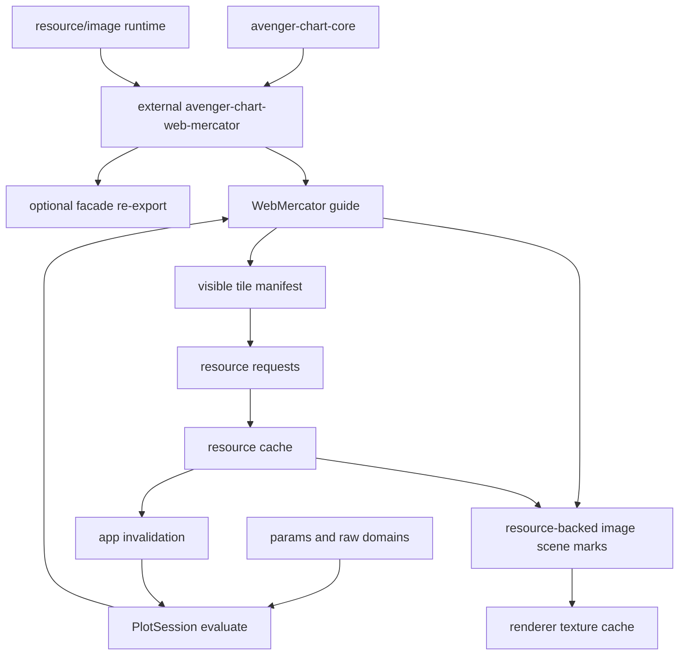

# Map Tiles As Coordinate Guides

## Status

Ready for design spike. The coordinate-system guide framing is clear, but the
runtime needs new generic async-resource primitives before map tiles should be
implemented.

## Goal

Support dynamic raster map tile underlays for a future `WebMercator`
coordinate system without making tiles a special case in the app, renderer, or
tool layers.

The intended authoring shape is a coordinate-guide option:

```rust
Plot::<WebMercator>::new()
    .guide(|g| {
        g.tile_underlay(
            RasterTileLayer::xyz("https://example.com/{z}/{x}/{y}.png")
                .tile_size(256)
                .max_zoom(19)
                .attribution("...")
        )
    })
    .tool(PanScrollZoom::web_mercator())
    .mark(...)
```

The tool manipulates coordinate domains. The coordinate guide observes the
current view, determines which tiles are visible, requests missing images, and
renders whichever tile resources are ready.

## External Crate Target

`WebMercator` and its tile underlay should be implemented in an external
coordinate crate, for example `avenger-chart-web-mercator`, not in the
`avenger-chart` facade.

That crate owns:

- `WebMercator`,
- `WebMercatorGuide`,
- longitude/latitude or projected Web Mercator position-channel helpers,
- Web Mercator transform and inversion behavior,
- tile layer specs such as `RasterTileLayer`,
- XYZ/TMS tile math and antimeridian wrapping,
- coordinate-specific guide rendering for tile underlays.

The crate should depend on `avenger-chart-core` and lower-level resource,
scenegraph, image, and projection utilities. It should not require
`avenger-chart`. The facade can re-export the crate for convenience, but tile
rendering should not rely on root-crate downcasts or special cases.

Any Web-Mercator-specific navigation tool should also be external or generic.
For example, `avenger-chart-web-mercator` can expose a helper tool that expands
to ordinary raw-domain params and event bindings, while the core tool system
only needs generic invertible-coordinate and sharing contracts.

Map tiles should share the same async runtime substrate as async rasterized
marks and async M4 lines, but they are resource requests rather than computed
data materializations. The common pieces are stable keys, nonblocking requests,
executor registration, cache states, completion invalidation, and renderer
resource lookup.

## Research Basis

Modern web map renderers separate source loading from rendering. Mapbox GL
style JSON represents raster maps as sources plus raster layers. A raster
source is configured by URL templates, tile size, bounds, min/max zoom, and
attribution. MapLibre exposes a `Source` interface with asynchronous
`loadTile`, `abortTile`, and `unloadTile` hooks, plus source data events that
notify the renderer when content changes.

The common OpenStreetMap/XYZ tile scheme maps projected Web Mercator space to
`z/x/y` tile identifiers. At zoom `z`, the world is divided into `2^z` tiles in
each direction. Standard raster tiles are commonly 256 pixels, with 512 pixel
retina variants also common.

Tile services also impose operational constraints. Public OSM-style services
require accurate identifying headers, attribution, respect for cache headers
and 429 responses, and avoidance of bulk scraping. Avenger should make these
policies possible to honor by supporting request throttling, cache policy, and
provider attribution.

References:

- [Mapbox raster source style spec](https://docs.mapbox.com/mapbox-gl-js/style-spec/sources/)
- [Mapbox raster tile example](https://docs.mapbox.com/mapbox-gl-js/example/map-tiles/)
- [MapLibre `Source` interface](https://maplibre.org/maplibre-gl-js/docs/API/interfaces/Source/)
- [OpenStreetMap Slippy map tilenames](https://wiki.openstreetmap.org/wiki/Slippy_map_tilenames)
- [OpenStreetMap US tile usage policy](https://tiles.openstreetmap.us/usage-policy/)

## Coordinate Guide Framing

Map tiles are coordinate-system context, not ordinary data marks. They should
behave like image-based guide chrome for a spatial coordinate system:

- tiles render below data marks and above the plot background,
- tiles clip to the plot area,
- tiles do not contribute to scale domains,
- tiles do not create legends,
- tiles are not datum-bearing selection targets by default,
- tile visibility follows the coordinate transform and current plot-area size,
- pan and zoom update the coordinate domains; tile selection follows from the
  new visible Web Mercator extent.

This keeps tile math in the coordinate crate. `WebMercator` owns projection,
tile zoom selection, wrap behavior at the antimeridian, and tile bounds. The
chart app and renderer only see generic resource-backed image scene marks.



## Required Generic Primitives

### 1. Resource Requests

Evaluation needs a way to declare resources it would like to have without
blocking evaluation.

```rust
pub struct ResourceRequest {
    pub key: ResourceKey,
    pub kind: ResourceKind,
    pub source: ResourceSource,
    pub priority: f32,
    pub cache_policy: ResourceCachePolicy,
}
```

For raster tiles, the key is stable across evaluations, such as
`tile_layer_id/z/x/y/scale`. The source is usually an HTTP URL after template
expansion. Other future uses could include remote images, icons, JSON data,
Parquet fragments, or vector tile payloads.

### 2. Resource Cache And Loader

`PlotSession` or the app runtime needs a resource cache with explicit states:

- `Missing`
- `Queued`
- `Loading`
- `Ready`
- `Error`
- optionally `Stale`

The cache should support max concurrency, priority updates, stale request
cancellation, memory limits, provider cache headers, and retry/backoff policy.
The cache should not be part of `CompiledPlot`; it is session/runtime state.

### 3. Resource Completion Invalidation

When a resource finishes loading, the app should request a redraw without user
input. Resource completion should coalesce so a burst of tile completions does
not cause one full chart evaluation per tile.

The invalidation should be narrow:

- if the scene contains resource-backed image marks whose geometry is already
  known, the renderer may only need to upload the newly ready image and redraw;
- if the guide wants to change fallback scene marks or tile opacity, the
  session may need a lightweight reevaluation.

### 4. Resource-Backed Scene Images

`SceneImageMark` currently stores decoded `RgbaImage` values. That is useful
for static images but too expensive for dynamic map tiles. The scenegraph
needs an image source representation with both inline and resource-backed
forms:

```rust
pub enum SceneImageSource {
    Inline(RgbaImage),
    Resource(ResourceKey),
}
```

The renderer resolves `ResourceKey` through the current resource cache. If the
image is not ready, the renderer skips the image or draws a configured
placeholder. The WGPU renderer should keep a texture cache keyed by
`ResourceKey` so pan/zoom redraws do not repeatedly upload unchanged tiles.

### 5. Async Image Fetching

`avenger-image` currently exposes synchronous URL-to-`RgbaImage` conversion.
Dynamic tiles need an async loading path:

- HTTP fetch with headers and cancellation,
- decode off the render path,
- support for PNG/JPEG/WebP as needed,
- provider attribution and cache metadata,
- wasm-compatible fetch support when targeting browsers.

Static image marks may keep the existing inline path. URL-backed image marks
should eventually migrate to the same resource pipeline so remote images do
not block chart evaluation.

### 6. Guide-Generated Resource Content

`CompiledGuide::evaluate` currently returns scene marks. It should be able to
also return resource requests, or write them into an evaluation resource
collector.

For map tiles, the guide-generated content is:

- a sorted tile manifest for the current extent,
- one resource request per missing or stale tile,
- one resource-backed `SceneImageMark` per visible tile,
- optional placeholder rects for missing/error tiles,
- attribution text or attribution metadata for app chrome.

This should remain a generic guide capability. Other coordinates may use it
for remote basemap layers, celestial image surveys, large tiled heatmap
rasters, or lazy-loaded geographic reference shapes.

### 7. View Context For Guides

The tile guide needs a stable context containing:

- plot-area width and height,
- configured coordinate scales and domains,
- current params,
- coordinate measurement,
- clipping bounds,
- device pixel ratio or tile pixel ratio when available,
- evaluation mode if tile strategy differs between Preview and Exact.

Most of this already flows through guide measurement/evaluation. The missing
piece is a formal resource collector and, possibly, device pixel ratio from the
host.

### 8. Runtime Store Patching From Resource Tasks

Stores are still useful for resource metadata but should not be the primary
decoded-image cache. The runtime should allow non-event tasks to patch stores
and request render. This lets an async resource task update a metadata store
such as:

```text
tile_key, z, x, y, x0, y0, x1, y1, status, error
```

This supports user-authored placeholder layers and debugging overlays without
placing image bytes in Arrow rows.

### 9. Coordinate Guide Layer Slots

Coordinate guides currently return scene marks as one guide result. Map tiles
need a first-class underlay slot so guide-generated tiles render below data
marks, while axes, gridlines, labels, and other guide chrome can keep their
existing ordering.

A future guide evaluation result should distinguish at least:

- plot-background or underlay marks,
- data-space guide marks that may render below data,
- ordinary guide chrome,
- optional overlay guide marks.

The tile layer should use the underlay/data-space guide slot. This is still a
generic guide capability: other coordinates could use it for reference rasters,
survey imagery, background grids, or projected map outlines.

### 10. Extensible Resource And Materialization Executors

Resource requests must be executable without `avenger-chart` matching on every
future resource kind. The resource layer should provide a registry keyed by
serializable resource kind or source type:

```rust
pub trait ResourceExecutor: Send + Sync {
    fn kind(&self) -> &'static str;
    async fn load(&self, request: ResourceRequest) -> Result<ResourceValue, ResourceError>;
}
```

Built-in executors can handle HTTP images and inline image refs. External
coordinate crates can use those generic executors for raster tiles or register
their own providers. The serialized chart should carry resource requests and
resource-source specs; the app/session supplies the executor registry and any
non-serialized runtime credentials.

This should align with the materialization executor registry used by external
data marks. A resource executor fetches or decodes external content. A
materialization executor computes derived content from chart data. Both are
nonblocking runtime services keyed by serializable specs.

## Tile Layer Behavior

### Zoom Selection

The guide should choose a discrete tile zoom from current Web Mercator scale
and device pixel ratio. It should support `min_zoom`, `max_zoom`, `round_zoom`,
and overscaling behavior. Overscaling means drawing a lower-zoom tile at a
higher screen resolution while higher-detail tiles are unavailable or outside
the provider limit.

### Placement

For each visible `z/x/y`, the guide computes the tile bounds in Web Mercator
domain coordinates, transforms those corners to plot pixels, and emits an
image mark covering that rectangle. The initial implementation can assume
axis-aligned Web Mercator tiles in an unrotated plot area.

### Fallbacks

Missing tiles should not block rendering. Acceptable fallback policies:

- transparent gap,
- neutral placeholder rect,
- lower-zoom parent tile,
- previously cached stale tile,
- fade-in when the new tile arrives.

The default should be conservative: render ready tiles, leave missing tiles
transparent, and optionally expose placeholder styling in the tile layer
config.

### Attribution

Tile layer config should carry attribution. Attribution can be rendered by the
coordinate guide or exposed to app chrome. It should not be optional for
providers that require it.

### Interaction

Raster tile underlays should be noninteractive by default. Pointer events
should continue to hit data marks and coordinate plot surfaces, not basemap
pixels. Future vector tile features may opt into hit testing, but that is a
separate feature from raster guide underlays.

## Public API Sketch

```rust
let basemap = RasterTileLayer::xyz("https://tile.openstreetmap.org/{z}/{x}/{y}.png")
    .id("osm_standard")
    .tile_size(256)
    .min_zoom(0)
    .max_zoom(19)
    .attribution("© OpenStreetMap contributors")
    .cache_policy(TileCachePolicy::http());

let plot = Plot::<WebMercator>::new()
    .guide(|g| g.tile_underlay(basemap))
    .tool(PanScrollZoom::web_mercator())
    .mark(
        Symbol::new()
            .longitude(col("lon"))
            .latitude(col("lat"))
            .fill(lit("#2563eb")),
    );
```

The guide API is convenient, but the implementation should lower to generic
resource primitives. A custom coordinate crate should be able to define its own
resource-backed guide content without depending on a tile-specific runtime.

## Foundational Utilities For External Coordinates

To make `WebMercator` genuinely external, the shared crates need these public
utilities:

- guide evaluation contexts that expose plot size, scale domains, params,
  device pixel ratio, and an evaluation resource collector;
- guide layer slots for underlays and overlays;
- resource-backed scene images in `avenger-scenegraph`;
- async image fetch/decode and cache primitives outside `avenger-chart`;
- an executor registry for resource requests emitted by external crates;
- projection/tile math helpers that can live in the external Web Mercator
  crate or a lower-level geography utility crate;
- a way for external coordinate crates to provide coordinate-specific
  interaction helpers without changing `avenger-chart-tools`;
- deterministic fixture resource resolvers for tests and visual baselines.

The root facade should only collect the generic guide/resource output and pass
it to the session/app/renderer. It should not know that a given resource came
from Web Mercator tiles.

## Unified Async Runtime Family

This plan is part of a broader family:

- this document: external coordinate guides that fetch image tiles,
- [async-rasterized-marks.md](async-rasterized-marks.md): external data marks
  that compute raster images from source data,
- [async-m4-lines.md](async-m4-lines.md): external data marks that compute
  sampled vector line data from source data.

The shared runtime should handle stable keys, executor registries, cache
states, completion invalidation, and renderer/app redraw. The chart facade
should not know which external crate emitted a given request.

## Why Not A Regular Image Mark Layer

A user-authored image mark layer can represent a static tiled image if the data
already contains all tile rows and decoded images. Dynamic map tiles need more:

- visible tile rows are derived from current coordinate view, not static data,
- images load asynchronously and may complete after evaluation,
- large decoded image buffers should not be embedded into the scenegraph every
  frame,
- renderer texture reuse matters for pan/zoom,
- request cancellation and provider cache policy matter,
- the layer is coordinate context, not data.

This is why the tile layer belongs in the coordinate guide while relying on
general resource-backed scene primitives.

## Implementation Phases

### Phase 1: Resource Model Spike

- Add `ResourceKey`, `ResourceRequest`, `ResourceKind`, `ResourceState`, and
  `ResourceCachePolicy`.
- Add an evaluation-side resource request collector.
- Return resource diagnostics from `PlotSession` metrics.
- Add tests proving evaluation can request missing resources without blocking.

### Phase 2: Resource-Backed Images

- Extend scenegraph image sources to support inline images and resource refs.
- Update WGPU image rendering to resolve resource refs.
- Add renderer texture caching keyed by resource key.
- Keep PNG/headless rendering deterministic by providing a resource resolver in
  test contexts.

### Phase 3: Async Image Loader

- Add async image fetch/decode in `avenger-image` or a new lower-level
  resource crate.
- Respect cache headers where available.
- Add request cancellation and concurrency limits.
- Add wasm-compatible fetch support if practical.

### Phase 4: Guide Resource Output

- Extend `CompiledGuide::evaluate` or its evaluation context with a resource
  collector.
- Allow guide-generated scene marks to reference resource keys.
- Add guide layer slots so resource-backed underlays render below data marks
  without special-casing tiles in plot rendering.
- Add unit tests with a synthetic coordinate guide that requests images and
  renders placeholders.

### Phase 5: External `WebMercator` Coordinate Spike

- Add an `avenger-chart-web-mercator` crate with `WebMercator` coordinate
  transforms for longitude/latitude or projected Web Mercator channels.
- Add pan/scroll-zoom support through raw domains.
- Add raster tile manifest calculation from current domain and plot size.
- Render ready resource-backed tiles under data marks.
- Prove the crate can be used without depending on the `avenger-chart` facade,
  then add optional facade re-exports.

### Phase 6: Tile Cache And Fallback Polish

- Add parent-tile fallback or stale tile fallback.
- Add optional fade-in.
- Add cache eviction metrics.
- Add attribution rendering or app-surface attribution metadata.

## Testing Plan

- Unit-test XYZ tile math against known lon/lat and tile coordinates.
- Unit-test visible tile enumeration across viewport edges and the
  antimeridian.
- Unit-test resource request deduplication across repeated evaluations.
- Unit-test cancellation or priority updates when pan/zoom changes the visible
  tile set.
- Unit-test that missing resources do not block evaluation and do not error.
- Add a deterministic fake resource loader for visual baselines.
- Add a WebMercator tile-underlay visual baseline with local fixture tiles.
- Add an interactive example that pans/zooms with slow artificial tile loading.
- Add metrics for requested, queued, loaded, errored, cache-hit, texture-hit,
  and stale-dropped resources.

## Open Design Questions

- Should resource cache ownership live in `PlotSession`, `avenger-chart-app`,
  or a lower-level `avenger-resource` crate shared by other apps?
- Should guide-generated resource requests force reevaluation on completion, or
  can the renderer update ready textures without rebuilding the scenegraph?
- Should attribution be scenegraph content, app chrome, or both?
- Should URL-backed ordinary `Image` marks migrate immediately to resource
  refs, or should static image marks keep the synchronous path until map tiles
  prove the resource layer?
- How should tile layers expose provider headers and auth tokens without making
  serialized `CompiledPlot` contain secrets?
- Should reusable projection math live in `avenger-chart-web-mercator` itself
  or in a lower-level crate intended for multiple geographic coordinates?
