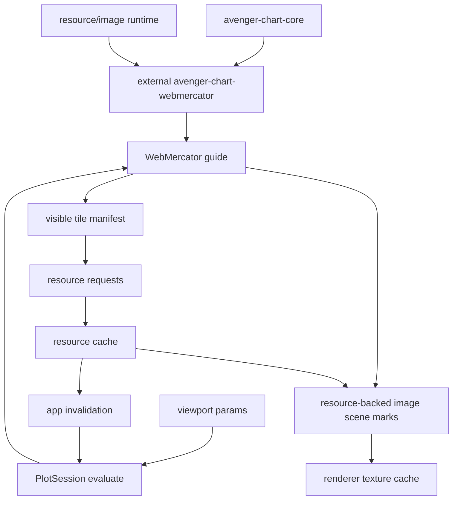

# Map Tiles As Coordinate Guides

## Status

Implemented. The design below was first realized in the external
`avenger-chart-webmercator` crate; that crate has since been retired and
replaced by `avenger-chart-geo`, whose `Geo` coordinate system carries
the same tile-layer surface generalized to arbitrary projections (tiles
render as warped textured meshes off-Mercator, and as plain image marks
on the Mercator identity fast path). See [`../geo.md`](../geo.md) for
the current authoring surface. The remainder of this document is the
original design discussion, retained for background; `WebMercator` reads
map to today's `Geo::mercator()`.

## Goal

Support dynamic raster map tile underlays for a future `WebMercator`
coordinate system without making tiles a special case in the app, renderer, or
tool layers.

The intended authoring shape is coordinate-owned tile configuration:

```rust
Plot::with_coord(
    WebMercator::new().tiles(
        RasterTileLayer::xyz("https://example.com/{z}/{x}/{y}.png")
            .tile_size(256)
            .max_zoom(19)
            .attribution("..."),
    ),
)
    .tool(WebMercatorPanZoom::new())
    .mark(...)
```

The tool manipulates coordinate-owned viewport params. The stateless coordinate
guide observes the realized view plus coordinate-owned tile-layer payload,
determines which tiles are visible, requests image resources, and emits
resource-backed image marks. A separate public `.guide(...)` configuration
surface is not part of the design.

## External Crate Target

`WebMercator` and its tile underlay live in an external coordinate crate named
`avenger-chart-webmercator`, not in the `avenger-chart` facade. Its Rust crate
name is `avenger_chart_webmercator`.

That crate owns:

- `WebMercator`,
- `WebMercatorGuide`,
- longitude/latitude or projected Web Mercator position-channel helpers,
- Web Mercator transform and inversion behavior,
- tile layer specs such as `RasterTileLayer`,
- XYZ/TMS tile math and antimeridian wrapping,
- coordinate-specific guide rendering for tile underlays.

The crate should depend on `avenger-chart-core` and lower-level resource,
scenegraph, image, and projection utilities. It should not require
`avenger-chart` outside tests, examples, and documentation. Tile rendering must
not rely on root-crate downcasts, facade re-exports, or WebMercator-specific
special cases.

Any Web-Mercator-specific navigation tool should also be external or generic.
For example, `avenger-chart-webmercator` can expose a helper tool that expands
to viewport params and event bindings, while the core tool system only needs
generic invertible-coordinate and sharing contracts.

Map tiles should share the same async runtime substrate as other resource-backed
content, but they are resource requests rather than computed data
materializations. The common pieces are stable keys, nonblocking requests,
cache states, completion invalidation, and renderer resource lookup.

## Research Basis

Modern web map renderers separate source loading from rendering. Mapbox GL
style JSON represents raster maps as sources plus raster layers. A raster
source is configured by URL templates, tile size, bounds, min/max zoom, and
attribution. MapLibre exposes a `Source` interface with asynchronous
`loadTile`, `abortTile`, and `unloadTile` hooks, plus source data events that
notify the renderer when content changes.

The common OpenStreetMap/XYZ tile scheme maps projected Web Mercator space to
`z/x/y` tile identifiers. At zoom `z`, the world is divided into `2^z` tiles in
each direction. Standard raster tiles are commonly 256 pixels, with 512 pixel
retina variants also common.

Tile services also impose operational constraints. Public OSM-style services
require accurate identifying headers, attribution, respect for cache headers
and 429 responses, and avoidance of bulk scraping. Avenger should make these
policies possible to honor by supporting request throttling, cache policy, and
provider attribution.

References:

- [Mapbox raster source style spec](https://docs.mapbox.com/mapbox-gl-js/style-spec/sources/)
- [Mapbox raster tile example](https://docs.mapbox.com/mapbox-gl-js/example/map-tiles/)
- [MapLibre `Source` interface](https://maplibre.org/maplibre-gl-js/docs/API/interfaces/Source/)
- [OpenStreetMap Slippy map tilenames](https://wiki.openstreetmap.org/wiki/Slippy_map_tilenames)
- [OpenStreetMap US tile usage policy](https://tiles.openstreetmap.us/usage-policy/)

## Coordinate Guide Framing

Map tiles are coordinate-system context, not ordinary data marks. They should
behave like image-based guide chrome for a spatial coordinate system:

- tiles render below data marks and above the plot background,
- tiles clip to the plot area,
- tiles do not contribute to scale domains,
- tiles do not create legends,
- tiles are not datum-bearing selection targets by default,
- tile visibility follows the coordinate transform and current plot-area size,
- pan and zoom update coordinate-owned viewport params; tile selection follows
  from the new visible Web Mercator extent.

This keeps tile math in the coordinate crate. `WebMercator` owns projection,
tile zoom selection, wrap behavior at the antimeridian, and tile bounds. The
chart app and renderer only see generic resource-backed image scene marks.



## Current Generic Substrate

The Web Mercator crate can now build on these generic pieces:

- `ResourceRequest`/`ResourceKey` and image resource kind live outside
  `avenger-chart`.
- `SceneImageSource::Resource` lets scenegraph images refer to stable resource
  keys instead of decoded image bytes.
- `ImageResourceCache` owns loading/cache state and can request render
  invalidation when a resource becomes ready or failed.
- WGPU can draw placeholders for unresolved image resources and reuse uploaded
  textures across redraws.
- chart SVG/PDF/static export can resolve image resource requests, inline ready
  images into a temporary scenegraph, and render deterministic output.
- winit and egui hosts can subscribe to render invalidations and redraw even
  when the user is idle.
- `CompiledGuide::evaluate(..., GuideRenderContext)` gives coordinate guides
  plot size and a resource request sink.

For raster tiles, `WebMercator` stores tile-layer configuration, the coordinate
measurement carries that payload together with the realized viewport, and the
stateless guide renders from the measurement. The guide should create stable
keys such as `tile_layer_id/z/x/y/scale`, expand the URL template into an image
`ResourceRequest`, and emit one resource-backed `SceneImageMark` per visible
tile.

## Remaining Generic Gaps

These gaps are useful to track, but they should not block
`avenger-chart-webmercator`:

- guide layer slots for a formal underlay/overlay split;
- device pixel ratio in guide evaluation context for sharper tile zoom choice;
- richer image cache policy knobs for HTTP cache headers, concurrency,
  retry/backoff, and provider-specific headers;
- optional resource metadata stores for debugging overlays or user-authored
  placeholder layers;
- a future executor registry if non-image resource kinds need to be loaded by
  external crates.

The implementation can use ordinary guide scene marks with an under-data
z-index, the built-in image cache, and explicit tile attribution marks.

## Tile Layer Behavior

### Zoom Selection

The guide should choose a discrete tile zoom from current Web Mercator scale
and device pixel ratio. It should support `min_zoom`, `max_zoom`, `round_zoom`,
and overscaling behavior. Overscaling means drawing a lower-zoom tile at a
higher screen resolution while higher-detail tiles are unavailable or outside
the provider limit.

### Placement

For each visible `z/x/y`, the guide computes the tile bounds in Web Mercator
domain coordinates, transforms those corners to plot pixels, and emits an
image mark covering that rectangle. Web Mercator starts with axis-aligned tiles
in an unrotated plot area.

### Fallbacks

Missing tiles should not block rendering. Acceptable fallback policies:

- transparent gap,
- neutral placeholder rect,
- lower-zoom parent tile,
- previously cached stale tile,
- fade-in when the new tile arrives.

The default should be conservative: render ready tiles, leave missing tiles
transparent, and optionally expose placeholder styling in the tile layer
config.

### Attribution

Tile layer config should carry attribution. Attribution can be rendered by the
coordinate guide or exposed to app chrome. It should not be optional for
providers that require it.

### Interaction

Raster tile underlays should be noninteractive by default. Pointer events
should continue to hit data marks and coordinate plot surfaces, not basemap
pixels. Future vector tile features may opt into hit testing, but that is a
separate feature from raster guide underlays.

## Public API Sketch

```rust
let basemap = RasterTileLayer::xyz("https://tile.openstreetmap.org/{z}/{x}/{y}.png")
    .id("osm_standard")
    .tile_size(256)
    .min_zoom(0)
    .max_zoom(19)
    .attribution("© OpenStreetMap contributors")
    .cache_policy(TileCachePolicy::http());

let plot = Plot::with_coord(WebMercator::new().tiles(basemap))
    .tool(WebMercatorPanZoom::new())
    .mark(
        Symbol::new()
            .longitude(col("lon"))
            .latitude(col("lat"))
            .fill(lit("#2563eb")),
    );
```

The coordinate configuration is the public API. Internally, `WebMercator`
copies tile-layer configuration into `WebMercatorCoordMeasurement`, and
`WebMercatorGuide` lowers the realized visible tiles to generic resource-backed
image marks. A custom coordinate crate should be able to define its own
resource-backed guide content without depending on a tile-specific runtime.

## Crate And Utility Boundary

`avenger-chart-webmercator` should be genuinely external. It should depend on
public lower-level crates, not on root-crate special cases:

- coordinate traits, guide traits, domain-provider traits, params, and scale
  metadata from `avenger-chart-core`;
- mark definitions from `avenger-chart-marks`;
- resource keys/requests/invalidation from `avenger-resource`;
- image resource loading/cache helpers from `avenger-image`;
- scene image resource marks from `avenger-scenegraph`;
- projection and tile math owned by the Web Mercator crate itself.

The root facade should only pass generic guide/resource output to the
session/app/renderer. It should not know that a given resource came from Web
Mercator tiles.

## Unified Async Runtime Family

This plan is part of a broader family:

- this document: external coordinate guides that fetch image tiles,
- [async-rasterized-marks.md](async-rasterized-marks.md): external data marks
  that compute raster images from source data,
- [async-m4-lines.md](async-m4-lines.md): external data marks that compute
  sampled vector line data from source data.

The shared runtime should handle stable keys, cache states, completion
invalidation, and renderer/app redraw. Future executor registries may be useful
for non-image resource kinds, but raster tiles can start with the existing image
resource path. The chart facade should not know which external crate emitted a
given request.

## Why Not A Regular Image Mark Layer

A user-authored image mark layer can represent a static tiled image if the data
already contains all tile rows and decoded images. Dynamic map tiles need more:

- visible tile rows are derived from current coordinate view, not static data,
- images load asynchronously and may complete after evaluation,
- large decoded image buffers should not be embedded into the scenegraph every
  frame,
- renderer texture reuse matters for pan/zoom,
- request cancellation and provider cache policy matter,
- the layer is coordinate context, not data.

This is why the tile layer belongs in the coordinate guide while relying on
general resource-backed scene primitives.

## Implementation Phases

See `scratch/web-mercator-coordinate-implementation-plan.md` for the current
checklist. At a high level:

### Phase 0: External Crate

- Add `avenger-chart-webmercator` as a workspace member with Rust crate name
  `avenger_chart_webmercator`.
- Keep `avenger-chart` as a dev-dependency only.

### Phase 1: Projection And Coordinate

- Add EPSG:3857 projection/inverse helpers and coordinate skeleton.
- Use projected x/y meters internally; longitude/latitude authoring lowers to
  projected x/y.

### Phase 2: Viewport Domain Provider

- Implement coordinate-owned `center_x`, `center_y`, and `units_per_pixel`
  realization through `CoordinateDomainProvider`.
- Infer center/zoom from symbols when not authored, and infer zoom around an
  authored center when only center is provided.

### Phase 3: Marks, Tiles, And Tools

- Implement `Symbol<WebMercator>`.
- Add coordinate-owned `RasterTileLayer` configuration and guide-generated
  resource-backed image marks.
- Add `WebMercatorPanZoom` that edits viewport params, not raw scale domains.
- Add viewport-aspect Web Mercator box zoom.

### Phase 4: Containers, Export, And Baselines

- Validate facet/repeat shared viewport behavior through the generic
  coordinate-domain group solver.
- Keep SVG/PDF/static export tests passing with deterministic tile resources.
- Add WGPU baselines for symbols, tile underlays, placeholders, ready resources,
  attribution, and shared/free viewport containers.

## Testing Plan

- Unit-test XYZ tile math against known lon/lat and tile coordinates.
- Unit-test visible tile enumeration across viewport edges and the
  antimeridian.
- Unit-test resource request deduplication across repeated evaluations.
- Unit-test cancellation or priority updates when pan/zoom changes the visible
  tile set.
- Unit-test that missing resources do not block evaluation and do not error.
- Add a deterministic fake resource loader for visual baselines.
- Add a WebMercator tile-underlay visual baseline with local fixture tiles.
- Add an interactive example that pans/zooms with slow artificial tile loading.
- Add metrics for requested, queued, loaded, errored, cache-hit, texture-hit,
  and stale-dropped resources.

## Decisions And Remaining Questions

- Resource cache ownership should stay in the lower-level resource/image stack,
  with chart apps wiring requests to the resolver.
- Guide-generated image requests do not need to force reevaluation on completion;
  renderer/app invalidation is enough when geometry is unchanged.
- URL-backed ordinary `Image` marks do not need to migrate immediately beyond
  the current resource-image path used by app examples and export resolution.
- Attribution should be supported as scenegraph content first; app-chrome
  attribution metadata can be added later if needed.
- Provider headers and auth tokens still need a runtime-only configuration
  story that does not serialize secrets into compiled plots.
- Projection and tile math should start in `avenger-chart-webmercator`. A lower
  geography utility crate can be split out only after another coordinate system
  wants the same math.
