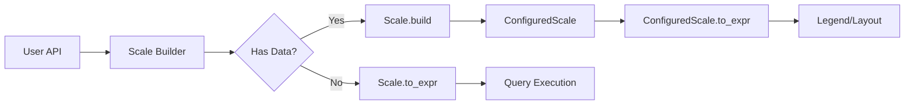

# Scale.to_expr() Migration Analysis Report

## Executive Summary

The `Scale.to_expr()` method is marked as deprecated but cannot be easily removed due to fundamental architectural differences between the `Scale` and `ConfiguredScale` systems. This report analyzes the technical debt, identifies specific blockers, and proposes a path forward.

**Key Finding**: The dual scale system represents two distinct phases of the visualization pipeline—expression compilation vs. data transformation—and both are necessary for the current architecture.

## Current Architecture Overview

### The Dual Scale System

The avenger-chart codebase maintains two parallel scale representations:

1. **`Scale` (avenger-chart)**: A builder-pattern struct that works with DataFusion expressions
2. **`ConfiguredScale` (avenger-scales)**: An execution-ready struct that works with resolved Arrow arrays

```rust
// Scale - Expression-based
pub struct Scale {
    pub scale_impl: Arc<dyn ScaleImpl>,
    pub domain: ScaleDomain,              // Can contain Expr references to data
    pub range: ScaleRange,                // Can contain Expr references  
    pub options: HashMap<String, Expr>,   // DataFusion expressions
}

// ConfiguredScale - Array-based
pub struct ConfiguredScale {
    pub scale_impl: Arc<dyn ScaleImpl>,
    pub config: ScaleConfig {
        domain: ArrayRef,                  // Resolved Arrow array
        range: ArrayRef,                   // Resolved Arrow array
        options: HashMap<String, Scalar>,  // Resolved scalar values
    }
}
```

### Current Usage Patterns

#### Scale.to_expr() Usage (5 locations)
1. **render.rs:864** - Mark rendering pipeline
2. **plot.rs:691** - Channel value processing
3. **Scale struct:314** - The deprecated implementation

#### ConfiguredScale.to_expr() Usage (via extension trait)
1. **extensions.rs:67-143** - Legend generation
2. **chart_layout.rs** - Layout calculations
3. **render.rs** (indirectly) - After scale resolution

## Migration Blockers

### 1. Expression vs. Array Paradigm

**Blocker**: `Scale.to_expr()` compiles DataFusion expressions that can reference data columns at runtime, while `ConfiguredScale.to_expr()` operates on pre-resolved data.

```rust
// Scale.to_expr() - Compiles expressions
let domain_expr = self.compile_domain()?;     // col("category")
let range_expr = self.compile_range()?;       // [lit(0), lit(100)]
let udf = create_scale_udf(...);
udf.call(vec![domain_expr, range_expr, options_expr, values])

// ConfiguredScale.to_expr() - Uses resolved arrays
let domain_scalar = array_to_list_scalar(["A", "B", "C"])?;
let range_scalar = array_to_list_scalar([0.0, 50.0, 100.0])?;
udf.call(vec![lit(domain_scalar), lit(range_scalar), ...])
```

### 2. Data Resolution Timing

**Blocker**: The two systems operate at different phases of the pipeline:

| Phase | System | Purpose |
|-------|--------|---------|
| Query Planning | Scale | Build expressions that reference data columns |
| Domain Inference | Scale → ConfiguredScale | Resolve domains from actual data |
| Execution | ConfiguredScale | Transform concrete values |

### 3. Mark Rendering Dependencies

**Blocker**: The mark rendering pipeline in `render.rs` specifically requires:

```rust
// render.rs:858-865
if let Some(scale) = self.scales.get(channel_name) {
    // Needs Scale object to create expressions that reference data
    let scale_expr = scale.to_expr(field_value.clone())?;
    field = field.with_value(scale_expr);
}
```

This cannot use `ConfiguredScale` because:
- The domain might not be resolved yet
- The expression needs to reference data columns dynamically
- The scale might have data-dependent domains (`domain_data_field`)

### 4. Coordinate System Integration

**Blocker**: Coordinate systems (coords.rs:245-280) require Scale objects for:
- Axis generation with `get_scale_type()`
- Creating fresh ConfiguredScale instances
- Accessing builder methods for dynamic configuration

### 5. Channel Resolution Dependencies

**Blocker**: The channel resolution system (`plot.rs:685-695`) needs to:
- Apply scales to expressions before data is available
- Handle identity transformations
- Support column references that will be resolved later

## Why Simple Migration Fails

### Attempt 1: Direct Replacement
```rust
// ❌ This doesn't work
let configured_scale = scale.build(...).await?;
let expr = configured_scale.to_expr(values)?;
```
**Problem**: Requires resolving data before building expressions, but expressions need to be built before data is available.

### Attempt 2: Lazy Resolution
```rust
// ❌ This doesn't work either  
let expr = scale.to_lazy_configured_expr(values)?;
```
**Problem**: Would require ConfiguredScale to handle unresolved domains, defeating its purpose as a resolved, execution-ready structure.

### Attempt 3: Unified Interface
```rust
// ❌ This violates separation of concerns
trait ScaleExpr {
    fn to_expr(&self, values: Expr) -> Result<Expr>;
}
```
**Problem**: Forces avenger-scales to depend on DataFusion, breaking the clean separation between crates.

## Architectural Insights

### The Pipeline Requires Both Systems

The current architecture isn't accidental—it represents a deliberate separation of concerns:



### Design Principles

1. **Scale**: Handles the "what" - what transformation should be applied
2. **ConfiguredScale**: Handles the "how" - how to execute the transformation
3. **Separation**: Keeps avenger-scales pure (no DataFusion dependency)

## Recommendations

### Short-term (Current Sprint)

1. **Remove the deprecated marker** from `Scale.to_expr()`
2. **Document the dual system** explicitly in code comments
3. **Add architectural decision record (ADR)** explaining why both exist

### Medium-term (Next Quarter)

1. **Create a facade pattern** to hide the complexity:
```rust
pub enum ScaleExpression {
    Unresolved(Scale),
    Resolved(ConfiguredScale),
}

impl ScaleExpression {
    pub fn to_expr(&self, values: Expr) -> Result<Expr> {
        match self {
            Self::Unresolved(s) => s.to_expr(values),
            Self::Resolved(c) => c.to_expr(values),
        }
    }
}
```

2. **Standardize the migration path**:
```rust
// Clear API for when to use which
impl Scale {
    /// Use for mark rendering and query planning
    pub fn to_planning_expr(&self, values: Expr) -> Result<Expr>
    
    /// Use after domain resolution
    pub async fn to_execution_expr(&self, values: Expr) -> Result<Expr>
}
```

### Long-term (Future Architecture)

Consider a three-tier architecture:

1. **ScaleSpec** - Pure specification (JSON-serializable)
2. **ScaleBuilder** - Expression-based builder (current Scale)
3. **ScaleExecutor** - Array-based executor (current ConfiguredScale)

This would make the phases explicit and allow for better testing and modularity.

## Conclusion

The `Scale.to_expr()` deprecation cannot be completed without significant architectural changes. The dual system represents a fundamental design decision that separates expression compilation from data transformation. Rather than forcing migration, we should:

1. Embrace the dual system as intentional architecture
2. Improve documentation and APIs to make the distinction clear
3. Consider longer-term refactoring only if it provides clear benefits

The technical debt here is not in having two systems, but in not clearly documenting why both are necessary.

## Appendix: Specific Usage Analysis

### Files Still Using Scale.to_expr()

| File | Line | Context | Can Migrate? |
|------|------|---------|--------------|
| render.rs | 864 | Mark rendering with data columns | No - needs expressions |
| plot.rs | 691 | Channel processing | No - pre-data resolution |
| scale.rs | 314 | The implementation itself | N/A |

### Files Using ConfiguredScale.to_expr()

| File | Line | Context | 
|------|------|---------|
| extensions.rs | 67-143 | Legend generation |
| chart_layout.rs | Various | Layout calculations |

### Data Flow Diagram

```
[User Code]
    |
    v
[Plot Builder API]
    |
    ├──> [Scale Builders] ──> [Scale.to_expr()] ──> [Query Planning]
    |                                                        |
    |                                                        v
    |                                                  [Data Execution]
    |                                                        |
    └──> [Domain Inference] <───────────────────────────────┘
              |
              v
        [ConfiguredScale]
              |
              ├──> [ConfiguredScale.to_expr()] ──> [Legends]
              |
              └──> [Axis Rendering]
```

---

*Report generated: 2025-08-18*  
*Author: Analysis performed via architectural code review*