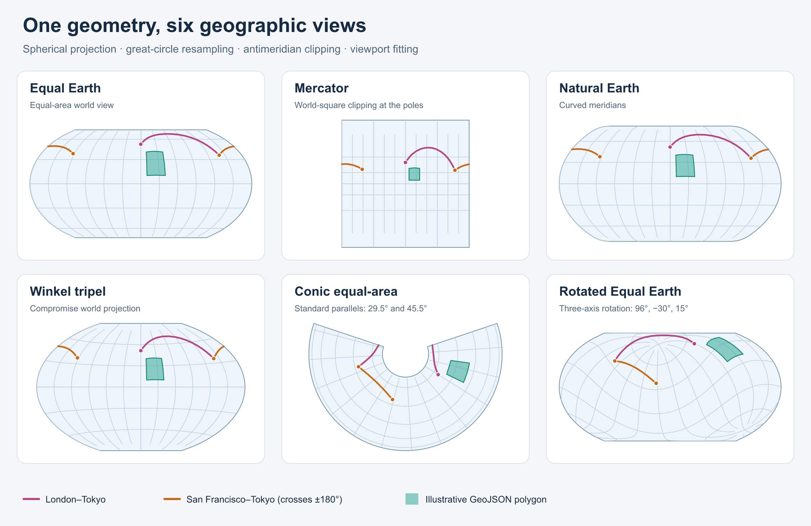

# avenger-geo

Project geographic geometry into paths or polylines without a chart, data
engine, or renderer. The crate runs on native targets and WebAssembly.

`Projection` composes rotation, antimeridian clipping, adaptive great-circle
resampling, and rectangular clipping. The catalog contains Equal Earth,
Natural Earth, Mercator, equirectangular, Winkel tripel, two conic projections,
and planar identity. `BlendRaw` interpolates projections; anchoring helpers
keep a selected location and its local north direction stable.

```rust
use avenger_geo::{LyonPathSink, Projection, ProjectionKind, Sphere};

let mut projection = Projection::new(ProjectionKind::EqualEarth);
projection.fit_size([640.0, 360.0], &Sphere).unwrap();
let projector = projection.build();
let mut sink = LyonPathSink::fill();
projector.stream(&Sphere, &mut sink);
let outline = sink.finish();
```

Spherical coordinates enter the pipeline as longitude/latitude **degrees**.
Raw projections use radians and produce y-up planar units. Display coordinates
are y-down. Planar identity preserves input coordinates at unit scale and zero
translation; `reflect_y: true` flips their y axis.

`Projector::project` projects individual points without clipping.
`Projector::stream` applies clipping to complete geometry. Use point projection
for markers and apply your viewport visibility test before drawing them.
`LyonPathSink` and `PolylineSink` consume lines; isolated points are ignored.

`fit_extent` and `fit_size` return an error for empty, non-finite, or
point-sized bounds and leave the configuration unchanged. Horizontal and
vertical lines can be fitted. `Graticule::try_lines` checks configuration and
limits its vertex estimate to one million; `lines` panics on the same errors.

`ingest::geojson_to_features` produces ISO WKB, recomputed bounds, and JSON
properties. It reverses RFC 7946 polygon winding to the d3 convention using
planar signed area. Use `Streamable` directly for geometry that already has
spherical winding, including polar caps. Direct polygon rings must be closed;
the stream omits their duplicated closing vertex.

Projection blending can introduce singularities. Its numerical inverse can
return `None`. The built-in pipeline cuts at the antimeridian; it does not
implement spherical cap clipping or an orthographic projection.

## Example and verification

```sh
cargo run --release -p avenger-geo --example projection_gallery
cargo test --release -p avenger-geo --all-targets
cargo test --release -p avenger-geo --doc
cargo check --release --target wasm32-unknown-unknown -p avenger-geo --lib
```

The example writes SVG and PNG files to `target/geo-gallery`. An optional
output directory is accepted as its first argument. PNG labels use installed
system fonts. The runtime crate has no font or rasterizer dependency.



Twenty-two fixtures compare projections, inverses, streamed geometry, bounds,
and fitting with d3-geo. See [UPSTREAM.md](UPSTREAM.md) for source attribution
and fixture regeneration instructions.
