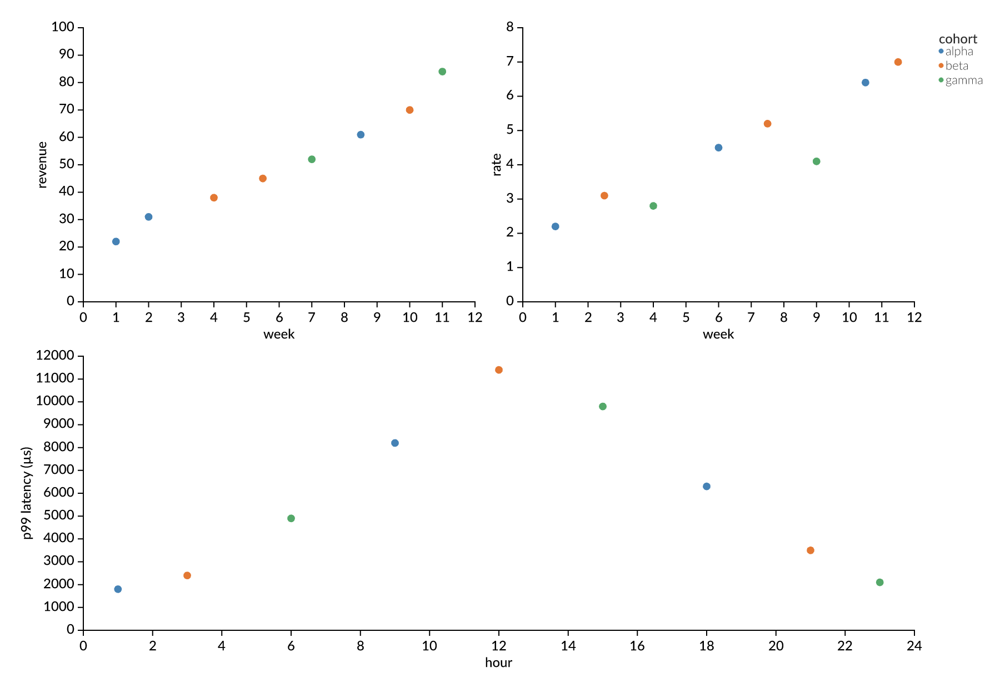

# avenger-layout

Arrange measured rectangles in nested rows, columns, and grids. Reserve room
for labels, legends, titles, and margins while keeping content rectangles
aligned. The runtime library has **no dependencies** and builds for native
targets and WebAssembly.

```rust
use avenger_layout::{EdgeDemand, Layout, Side, Size, SolveOptions};

let plot: Layout<&str> = Layout::leaf(Size::new(320.0, 220.0))
    .id("plot")
    .demand(Side::Left, EdgeDemand { guide: 48.0, legend: 0.0 });
let page = Layout::row([plot]).margin(12.0);
let solved = page.solve(&SolveOptions::default()).unwrap();
let plot_rect = solved.region(&"plot").unwrap().content;
```

## Layout model

A leaf supplies a measured content size and optional edge demands. A grid
arranges children in slots, including spans and empty cells. Grids accept
fixed, automatic, and weighted tracks, plus alignment and spacing policies.
A share key coordinates compatible grids in different parts of the tree.
Incompatible share groups are reported in solution diagnostics.

Each node can also declare edge reservations: margins, repeated strips,
guides, and legends. The solution includes their positioned rectangles.
`SolveFor` selects whether the solver derives content size, outer size, or
flexible margins. Width and height can use different modes.

`Region::slot` is the space allocated to a node. `Region::content` is its
measured or solved content rectangle inside that space. A fixed track can be
smaller than its content. Layout reports that overflow and does not clip it.
Neighboring edge demands contribute to the gap between tracks. Guide and
legend demands coordinate separately. Margins and strips reserve private
space around their node.

`Layout::solve` rejects invalid grid slots, duplicate IDs, non-finite input
values, and arithmetic that overflows the coordinate range. The low-level
`GridRequirements` interface assumes finite measurements and internally
consistent vectors when callers construct or modify its public fields.

## Measurement and rendering

The solver consumes sizes and returns rectangles. The caller supplies text
measurement, scales, scene construction, and rendering. If labels or wrapping
depend on allocated size, remeasure at the new slots and solve again.
`LayoutSolution::content_delta` compares leaf slot sizes between solutions.
Set a tolerance and iteration limit appropriate for the application.

The chart-grid example measures axes and a legend with `avenger-guides`,
repeats layout until allocations settle, maps points with `avenger-scales`,
and renders with `avenger-wgpu`. One `avenger-text` engine is shared by guide
measurement and rendering. These crates are development dependencies only.

```sh
cargo run --release -p avenger-layout --example chart_grid
cargo test --release -p avenger-layout --all-targets
cargo check --release --target wasm32-unknown-unknown -p avenger-layout --lib
```

The example writes `target/layout-gallery/chart-grid.png`. Pass a different
output path as the first argument after `--`.



`LayoutSolution::to_svg` draws layout diagnostics without a renderer dependency.
The [SVG baseline gallery](tests/baselines/README.md) contains 23 examples of
spacing, overflow, edge reservations, shared tracks, and nested layout.

This crate does not group data, determine facet domains, or choose which axes
to show. Those decisions belong to its consumers.
