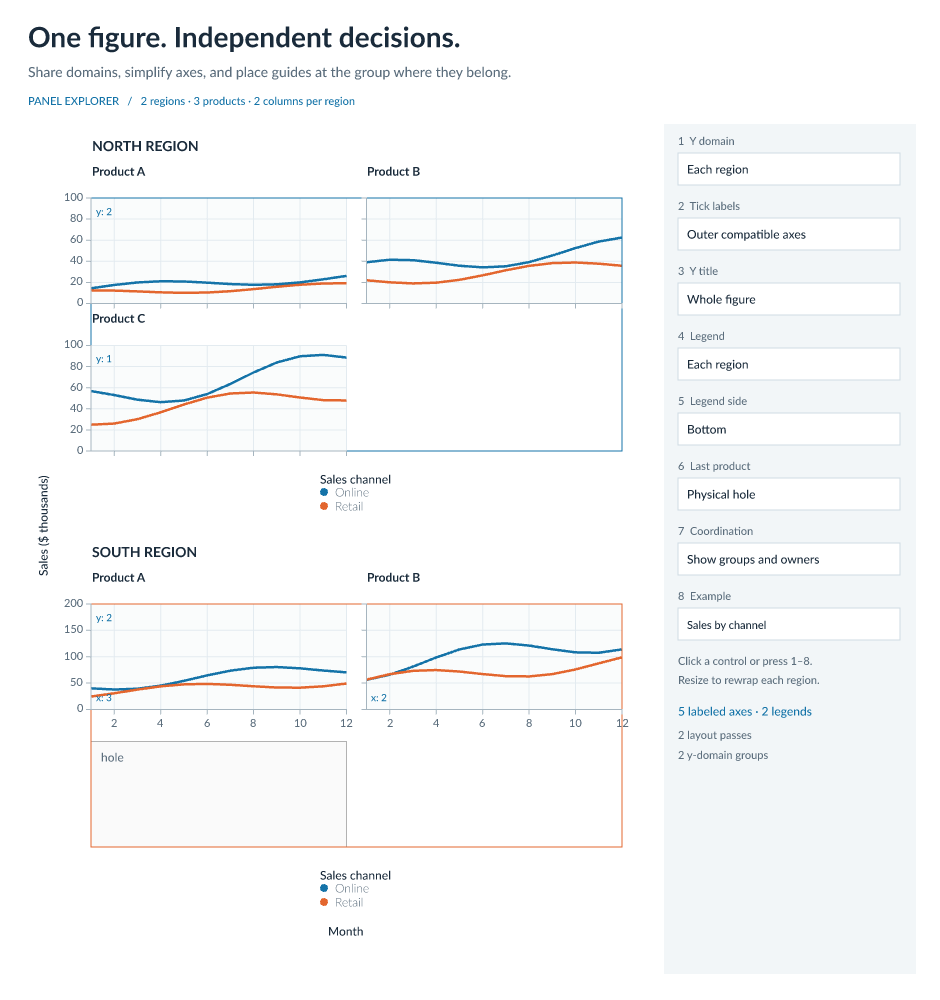

# avenger-panels

Panel hierarchy, sharing policies, and guide placement for visualizations with multiple panels. The crate depends on `avenger-layout`. Applications supply data, scale domains, guide content, measurement, and rendering.


## Three operations

`PanelTree::group` partitions an explicit set of panel IDs by logical scope. Use its result to aggregate domains or coordinate another resource. The result contains anchors and participants, with no assumptions about scale types or domain reducers.

`PanelTree::arrange` assigns direct children to rows, columns, wraps, or explicit grid slots. Physical wrap rows never add logical sharing levels. `PanelDisplay::Hole` preserves a slot while excluding its panel from guide presentation. A shown panel with no data remains eligible for guides.

`PanelTree::plan_guides` reads solved plot rectangles and typed requests. It returns guide instances and a decision for every submitted contribution. A decision either identifies a representing instance or explains why the contribution is hidden.

```rust
use avenger_panels::{PanelNode, PanelTree, Scope};

let tree = PanelTree::new("figure".into(), [
    PanelNode::group("north", [PanelNode::panel("north-a"), PanelNode::panel("north-b")]),
    PanelNode::group("south", [PanelNode::panel("south-a"), PanelNode::panel("south-b")]),
])?;
let domains = tree.group(tree.panels().cloned(), Scope::ancestor(1)?)?;
assert_eq!(domains.iter().count(), 2);
```

## Scope and identity

`PanelId` and `GroupId` are distinct caller-assigned identities. Stable IDs preserve logical membership across a resize or reorder. Child order determines default physical placement and grouping iteration order.

| Scope | Anchor |
|---|---|
| `Scope::Panel` | The participating panel |
| `Scope::ancestor(1)?` | Its immediate logical parent |
| `Scope::ancestor(n)?` | Exactly n parent links above it |
| `Scope::Root` | The tree root |
| `Scope::Group(id)` | An explicit ancestor group |

Zero or excessive ancestor depths, unknown IDs, and non-ancestor group references return `PanelError`. Scope applies only to supplied participants. Each resource or guide request chooses its own scope. Callers resolve policy inheritance before making requests.

## Guide content and placement

`AxisLabels` has `All`, `Outer`, and `None` visibility policies. The default is `All`. `Outer` suppresses labels only when an aligned visible instance can represent them. Incompatible content, an intervening unrelated panel, overlapping plots, or unequal spans keep affected labels visible. Holes allow the edge owner to move to the next eligible panel. Axis lines, tick marks, and grid lines remain independent.

`SharedGuide` places an axis title, header, or legend once per scope group. The instance exposes both its source panel and its placement anchor. A region legend can use content from its first panel while aligning to the whole region. Source selection uses stable ID ordering and does not depend on which side contains the guide.

Each `GuideContribution` can carry an `EquivalenceKey`. The caller certifies that matching keys describe interchangeable content for that family. Label evidence covers units, transforms, tick values, formatting, and positions normalized against the plot rectangle. Legend evidence covers entries, order, title, and visual mappings. Equal numeric bounds alone are insufficient. Missing evidence keeps local labels visible. Several unverified or incompatible contributions requested as one shared guide return an error.

```rust
use avenger_panels::{GuideContribution, SharedGuide, SharedGuideKind, Side, Scope};

let title = SharedGuide::new(
    "y-title".into(), SharedGuideKind::AxisTitle, Side::Left, Scope::Root,
    ["north-a", "north-b", "south-a", "south-b"].map(|id| {
        GuideContribution::new(id.into()).equivalent("Revenue in dollars".into())
    }),
);
```

## Layout lifecycle

Build a logical tree and aggregate domains from its groups. Resolve concrete wrap columns and grid slots, then construct an `avenger-layout::Layout`. Register each logical node at its actual plot or group content rectangle. `PanelFrames::from_layout` reads those regions, including invisible nodes for retained holes. Another geometry producer can use the checked direct frame constructor.

Prepare an initial layout with labels present. Construct ticks and equivalence keys for its plot sizes, then plan and measure guides. Reserve the measured space and solve again. The caller repeats until geometry, content, and guide decisions settle. The demo uses a bounded loop and an all-label fallback. It reports failure if the fallback also fails to settle.

Shared guides reserve space at their anchor once. Aggregate multiple guides on the same side before calling `Layout::guide` or `Layout::legend`, because those setters replace their prior values. Contained group boxes also need clearance for their children's exterior guides before placing their own headers or titles. The demo's measurement and layout mapping show this boundary explicitly.

The planner uses actual plot content extents for alignment. Domain sharing does not implicitly enable `Layout::share`. Alignment tolerance defaults to exact endpoint matching, and every suppressed contribution must match its representative directly. Placement uses an anchor's full content edge. Arbitrary interior placements and merged axes across unequal spans are outside the initial API.

## Demo and verification

The [small-multiples explorer](../examples/winit-panels/README.md) runs natively and in the browser with the same scene builder. It includes independent domains, equal bounds with different units, a physical-hole toggle, and a coordination overlay.



```sh
cargo test --release -p avenger-panels -p winit-panels
cargo clippy --release -p avenger-panels -p winit-panels --all-targets -- -D warnings
```

Public tests cover scopes, identity, arrangement validation, direct and layout-derived frames, guide equivalence, blockers, tolerance, deterministic sources, and every hole pattern in a six-panel grid on all four sides.
