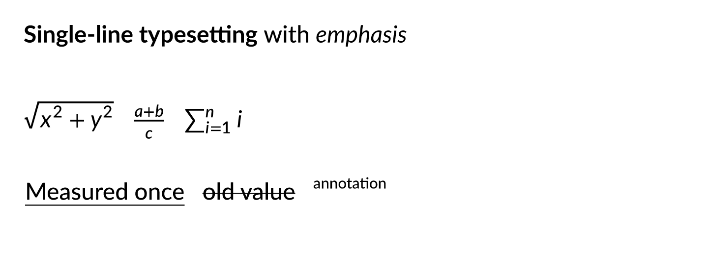

# avenger-typst-label

`avenger-typst-label` is a lightweight adaptation of Typst for making labels. It
implements the subset of Typst behavior needed for compact single-line labels,
including regular text, inline math, emoji, simple text markup, SVG/PDF-friendly
metadata, and raster output.

The implementation is owned by this crate, but the syntax and layout behavior
should stay Typst-shaped. Parser and parser-support modules copied or mirrored
from upstream Typst live in private `src/typst_syntax`, `src/typst_timing`, and
`src/typst_utils` modules. Upstream-like implementation modules use `typst_*`
names; the Avenger-owned public facade lives in `src/label`. Public callers see
only label frames and output artifacts, not Typst parser or document types.

## Kept Functionality

The crate keeps the parts of Typst that are useful for compact labels:

- Single-line text layout with font fallback, shaping, bidi support, script
  segmentation, emoji, and explicit font weight/style selection.
- `$...$` math spans inside text lines, using Typst syntax and escaping rules for
  literal dollar signs and other markup characters.
- Strict Typst-like math fragments for identifiers, numbers, operators,
  grouping, shorthand symbols, string literals, scripts, primes, fractions,
  roots, binomial-style calls, accents, cancellation, common functions, and
  operator-sized constructs such as sums.
- Explicit math size calls such as `display(...)` inside a single-line math
  label, including display-style large operator variants and Typst's default
  limit placement rules.
- A small text-markup subset outside math, including case transforms,
  underline/overline/strike options, sub/super, smallcaps, emph/strong, raw
  inline text, symbols, and named emoji aliases such as `#emoji.face`.
- OpenType MATH-table based math positioning where available, including math
  constants, glyph variants, italic correction, top accent attachment, and
  script-style shaping.
- Full-line metrics with width, height, baseline, ascent, and descent.
- Frame item output so SVG/PDF can emit native text, vector shapes, color emoji
  images, and PDF glyph metadata from one compiled label.
- Path output for vector renderers.
- Optional raster output through the `raster` feature and `tiny-skia`.
- Optional PDF text-layer metadata for future direct PDF math embedding.

The crate intentionally excludes full Typst document features:

- No full Typst evaluator, `#let`, imports, dynamic code execution, package
  loading, or document-level code.
- No public Typst `SyntaxNode`, content, element, style-chain, or frame tree.
- No page layout, paragraphs, wrapping, justification, tables, matrices, or
  multiline math.
- No block display equations; display-style math is supported only as an
  explicit single-line math call such as `$display(sum_(i=0)^n)$`.
- No general Typst SVG/PDF/render backends.
- No compatibility promise for unsupported Typst syntax beyond returning clear
  errors.

## Public API Shape

The public API is frame-first: compile Typst label markup into one positioned
label frame, then lower that frame into measurement, raster, SVG, or PDF
artifacts.

```rust
pub struct LabelEngine;

impl LabelEngine {
    pub fn new(options: EngineOptions) -> Result<Self, LabelInitError>;
    pub fn compile(
        &self,
        source: &str,
        options: &LabelOptions,
    ) -> Result<CompiledLabel, LabelError>;
    pub fn measure(
        &self,
        source: &str,
        options: &LabelOptions,
    ) -> Result<LabelMetrics, LabelError>;
    pub fn compile_text(
        &self,
        text: &str,
        options: &LabelOptions,
    ) -> Result<CompiledLabel, LabelError>;
    pub fn measure_text(
        &self,
        text: &str,
        options: &LabelOptions,
    ) -> Result<LabelMetrics, LabelError>;
    pub fn referenced_params(&self, source: &str) -> Result<Vec<String>, LabelError>;
}

pub fn escape_text(text: &str) -> String;
pub fn referenced_params(source: &str) -> Result<Vec<String>, LabelError>;
pub fn rasterize(label: &CompiledLabel, options: &RasterOptions) -> Result<RasterImage, LabelError>;
pub fn svg_items(label: &CompiledLabel, options: &SvgOptions) -> Result<SvgLabel, LabelError>;
pub fn pdf_items(label: &CompiledLabel, options: &PdfOptions) -> Result<PdfLabel, LabelError>;
```

Core output should look like a small Typst frame:

```rust
pub struct CompiledLabel {
    pub source: String,
    pub frame: LabelFrame,
    pub metrics: LabelMetrics,
    pub flags: LabelFlags,
    pub warnings: Vec<LabelWarning>,
}

pub struct LabelFrame {
    pub size: Size,
    pub baseline: f32,
    pub items: Vec<(Point, LabelFrameItem)>,
}

pub enum LabelFrameItem {
    Text(TextItem),
    Shape(ShapeItem),
    Image(ImageItem),
    Group(GroupItem),
}
```

This mirrors Typst's useful public shape without adopting its full document API:
parse/evaluate label markup, produce a frame, then export that frame through
raster/SVG/PDF lowerers. Legacy output-request APIs are no longer exported from
the crate facade.

`compile_text` and `measure_text` are literal-text fast paths. They should be
semantically equivalent to `compile(escape_text(text), options)`, but should
bypass escaping allocation and parser traversal by constructing the same label
content that escaped plain text would produce.

## Relationship To Upstream Typst

`avenger-typst-label` should be treated as a behavioral subset of Typst, not as a
source-level fork. See `UPSTREAM.md` for the detailed file-by-file provenance
map. The closest upstream source areas are:

| Module | Typst source area | Relationship |
| --- | --- | --- |
| `src/typst_syntax/*` | `crates/typst-syntax/src/*` | Private copied parser/AST module, trimmed by policy through the evaluator and label tests |
| `src/typst_timing/*` | `crates/typst-timing/src/*` | No-op parser support shim for copied syntax code |
| `src/typst_utils/*` | `crates/typst-utils/src/*` | Private parser/support utilities retained only where needed |
| `src/typst_eval/*` | `crates/typst-eval/src/*` | Static label evaluator for retained markup, math, literal arguments, and read-only params |
| `src/typst_library/*` | `crates/typst-library/src/*` | Retained text, math, font, color, stroke, symbol, and compact content concepts |
| `src/typst_realize/*` | `crates/typst-realize/src/*` | Static realization from parsed label content into renderable text/math nodes |
| `src/typst_layout/*` | `crates/typst-layout/src/*` | Single-line inline text and math layout plus frame items |
| `src/typst_svg/*` | `crates/typst-svg/src/*` | Vector/path/image artifacts consumed by Avenger SVG/text layers |
| `src/typst_render/*` | `crates/typst-render/src/*` | Optional `tiny-skia` raster lowering for compiled label frames |
| `src/label/*` | Avenger label facade | The public frame-first API boundary, including label-scoped errors, warnings, and PDF metadata consumed by Avenger's direct PDF renderer |

Every top-level implementation module other than `src/lib.rs` is either an
upstream-shaped `typst_*` module or the Avenger-owned `label` facade. Remaining
compact internal names such as `ParsedLine` and `MathAst` represent label-scale
Typst-equivalent content/IR concepts, not public compatibility shims.

## Extraction Process

The current crate came from a staged extraction:

1. Study the upstream Typst crates to identify the minimum pieces needed for
   labels: math parsing, math layout, font shaping, glyph outlines,
   metrics, rasterization, and SVG/PDF-friendly artifacts.
2. Prototype a vendored path by copying relevant Typst code and patching it
   enough to compile independently.
3. Remove the full evaluator and document model, keeping only static label
   evaluation for retained text, math, symbols, emoji, literal arguments, and
   read-only external parameters.
4. Replace Typst's general content, style-chain, frame, render, SVG, and PDF
   machinery with compact label-oriented structs and APIs.
5. Reorganize the owned implementation into `typst_*` modules that preserve
   traceability to upstream concepts without exposing upstream APIs.
6. Add release-mode unit, crate-level PNG parity, and chart visual tests to lock
   down the supported subset.

This means future traceability should rely on both source notes for the copied
parser modules and behavior tests for the label layout engine. When changing
math behavior, compare against upstream Typst for representative supported
examples, but keep the implementation small and local to this crate.

## Traceability Guidelines

When adding or changing functionality:

- Prefer naming tests after the supported Typst syntax or layout behavior.
- Add comments only where an algorithm depends on a specific Typst/OpenType MATH
  convention.
- If a new feature corresponds closely to Typst source, mention the upstream file
  in the module or test comment.
- Keep unsupported Typst syntax strict: accept the subset intentionally, and
  return `LabelError::UnsupportedSyntax` or `LabelError::Syntax` for unsupported
  constructs.
- Avoid reintroducing Typst evaluator, document, page-layout, or renderer
  dependencies unless label rendering explicitly needs them.

## Size Probe

The crate includes a tiny release probe for the direct label engine path.
The font-directory argument must contain uncompressed Lato and Lete Sans Math
font files; the bundled `.br` assets must be decompressed before use:

```bash
cargo build --profile release-size -p avenger-typst-label --bin typst-label-math-svg-probe
target/release-size/typst-label-math-svg-probe \
  target/typst-label-math-svg-probe/math-label.svg \
  scratch/font-subset-output
```

This lays out one Typst math label and exports SVG path artifacts without
pulling in `avenger-text`, `avenger-wgpu`, chart crates, or the optional raster
feature.

The comparison probe is a separate workspace under `tools/upstream-typst-probe`.
It uses upstream Typst crates from a sibling `../typst` checkout. The main
workspace does not load those dependencies:

```bash
CARGO_TARGET_DIR=target cargo build --profile release-size \
  --manifest-path tools/upstream-typst-probe/Cargo.toml
target/release-size/upstream-typst-math-svg-probe \
  target/upstream-typst-math-svg-probe/math-label.svg \
  scratch/font-subset-output
```

As of the current SVG-only probes, both paths use disk-loaded Lato and Lete Sans
Math fonts and avoid the optional `avenger-typst-label` raster feature. The
historical `release-size` measurements from the source branch are shown below.
Sizes vary with the compiler, dependency versions, and target:

| Probe | Size | Notes |
| --- | ---: | --- |
| `typst-label-math-svg-probe` | 1,250,160 bytes / 1.19 MiB | Lightweight label engine plus SVG path artifact export. |
| `upstream-typst-math-svg-probe` | 17,002,560 bytes / 16.21 MiB | Upstream `typst`, `typst-layout`, and `typst-svg` path. |

That makes the upstream comparison binary about 13.6x larger, with the
lightweight path saving about 15.0 MiB for this operation. Upstream `typst-svg`
still brings `tiny-skia-path` through its vector/image plumbing, but this probe
does not pull the full `tiny-skia` rasterizer or `typst-render`.

## Validation

Run crate validation in release mode:

```bash
cargo test --release -p avenger-typst-label -- --nocapture
```

The crate also has an optional upstream PNG parity corpus. The Rust integration
test is offline and compares against checked-in reference PNGs:

```bash
cargo test --release -p avenger-typst-label --features raster,upstream-png-parity --test upstream_png_parity -- --nocapture
```

The reference generator is the only parity path that expects an upstream Typst
checkout at `../typst`. See `tests/fixtures/upstream_png/README.md` for fixture
maintenance, reference generation, and failure artifact details.

## Render the label gallery

```sh
cargo run --release -p avenger-typst-label --features raster --example gallery -- docs/images/typst-labels.png
```

The example uses bundled fonts and renders markup and math at twice the logical resolution.


