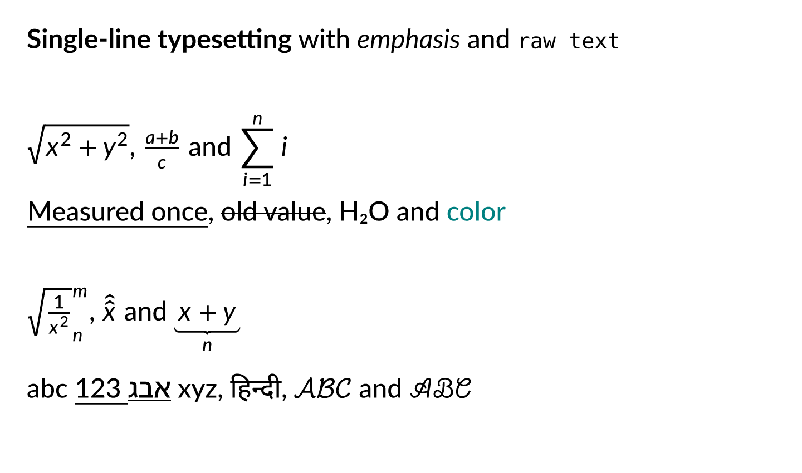
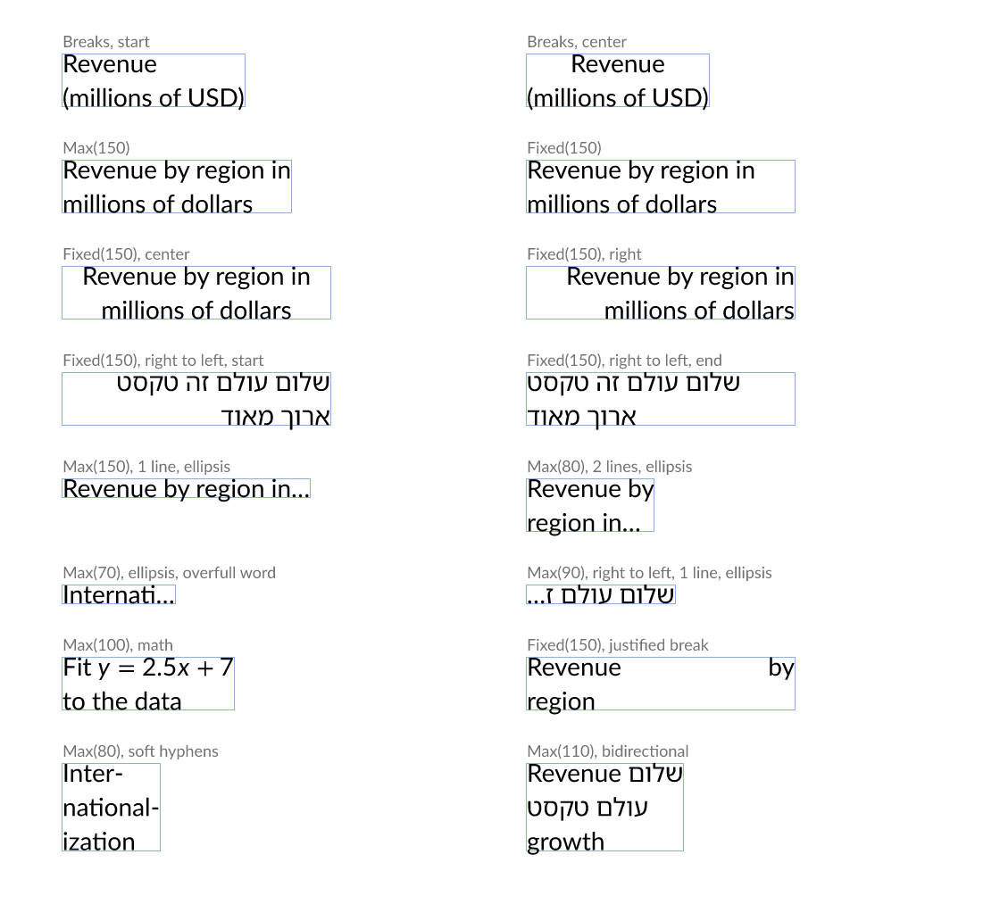

# avenger-typst-label

Typesets labels written in [Typst](https://typst.app) markup, with inline math, for Avenger's
charts. A label is one paragraph: a line, or lines that explicit breaks end or that wrap at a
width. It compiles to a positioned frame of glyphs and shapes, which lowers to SVG drawing
items, PDF text runs, or a raster image.

The typesetting is Typst's own: the crate uses upstream's parser and ports Typst 0.15.1's
evaluator, realization, text and math libraries, and inline and math layout, reduced to one
paragraph. [UPSTREAM.md](UPSTREAM.md) maps the ported files, lists where labels deliberately differ,
and says how to follow upstream.



## Usage

```rust
use std::sync::Arc;

use avenger_typst_label::{
    EngineOptions, LabelEngine, LabelOptions, LabelParamValue, RegisteredFont, SvgOptions,
    svg_items,
};

let mut engine_options = EngineOptions::default();
engine_options.fonts.registered_fonts = vec![RegisteredFont::new(lato), RegisteredFont::new(math)];
engine_options.fonts.default_sans_serif_family = Some("Lato".into());
engine_options.fonts.default_math_family = Some("Lete Sans Math".into());
let engine = LabelEngine::new(engine_options)
    .with_number_formatting(Arc::new(avenger_format_number_d3::D3NumberFormatProvider::new()));

let mut options = LabelOptions::default();
options.text.font_size = 14.0;
options.params.insert("r2".into(), LabelParamValue::Float(0.9412));

let label = engine.compile("*Fit* $R^2 = #numfmt(r2, \".2f\")$", &options)?;
println!("{} × {} pt", label.metrics.width, label.metrics.height);
let svg = svg_items(&label, &SvgOptions::default());
```

- `LabelEngine` owns the fonts and caches and is cheap to clone. Fonts come from registered
  data, from `extra_font_dirs` and, unless `load_system_fonts` is off, from the system.
- `compile` takes markup; `compile_text` takes literal text, as `compile(&escape_text(text))`
  would. `measure` and `measure_text` return only the metrics.
- `CompiledLabel` has the `frame`, its `metrics` (width, height, and the first line's baseline
  with the ascent above it and the descent below), the `semantic_text` for text extraction,
  `flags` and `warnings`.
- `svg_items` lowers a label to paths (glyph outlines and shapes) and images (bitmap glyphs, such
  as color emoji); `pdf_items` to glyph runs in their fonts, bitmap glyphs included, and paths;
  and `rasterize`, with the `raster` feature, to an RGBA image.

### Options

`LabelOptions` sets one label's style:

- `text`: the font families (a CSS-style list such as `"Lato, sans-serif"`), size, fill, weight,
  style, language, region and direction. The language also picks smart quotes and, by default,
  the direction.
- `math`: the math font family. Math takes the text's size, fill and weight unless `math` sets
  them.
- `width`: `Auto`, the default, ends lines only at explicit breaks. `Max(w)` wraps them at `w`
  points, as Typst wraps them, and the label is as wide as its widest line; `Fixed(w)` makes
  the label exactly `w` wide.
- `align`: where lines sit within the label's width: `Start`, the default, `Left`, `Center`,
  `Right` or `End`. Start and end follow the text direction.
- `max_lines` keeps at most that many lines. With `ellipsis`, the last line ends in "…" where
  text is cut, shortened to fit, and `flags.truncated` says whether it was.
- `params`: values the label's source refers to by name, as `#name` in markup and code, or as
  `name` in math. Parameters shadow the library's names.
- `limits`: bounds on the source's size, its number of equations and how deep its math nests.



The engine falls back to its sans-serif family and then to emoji fonts for text that the label's
fonts don't cover, and to its math family for math. `missing_font` chooses whether a family
missing from a label's font lists is silent, a warning or an error.

### Errors

A label that doesn't compile returns `LabelError::Source`, with Typst's message, the byte range
of the source it is about, and Typst's hints, or one of the variants for the limits and fonts.
Typst's warnings, such as for an unknown family, arrive in `CompiledLabel::warnings`.

## What labels support

Labels take Typst's markup syntax ([reference](https://typst.app/docs/reference/)) in one
paragraph. [docs/typst-support.md](docs/typst-support.md) goes through Typst's reference item by
item; in brief:

- Text, with Typst's whitespace rules, escapes, smart quotes and symbol shorthands.
- Line breaks: `\` and `#linebreak()`. Line breaks in data, such as in strings and parameters,
  are spaces.
- `*strong*` and `_emphasis_`, and `#strong`, `#emph`, `#underline`, `#overline`, `#strike`,
  `#highlight`, `#sub`, `#super`, `#smallcaps`, `#upper` and `#lower`.
- Inline raw text (`` `code` `` and `#raw`), on one line and without a language.
- `#text` with `fill`, `size`, `weight`, `style`, `font`, `lang`, `region`, `dir`, `baseline`,
  `tracking` and `features`.
- `#sym` and `#emoji` names, and the color constructors `rgb` and `luma`. Named colors are CSS
  colors, so `red` is `#ff0000`, and `rgb("…")` takes any CSS color string.
- Inline equations (`$…$`) with Typst's math: attachments and limits, fractions, `binom`, roots,
  accents, delimiters with `lr`, `mid` and the shorthands such as `abs` and `norm`, `cancel`,
  under- and over-braces, operators, `stretch`, `class`, alphabets such as `bold` and `cal`,
  and sizes such as `display`.
- Parameters, and `#numfmt` and `#datetimefmt`.

Labels can't use what needs more than a paragraph or a program: `#let`, `#set`, `#show`, loops
and imports, paragraph breaks, block equations, line breaks, matrices, vectors, case
distinctions and alignment points in math, and layout elements such as boxes, grids and images.
These are errors in Typst's style ("… are not supported in labels").

Where labels differ from Typst, mostly in how they take data,
[UPSTREAM.md](UPSTREAM.md#deliberate-divergences) lists it.

## Number and date formatting

`#numfmt(value, pattern)` and `#datetimefmt(value, pattern)` format values with the engine's
providers, which `with_number_formatting` and `with_datetime_formatting` set. A provider's
settings, such as its locale and timezone, apply to every pattern it prepares, and prepared
patterns are reused. `compile_with_formatting` takes providers for one label. Labels that don't
format values need no provider; one that does fails without it.

Exponent notation becomes math: `#numfmt(1234.5, ".1e")` lays out as 1.2 × 10³.

## Size

The `typst-label-math-svg-probe` binary (feature `size-probe`) lays out one math label and
writes its drawing items as SVG. Built with the workspace's `release-size` profile on macOS
(Rust 1.96), it measures 1,812,080 bytes (1.73 MiB). A program that does the same through
upstream Typst's `typst`, `typst-layout` and `typst-svg` measured 17,002,560 bytes (16.21 MiB).

```bash
cargo build --profile release-size -p avenger-typst-label --features size-probe \
  --bin typst-label-math-svg-probe
```

## Tests

```bash
cargo test --release -p avenger-typst-label
cargo test --release -p avenger-typst-label --features raster,upstream-png-parity \
  --test upstream_png_parity
```

The default suite runs the oracles, which compare every case in `tests/fixtures` with upstream
Typst's frames, math IR and evaluation; the PNG suite compares rasterized labels with upstream's
renders. Both read checked-in references; [UPSTREAM.md](UPSTREAM.md#tools) has the tools that
regenerate them.

`examples/label_bench.rs` times compilation, and `examples/gallery.rs` renders the image above:

```bash
cargo run --release -p avenger-typst-label --features raster --example gallery -- \
  docs/images/typst-labels.png
```

`examples/multiline.rs` renders the image of multi-line labels above, with their boxes outlined:

```bash
cargo run --release -p avenger-typst-label --features raster --example multiline -- \
  docs/images/typst-multiline-labels.png
```
