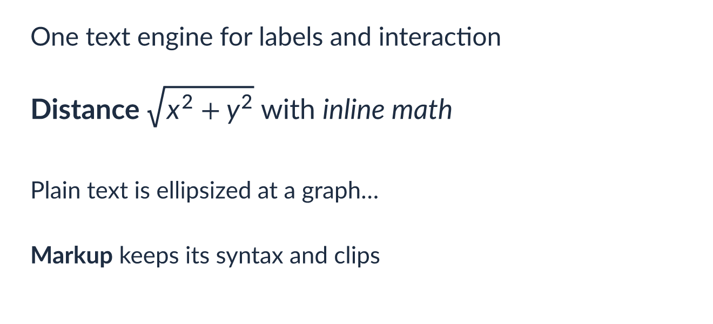

# avenger-wgpu

GPU-accelerated rendering backend for Avenger scene graphs.

## Purpose

This crate implements Avenger's primary rendering engine using wgpu for cross-platform GPU acceleration. It converts scene graphs into optimized GPU resources and handles the rendering pipeline from geometry tessellation through final pixel output.

## Architecture

The crate provides two main canvas implementations:
- **Canvas**: Native rendering to window surfaces via winit
- **HtmlCanvasCanvas**: WASM rendering to HTML canvas elements

Scene marks are rendered using specialized GPU shaders:
- **Instanced rendering**: Efficient batching for marks with many instances
- **Multi-mark rendering**: Handles complex marks requiring tessellation

Text rendering rasterizes each label with the Typst-based label crate, `avenger-typst-label`, into texture atlases. The `rich_text` example draws rich labels, and plain text and markup cut to a width with an ellipsis:

## Integration

- **Input**: Takes `avenger-scenegraph::SceneGraph` structures
- **Output**: Renders to GPU surfaces or exports to PNG images
- **Text**: Uses `avenger-typst-label` for text measurement and rasterization
- **Geometry**: Leverages Lyon for path tessellation and GPU vertex generation
