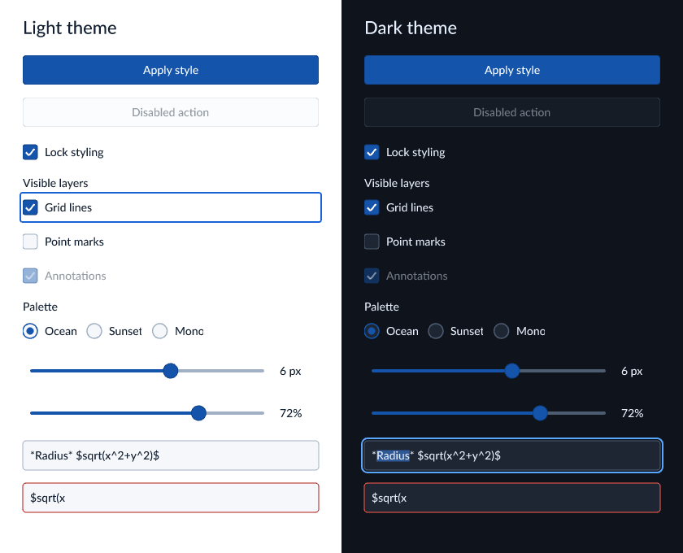

# avenger-widgets

Reusable scenegraph controls with application-owned values and layout. The crate
builds on Avenger text, geometry, and eventstream primitives. It does not depend
on a window host, chart model, query engine, or expression language.

Describe controls with stable IDs and current values. Prepare descriptions with
the application's `TextEngine`, read their measurements, and allocate rectangles
in root-canvas logical pixels. Finish the frame, put its scene fragment in the
application scene, and install the frame as part of that successful scene build.
Deliver the returned host commands after installing the scene.

Preparation does not change live focus or dispatch host effects. A frame becomes
stale if the runtime handles another event before installation. Applications that
use `avenger-app` can keep the runtime in their cloned state and return effects
through `SceneGraphBuilder::build_with_effects`.

```rust
use avenger_widgets::prelude::*;

let mut widgets = WidgetRuntime::new();
let engine = avenger_text::default_text_engine();
let controls = vec![Checkbox::new("grid", "Show grid", true).into()];
let mut prepared = widgets.prepare(&controls, &WidgetTheme::light(), &engine)?;
let size = prepared.metrics("grid").unwrap().preferred;
prepared.place("grid", Rect::new(12.0, 12.0, size.width, size.height), None)?;
let frame = prepared.finish()?;
let scene_fragment = frame.scene.clone();
// Assemble the full scene here, then install matching widget state.
let effects = widgets.install(frame)?;
# Ok::<(), WidgetError>(())
```

Route events through `WidgetRuntime::handle` using the complete installed scene's
R-tree. Apply `WidgetAction` values synchronously before the next frame. The
runtime previews accepted changes immediately. On the next build, the supplied
value is authoritative. Echoing the event value preserves the interaction.
Supplying a different value restores or replaces it.

Merge the returned `status` into the application's `UpdateStatus` and deliver its
host commands. Keep `consume` and `suppress_click` so a control gesture does not
also activate a plot handler. Place the widget handler before plot handlers.

A button activates on an inside release, Enter press, or Space release. A
checkbox toggles on an inside release or Space release. Held activation keys do
not repeat. Tab order follows declaration order and excludes disabled or fully
clipped controls. Browser embeddings use the default `FocusBoundary::Handoff`.
Standalone native windows can opt into `FocusBoundary::Cycle`.

`semantics()` provides names, roles, values, focus, and visible bounds for adapter
code. It does not install an operating-system accessibility bridge.

Checkbox groups bind to `BTreeSet<ChoiceItemId>` and contribute one Tab stop per
enabled item. Radio groups bind to `Option<ChoiceItemId>` and contribute one Tab
stop. Arrow keys move the radio selection, wrapping across enabled items.
Both groups share `ChoiceItem` and vertical/horizontal row layout. Duplicate IDs
and unknown checked/selected items fail preparation. Disabled selections remain
visible. Item reordering preserves focus and values by ID.

`SliderDomain::stepped(0.0, 10.0, 3.0)` admits 0, 3, 6, 9, and 10. Normalization
chooses the nearest allowed value, with ties upward. Continuous domains accept
any finite value between their bounds. Their default keyboard increment is one
hundredth of the span. Invalid spans and increments that cannot advance distinct
values fail construction.

Sliders emit immediate changes and one commit on release after a change. Escape
restores the transaction's starting value. Focus or capture loss retains its last
value and emits cancellation without a commit. A different application value
cancels the transaction during frame installation. Optional readouts reserve a
fixed width, so changing digit counts do not move the track.

Render the state gallery with `cargo run --release -p avenger-widgets --example
gallery -- widgets-gallery.png`. The example uses the bundled Lato font and one
shared text engine for layout and rendering.



`TextInput` edits one plain-text draft. Its uniform font can be styled, and its
contents can contain Typst source. The application validates and typesets that
source elsewhere. Keep the last accepted annotation separately from the draft so
invalid markup remains available for correction.

Each edit emits `TextChanged` immediately. `TextCommitPolicy` controls only
`TextCommitted`: immediate, after a debounce interval, or on Enter/blur. Enter
flushes a pending commit, emits `TextSubmitted`, and retains focus. Ordinary blur
flushes before the focus-loss notification. Removal and disabling cancel pending
work. A commit expresses user intent, not successful application validation.

Escape cancels composition first and restores its selection. A later Escape
restores the last committed or programmatically supplied draft. Both retain field
focus. Applications can use `reset_text` for an explicit reset that immediately
cancels composition and retires queued input. During ordinary external replacement,
a composing field defers the new draft until composition ends. The latest supplied
value wins. Neither kind of programmatic replacement emits a user change event.

Text input requires the host's input-session protocol. Forward tagged keyboard,
IME, clipboard, and keyed wakeup events through the runtime. Publish every returned
host effect, including initial-build and successful-rebuild effects. The winit
host supplies this protocol on native and WASM targets. Use `with_text_shortcuts`
to select Mac conventions in a browser running on macOS.

History retains 100 groups. Typing or deletion coalesces within one second until
navigation, focus, or edit class changes. Paste, cut, and IME commits are separate
groups. External replacements clear history. Line feeds, carriage returns, tabs,
other control characters, and Unicode line/paragraph separators are removed from
single-line values and edits. For example, pasting `one\ntwo` produces `onetwo`.
Debounce intervals use millisecond wakeups, rounding a positive fraction upward.

Read-only fields allow caret navigation, selection, and copying. Caret blinking
runs only for a focused editable field with a visible caret. Selection dragging
can scroll horizontally, including while the pointer remains beyond a field edge.
Selection queries expose byte offsets at grapheme boundaries.
