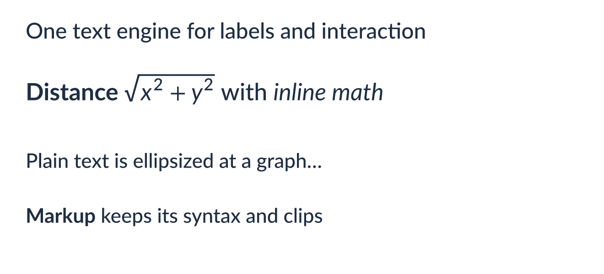
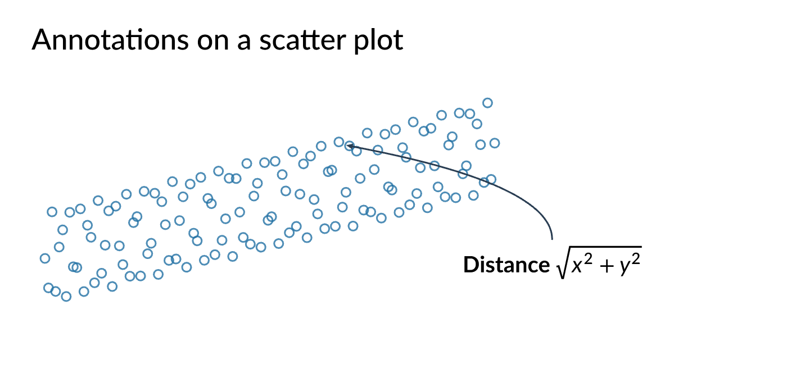
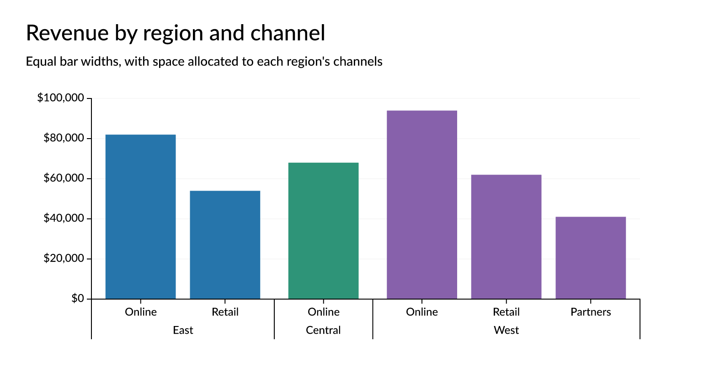
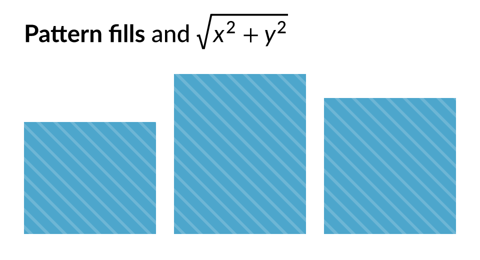
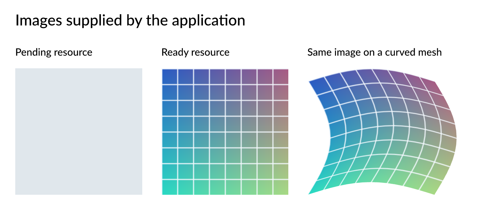

# Foundation API migration

## Color and formatting

Import `ColorOrGradient`, `Gradient`, `GradientStop`, `LinearGradient`, and `RadialGradient` from `avenger_color`. These types previously lived in `avenger_common::types`. Scene marks, guides, scales, and Vega imports use the shared definitions.

`avenger-color` also provides color parsing, conversion, interpolation, weighted Oklab mixing, and contrast calculations. `avenger-format-number` and `avenger-format-datetime` provide standalone format parsing and locale resolution without dependencies on rendering or chart libraries.

Run the color example from the repository root:

```sh
cargo run --release -p avenger-color --example interpolation -- docs/images/color-interpolation.png
```

The image shows sRGB, HSL, Lab, and Oklab interpolation from top to bottom.


Use `--release` for development runs and tests. The `release` profile favors iteration, while `release-perf` retains optimized distribution settings. Geometry consumers resolve a pinned rstar revision without relying on this repository's lockfile.

## Share one text engine

`avenger-text` now uses the portable Typst label engine on native and browser targets. Remove the old `cosmic-text` feature and global font-registration calls.

Create a `TextEngine` with `FontResolutionOptions` when an application needs explicit fonts. Pass clones to `CanvasConfig::text_engine`, `AvengerApp::try_new_with_text_engine`, and `SceneGraphRTree::from_scene_graph_with_text_engine` to keep rendering and picking consistent.

Set `SceneTextMark::text_syntax` to `TextSyntaxMode::TypstMarkup` for styled labels and inline math. Plain labels use grapheme-safe ellipsis under a width limit. Markup is compiled intact and clipped after layout. Locale options and read-only parameters travel with each text mark.

```sh
cargo run --release -p avenger-wgpu --example rich_text -- docs/images/rich-text.png
```



## Render into an application-owned target

`AvengerWgpuRenderer` accepts an existing WGPU device and queue. `OffscreenTarget` and `OffscreenTargetPool` provide reusable targets, and `FramePublisher` publishes completed frames by generation. The workspace now uses WGPU 27.

Window and PNG canvases use the same renderer. A resize rebuilds dimension-dependent scene state while keeping logical coordinates intact. Rendering and picking share display order, including root marks and inherited group z-index. Set a mark's `interactive` field to `false` to exclude it from picking.

Text marks keep their target in `x` and `y`. The `dx` and `dy` channels move the label, and the leader channels control the connecting line and arrowhead. Rendering and picking use the same leader geometry.

```sh
cargo run --release -p avenger-wgpu --example annotation_leaders -- docs/images/annotation-leaders.png
```



## Configure scales and guides

`ConfiguredScale` validates options and normalizes domains with typed context. Numeric and temporal guides accept explicit formats, locale context, and tick spacing. `AxisConfig` has new optional fields; use `..Default::default()` when setting a subset. Arrow consumers now use version 58.

`NestedBandScale` accepts a struct array with one field per category level. Its layout exposes parent spans and leaf widths. `make_nested_band_axis_marks` uses the same layout for hierarchical labels and separators. Free nesting allocates space to observed children; shared nesting reserves missing child slots across parents.

```sh
cargo run --release -p wgpu-scales --bin nested_bands -- docs/images/nested-bands.png
```



## Fill marks with patterns

Set `fill_pattern` on filled marks to combine stripe or symbol layers. Layers support add, subtract, and XOR operations. Pattern coverage is clipped to the host shape and its group clip; overlapping crosshatch strokes do not accumulate opacity.

Choose mark, plot, or chart anchoring. Plot anchoring requires a `PatternReferenceFrame` on the mark's group or an ancestor. The frame uses that group's local coordinates, so neighboring marks can share a stripe phase. Symbol legends accept the same pattern definitions.

```sh
cargo run --release -p avenger-wgpu --example patterns_and_text -- docs/images/patterns-and-text.png
```



## Supply images through a resolver

`SceneImageMark::image` now contains `SceneImageSource` values. Wrap existing pixel data in `SceneImageSource::Inline`, or use `SceneImageSource::Resource` with a stable key and intrinsic dimensions. Set the image resolver in `CanvasConfig::image_resource_config`.

`ImageResourceCache` handles requests, freshness, eviction, and render invalidation. Installed scenes retain their image keys until replacement or renderer destruction. Pending resources can use a placeholder or skip drawing; a ready resource appears on a later render without another `set_scene` call.

`SceneWarpedImageMark` accepts a textured triangle mesh. Tile hints can route eligible resources through persistent texture arrays. Local data URI decoding works without the HTTP feature; opt into `avenger-image`'s `reqwest` feature for native URL fetching.

```sh
cargo run --release -p avenger-wgpu --example image_resources -- docs/images/image-resources.png
```



## Coordinate input and host updates

`UpdateStatus` can carry `RuntimeHostCommand` values for keyed wake-ups, IME state, clipboard writes, cursors, and tooltip overlays. `EventAdmission` controls whether a handler advances its stream state. A between stream can emit its end event with the original gesture context. `DebouncedCommit` applies the latest draft after a keyed deadline.

Use `HostUpdateSender::mark_request_epoch` when a replacement request starts, then submit a `PreparedHostUpdate` after preparation completes. The host rejects stale results and preserves the window. Replacement clears old application wake-ups and overlays. `WindowSceneSizing` selects whether the surface follows the window or the scene.

Escape now reaches application handlers. Modifier snapshots and focus changes keep shortcut state current, and close requests reach application cleanup before the host exits.

```sh
cargo run --release -p winit-annotation-editor
cargo run --release -p winit-annotation-editor -- --slow-loads
```

The [annotation editor](../examples/winit-annotation-editor/README.md) combines text selection, composition, clipboard actions, debounced edits, draggable labels, tooltips, and prepared sample replacement.


