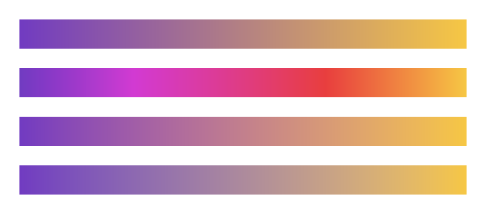

# Foundation API migration

## Color and formatting

Import `ColorOrGradient`, `Gradient`, `GradientStop`, `LinearGradient`, and `RadialGradient` from `avenger_color`. These types previously lived in `avenger_common::types`. Scene marks, guides, scales, and Vega imports use the shared definitions.

`avenger-color` also provides color parsing, conversion, interpolation, weighted Oklab mixing, and contrast calculations. `avenger-format-number` and `avenger-format-datetime` provide standalone format parsing and locale resolution without dependencies on rendering or chart libraries.

Run the color example from the repository root:

```sh
cargo run --release -p avenger-color --example interpolation -- docs/images/color-interpolation.png
```

The image shows sRGB, HSL, Lab, and Oklab interpolation from top to bottom.



Use `--release` for development runs and tests. The `release` profile favors iteration, while `release-perf` retains optimized distribution settings. Geometry consumers resolve a pinned rstar revision without relying on this repository's lockfile.
