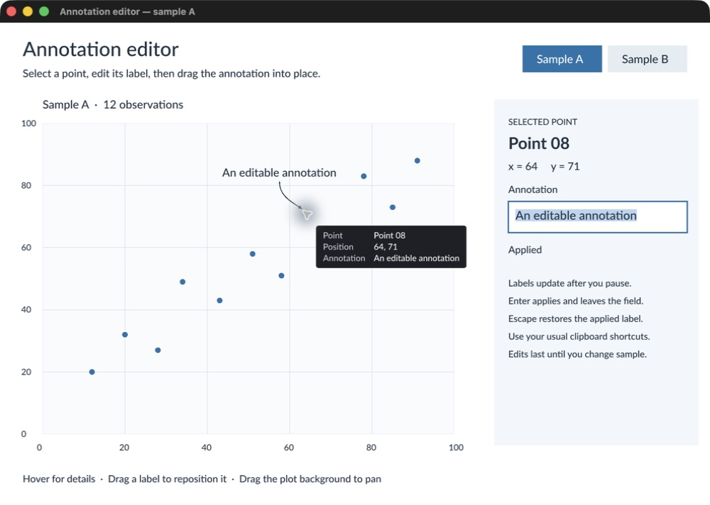

# Annotation editor

Select a point, edit its annotation, and drag the label into position. This native example uses scene marks, the shared text editor, event streams, and the winit host directly.

```sh
cargo run --release -p winit-annotation-editor
```

- Labels update after 350 ms without an edit. Enter applies immediately. Escape restores the applied label and leaves the field.
- Select text with a drag, a double-click, Shift with arrow keys, or the platform select-all shortcut. Use the usual clipboard shortcuts. Input-method composition stays in the field until committed.
- Drag a label to move it. Drag the plot background to pan. A gesture keeps its original target until release, even over another mark.
- Hover over a point for 400 ms to show a tooltip. Tooltip movement does not rebuild the application scene.
- Switch samples to replace the application in the same window. Edits are in memory and reset when a sample loads.

To exercise out-of-order preparation, run with `--slow-loads`, click Sample A, then click Sample B within 1.6 seconds. B prepares in 150 ms. Its result stays installed when the earlier A request finishes. The window remains usable during preparation.

```sh
cargo run --release -p winit-annotation-editor -- --slow-loads
cargo test --release -p winit-annotation-editor
cargo run --release -p winit-annotation-editor --example snapshot -- target/annotation-editor
```

The snapshot example renders selection and composition at 1× and 2×. The window uses scale 2 on macOS and scale 1 elsewhere. Override the raster scale with `--scale NUMBER` when testing another display configuration.

`state.rs` owns the editor and draft. `interaction.rs` registers gestures and requests keyed wake-ups, IME placement, clipboard writes, and tooltip updates. `reload.rs` prepares replacement applications on Tokio, advances the request epoch before preparation, and observes installation results. `scene.rs` draws the UI with the same text engine used for editing and picking.


