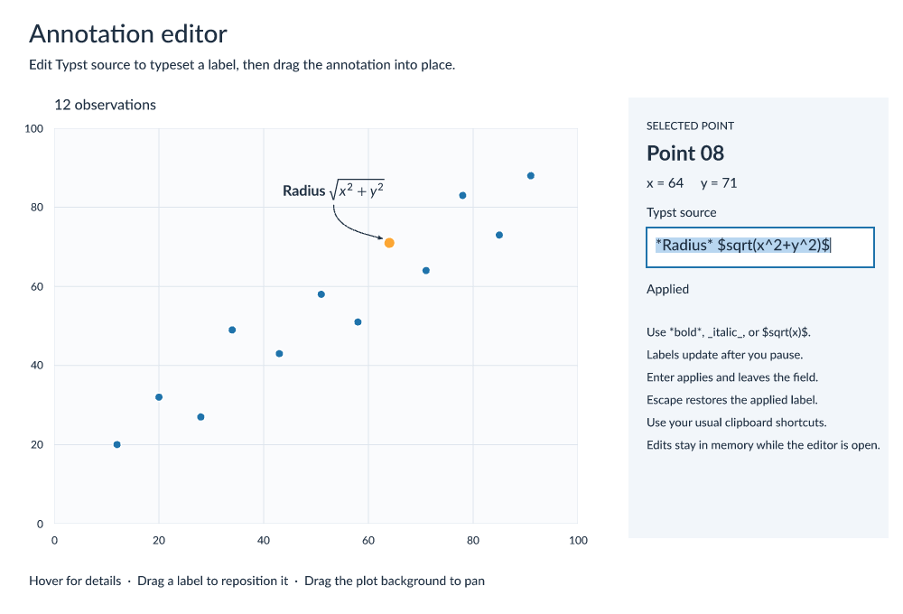

# Annotation editor

Select a point, edit its Typst source, and drag the typeset label into position. This example runs in a native window or a browser. Both modes use the same scene marks, text editor, event streams, and winit host.

```sh
cargo run --release -p winit-annotation-editor
```

To run in a browser, build with `wasm-pack` and serve the example directory:

```sh
wasm-pack build examples/winit-annotation-editor --target web --release
python3 -m http.server 8767 --directory examples/winit-annotation-editor
```

Open [localhost:8767](http://localhost:8767). The page uses the display's pixel ratio and bundled fonts. It needs a browser with WebGPU support. The editor handles text input and composition through a hidden browser input. Copy and cut use the current selection during the browser's clipboard event.

- The field edits literal Typst source. Chart labels typeset markup such as `*bold*`, `_italic_`, and `$sqrt(x^2+y^2)$`.
- Valid labels update after 350 ms without an edit. Enter applies immediately. Escape restores the applied label and leaves the field.
- Invalid source stays editable and shows an error while the chart retains its last valid label. Enter keeps the field focused until the source is valid. Escape restores the applied source. Selecting another point discards an invalid draft.
- Select text with a drag, a double-click, Shift with arrow keys, or the platform select-all shortcut. Use the usual clipboard shortcuts. Input-method composition stays in the field until committed.
- Drag a label to move it. Drag the plot background to pan. A gesture keeps its original target until release, even over another mark.
- The x and y linear scales position points and generate ticks for the visible domains. Tick labels and grid lines share these positions and move smoothly with the points during panning.
- Hover over a point for 400 ms to show a tooltip. Tooltip movement does not rebuild the application scene.

Edits stay in memory while the editor is open.

After building the WASM package, run the browser interaction tests with Node.js 20 or later and Chrome:

```sh
cd examples/winit-annotation-editor
npm ci
npx playwright install chrome
npm run test:browser
```

The tests start a local server when needed. They exercise typing, clipboard events, composition, focus changes, panning, annotation dragging. CI also runs this suite.

```sh
cargo test --release -p winit-annotation-editor
cargo run --release -p winit-annotation-editor --example snapshot -- target/annotation-editor
```

The snapshot example renders selection, composition, and panning at 1× and 2×. The window uses scale 2 on macOS and scale 1 elsewhere. Override the raster scale with `--scale NUMBER` when testing another display configuration.

`state.rs` owns the editor and draft. `interaction.rs` registers gestures and requests keyed wake-ups, IME placement, clipboard writes, and tooltip updates. `web.rs` starts the browser host. `scene.rs` draws the UI with the same text engine used for editing and picking.


