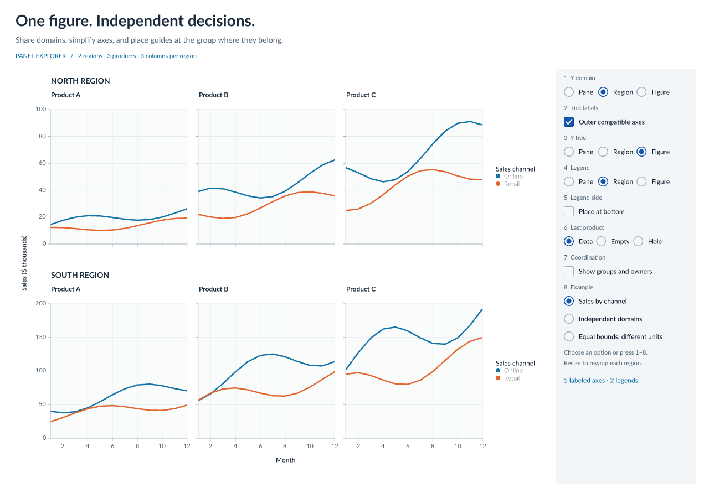

# Panel explorer

Explore how sharing scope, axis labels, titles, and legends interact across two regions and three products. Resize the window to wrap each region. The chart uses generated monthly sales data and the public `avenger-panels` API.



## Native

Run from the repository root:

```sh
cargo run --release -p winit-panels
```

Choose domain, title, and legend scopes, last-product state, and example presets directly from the radio groups. Checkboxes toggle outer labels, legend placement, and the coordination overlay. The 1–8 shortcuts still cycle the corresponding settings. Tab moves focus through the controls, and arrow keys change the radio selection. Domain, title, and legend scopes are independent. Tick marks and grid lines remain visible when labels are suppressed. The last product can contain data, show an empty panel, or leave a physical hole. Its logical domain contribution remains unchanged during that display toggle.

If the measured guides do not fit, the chart asks for more room while keeping the controls available.

The coordination overlay outlines region anchors and labels each visible axis with the number of panels it represents. The example presets include independent domains with a shared title and equal numeric bounds with different dollar and percentage formatting.

## Browser

Build from the example directory:

```sh
wasm-pack build --target web --release
python3 -m http.server 8768 --bind 127.0.0.1
```

Open [the local demo](http://127.0.0.1:8768/) in a WebGPU-capable browser. The canvas follows the browser width and gains vertical scroll space when panels wrap. It uses the same event handlers, planner, scene builder, text engine, and renderer as the native application.

Run the browser interaction checks after building the WASM package:

```sh
npm ci
npm run test:browser
```

## PNG output

Run from the repository root:

```sh
cargo run --release -p winit-panels --example snapshot -- target/panels-gallery
```

The exporter writes sales, wrapped-hole, independent-domain, and mixed-unit scenes. Its output is deterministic for the same font and rendering environment.

## Implementation

The controls use `avenger-widgets` with application-owned values. `scene.rs` builds a `PanelTree`, aggregates domains from `group`, and resolves a `PanelArrangement`. It maps the physical grids into `avenger-layout`, then reads `PanelFrames` and calls `plan_guides`. Numeric axes come from `avenger-guides`, lines use `avenger-scales`, and shared titles and legends reserve measured chrome at the plan's anchor.

The measurement loop checks geometry and guide decisions before rendering. It retains explicit space for child guides around contained groups, aggregates same-side guide demands, and uses one source contribution for each shared instance. The planner supplies owner selection and blocker rules.
