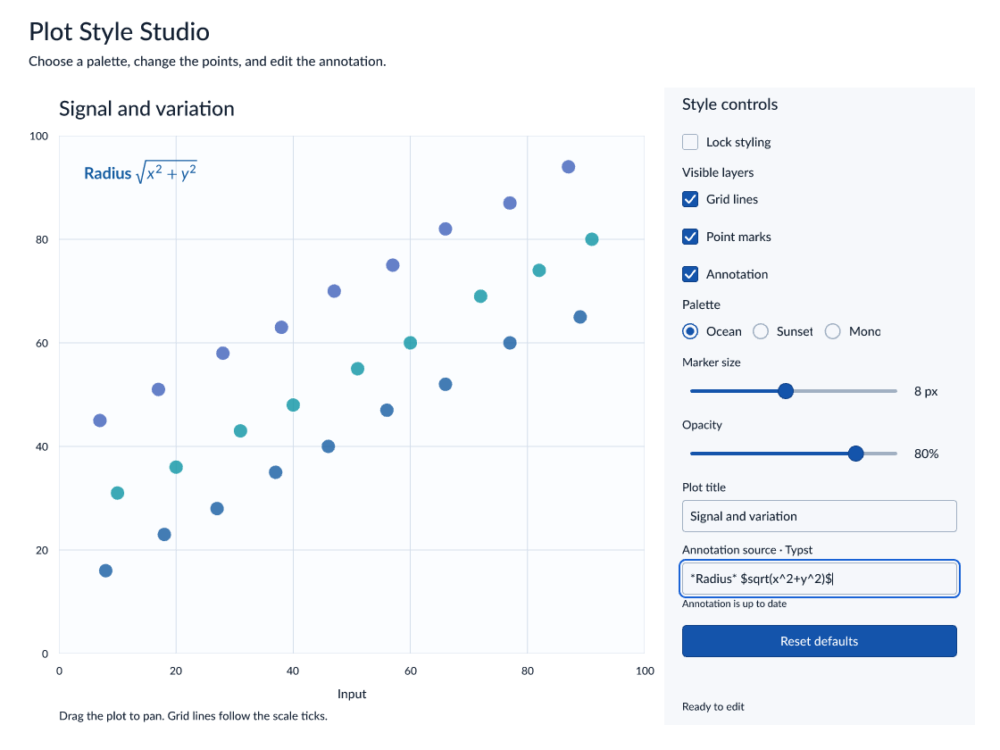

# Plot Style Studio

This example uses `avenger-widgets` to edit an application model and draw a plot
from scales and scenegraph marks. The same Rust code runs in a native window and
in a browser.

The settings panel demonstrates a checkbox, checkbox group, radio group, stepped
and continuous sliders, two text inputs, and a reset button. The title updates
on each edit. Typst annotation source commits after 350 ms, and invalid source
keeps the last valid annotation visible. Drag the plot to pan its scales.

```sh
cargo run --release -p winit-widgets
cargo run --release -p winit-widgets -- --screenshot studio.png
```

To build and serve the browser version from this directory:

```sh
wasm-pack build --target web --release
python3 -m http.server 8772 --bind 127.0.0.1
```

Open `http://127.0.0.1:8772`. The links before and after the canvas demonstrate
Tab entry and exit. Within the canvas, Tab visits each checkbox-group item but
visits the radio group once. Arrow keys choose a radio item or change a slider.
Enter submits a text field while keeping focus. Escape cancels its uncommitted
edit. The native window cycles focus through the controls.

```sh
npm ci
npm run test:browser
```

The browser tests operate the actual canvas and hidden text input. They read a
snapshot of the last completed scene through `window.widgetStudioSnapshot()`
to check model values and find control bounds. This diagnostic function cannot
mutate application or widget state.


