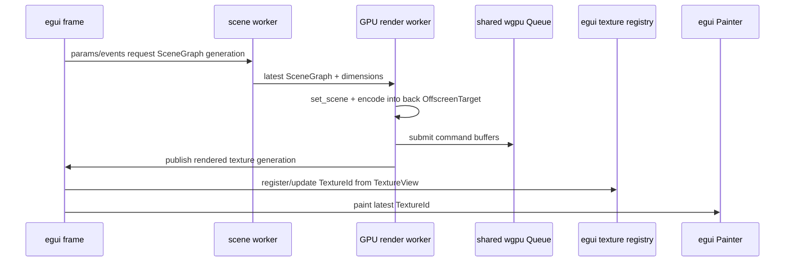

# Avenger WGPU GUI Offscreen Refactor Plan

Date: 2026-06-19

## Goal

Refactor `avenger-wgpu` so Avenger can render into offscreen WGPU textures owned by a GUI integration, then let egui display the latest completed texture at 60 FPS while exact Avenger renders run asynchronously.

The intended end state is:

- egui owns the application shell, window, input loop, and WGPU device/queue for the first GUI integration.
- Avenger owns reusable scene/render resources, but not necessarily a winit surface.
- Avenger can render a `SceneGraph` into:
  - a winit swapchain texture,
  - an offscreen texture for GUI sampling,
  - an offscreen texture for PNG/readback,
  - a background-rendered texture published to a GUI frame loop.
- egui routes widget-local events into Avenger's existing `WindowEvent` abstraction.
- Heavy exact renders can complete in the background.
- The first GUI MVP should keep the GUI responsive by sampling the latest completed texture while exact renders run asynchronously. Semantic drag preview is deferred until after the baseline feel is evaluated.

## Read This First

This plan is intentionally egui-first. Do not add Iced, direct rendering into egui's main render pass, semantic drag preview, or an egui-specific text backend while implementing the main phases.

The first successful app should look like this:

```text
eframe app
  left egui side panel:
    normal egui slider
    slider Response::changed() calls plot_handle.set_param("point_size", value)

  central egui panel:
    Plot::new(&plot_handle).show(ui)
    plot widget samples latest completed Avenger offscreen texture
    plot widget routes egui input to Avenger WindowEvent
```

The first MVP is allowed to show the previous completed chart frame while a new exact frame is pending. Do not build special pan/zoom preview behavior until a working egui MVP has been manually tested and found too stale.

Implementation milestones:

- Phases 0-6: refactor `avenger-wgpu` without changing existing window/PNG behavior.
- Phase 7: align WGPU versions for egui integration if needed.
- Phases 8-10: build the egui MVP with latest-frame publishing and low-level `set_param`.
- Phase 11: move full exact GPU rendering off the GUI hot path after the MVP works.
- Phases 12-13: add observability and architecture documentation.
- Deferred follow-up: semantic preview during drag, only if baseline UX requires it.

Non-goals for the main plan:

- [x] Do not add an Iced integration crate.
- [x] Do not render Avenger directly into egui's main render pass.
- [x] Do not add semantic drag preview before the egui MVP is evaluated.
- [x] Do not add high-level egui param binding helpers such as `param_slider` or `bind_param`.
- [x] Do not replace Avenger's text measurement/rasterization with egui text. Keep Avenger chart text on the existing Avenger text stack for this plan.
- [x] Do not use CPU readback to display charts in egui. The chart must remain a GPU texture sampled by egui.

Glossary:

- "Exact render": the authoritative Avenger/chart evaluation and render for the current params/events. The public egui API should not expose this term.
- "Latest completed frame": the newest finished offscreen texture that the egui frame loop can sample without waiting.
- "Preview": a future semantic drag-rendering mode. It is not part of the initial egui MVP.
- "Host wrapper": code that owns a window/surface/presentation loop and delegates rendering to `AvengerWgpuRenderer`.
- "Renderer core": the surface-independent Avenger WGPU renderer that can encode into a caller-provided texture view.

## Implementing Agent Instructions

This document is meant to be edited as implementation progresses.

Current validation policy: use release builds/tests only for the remainder of
this implementation pass unless a maintainer explicitly asks otherwise.

- [ ] Before starting a task, read the relevant files and confirm the assumptions in that phase still hold.
- [ ] Check off tasks in this document as they are completed.
- [ ] Keep each commit focused. Prefer one commit per phase, or one commit per coherent sub-phase when a phase is large.
- [ ] After each commit, update this document with:
  - completed checkboxes,
  - validation commands run,
  - any changed design decisions,
  - the commit hash.
- [ ] Do not batch many unrelated phases into a single commit.
- [ ] If a task reveals a better design, update the plan before continuing so the next agent can trust the document.
- [ ] Do not revert unrelated dirty work in the repository.
- [ ] Before marking a phase complete, run the validation listed for that phase.

Commit message guidance:

- Use Conventional Commit style.
- Suggested scopes:
  - `refactor(wgpu): ...`
  - `feat(wgpu): ...`
  - `feat(egui): ...`
  - `test(wgpu): ...`
  - `docs(wgpu): ...`

## Current Architecture Summary

Relevant existing files:

- `avenger-wgpu/src/canvas.rs`
  - `Canvas` trait mixes scene-building responsibilities with render target/device access.
  - `WindowCanvas` owns winit `Window`, WGPU `Surface`, `Device`, `Queue`, render state, and presentation.
  - `PngCanvas` owns a separate offscreen texture, readback buffer, `Device`, `Queue`, and mostly duplicates the `WindowCanvas` render path.
- `avenger-wgpu/src/marks/multi.rs`
  - `MultiMarkRenderer::prepare` builds frame resources.
  - `MultiMarkRenderer::encode_multi_ranges` currently creates its own `CommandEncoder` and returns a `CommandBuffer`.
- `avenger-wgpu/src/marks/instanced_mark.rs`
  - `InstancedMarkRenderer::render` currently creates its own `CommandEncoder` and returns a `CommandBuffer`.
- `avenger-eventstream/src/window/mod.rs`
  - Defines GUI-host-independent logical `WindowEvent`.
- `avenger-eventstream/src/window/winit.rs`
  - winit is already just one translation layer into `WindowEvent`.
- `avenger-app/src/app.rs`
  - `AvengerApp::update_with_status` routes events and rebuilds scenegraphs.
- `avenger-chart/src/plot/compiled/session.rs`
  - `EvaluationRequest::exact()` and `EvaluationRequest::preview()` already model exact vs preview evaluation.
  - `PlotSession::apply_param_patch` already supports param changes.

Main problem:

`WindowCanvas::render` and `PngCanvas::render` contain the reusable Avenger render sequence, but that sequence is not available as a target-agnostic API. GUI integrations need to render into a texture without pretending to own a winit surface.

## Version Strategy

As of this plan:

- Avenger workspace uses `wgpu = 25.0.2`.
- Current egui-wgpu latest uses newer WGPU than Avenger.

Recommended first compatibility target:

- [x] Confirm exact current crate versions before implementation.
- [x] Choose the first egui-compatible WGPU target deliberately.
- [x] Prefer the latest egui/egui-wgpu stack that can be adopted without excessive WGPU migration risk.
- [x] Record the chosen versions here:
  - `wgpu`: `27.0.1`
  - `egui`: `0.33.3`
  - `egui-wgpu`: `0.33.3`
  - `eframe`: `0.33.3`, if used for examples

Phase 0 version decision, 2026-06-19:

Use `egui`/`egui-wgpu`/`eframe` `0.33.3` as the first integration target and update Avenger to `wgpu 27.0.1` in Phase 7. The latest checked egui stack, `0.34.3`, uses `wgpu 29.0.1` but requires Rust `1.92`; the current local toolchain is `rustc 1.91.1`, while the `0.33.3` stack supports Rust `1.88` and matches `wgpu 27.0.1`.

Notes:

- Updating WGPU is acceptable for this project.
- Avoid supporting multiple WGPU major versions inside the same build. That will usually make native texture sharing impossible.
- Keep the renderer core independent enough that other GUI backends can be added later without changing `avenger-wgpu`.

## Design Principles

- [x] Keep `avenger-wgpu` independent of egui-specific types.
- [x] Make "render into this WGPU texture view" the core capability.
- [x] Make "own a winit surface and present" a host wrapper, not the renderer core.
- [x] Make "render into an offscreen texture and sample it later" a first-class path.
- [x] Avoid CPU readback for GUI display.
- [x] Keep the GUI frame loop non-blocking.
- [x] Make stale background renders cheap to discard.
- [x] Preserve existing `WindowCanvas` and `PngCanvas` behavior during migration.
- [ ] Validate each refactor step against existing visual baselines.

## Target API Sketch

The final names do not need to match this exactly, but implementation must preserve these responsibilities. If the public shape changes materially, update this sketch and the Phase 13 architecture docs in the same commit.

```rust
pub struct AvengerWgpuRenderer {
    dimensions: CanvasDimensions,
    scene_state: SceneRenderState,
    resources: AvengerRenderResources,
}

pub struct AvengerRendererConfig {
    pub dimensions: CanvasDimensions,
    pub texture_format: wgpu::TextureFormat,
    pub sample_count: u32,
    pub text_builder_ctor: Option<TextBuildCtor>,
}

pub struct AvengerRenderTarget<'a> {
    pub view: &'a wgpu::TextureView,
    pub resolve_target: Option<&'a wgpu::TextureView>,
    pub extent: wgpu::Extent3d,
    pub format: wgpu::TextureFormat,
    pub sample_count: u32,
    pub load: wgpu::LoadOp<wgpu::Color>,
}

pub struct PreparedAvengerFrame {
    // Text bind groups, prepared multi resources, per-frame statistics, etc.
}

impl AvengerWgpuRenderer {
    pub fn new(
        device: &wgpu::Device,
        queue: &wgpu::Queue,
        config: AvengerRendererConfig,
    ) -> Result<Self, AvengerWgpuError>;

    pub fn resize(
        &mut self,
        device: &wgpu::Device,
        dimensions: CanvasDimensions,
    ) -> Result<(), AvengerWgpuError>;

    pub fn set_scene(
        &mut self,
        device: &wgpu::Device,
        queue: &wgpu::Queue,
        scene_graph: &SceneGraph,
    ) -> Result<(), AvengerWgpuError>;

    pub fn prepare_frame(
        &mut self,
        device: &wgpu::Device,
        queue: &wgpu::Queue,
        extent: wgpu::Extent3d,
    ) -> Result<PreparedAvengerFrame, AvengerWgpuError>;

    pub fn encode_frame(
        &mut self,
        encoder: &mut wgpu::CommandEncoder,
        target: AvengerRenderTarget<'_>,
        prepared: &PreparedAvengerFrame,
    ) -> Result<(), AvengerWgpuError>;
}
```

Offscreen support:

```rust
pub struct OffscreenTarget {
    pub texture: wgpu::Texture,
    pub view: wgpu::TextureView,
    pub extent: wgpu::Extent3d,
    pub format: wgpu::TextureFormat,
    pub generation: u64,
}

pub struct OffscreenTargetPool {
    // double or triple buffered textures
}
```

Texture usages for GUI display:

```rust
wgpu::TextureUsages::RENDER_ATTACHMENT
    | wgpu::TextureUsages::TEXTURE_BINDING
    | wgpu::TextureUsages::COPY_SRC
```

## Phase 0 - Baseline, Compatibility, and Guardrails

Purpose: establish the current behavior and pick dependency versions before large refactors.

Tasks:

- [x] Run `git status --short` and record unrelated dirty files in this document.
- [x] Confirm the current workspace `wgpu` version.
- [x] Research current egui-wgpu WGPU version.
- [x] Choose the first target WGPU version.
- [x] Add a short note to this document with the version decision and rationale.
- [x] Run baseline tests for `avenger-wgpu`.
- [x] Run at least one existing visual regression or PNG-render path that exercises `PngCanvas`.
- [x] Capture baseline timing logs for one representative chart, if practical.
- [x] Identify any required WGPU API migration changes before touching renderer architecture.

Phase 0 findings, 2026-06-19:

- Initial `git status --short`: clean worktree; no unrelated dirty files.
- Current workspace `wgpu`: `25.0.2`, confirmed from `Cargo.toml` and `cargo tree -i wgpu --workspace`.
- Current latest checked egui stack:
  - `egui-wgpu 0.34.3` uses `wgpu 29.0.1` and requires Rust `1.92`.
  - `egui-wgpu 0.33.3` uses `wgpu 27.0.1` and requires Rust `1.88`.
  - Local toolchain: `rustc 1.91.1`, `cargo 1.91.1`.
- First target: `wgpu 27.0.1` with `egui`/`egui-wgpu`/`eframe 0.33.3`.
- Baseline `cargo test -p avenger-wgpu` result before code changes:
  - unit tests passed,
  - image baseline suite failed existing cases:
    - `case_090` / `residuals_colorscale`, diff `0.026578`,
    - `case_119` / `geoScale`, diff `0.016531`,
    - `case_120` / `maptile_background`, diff `0.012998`.
- Baseline `cargo test -p avenger-chart visual_regression -- --nocapture` completed successfully but selected zero tests under that filter (`618 filtered out` in `tests/visual_regression.rs`), so it is recorded as a command check rather than meaningful visual coverage.
- Baseline timing logs were not captured; the current baseline has known visual failures and no representative timing harness was selected in this phase.
- Disposable `/tmp/avenger-wgpu27-check` compile audit against `wgpu 27.0.1` found these first-order migration items:
  - `wgpu::DeviceDescriptor` now requires `experimental_features`,
  - `wgpu::RenderPassColorAttachment` now requires `depth_slice`,
  - `wgpu::PollType::Wait` is now a struct-style variant instead of a bare value.

Suggested validation:

```bash
cargo test -p avenger-wgpu
cargo test -p avenger-chart visual_regression -- --nocapture
```

Commit:

- [x] Commit doc/version baseline updates.
- Commit hash: `c2948e61`

## Phase 1 - Extract Renderer Core Without Behavior Change

Purpose: separate reusable Avenger render state from surface ownership while preserving `WindowCanvas` and `PngCanvas` public behavior.

Tasks:

- [x] Create `avenger-wgpu/src/renderer.rs`.
- [x] Create `avenger-wgpu/src/target.rs`.
- [x] Move shared fields out of `WindowCanvas` and `PngCanvas` into a new internal render state:
  - `marks`
  - `shared_multi`
  - `run_start`
  - `current_zindex`
  - `instanced_renderers`
  - `multi_render_resources`
  - `text_atlas_builder`
  - `config`
  - `dimensions`
  - `sample_count`
  - `texture_format`
- [x] Keep device/queue ownership in existing host canvases for now.
- [x] Keep surface/window ownership only in `WindowCanvas`.
- [x] Keep PNG output texture/readback ownership only in `PngCanvas`.
- [x] Move `commit_all_multi_renderers` to the renderer core.
- [x] Move `make_frame_overlay_command` or its future equivalent behind the renderer core.
- [x] Keep the existing `Canvas` trait working, even if implemented by forwarding to the new renderer core.
- [x] Update module exports.
- [x] Ensure no behavior changes in `WindowCanvas::new`, `WindowCanvas::render`, `PngCanvas::new`, or `PngCanvas::render`.

Phase 1 notes, 2026-06-19:

- Added `AvengerRendererCore` in `avenger-wgpu/src/renderer.rs`.
- Moved `MarkRenderer`, `ZIndexedMark`, `mark_renderer_counts`, shared text atlas construction, shared mark state, z-run bookkeeping, and frame-overlay command construction into the renderer module.
- Kept the old `avenger_wgpu::canvas::MarkRenderer` and `ZIndexedMark` paths available by re-exporting them from `canvas.rs`.
- Added `avenger-wgpu/src/target.rs` as the Phase 2 module boundary only; explicit target descriptors are still deferred to Phase 2.
- `WindowCanvas` still owns the winit window/surface/device/queue/presentation details.
- `PngCanvas` still owns the PNG output texture, readback buffer, device, and queue.
- `WindowCanvas` and `PngCanvas` implement `Canvas` by delegating shared renderer-state mutations to `AvengerRendererCore`.

Validation:

```bash
cargo fmt --all
cargo test -p avenger-wgpu
cargo test -p avenger-chart-app --features winit-wgpu
```

Phase 1 validation results, 2026-06-19:

- `cargo fmt --all`: passed.
- `cargo check -p avenger-wgpu`: passed.
- `cargo test -p avenger-wgpu --lib`: passed, 27 tests.
- `cargo test -p avenger-wgpu`: failed only on the same three Phase 0 image baseline cases with the same diff values:
  - `case_090` / `residuals_colorscale`, diff `0.026578`,
  - `case_119` / `geoScale`, diff `0.016531`,
  - `case_120` / `maptile_background`, diff `0.012998`.
- `cargo test -p avenger-chart-app --features winit-wgpu`: failed before test execution because example `parallel_coordinates_header_drag_reorder.rs` references missing `ev::parallel_dimension_id()` and `ev::parallel_display_x()` helpers. This file was not touched in Phase 1.
- `cargo test -p avenger-chart-app --features winit-wgpu --lib`: failed 3 existing event-binding tests around retained nested event datum rows. No chart-app files were touched in Phase 1.

Commit:

- [x] Commit Phase 1.
- Suggested message: `refactor(wgpu): extract reusable renderer state`
- Commit hash: `2fe37940`

## Phase 2 - Introduce Explicit Render Targets

Purpose: make render target details explicit instead of implicit in `WindowCanvas` and `PngCanvas`.

Tasks:

- [x] Add `AvengerRenderTarget<'a>`.
- [x] Add render target helpers for:
  - swapchain texture view,
  - offscreen texture view,
  - multisampled color target plus resolve target.
- [x] Replace hard-coded background clear with target-provided `load`.
- [x] Preserve default white clear for existing window/png behavior.
- [x] Move background clear encoding into renderer core.
- [x] Add a renderer method that builds commands for an arbitrary `AvengerRenderTarget`.
- [x] Keep existing command-buffer-returning API available until Phase 3 completes.

Phase 2 notes, 2026-06-19:

- Added `AvengerRenderTarget<'a>` in `avenger-wgpu/src/target.rs`.
- Added helpers for `swapchain`, `offscreen`, and `multisampled` targets.
- Added `WHITE_CLEAR` as the default load op used by existing window and PNG behavior.
- Moved background pass command encoding into `AvengerRendererCore::make_background_command`.
- Left mark rendering on the existing command-buffer-returning APIs. Phase 3 will convert mark renderers to encode into caller-provided command encoders.
- Kept `canvas::make_background_command` as a compatibility wrapper for the wasm canvas path.

Validation:

```bash
cargo fmt --all
cargo test -p avenger-wgpu --lib --release
```

Phase 2 validation results, 2026-06-19:

- `cargo fmt --all`: passed.
- `cargo check -p avenger-wgpu`: passed.
- `cargo test -p avenger-wgpu --lib`: passed, 27 tests.
- Full `cargo test -p avenger-wgpu` was not rerun in Phase 2; Phase 1 showed the only failures match the Phase 0 image baseline failures.

Commit:

- [x] Commit Phase 2.
- Suggested message: `refactor(wgpu): make render targets explicit`
- Commit hash: `70f80ebe`

## Phase 3 - Encode Into Caller-Provided Command Encoders

Purpose: allow egui callbacks and offscreen workers to compose Avenger rendering into their own frame lifecycle.

Tasks:

- [x] Add `MultiMarkRenderer::encode_multi_ranges_into`.
- [x] Keep `MultiMarkRenderer::encode_multi_ranges` as a wrapper that creates an encoder and returns a `CommandBuffer`.
- [x] Add `InstancedMarkRenderer::encode_into`.
- [x] Keep `InstancedMarkRenderer::render` as a wrapper that creates an encoder and returns a `CommandBuffer`.
- [x] Ensure all render passes use `LoadOp::Load` after the explicit background pass unless the target requests otherwise.
- [x] Ensure scissor state remains correct after moving to shared encoders.
- [x] Preserve path/stencil clipping behavior.
- [x] Confirm regression coverage for at least:
  - basic rect/symbol/text chart,
  - path-clipped mark,
  - instanced symbol mark,
  - multi-mark z-order.
- [x] Add debug labels to new encoders/passes so GPU captures remain readable.

Phase 3 notes, 2026-06-19:

- Added `MultiMarkRenderer::encode_multi_ranges_into`.
- Kept `MultiMarkRenderer::encode_multi_ranges` as a command-buffer wrapper.
- Added `InstancedMarkRenderer::encode_into`.
- Kept `InstancedMarkRenderer::render` as a command-buffer wrapper.
- Updated `WindowCanvas` and `PngCanvas` to encode mark draws into a shared `Avenger Mark Render Encoder` command encoder per frame.
- Existing render passes still use `LoadOp::Load` after the explicit background command.
- Existing image baseline cases cover the required regression categories:
  - basic rect/text/symbol: `stacked_bar`, `bar_axis_labels`, `binned_scatter_*`,
  - path and clip behavior: `single_path_*`, `multi_path_*`, `clip_mixed_marks`,
  - instanced symbol path: `circle_fast_path_large_translucent`,
  - multi-mark z-order: `zindex_circles`.

Validation:

```bash
cargo fmt --all
cargo test -p avenger-wgpu
cargo test -p avenger-chart visual_regression -- --nocapture
```

Phase 3 validation results, 2026-06-19:

- `cargo fmt --all`: passed.
- `cargo check -p avenger-wgpu`: passed.
- `cargo test -p avenger-wgpu --lib`: passed, 27 tests.
- `cargo test -p avenger-wgpu`: failed only on the same three Phase 0 image baseline cases with the same diff values:
  - `case_090` / `residuals_colorscale`, diff `0.026578`,
  - `case_119` / `geoScale`, diff `0.016531`,
  - `case_120` / `maptile_background`, diff `0.012998`.
- `cargo test -p avenger-chart visual_regression -- --nocapture`: passed but selected zero tests under this filter (`618 filtered out` in `tests/visual_regression.rs`).

Commit:

- [x] Commit Phase 3.
- Suggested message: `refactor(wgpu): encode marks into provided command encoders`
- Commit hash: `b58fa971`

## Phase 4 - Add Offscreen Render Targets and Pooling

Purpose: make the GUI texture route first-class.

Tasks:

- [x] Create `avenger-wgpu/src/offscreen.rs`.
- [x] Add `OffscreenTarget`.
- [x] Add `OffscreenTargetDescriptor`.
- [x] Add `OffscreenTarget::new`.
- [x] Add `OffscreenTarget::resize_or_recreate`.
- [x] Add `OffscreenTargetPool`.
- [x] Support double buffering.
- [x] Support optional triple buffering for background render plus GUI sampling.
- [x] Track texture generation IDs.
- [x] Track size, scale, format, sample count, and usage.
- [x] Use texture usages:
  - `RENDER_ATTACHMENT`
  - `TEXTURE_BINDING`
  - `COPY_SRC`
- [x] Add renderer convenience methods:

```rust
fn encode_to_offscreen_commands(
    &mut self,
    device: &wgpu::Device,
    queue: &wgpu::Queue,
    target: &mut OffscreenTarget,
) -> Result<Vec<wgpu::CommandBuffer>, AvengerWgpuError>;

fn render_to_offscreen(
    &mut self,
    device: &wgpu::Device,
    queue: &wgpu::Queue,
    target: &mut OffscreenTarget,
) -> Result<RenderedOffscreenFrame, AvengerWgpuError>;
```

- [x] Ensure offscreen render does not submit implicitly unless the method name says it does.
- [x] Provide both low-level encode and high-level submit helpers if needed.
- [x] Implement `OffscreenTargetPool` in `avenger-wgpu`.
- [x] Document that `avenger-egui` should own an `OffscreenTargetPool` instance for each plot handle/widget because egui owns the WGPU device/queue and texture registration lifecycle.
- [x] Document this ownership decision in Phase 13 architecture docs.

Phase 4 notes, 2026-06-19:

- Added public `avenger_wgpu::offscreen` types for target allocation and pooling.
- `OffscreenTargetDescriptor::new` defaults usage to `RENDER_ATTACHMENT | TEXTURE_BINDING | COPY_SRC`, matching the GUI texture path and the optional readback/debug path.
- `OffscreenTarget::resize_or_recreate` recreates when physical extent, format, sample count, usage, or scale changes.
- `OffscreenTargetPool` supports arbitrary pool sizes plus `double_buffered` and `triple_buffered` constructors. It hands out targets round-robin with monotonically increasing generation IDs on allocation/recreation.
- Added `RenderedOffscreenFrame` metadata so later frame-publishing code can carry generation, extent, format, and sample count without exposing texture ownership details.
- Added internal `AvengerRendererCore::build_frame_commands`, `encode_to_offscreen_commands`, and `render_to_offscreen` helpers. The low-level encode helper returns command buffers without submitting; the method named `render_to_offscreen` submits to the queue.
- These renderer helpers remain `pub(crate)` in this phase because the public renderer facade is not established yet. Phase 5/6 should introduce or expose the public `AvengerWgpuRenderer` boundary after `PngCanvas` and `WindowCanvas` are rebuilt on the core/offscreen path.
- The future `avenger-egui` crate should own one `OffscreenTargetPool` per plot handle/widget. That crate will receive egui-wgpu's device/queue/renderer context, register the latest target with egui, and repaint the most recent completed generation.

Validation:

```bash
cargo fmt --all
cargo check -p avenger-wgpu
cargo test -p avenger-wgpu --lib
cargo test -p avenger-wgpu
```

Phase 4 validation results, 2026-06-19:

- `cargo fmt --all`: passed.
- `cargo check -p avenger-wgpu`: passed.
- `cargo test -p avenger-wgpu --lib`: passed, 27 tests.
- `cargo test -p avenger-wgpu`: failed only on the same three Phase 0 image baseline cases with the same diff values:
  - `case_090` / `residuals_colorscale`, diff `0.026578`,
  - `case_119` / `geoScale`, diff `0.016531`,
  - `case_120` / `maptile_background`, diff `0.012998`.

Commit:

- [x] Commit Phase 4.
- Suggested message: `feat(wgpu): add offscreen render targets`
- Commit hash: `c39999f7`

## Phase 5 - Rebuild PngCanvas on the Renderer Core

Purpose: prove the extracted renderer core and offscreen path produce the same pixels before introducing GUI frameworks.

Tasks:

- [x] Replace `PngCanvas`'s duplicated render logic with:
  - `AvengerRendererCore::build_frame_commands` for now,
  - an `OffscreenTarget`,
  - a readback buffer.
- [x] Move readback-specific code into `readback.rs`.
- [x] Preserve `PngCanvas::render` public behavior.
- [x] Preserve existing image dimensions and padding behavior.
- [x] Ensure MSAA resolve behavior matches the old implementation.
- [x] Verify text atlas behavior is unchanged.
- [x] Verify `PngCanvas` does not require `TEXTURE_BINDING` unless using shared `OffscreenTarget` directly.

Phase 5 notes, 2026-06-19:

- `PngCanvas` now owns an `OffscreenTarget` for the resolved output texture and a `TextureReadback` helper for padded CPU readback.
- The public renderer facade is still deferred. `PngCanvas` now calls `AvengerRendererCore::build_frame_commands`, which is the same target-agnostic path the facade should expose in Phase 6.
- `avenger-wgpu/src/readback.rs` owns the padded buffer allocation, texture-to-buffer copy encoding, map/poll/readback flow, and final crop to the requested physical image dimensions.
- PNG output target usage is `COPY_SRC | RENDER_ATTACHMENT`; it does not request `TEXTURE_BINDING`.
- Existing MSAA behavior is preserved by keeping `PngCanvas`'s multisampled framebuffer and resolving into the offscreen output target view when `sample_count > 1`.
- Text atlas behavior is routed through `AvengerRendererCore::build_frame_commands`, so PNG rendering uses the same once-per-frame shared text bind group path as the refactored core.

Validation:

```bash
cargo fmt --all
cargo check -p avenger-wgpu
cargo test -p avenger-wgpu --lib
cargo test -p avenger-wgpu
cargo test -p avenger-chart visual_regression -- --nocapture
```

Phase 5 validation results, 2026-06-19:

- `cargo fmt --all`: passed.
- `cargo check -p avenger-wgpu`: passed.
- `cargo test -p avenger-wgpu --lib`: passed, 27 tests.
- `cargo test -p avenger-wgpu`: failed only on the same three Phase 0 image baseline cases with the same diff values:
  - `case_090` / `residuals_colorscale`, diff `0.026578`,
  - `case_119` / `geoScale`, diff `0.016531`,
  - `case_120` / `maptile_background`, diff `0.012998`.
- `cargo test -p avenger-chart visual_regression -- --nocapture`: passed but selected zero tests under this filter (`618 filtered out` in `tests/visual_regression.rs`).

Commit:

- [x] Commit Phase 5.
- Suggested message: `refactor(wgpu): render png output through renderer core`
- Commit hash: `ddd57b1e`

## Phase 6 - Rebuild WindowCanvas as a Host Wrapper

Purpose: keep the existing winit integration working while proving the renderer core can target a swapchain texture.

Tasks:

- [x] Reduce `WindowCanvas` to:
  - winit `Window`,
  - WGPU `Surface`,
  - `SurfaceConfiguration`,
  - `Device`,
  - `Queue`,
  - `AvengerRendererCore` for now.
- [x] Make `WindowCanvas::render`:
  - acquire surface texture,
  - create surface texture view,
  - create target descriptor,
  - call renderer frame-command builder,
  - submit,
  - present.
- [x] Preserve surface resize behavior.
- [x] Preserve frame overlay behavior.
- [x] Preserve `WindowCanvas::set_scene`.
- [x] Preserve `Canvas` trait compatibility for downstream crates.
- [x] Run an existing winit example manually if practical, otherwise record why it was skipped.

Phase 6 notes, 2026-06-19:

- `WindowCanvas` still owns the winit window, WGPU surface/configuration, device, queue, multisampled framebuffer, and renderer core.
- `WindowCanvas::render` now acquires the surface texture, syncs resize state, builds a swapchain or multisampled `AvengerRenderTarget`, calls `AvengerRendererCore::build_frame_commands` with the optional frame overlay, submits, and presents.
- Surface resize behavior is preserved through `sync_to_acquired_surface_texture` and `update_physical_size`.
- Frame overlay rendering now flows through `build_frame_commands`, using the same text bind groups as the rest of the frame.
- Removed renderer-core accessors that were only needed by the old duplicated host render loops.
- A manual winit example run was skipped in this environment; `cargo test -p avenger-winit-wgpu` passed and covers the non-windowing frame/resize helper logic.

Validation:

```bash
cargo fmt --all
cargo check -p avenger-wgpu
cargo test -p avenger-wgpu --lib
cargo test -p avenger-wgpu
cargo test -p avenger-winit-wgpu
cargo test -p avenger-chart-app --features winit-wgpu
cargo test -p avenger-chart-app --features winit-wgpu --lib
```

Phase 6 validation results, 2026-06-19:

- `cargo fmt --all`: passed.
- `cargo check -p avenger-wgpu`: passed.
- `cargo test -p avenger-wgpu --lib`: passed, 27 tests.
- `cargo test -p avenger-wgpu`: failed only on the same three Phase 0 image baseline cases with the same diff values:
  - `case_090` / `residuals_colorscale`, diff `0.026578`,
  - `case_119` / `geoScale`, diff `0.016531`,
  - `case_120` / `maptile_background`, diff `0.012998`.
- `cargo test -p avenger-winit-wgpu`: passed, 3 tests.
- `cargo test -p avenger-chart-app --features winit-wgpu`: failed before test execution because example `parallel_coordinates_header_drag_reorder.rs` references missing `ev::parallel_dimension_id()` and `ev::parallel_display_x()` helpers. This is the same pre-existing failure recorded in Phase 1.
- `cargo test -p avenger-chart-app --features winit-wgpu --lib`: failed 3 existing event-binding tests around retained nested event datum rows. This is the same pre-existing failure recorded in Phase 1.

Commit:

- [x] Commit Phase 6.
- Suggested message: `refactor(wgpu): make window canvas a renderer host`
- Commit hash: `c9085d40`

## Phase 7 - WGPU Upgrade

Purpose: align Avenger with the first target GUI backend dependency set.

Do this before backend crates if version mismatch prevents texture/resource sharing.

Tasks:

- [x] Update workspace `wgpu`.
- [x] Update WGPU API calls across `avenger-wgpu`.
- [x] Update WASM-specific WGPU features.
- [x] Update examples that directly depend on WGPU.
- [x] Re-check texture format feature queries.
- [x] Re-check surface configuration fields.
- [x] Re-check `Device::poll` usage.
- [x] Re-check command encoder, copy, and texture descriptor APIs.
- [x] Re-check validation errors around stencil/depth attachments.
- [x] Confirm native builds.
- [x] Record WASM build status for this phase.

Phase 7 notes, 2026-06-19:

- Updated the workspace and directly pinned example dependencies from `wgpu 25.0.2` to `wgpu 27.0.1`.
- Updated the target-specific wasm WGPU pins in `avenger-wgpu`, `examples/wgpu-scales`, `examples/wgpu-winit`, and `examples/iris-pan-zoom` to `27.0.1` while preserving the existing `webgl`/`webgpu` features.
- `cargo tree -i wgpu --workspace` now reports a single WGPU version: `wgpu v27.0.1`.
- WGPU API migrations required in `avenger-wgpu`:
  - add `experimental_features: wgpu::ExperimentalFeatures::disabled()` to `DeviceDescriptor`,
  - use `wgpu::PollType::wait_indefinitely()` for readback polling,
  - add `depth_slice: None` to 2D render-pass color attachments.
- Texture format feature queries and surface configuration fields did not require code changes for `wgpu 27.0.1`.
- Command encoder, copy, and texture descriptor APIs did not require code changes beyond the readback poll migration.
- Stencil/depth attachment validation did not require code changes beyond adding `depth_slice: None` to color attachments.
- Direct WGPU example crates were checked with:
  `cargo check -p avenger-winit-wgpu -p wgpu-scales -p wgpu-winit -p iris`.
- `examples/iris-pan-zoom` also needed `UpdateStatus { ..Default::default() }` updates for the existing `cursor` field; this was not a WGPU API change but was required to keep the direct WGPU example building.
- Optional WASM build validation was not run in this phase. Native egui integration is the first target, and the optional wasm command can be revisited after the egui MVP works.

Validation:

```bash
cargo fmt --all
cargo check -p avenger-wgpu
cargo check -p avenger-winit-wgpu -p wgpu-scales -p wgpu-winit -p iris
cargo tree -i wgpu --workspace
cargo test -p avenger-wgpu --lib
cargo test -p avenger-wgpu
cargo test -p avenger-winit-wgpu
cargo test -p avenger-chart visual_regression -- --nocapture
```

Phase 7 validation results, 2026-06-19:

- `cargo fmt --all`: passed.
- `cargo check -p avenger-wgpu`: passed.
- `cargo check -p avenger-winit-wgpu -p wgpu-scales -p wgpu-winit -p iris`: passed.
- `cargo tree -i wgpu --workspace`: reports only `wgpu v27.0.1`.
- `cargo test -p avenger-wgpu --lib`: passed, 27 tests.
- `cargo test -p avenger-wgpu`: failed only on the same three Phase 0 image baseline cases with the same diff values:
  - `case_090` / `residuals_colorscale`, diff `0.026578`,
  - `case_119` / `geoScale`, diff `0.016531`,
  - `case_120` / `maptile_background`, diff `0.012998`.
- `cargo test -p avenger-winit-wgpu`: passed, 3 tests.
- `cargo test -p avenger-chart visual_regression -- --nocapture`: passed but selected zero tests under this filter (`618 filtered out` in `tests/visual_regression.rs`).
- Optional wasm validation was not run.

Optional WASM validation:

```bash
examples/iris-pan-zoom/wasm-pack build --target web --release
```

Commit:

- [x] Commit Phase 7.
- Suggested message: `refactor(wgpu): update wgpu dependency for gui integration`
- Commit hash: `01ee00cf`

## Phase 8 - Async Frame Publishing Core

Purpose: provide the background exact render and latest-frame handoff primitives needed by the egui integration.

Tasks:

- [x] Create a small frame-publishing module, either in `avenger-wgpu` or a GUI-support crate.
- [x] Define `RenderedFrame`.
- [x] Define `FrameGeneration`.
- [x] Define `LatestFrame`.
- [x] Define `FramePublisher`.
- [x] Ensure GUI readers can grab the latest completed frame without blocking.
- [x] Add offscreen-pool support for avoiding the latest sampled texture generation.
- [x] Use generation IDs to discard stale renders.
- [x] Add a cancellation/drop-stale policy.
- [x] Add a "render in progress" flag.
- [x] Add metrics:
  - scene evaluation time,
  - `set_scene` time,
  - prepare time,
  - command encode time,
  - submit time,
  - texture publish time.
- [x] In Phase 8, provide primitives for CPU scene evaluation / scene publication as the background work.
- [x] In Phase 8, keep GPU upload/render out of the publisher so it can remain in the egui render preparation path for simpler WGPU ownership.
- [x] Do not implement full background GPU submission until Phase 11.
- [x] Document this staged decision in Phase 13 architecture docs.

Phase 8 notes, 2026-06-19:

- Added public `avenger_wgpu::frame_publisher` primitives:
  - `FrameGeneration`,
  - `FrameRenderMetrics`,
  - `RenderedFrame<T>`,
  - `LatestFrame<T>`,
  - `FramePublisher<T>`,
  - `FrameRenderTicket<T>`,
  - `BeginFrameError`,
  - `PublishResult`.
- `LatestFrame<T>` uses `arc-swap` so GUI readers can clone an `Arc<RenderedFrame<T>>` snapshot with an atomic load instead of taking a mutex.
- `FramePublisher<T>` provides request generation, begin-render, stale detection, publish, cancel, in-progress tracking, and status counters.
- Dropping an unpublished `FrameRenderTicket<T>` cancels the in-progress render automatically.
- Publishing a generation older than the latest requested generation returns `PublishResult::DroppedStale` and does not update the latest frame.
- Added `OffscreenTargetPool::acquire_next_excluding_generation` so GUI integrations can avoid rendering into the generation currently being presented.
- The texture-overwrite guarantee is staged: Phase 8 provides the latest-generation exclusion primitive, and the egui integration must use it with double/triple buffering and latest-frame snapshots. Full background GPU submission and stronger retention/fence policy remain Phase 11 work.
- No background GPU submission was added. The publisher payload is generic so Phase 10 can publish CPU-evaluated scene/frame metadata first, while GPU upload/render stays in the egui preparation path.
- Added unit tests for generation allocation, latest-frame snapshots, stale publish discard, stale begin discard, in-progress rejection, and ticket-drop cancellation.

Recommended initial policy:

- CPU scene evaluation may run in the background.
- GPU upload/render should initially happen in the GUI callback `prepare` phase for simpler WGPU ownership and easier validation.
- Full background GPU render can be enabled after the offscreen path is stable.

Validation:

```bash
cargo fmt --all
cargo check -p avenger-wgpu
cargo test -p avenger-wgpu --lib
cargo test -p avenger-wgpu
```

Phase 8 validation results, 2026-06-19:

- `cargo fmt --all`: passed.
- `cargo check -p avenger-wgpu`: passed.
- `cargo test -p avenger-wgpu --lib`: passed, 33 tests.
- `cargo test -p avenger-wgpu`: failed only on the same three Phase 0 image baseline cases with the same diff values:
  - `case_090` / `residuals_colorscale`, diff `0.026578`,
  - `case_119` / `geoScale`, diff `0.016531`,
  - `case_120` / `maptile_background`, diff `0.012998`.

Commit:

- [x] Commit Phase 8.
- Suggested message: `feat(wgpu): add latest-frame publishing primitives`
- Commit hash: `991001c4`

## Deferred Follow-Up - Semantic Fast Preview and Drag Rendering

Status: intentionally out of the first egui MVP.

Purpose: revisit drag rendering only after testing the baseline offscreen/latest-frame model. The initial implementation must not build a separate semantic preview scheduler, texture-transform fallback, or mark-adjustment path. First measure how it feels when drag/param changes enqueue asynchronous exact renders and the GUI keeps painting the latest completed frame.

If the baseline feels too stale during pan/zoom, the follow-up requirement is semantic preview, not a simple texture shift. For pan/zoom, axes, guides, ticks, selections, and marks must update according to the interaction. A texture transform can be used only as a temporary continuity fallback because axes and guides would otherwise be stale.

This is not an implementation phase. Do not add tasks or commits for this follow-up until the egui MVP has been manually evaluated and the plan has been updated with a concrete new phase.

## Phase 9 - Chart/App Param APIs for Native Widgets

Purpose: let native egui controls drive Avenger chart params without pretending to be pointer events.

Tasks:

- [x] Add public `ChartAppState` or wrapper APIs for param patching.
- [x] Add a public `set_param` API for the first GUI MVP.
- [x] Make `set_param` enqueue an exact/settled param update internally without exposing "exact" in the egui app-author API.
- [x] Make `set_param` update an optimistic local param mirror immediately so egui controls do not snap back while an exact frame is pending.
- [x] Defer preview param patch API unless the baseline latest-frame model feels too stale.
- [x] Add param snapshot API.
- [x] Add cheap typed param getters needed by the example:
  - `param_f64(name) -> Option<f64>`,
  - `param_bool(name) -> Option<bool>` if the checkbox example uses a bool param.
- [x] Add param change records with revision IDs so `PlotOutput` can report which params changed during a widget frame.
- [ ] Add selection snapshot API if selection observation is in scope.
- [ ] Add revision counters for:
  - [x] params,
  - selections,
  - stores if needed.
- [x] Prefer implementing GUI-neutral param/change APIs in `avenger-chart-app` or a small GUI-neutral adapter; keep egui types out of chart/app crates.
- [x] Ensure `set_param` can enqueue exact renders without blocking the GUI frame.
- [x] Add tests for slider-like workflows:
  - [x] many rapid `set_param` calls,
  - [x] optimistic getter returns latest requested value before exact frame publishes,
  - [x] param change record is emitted for a changed param,
  - stale exact result discarded.

Phase 9 notes, 2026-06-19:

- Added public GUI-neutral param APIs on `ChartAppState`:
  - `set_param(name, value)`,
  - `param_snapshot()`,
  - `param_revision()`,
  - `param_changes_since(revision)`,
  - `param_f64(name)`,
  - `param_bool(name)`.
- Added public `ParamChange`, `ParamSnapshot`, `ParamSetResult`, and `IntoChartParamValue`.
- `set_param` is synchronous and updates a small optimistic root-param mirror immediately.
- If the chart runtime is available, `set_param` drains pending patches into the session immediately and requests the next evaluation as exact internally.
- If the chart runtime is busy, `set_param` queues the pending root patch without waiting; the next scene build or event handler drains the patch before evaluation/event routing.
- Existing async `params().await` remains compatible with tests and direct session mutations by opportunistically syncing the mirror from the runtime when the runtime is free.
- Root-param changes produced by resize handlers and scoped event bindings now sync into the same change/revision stream.
- Selection snapshots and selection/store revision counters are still deferred. Phase 10 keeps `selection_changes()` reserved on `PlotOutput`; a later selection-observation pass can fill it.
- Full stale exact-frame discard is still a Phase 10/11 frame-publishing responsibility. Phase 9 tests cover the lower-level precondition: `set_param` queues while the runtime is busy and the next build drains the latest optimistic value.

Validation:

```bash
cargo fmt --all
cargo test -p avenger-chart-app
```

Phase 9 validation results, 2026-06-19:

- `cargo check -p avenger-chart-app`: passed.
- `cargo fmt --all`: passed.
- `cargo test -p avenger-chart-app set_param --lib`: passed, 4 tests.
- `cargo test -p avenger-chart-app param_ --lib`: passed, 8 tests.
- `cargo test -p avenger-chart-app event_binding_can_reset_raw_domain_to_default --lib`: passed after preserving async `params().await` compatibility with direct session mutations.
- `cargo test -p avenger-chart-app --lib`: failed only on the three pre-existing retained-event-datum tests recorded in earlier phases:
  - `bar_click_exposes_nested_struct_event_coord_readback`,
  - `bar_click_writes_nested_source_column_selection_clause`,
  - `facet_bar_click_writes_nested_source_column_selection_clause_in_cell_scope`.
- `cargo test -p avenger-chart-app`: failed before running the lib suite because default examples require the `winit-wgpu` feature and because `parallel_coordinates_header_drag_reorder.rs` still references missing `ev::parallel_dimension_id()` / `ev::parallel_display_x()` helpers. These are pre-existing validation blockers unrelated to Phase 9.

Commit:

- [x] Commit Phase 9.
- Suggested message: `feat(chart-app): expose param update APIs for gui widgets`
- Commit hash: `95b0185e`

## Phase 10 - egui Integration Crate

Purpose: implement the first GUI backend using the offscreen texture route.

Crate:

- `avenger-egui`

Tasks:

- [x] Add `avenger-egui` crate to the workspace.
- [x] Depend on compatible `egui`, `egui-wgpu`, and optionally `eframe`.
- [x] Define `AvengerEguiHandle`.
- [x] Define `Plot` as the primary egui widget builder: `avenger_egui::Plot::new(&handle).show(ui)`.
- [x] Use `Plot` directly; no internal `AvengerPlotWidget` alias was needed.
- [x] Define an egui-style `PlotOutput` returned by the plot widget:
  - contains the underlying `egui::Response`,
  - exposes `changed()`,
  - exposes `params_changed()`,
  - exposes `param_changed(name)`,
  - exposes `param_changes()`,
  - reserves space for future `selection_changes()`,
  - includes lightweight frame/render status for debug UI.
- [x] Call `response.mark_changed()` when routed plot input causes observable Avenger param or selection changes.
- [x] Implement widget allocation with `Sense::click_and_drag()` for the first MVP.
- [x] Keep builder options low-level and minimal:
  - `desired_size(Vec2)` if needed,
  - `sense(Sense)` if needed,
  - no high-level param binding helpers.
- [x] Add an explicit `EguiEventTranslator` or equivalent module for routing egui input into Avenger events.
- [x] Make the translator convert egui pointer positions from screen-space points to widget-local logical coordinates:
  - subtract `rect.min`,
  - preserve egui logical point units,
  - output Avenger positions as `[f32; 2]`.
- [x] Convert egui pointer movement and drag/click state to Avenger cursor and mouse events:
  - `WindowEvent::CursorMoved`,
  - `WindowEvent::MouseInput`,
  - `WindowEvent::CursorEntered`,
  - `WindowEvent::CursorLeft`.
- [x] Convert egui wheel events to `WindowEvent::MouseWheel`.
- [x] Convert egui keyboard events to `WindowEvent::KeyboardInput`.
- [x] Route pointer events only when the pointer is hovered, dragging, or otherwise captured by the plot widget.
- [x] Route wheel events only when the pointer is hovered over the plot widget.
- [x] Request plot focus on click/drag start.
- [x] Route keyboard events only when the plot widget has focus.
- [x] Route widget resize to `CanvasResize`.
- [x] Leave debounced/settled resize routing out of the MVP; manual resize validation did not show a need beyond `CanvasResize`.
- [x] Ensure the translated Avenger events are dispatched through the Avenger app/eventstream path, not through winit.
- [x] Add translator tests for:
  - coordinate conversion,
  - hover filtering,
  - active-drag routing after the pointer leaves the rect,
  - wheel filtering,
  - keyboard focus filtering,
  - resize event generation.
- [x] Register or update Avenger offscreen texture with egui-wgpu.
- [x] Prefer egui-wgpu native texture registration for the first MVP.
- [x] Keep and reuse a stable egui `TextureId` while the underlying offscreen texture remains compatible.
- [x] Re-register/update the texture when the offscreen texture is recreated because of size/format changes.
- [x] Paint latest frame texture into widget rect.
- [x] Keep `show(ui)` non-blocking: it may allocate the rect, route input, enqueue work, update texture registration, and paint the latest completed frame, but it must not wait for exact evaluation or rendering.
- [x] During drag, request repaint every frame.
- [x] On background frame publish, request repaint.
- [x] Add an example app with:
  - chart widget,
  - param slider,
  - checkbox/toggle param,
  - pan/zoom interaction,
  - visible metrics/debug panel.
- [x] Make the example app demonstrate a real egui control driving an Avenger param:
  - use an `eframe` app shell,
  - place controls in an egui side panel,
  - place the Avenger chart widget in the central panel,
  - bind an egui slider to a numeric chart param,
  - call `set_param` when the slider value changes,
  - keep painting the latest completed Avenger frame while the new exact render is pending,
  - show the latest frame generation/render status in a small debug readout.

Example shape:

```rust
struct BasicChartApp {
    plot: avenger_egui::AvengerPlotHandle,
    point_size: f64,
}

impl eframe::App for BasicChartApp {
    fn update(&mut self, ctx: &egui::Context, frame: &mut eframe::Frame) {
        egui::SidePanel::left("controls").show(ctx, |ui| {
            let changed = ui
                .add(egui::Slider::new(&mut self.point_size, 1.0..=20.0).text("Point size"))
                .changed();

            if changed {
                self.plot.set_param("point_size", self.point_size);
            }

            self.plot.show_metrics(ui);
        });

        egui::CentralPanel::default().show(ctx, |ui| {
            let output = avenger_egui::Plot::new(&self.plot).show(ui);

            if output.param_changed("point_size") {
                if let Some(value) = self.plot.param_f64("point_size") {
                    self.point_size = value;
                }
            }
        });
    }
}
```

Initial API shape:

```rust
pub struct PlotOutput {
    pub response: egui::Response,
    pub param_changes: Vec<ParamChange>,
    pub selection_changes: Vec<SelectionChange>,
    pub frame_status: FrameStatus,
}

impl PlotOutput {
    pub fn changed(&self) -> bool;
    pub fn params_changed(&self) -> bool;
    pub fn param_changed(&self, name: &str) -> bool;
    pub fn param_changes(&self) -> &[ParamChange];
    pub fn selection_changes(&self) -> &[SelectionChange];
}

pub struct ParamChange {
    pub name: String,
    pub value: ScalarValue,
    pub previous: Option<ScalarValue>,
    pub revision: u64,
}

pub struct SelectionChange {
    pub name: String,
    pub revision: u64,
}
```

If selection observation is not wired in the first egui crate commit, keep `selection_changes` present but always empty, and document that it is reserved for the next selection-observation pass.

Phase 10 progress notes, 2026-06-19:

- Added prerequisite public `avenger_wgpu::renderer::AvengerWgpuRenderer` facade in commit `8bff0c48` so GUI crates do not need `pub(crate)` renderer internals.
- Added `avenger-egui` workspace crate with `egui 0.33.3`, `egui-wgpu 0.33.3`, and optional local `eframe 0.33.3`.
- The initial public handle is named `AvengerPlotHandle`, matching the example shape already written in this plan. It wraps `ChartAppState` and exposes low-level `set_param`, `param_f64`, `param_bool`, snapshots, revisions, and change queries.
- Added `Plot::new(&handle).show(ui)` as the primary widget-shaped API.
- Added `PlotOutput` with `egui::Response`, param-change helpers, reserved empty `selection_changes`, lightweight placeholder `FrameStatus`, and translated Avenger `WindowEvent`s.
- Added `EguiEventTranslator` with widget-local coordinate conversion, cursor enter/leave/move, simple click input, and widget resize to `CanvasResize`.
- Added a nonblocking event queue on `AvengerPlotHandle`. `Plot::show(ui)` queues translated events without awaiting app updates, and `dispatch_pending_events().await` can route them through an owned `AvengerApp::update_with_status` outside the egui paint path.
- Added low-level `render_scene_to_texture(render_state, scene_graph, dimensions)` on `AvengerPlotHandle`. It renders a caller-provided `SceneGraph` into a handle-owned triple-buffered `OffscreenTargetPool`, registers/updates the latest target with `egui-wgpu`, and reuses the same `TextureId`.
- `Plot::show(ui)` paints the latest registered texture into the allocated widget rect without waiting for evaluation or rendering.
- Added `AvengerApp::scene_graph_arc` and `AvengerApp::rebuild_scene_graph` so native widget param changes can force an exact chart rebuild outside the window-event path.
- Added a `basic_chart` eframe example that uses a normal egui slider to call `set_param("point_size", value)`, uses a checkbox to call `set_param("show_points", value)`, rebuilds the scene, renders it into an egui-registered offscreen texture, displays the plot widget, dispatches queued plot events through `AvengerApp`, and requests repaint while dragging.
- The example uses eframe's WGPU path with `default-features = false` and `features = ["default_fonts", "wgpu"]`. Enabling eframe's default glow/glutin path conflicted with the workspace's locked `glutin_wgl_sys` version.
- Expanded `EguiEventTranslator` to read `egui::InputState::raw.events` for pointer button press/release, wheel events, focus-gated keyboard events, and pointer-gone events.
- Added background scene publishing to `AvengerPlotHandle` using the Phase 8 `FramePublisher<Arc<SceneGraph>>` primitive. The handle now exposes low-level `request_scene_rebuild(_with_repaint)` and `request_event_dispatch(_with_repaint)` APIs that schedule Avenger app work on a caller-provided Tokio runtime and publish only the latest completed scene.
- The egui example now uses a multi-thread Tokio runtime, requests async scene rebuilds from normal egui slider/checkbox changes, dispatches queued plot events through the same async publisher path, polls the latest published scene, and keeps painting the latest rendered texture while new scene work is pending.
- The example only re-renders the Avenger scene into the egui texture when the published scene generation or widget dimensions change.
- Added `EguiResponseState` so `Plot::show` snapshots `Response` state before entering `ui.input(...)`. This avoids calling `response.has_focus()` while egui's input lock is held, which can deadlock.
- Added translator tests for coordinate conversion, hover wheel filtering, active pointer capture/release after leaving the rect, keyboard focus filtering, and resize generation.
- Added async publisher tests for single rebuild publication, rapid rebuild coalescing to the newest generation, and routed resize events publishing a scene through the Avenger app/eventstream path.
- Phase 10 is close to implementation-complete. Remaining work is manual runtime validation of the native example, plus `CanvasResizeSettled` routing only if manual resize behavior shows it is needed. Selection observation remains a later pass.
- Progress commit hashes: `cdc4ee5d`, `b01ee84e`, `67eb684d`, `07dafe63`, `d5eaf801`, `83fa275c`, `b7f7ffef`

Phase 10 partial validation, 2026-06-19:

- `cargo fmt --all`: passed.
- `cargo check -p avenger-wgpu`: passed after adding the public renderer facade.
- `cargo test -p avenger-wgpu --lib`: passed, 33 tests.
- `cargo check -p avenger-egui`: passed.
- `cargo test -p avenger-egui --lib`: passed, 6 tests.
- `cargo test -p avenger-egui`: passed, 6 tests plus doc-tests.
- `cargo check -p avenger-egui`: passed after adding offscreen texture registration.
- `cargo test -p avenger-egui`: passed, 6 tests plus doc-tests, after adding offscreen texture registration.
- `cargo check -p avenger-egui --features eframe --example basic_chart`: passed.
- `cargo test -p avenger-egui`: passed, 6 tests plus doc-tests, after adding the app rebuild hook and example.
- `cargo test -p avenger-egui`: passed, 8 tests plus doc-tests, after expanding wheel/key/pointer event translation.
- `cargo check -p avenger-egui --features eframe --example basic_chart`: passed after expanding event translation.
- `cargo check -p avenger-egui --features eframe --example basic_chart`: passed after adding the checkbox-driven `show_points` param.
- `cargo test -p avenger-egui`: passed, 8 tests plus doc-tests, after adding the checkbox-driven `show_points` param.
- `cargo tree -i wgpu --workspace`: reports a single `wgpu v27.0.1`, including `egui-wgpu v0.33.3`.
- `cargo test -p avenger-egui --lib`: passed, 14 tests, after adding async scene publishing and stronger event-translation coverage.
- `cargo check -p avenger-egui --features eframe --example basic_chart`: passed after converting the example to async scene publication/latest-frame painting.
- `cargo fmt --all`: passed after async scene publication changes.
- `cargo test -p avenger-egui`: passed, 14 tests plus doc-tests, after async scene publication changes.

Implementation note:

The first version should prefer egui's native texture registration and `ui.painter().image(...)`. Only introduce `egui_wgpu::CallbackTrait` if same-frame GPU preparation or custom blit behavior is needed.

API scope note:

Keep the initial egui-facing param-setting API low-level and explicit. Provide `set_param(name, value)` and use normal egui widgets plus `Response::changed()` in examples. Observation should feel widget-like: the plot widget returns `PlotOutput`, and app code can inspect `output.changed()`, `output.param_changed(name)`, or `output.param_changes()`. Do not add `bind_param`, `param_slider`, `slider_f64`, or similar higher-level binding helpers in this plan. Those can be considered later after the low-level API and async render behavior feel right.

Validation:

```bash
cargo fmt --all
cargo test -p avenger-egui --release
cargo run -p avenger-egui --release --features eframe --example basic_chart
```

Manual checks:

- [x] Slider changes enqueue non-blocking exact renders.
- [x] Rapid slider changes keep the GUI responsive while exact renders are pending.
- [x] Drag/pan interactions keep the GUI responsive while exact renders are pending, even if the displayed chart remains on the latest completed frame.
- [x] Record subjective staleness during drag/pan so semantic preview can be evaluated later.
- [x] Window resize does not stall.
- [x] Latest completed frame is reused when no new frame is ready.

Manual runtime validation, 2026-06-19:

- `cargo run -p avenger-egui --release --features eframe --example basic_chart` displayed the chart through the egui widget.
- User validation confirmed the egui slider changes the chart point-size param in the native app. The metrics panel showed `scene generation: 462 / requested 462`, `frames painted: 1087`, `reused latest frame paints: 924`, `pending-frame paints: 234`, and `scene published/dropped: 162/63`, demonstrating non-blocking latest-frame reuse during rapid slider interaction.
- A manual plot drag routed through Avenger events: axes updated from the pan, the metrics panel advanced to `events routed: 55 in 52 batches`, and stale scene publications were dropped.
- Manual window resize regenerated offscreen textures (`texture generation: 5`) and kept the app responsive with no visible stall or WGPU validation error.
- Subjective staleness for the basic example is acceptable without semantic drag preview; continue without Phase 9/preview behavior until a heavier chart shows a real need.

Commit:

- [x] Commit Phase 10.
- Suggested message: `feat(egui): add offscreen avenger plot widget`
- Implementation commits so far: `cdc4ee5d`, `b01ee84e`, `67eb684d`, `07dafe63`, `d5eaf801`, `83fa275c`, `b7f7ffef`
- Final Phase 10 closure commit hash: `3f71dbd1`

## Phase 11 - Full Background GPU Rendering

Purpose: move `set_scene`, offscreen command encoding, and queue submission off
the GUI hot path where native WGPU permits it.

This phase should happen only after the egui example works with UI-thread GPU upload/render.

Status decision, 2026-06-19:

- Deferred for the initial egui MVP after release-mode manual validation. The current path already moves chart/event evaluation to background tasks, publishes only the latest scene generation, and keeps the egui frame loop sampling the latest completed texture.
- Local `wgpu 27.0.1` source confirms `Device` and `Queue` are `Clone` and `Send + Sync` on the native send/sync build, so a future background GPU worker can use cloned handles. That worker should still own independent `AvengerWgpuRenderer` state and back-buffer `OffscreenTarget`s to avoid cross-thread renderer mutation.
- The 100k-point egui example shows why this phase should stay gated: the observed bottleneck is chart scene evaluation, not WGPU submission. A representative pan/zoom screenshot showed `scene eval` around `137182 us`, while `set_scene/encode/submit` was about `4049/1395/79 us` and texture publication was about `6 us`. Moving GPU work off the GUI frame would remove roughly 5-6 ms from affected egui frames, but it would not by itself make 100k-point pan/zoom feel realtime.
- Do not implement this phase until a heavier chart proves that egui-frame GPU upload/render is the bottleneck. If resumed, keep the tasks below as the implementation checklist.

Non-goals for Phase 11:

- Do not implement semantic pan/zoom preview, cached data-mark retargeting, or event coalescing in this phase. Those are likely the first-order fix for 100k-point pan/zoom staleness.
- Do not mutate `egui_wgpu::Renderer` from a background worker.
- Do not introduce egui types into `avenger-wgpu`.
- Do not replace the current UI-thread render path on wasm; keep a fallback.

Target architecture:



Implementation plan:

### Phase 11.1 - Decision Gate and Baseline

- [x] Confirm WGPU `Device`/`Queue` sharing requirements for the chosen WGPU version.
- [x] Decide the future thread ownership model:
  - cloned `Device`/`Queue`,
  - one render worker per egui plot widget initially,
  - possible shared worker pool later only if per-widget workers become too heavy.
- [x] Require any future background worker to avoid mutating GUI-thread renderer resources.
- [x] Require any future background worker to own its own `AvengerWgpuRenderer` or carefully synchronized renderer state.
- [x] Record the 100k-point baseline before starting this phase:
  - scene evaluation is the current dominant cost,
  - GPU render/upload is currently secondary,
  - Phase 11 should be judged by GUI-frame smoothness, not by total pan/zoom latency alone.
- [x] Before implementing, capture a fresh release-mode baseline from `basic_chart` or a heavier chart where `set_scene + encode + submit` is large enough to matter.
- [x] Keep the baseline numbers in this plan or in the architecture document so the final comparison is obvious.

### Phase 11.2 - Split GPU State Ownership

- [x] Split the current `EguiPlotGpuState` responsibilities into:
  - a UI-thread texture registry/painter state that owns the current `egui::TextureId`,
  - a background render state that owns `AvengerWgpuRenderer`, `OffscreenTargetPool`, cloned `Device`, cloned `Queue`, texture format, and dimensions.
- [x] Keep egui texture registration/update on the egui frame thread:
  - `register_native_texture`,
  - `update_egui_texture_from_wgpu_texture`.
- [x] Define a `RenderedPlotTexture`/equivalent handoff object containing:
  - render generation,
  - source scene generation,
  - dimensions and scale,
  - texture target generation/slot id,
  - cloneable WGPU texture/view handles or a safe leased target handle.
- [x] Record render metrics through `PlotMetrics` rather than storing them on the handoff object.
- [x] Ensure the handoff object owns or leases enough target lifetime that the worker cannot overwrite the texture while egui may sample it.
- [x] Do not publish borrowed references into the UI thread.

### Phase 11.3 - Add Latest-Wins Render Requests

- [x] Add a render request type containing:
  - scene generation,
  - `Arc<SceneGraph>`,
  - `CanvasDimensions`,
  - target texture format,
  - optional egui repaint context.
- [x] Add a latest-wins request slot or channel for render work.
- [x] Coalesce render requests so an older scene generation is dropped before `set_scene` whenever a newer request exists.
- [x] If a render is already in progress, store only the newest pending request.
- [x] Preserve the current scene-generation publisher semantics: stale generations may be dropped, and the UI should keep sampling the latest completed texture.
- [x] Add cancellation checks:
  - before `set_scene`,
  - after `set_scene` and before command encode,
  - after command encode and before publish.

### Phase 11.4 - Render Worker

- [x] Initialize the worker after the first egui frame exposes `egui_wgpu::RenderState`.
- [x] Clone `wgpu::Device` and `wgpu::Queue` into the worker on native targets.
- [x] Construct `AvengerWgpuRenderer` on the worker using the current dimensions and texture format.
- [x] Own an `OffscreenTargetPool` on the worker.
- [x] Render exact frames into a back `OffscreenTarget`.
- [x] Submit background render commands through the cloned/shared queue.
- [x] Publish a rendered texture only after `queue.submit(...)` has been called.
- [x] Treat queue submission ordering as the normal synchronization path; add optional worker-side polling/fences only if validation or platform testing shows sampling can race submission.
- [x] Request an egui repaint after publishing a rendered texture.
- [x] Surface worker errors through the existing metrics/error path as `AvengerWgpuError::ConversionError`.

### Phase 11.5 - Texture Buffering and Lifetime

- [x] Replace the simple `acquire_next_excluding_generation(current_registered_generation)` policy with a lease-aware policy suitable for cross-thread publishing.
- [x] Track at least these target states:
  - free/back target available for worker rendering,
  - rendering target in use by the worker,
  - published target waiting for egui registration,
  - front target currently registered/paintable by egui.
- [x] Ensure the worker never renders into the current front target or a newly published target that egui has not consumed.
- [x] When egui registers a newer target, release the previous front target back to the pool.
- [x] Handle resize/scale/format changes by recreating worker targets and invalidating incompatible published/front targets.
- [x] Avoid unbounded texture growth; prefer two or three persistent targets per widget.

### Phase 11.6 - egui Integration Changes

- [x] Replace `render_scene_to_texture(...)` on the egui frame with an enqueue/checkpoint flow:
  - enqueue a render request when the latest scene generation or dimensions change,
  - consume the latest rendered texture if one is available,
  - register/update the egui `TextureId` on the UI thread,
  - paint the current `TextureId`.
- [x] Keep `Plot::show(ui)` behavior egui-native:
  - allocate the widget rect,
  - paint the latest texture,
  - translate egui input to Avenger events,
  - return `PlotOutput`.
- [x] Keep the UI responsive while a render worker is busy by always painting the last completed `TextureId`.
- [x] Make `FrameStatus` distinguish:
  - scene generation requested/published,
  - texture generation requested/published,
  - scene pending,
  - GPU render pending.
- [x] Add a clear fallback path that uses the current UI-thread `set_scene + encode + submit` implementation when background GPU rendering is disabled or unsupported.

### Phase 11.7 - Native/Wasm Capability Gate

- [x] Gate background GPU rendering behind a native-only capability check or cargo feature if needed.
- [x] On wasm, keep scene evaluation/render scheduling compatible with the browser constraints and use the UI-thread render path unless a tested browser-safe worker path exists.
- [x] Make the selected mode observable in metrics/debug UI:
  - `ui-thread-gpu`,
  - `background-gpu`,
  - `unsupported/fallback`.

### Phase 11.8 - Metrics and Tracing

- [x] Extend metrics with separate background GPU counters:
  - render requests enqueued,
  - render requests coalesced/dropped,
  - render frames submitted,
  - render frames published,
  - render frames consumed by egui,
  - front texture reuses while GPU render pending.
- [x] Record timings for:
  - queue wait/coalescing delay,
  - `set_scene`,
  - offscreen command encode,
  - queue submit,
  - time from scene publication to texture publication,
  - egui texture registration/update.
- [x] Add tracing spans around:
  - render request enqueue,
  - stale request drop,
  - worker render start/end,
  - queue submit,
  - rendered texture publish,
  - UI texture consume/register.

### Phase 11.9 - Tests

- [x] Unit-test render request keys without WGPU.
- [x] Unit-test latest-wins render request coalescing without WGPU.
- [x] Unit-test target lease state transitions without WGPU.
- [x] Unit-test stale render generation detection used to reject older publish attempts without WGPU.
- [x] Unit-test resize/change keys replace incompatible pending render requests without WGPU.
- [x] Validate resize/front-target safety with a native WGPU run, because actual target recreation and egui texture lifetime depend on WGPU texture/view handles.
- [x] Add a focused native integration test if practical; keep it release-mode if it is expensive.
- [x] Preserve existing `avenger-egui` event translation and scene publisher tests.

Phase 11 progress notes, 2026-06-19:

- Split `avenger-egui` GPU state into UI-thread texture registration state, a synchronous fallback renderer, and a native background render worker.
- Added `request_background_scene_texture(...)` and `request_background_scene_texture_with_repaint(...)` on `AvengerPlotHandle`.
- The native worker owns cloned `wgpu::Device`/`Queue` handles, an independent `AvengerWgpuRenderer`, and a triple-buffered `OffscreenTargetPool`.
- The egui thread still owns `egui_wgpu::Renderer` texture registration/update and paints the latest `TextureId`.
- The basic example now requests background texture rendering for the latest scene and dimensions, while wasm keeps the UI-thread GPU fallback.
- Added background GPU metrics and render mode reporting. Manual user feedback after the first worker milestone: 100k pan/zoom looked and felt the same, matching the measured diagnosis that scene evaluation dominates over `set_scene`/encode/submit.
- Added pure `BackgroundRenderState` helpers and no-WGPU release tests for latest-wins request coalescing, stale render generation detection, pending resize replacement, and front target generation bookkeeping. These tests make the worker coordination rules easier to validate without requiring native WGPU setup.
- Added a native WGPU release test that drives the real background render worker through sequential renders and a resize. It verifies that a render after egui consumption avoids the current front target generation, that resized renders publish a generation allocated during target recreation rather than ordinary round-robin rotation, and that background render request/submitted/published metrics advance.

Phase 11 validation results so far, 2026-06-19:

- `cargo fmt --all`: passed.
- `cargo check -p avenger-egui --release --features eframe --example basic_chart`: passed.
- `cargo test -p avenger-egui --release`: passed, 22 tests plus doc-tests after adding the worker-state and native WGPU worker tests.
- `cargo test -p avenger-wgpu --lib --release`: passed, 33 tests.
- `cargo run -p avenger-egui --release --features eframe --example basic_chart`: startup smoke passed with no panic or WGPU validation output, then stopped manually.

### Phase 11.10 - Implementation Agent Instructions

- [ ] Check off Phase 11 tasks as they are completed.
- [ ] Commit after each coherent sub-phase or after any substantial working milestone.
- [ ] Use Conventional Commit messages, for example:
  - `feat(egui): split plot gpu texture registry`
  - `feat(egui): render avenger plot textures on worker`
  - `test(egui): cover background texture publication`
- [ ] Use release builds/tests only for performance-sensitive validation in this phase.
- [ ] Do not change unrelated chart semantics while implementing this phase.
- [ ] If pan/zoom still feels slow but metrics show scene evaluation dominates, stop Phase 11 tuning and open/follow a separate preview/coalescing plan.

Validation:

```bash
cargo fmt --all
cargo test -p avenger-wgpu --lib --release
cargo test -p avenger-egui --release
cargo check -p avenger-egui --release --features eframe --example basic_chart
```

Manual checks:

- [ ] Artificially slow GPU render does not stall egui frame loop.
- [ ] Artificially slow `set_scene`/encode path does not stall egui slider dragging.
- [ ] 100k-point `basic_chart` still displays and keeps egui controls responsive.
- [ ] Pan/zoom continues to update axes and eventually displays the newest texture.
- [ ] Rapid slider changes publish only latest useful texture generations.
- [x] Window resize recreates compatible background targets without WGPU validation errors.
- [x] Native worker test verifies the target generation marked as the egui front target is not reused by the next background render.
- [ ] Interactive egui run verifies no texture currently registered with egui is overwritten while sampled.
- [x] Pure worker-state tests cover latest-wins coalescing, stale generation detection, pending resize replacement, and front target generation bookkeeping.
- [ ] Metrics clearly show whether latency is scene evaluation, GPU render, or egui texture registration.
- [x] Rapid param changes discard stale scene generations in the MVP publisher path.
- [x] No WGPU validation errors observed during manual release-mode slider, pan, and resize checks.

Commit:

- [x] Commit Phase 11 worker-render milestone.
- Suggested message: `feat(wgpu): support background offscreen exact rendering`
- Implementation commit so far: `d5bfee4e`
- Remaining Phase 11 work should use additional focused commits as checklist items above are completed.

## Phase 12 - Observability, Metrics, and Debugging

Purpose: make performance and correctness visible enough to tune.

Tasks:

- [x] Add tracing spans/events for:
  - GUI event routing,
  - param patch enqueue,
  - exact enqueue,
  - exact evaluation,
  - `set_scene`,
  - offscreen render encode,
  - offscreen render submit,
  - frame publish,
  - GUI texture paint.
- [x] Add counters for:
  - frames painted,
  - exact frames published,
  - stale exact frames dropped,
  - reused latest-frame paints,
  - frames painted while an exact render is pending.
- [x] Add an example debug overlay for egui.
- [x] Document recommended env vars for tracing.
- [ ] Add a small benchmark or profiling example.

Phase 12 progress notes, 2026-06-19:

- Added a low-level `PlotMetrics` snapshot on `AvengerPlotHandle` with counters for param sets, routed events, scene rebuild/event-dispatch requests, scene frames published, stale scene frames dropped, offscreen texture renders, texture registrations/updates, frames painted, reused latest-frame paints, and paints while a scene render is pending.
- Added last-duration fields for scene evaluation, `set_scene`, offscreen command encode, queue submit, and egui texture publication.
- Added `metrics()`, `reset_metrics()`, and `show_metrics(ui)` to keep observability explicit and egui-native without adding high-level binding helpers.
- Added tracing instrumentation for param patching, queued plot events, scene rebuild/event-dispatch requests, scene worker lifecycle, Avenger app event dispatch, scene frame publish/drop, offscreen render timing, and GUI texture paint.
- Updated the `basic_chart` example side panel to show the metrics readout.
- Added metrics tests for param set calls, routed event batches/counts, scene publish counts, requested/published generation tracking, and event-dispatch publication.
- Remaining Phase 12 work: decide whether a benchmark/profiling example is worth adding after manual egui validation.

Phase 12 validation results, 2026-06-19:

- `cargo fmt --all`: passed.
- `cargo test -p avenger-egui --release`: passed, 15 tests plus doc-tests.
- `cargo check --release -p avenger-egui --features eframe --example basic_chart`: passed.
- `cargo test -p avenger-wgpu --lib --release`: passed, 33 tests.
- Earlier non-release `cargo test -p avenger-wgpu --lib` was interrupted by the local target directory filling the filesystem; `cargo clean` removed 94.2 GiB, and subsequent validation used release profile only.
- Recommended tracing env var usage is now documented in `avenger-chart/docs/architecture/wgpu-gui-offscreen.md`.

Validation:

```bash
cargo fmt --all
cargo test -p avenger-wgpu --lib --release
```

Commit:

- [x] Commit Phase 12.
- Suggested message: `feat(wgpu): add gui render timing instrumentation`
- Implementation commits so far: `c9bc20ed`
- Final Phase 12 closure commit hash: `3f71dbd1`

## Phase 13 - Documentation and Final Cleanup

Purpose: make the architecture maintainable.

Tasks:

- [x] Add or update architecture docs under `avenger-chart/docs/architecture/`.
- [x] Prefer a focused document such as `avenger-chart/docs/architecture/wgpu-gui-offscreen.md`.
- [x] Link the new architecture document from the existing architecture docs index or nearest relevant architecture overview.
- [x] Document renderer core ownership.
- [x] Document host wrappers.
- [x] Document offscreen texture lifecycle.
- [x] Document async render lifecycle.
- [x] Document egui integration.
- [x] Document limitations:
  - texture format constraints,
  - WGPU version coupling,
  - wasm limitations,
  - background GPU render caveats,
  - direct rendering status.
- [x] Document explicit non-goals:
  - no Iced crate in this plan,
  - no direct egui render-pass integration in this plan,
  - no semantic drag preview until baseline staleness is evaluated,
  - no egui-backed Avenger text backend in this plan.
- [x] Remove temporary compatibility wrappers if no longer needed.
- [x] Remove dead code from the old render path.
- [x] Update examples list.

Phase 13 progress notes, 2026-06-19:

- Added `avenger-chart/docs/architecture/wgpu-gui-offscreen.md`.
- Linked the document from `avenger-chart/docs/architecture/README.md` and from `chart-apps-and-interaction.md`.
- Documented `AvengerWgpuRenderer`, host wrappers, egui widget shape, event routing, offscreen texture lifecycle, latest-scene publishing, metrics/tracing, limitations, and explicit non-goals.
- Documented the staged decision that background workers publish CPU scenegraphs while GPU upload/render stays on the egui frame for the MVP. Full background GPU submission remains a Phase 11 follow-up decision after manual measurement.
- Updated the root README with the `avenger-egui` crate entry and the release-mode `basic_chart` example command.
- Removed the unused `make_background_command<C: Canvas>` compatibility helper from the pre-refactor canvas path.
- Reviewed remaining obvious compatibility/dead-code markers in the touched WGPU/egui/app paths. No additional temporary GUI-refactor wrappers were identified for removal in this pass.
- Manual egui validation and the Phase 11 policy decision are now recorded. Remaining work is outside Phase 13 docs/cleanup: inspect the three open WGPU image-baseline failures before declaring the full plan complete.

Phase 13 validation results, 2026-06-19:

- Documentation links verified with `rg -n "wgpu-gui-offscreen" avenger-chart/docs/architecture`.
- Existing release validation from Phase 12 remains current for code paths touched before docs: `cargo test -p avenger-egui --release`, `cargo check --release -p avenger-egui --features eframe --example basic_chart`, and `cargo test -p avenger-wgpu --lib --release`.
- `cargo fmt --all`: passed after removing the unused canvas helper.
- `cargo test -p avenger-wgpu --lib --release`: passed, 33 tests, after removing the unused canvas helper.
- `cargo test -p avenger-winit-wgpu --release`: passed, 3 tests plus doc-tests, after manual egui validation.
- `cargo test -p avenger-wgpu --test test_image_baselines --release`: failed 3 of 127 image-baseline cases: `residuals_colorscale` (`0.026578`), `geoScale` (`0.016531`), and `maptile_background` (`0.012998`). Rendered outputs were written to `avenger-wgpu/tests/output/gradients-residuals_colorscale.png`, `avenger-wgpu/tests/output/vl-convert-geoScale.png`, and `avenger-wgpu/tests/output/vl-convert-maptile_background.png`. Keep the visual-baseline acceptance item open until these are inspected and either fixed or intentionally re-baselined.

Validation:

```bash
cargo fmt --all
cargo clippy --all-targets --release
cargo test --release
```

Commit:

- [x] Commit Phase 13.
- Suggested message: `docs(wgpu): document gui offscreen rendering architecture`
- Implementation commits so far: `a6a2b118`, `86e3a6c6`, `179bea05`, `3f71dbd1`
- Final Phase 13 closure commit hash: `3f71dbd1`

## Milestone Completion Definitions

Use these definitions when reporting progress.

Renderer refactor complete:

- [x] Phases 0-6 are complete.
- [x] `WindowCanvas` and `PngCanvas` still pass their existing focused release tests.
- [x] `avenger-wgpu` can encode a scene into a caller-provided texture view.

egui MVP complete:

- [x] Phases 0-10 are complete.
- [x] The egui example displays an Avenger chart through an offscreen texture.
- [x] `set_param` from an egui slider enqueues a non-blocking chart update.
- [x] The plot widget returns `PlotOutput`.
- [x] egui input routes through Avenger `WindowEvent`s.
- [x] The GUI keeps repainting/latest-frame sampling while a new exact frame is pending.

Full plan complete:

- [ ] Phases 0-13 are complete.
- [x] Phase 11 full background GPU rendering has either been implemented or explicitly documented as not needed after measurement.
- [x] Architecture docs under `avenger-chart/docs/architecture/` are updated.

## Acceptance Criteria

The refactor is complete when:

- [x] `WindowCanvas` still works.
- [ ] `PngCanvas` still works and visual baselines pass.
- [x] `avenger-wgpu` exposes a renderer core that can render into a caller-provided texture view.
- [x] `avenger-wgpu` exposes offscreen targets usable as sampled GUI textures.
- [x] egui can display an Avenger chart as a native widget.
- [x] Native GUI controls can patch Avenger params.
- [x] Widget-local GUI events route into Avenger `WindowEvent`s.
- [x] Exact renders can be scheduled asynchronously.
- [x] The GUI frame loop can sample the latest completed frame without waiting.
- [x] Drag/pan/zoom does not block the GUI frame while an exact render is pending. The first MVP may display the latest completed frame until a new exact frame publishes.
- [x] Baseline drag/pan/zoom staleness has been manually evaluated before deciding whether semantic preview is needed.
- [x] Stale background results are discarded safely.
- [x] The design is documented.

## Risks and Mitigations

### WGPU Version Coupling

Risk:

egui-wgpu may require a newer WGPU version than Avenger currently uses.

Mitigation:

- Pick one egui-compatible WGPU version for the first integration.
- Keep egui-specific types out of `avenger-wgpu`.
- Keep the renderer core backend-neutral so future GUI crates can be added later.

### Texture Format Constraints

Risk:

GUI backends may require specific sampleable texture formats.

Mitigation:

- Use `Rgba8Unorm` for offscreen GUI textures initially.
- Convert or blit from Avenger's preferred format if needed.
- Document any backend-specific constraints.

### GUI Frame Blocking

Risk:

GPU resource upload or accidental synchronous exact work may still happen on the GUI hot path.

Mitigation:

- Keep paint/draw paths limited to sampling an existing texture.
- Move exact work to background lanes in phases.
- Keep semantic preview out of the first MVP until baseline feel has been measured.

### Resource Lifetime Bugs

Risk:

The GUI may sample a texture while a worker writes to it.

Mitigation:

- Use double or triple buffering.
- Publish immutable `Arc<RenderedFrame>` handles.
- Never mutate the published front frame.

### Stale Render Results

Risk:

Slow exact results can overwrite newer interactions.

Mitigation:

- Use generation IDs.
- Drop stale generations before publishing.
- Prefer latest-wins semantics.

### Direct Render Temptation

Risk:

Trying to render directly into GUI render passes too early may complicate backend integration.

Mitigation:

- Make offscreen/blit the first-class path.
- Treat direct rendering as a later optimization only if profiling shows the extra composite pass matters.

## References

- egui-wgpu callback lifecycle: https://docs.rs/egui-wgpu/latest/egui_wgpu/trait.CallbackTrait.html
- egui-wgpu render state: https://docs.rs/egui-wgpu/latest/egui_wgpu/struct.RenderState.html
- egui-wgpu native texture registration: https://docs.rs/egui-wgpu/latest/egui_wgpu/struct.Renderer.html
